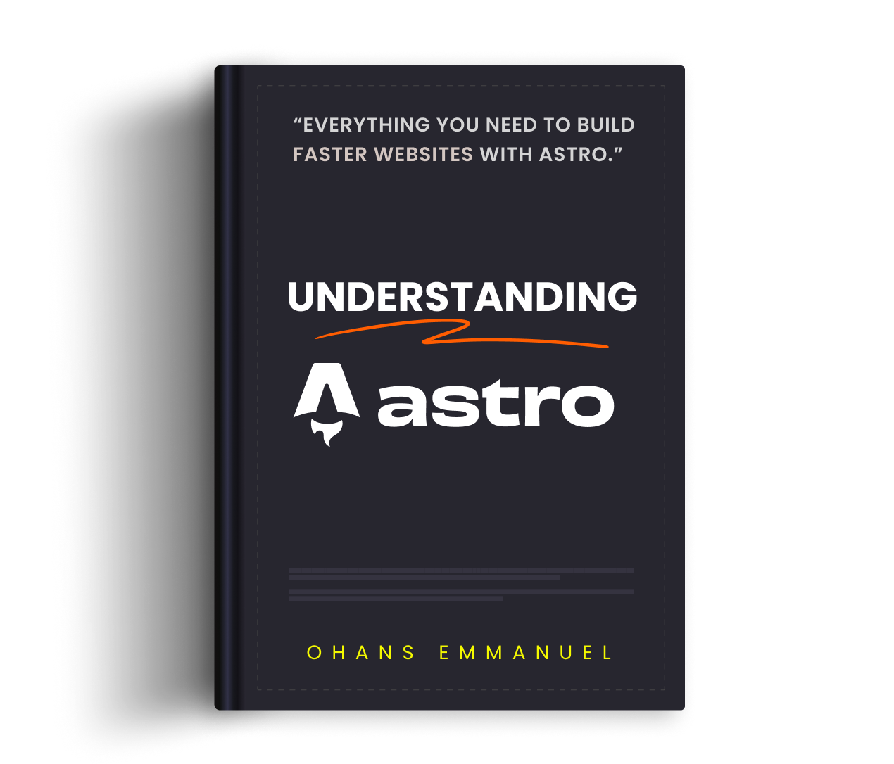

<h1 align="center">
  
</h1>

 

> Welcome to Understanding Astro!

This book is the ultimate guide to Astro. It represents months of work digging into Astro and conveying that to you in a practical and easy to understand fashion.

If you want to understand Astro, you've come to the right source.

## Want to download the ebooks? Click here

 

# ✨ Table of contents ✨

The following is a detailed table of contents for Understanding Astro.

<figure>
     
    
</figure>

## [Introduction](https://github.com/understanding-astro/understanding-astro-book/blob/master/preface.md)

- ### [Don't be displeased](https://github.com/understanding-astro/understanding-astro-book/blob/master/preface.md#dont-be-displeased)
- ### [Differences to the official documentation](https://github.com/understanding-astro/understanding-astro-book/blob/master/preface.md#differences-to-the-official-documentation)

- ### [How the book is structured](https://github.com/understanding-astro/understanding-astro-book/blob/master/preface.md#how-the-book-is-structured)
- ### [Chapters overview](https://github.com/understanding-astro/understanding-astro-book/blob/master/preface.md#chapter-overview)

- ### [Typographic conventions](https://github.com/understanding-astro/understanding-astro-book/blob/master/preface.md#typographic-conventions)

<figure>
     
    
</figure>

## [Chapter 1: Build your first Astro Application](#chapter-1-build-your-first-astro-application)

- ### [What you’ll learn](https://github.com/understanding-astro/understanding-astro-book/blob/master/ch1.md#what-youll-learn)
- ### [Project Overview](https://github.com/understanding-astro/understanding-astro-book/blob/master/ch1.md#project-overview)
- ### [Getting started](https://github.com/understanding-astro/understanding-astro-book/blob/master/ch1.md#getting-started)
  - #### [Install Node.js](https://github.com/understanding-astro/understanding-astro-book/blob/master/ch1.md#install-nodejs)
  - #### [Setting up your code editor](https://github.com/understanding-astro/understanding-astro-book/blob/master/ch1.md#setting-up-your-code-editor)
- ### [Project structure](https://github.com/understanding-astro/understanding-astro-book/blob/master/ch1.md#project-structure)
  - #### [tsconfig.json](https://github.com/understanding-astro/understanding-astro-book/blob/master/ch1.md#tsconfigjson)
  - #### [package.json](https://github.com/understanding-astro/understanding-astro-book/blob/master/ch1.md#packagejson)
  - #### [package-lock.json](https://github.com/understanding-astro/understanding-astro-book/blob/master/ch1.md#package-lockjson)
  - #### [astro.config.mjs](https://github.com/understanding-astro/understanding-astro-book/blob/master/ch1.md#astroconfigmjs)
  - #### [src/env.d.ts](https://github.com/understanding-astro/understanding-astro-book/blob/master/ch1.md#srcenvdts)
  - #### [src/pages/index.astro](https://github.com/understanding-astro/understanding-astro-book/blob/master/ch1.md#srcpagesindexastro)
- ### [Introduction to Astro pages](https://github.com/understanding-astro/understanding-astro-book/blob/master/ch1.md#introduction-to-astro-pages)
- ### [Anatomy of an Astro component](https://github.com/understanding-astro/understanding-astro-book/blob/master/ch1.md#anatomy-of-an-astro-component)
- ### [Component styles](https://github.com/understanding-astro/understanding-astro-book/blob/master/ch1.md#component-styles)
- ### [Page layouts](https://github.com/understanding-astro/understanding-astro-book/blob/master/ch1.md#page-layouts)
- ### [Rendering components and slots](https://github.com/understanding-astro/understanding-astro-book/blob/master/ch1.md#rendering-components-and-slots)
- ### [Capitalising component names](https://github.com/understanding-astro/understanding-astro-book/blob/master/ch1.md#capitalising-component-names)
- ### [The global style directive](https://github.com/understanding-astro/understanding-astro-book/blob/master/ch1.md#the-global-style-directive)
- ### [Custom fonts and global CSS](https://github.com/understanding-astro/understanding-astro-book/blob/master/ch1.md#custom-fonts-and-global-css)
- ### [Independent Astro components](https://github.com/understanding-astro/understanding-astro-book/blob/master/ch1.md#independent-astro-components)
- ### [Adding interactive scripts](https://github.com/understanding-astro/understanding-astro-book/blob/master/ch1.md#adding-interactive-scripts)
- ### [Interactive theme toggle](https://github.com/understanding-astro/understanding-astro-book/blob/master/ch1.md#interactive-theme-toggle)
- ### [The :global() selector](https://github.com/understanding-astro/understanding-astro-book/blob/master/ch1.md#the-global-selector)
- ### [Event Handling](https://github.com/understanding-astro/understanding-astro-book/blob/master/ch1.md#event-handling)
- ### [Theming via CSS variables](https://github.com/understanding-astro/understanding-astro-book/blob/master/ch1.md#theming-via-css-variables)
- ### [Accessing global client objects](https://github.com/understanding-astro/understanding-astro-book/blob/master/ch1.md#accessing-global-client-objects)
- ### [The magic of scripts](https://github.com/understanding-astro/understanding-astro-book/blob/master/ch1.md#the-magic-of-scripts)
- ### [Leveraging inline scripts](https://github.com/understanding-astro/understanding-astro-book/blob/master/ch1.md#leveraging-inline-scripts)
- ### [Global selectors in scripts](https://github.com/understanding-astro/understanding-astro-book/blob/master/ch1.md#global-selectors-in-scripts)
- ### [Markdown pages](https://github.com/understanding-astro/understanding-astro-book/blob/master/ch1.md#markdown-pages)
- ### [Navigating between pages](https://github.com/understanding-astro/understanding-astro-book/blob/master/ch1.md#navigating-between-pages)
- ### [Markdown layouts](https://github.com/understanding-astro/understanding-astro-book/blob/master/ch1.md#markdown-layouts)
- ### [Composing layouts](https://github.com/understanding-astro/understanding-astro-book/blob/master/ch1.md#composing-layouts)
- ### [Component props](https://github.com/understanding-astro/understanding-astro-book/blob/master/ch1.md#component-props)
- ### [Leveraging markdown frontmatter properties](https://github.com/understanding-astro/understanding-astro-book/blob/master/ch1.md#leveraging-markdown-frontmatter-properties)
- ### [Interactive navigation state](https://github.com/understanding-astro/understanding-astro-book/blob/master/ch1.md#interactive-navigation-state)
- ### [Component composition](https://github.com/understanding-astro/understanding-astro-book/blob/master/ch1.md#component-composition)
- ### [The template flow of data](https://github.com/understanding-astro/understanding-astro-book/blob/master/ch1.md#the-template-flow-of-data)
- ### [The dark side of define:vars](https://github.com/understanding-astro/understanding-astro-book/blob/master/ch1.md#the-dark-side-of-definevars)
- ### [Loading multiple local files](https://github.com/understanding-astro/understanding-astro-book/blob/master/ch1.md#loading-multiple-local-files)
- ### [Deploying a static Astro site](https://github.com/understanding-astro/understanding-astro-book/blob/master/ch1.md#deploying-a-static-astro-site)

  - #### [1. Create static production assets](#1-create-static-production-assets)
  - #### [2. Serve the static assets via a static web server](#2-serve-the-static-assets-via-a-static-web-server)
  - #### [The problem with manual deployments](#the-problem-with-manual-deployments)
  - #### [Automating the deployment of a static website](#automating-the-deployment-of-a-static-website)

- ### [How fast is our Astro website?](#how-fast-is-our-astro-website)
- ### [Conclusion](#conclusion)

<figure>
     
    
</figure>

- ## [Chapter 2: Astro Components In-depth](https://github.com/understanding-astro/understanding-astro-book/blob/master/ch2.md#chapter-2-astro-components-in-depth)
- ## [What you’ll learn](https://github.com/understanding-astro/understanding-astro-book/blob/master/ch2.md#what-youll-learn)
- ## [Introduction](https://github.com/understanding-astro/understanding-astro-book/blob/master/ch2.md#introduction)
- ## [The backbone of Astro](https://github.com/understanding-astro/understanding-astro-book/blob/master/ch2.md#the-backbone-of-astro)
  - ### [The Javascript runtime fatigue](https://github.com/understanding-astro/understanding-astro-book/blob/master/ch2.md#the-javascript-runtime-fatigue)
  - ### [Ditching the runtime](https://github.com/understanding-astro/understanding-astro-book/blob/master/ch2.md#ditching-the-runtime)
- ## [What is an Astro component?](https://github.com/understanding-astro/understanding-astro-book/blob/master/ch2.md#what-is-an-astro-component)

  - ### [An astro component is a .astro file capable of rendering any valid HTML](https://github.com/understanding-astro/understanding-astro-book/blob/master/ch2.md#an-astro-component-is-a-astro-file-capable-of-rendering-any-valid-html)

  - ### [Astro components can be composed to make complex pages](https://github.com/understanding-astro/understanding-astro-book/blob/master/ch2.md#astro-components-can-be-composed-to-make-complex-pages)

    - #### [1. Styles are local by default](https://github.com/understanding-astro/understanding-astro-book/blob/master/ch2.md#1-styles-are-local-by-default)
    - #### [2. The HTML element will always be present](https://github.com/understanding-astro/understanding-astro-book/blob/master/ch2.md#2-the-html-element-will-always-be-present)

    - #### [3. Styles and Scripts are Hoisted](https://github.com/understanding-astro/understanding-astro-book/blob/master/ch2.md#3-styles-and-scripts-are-hoisted)

    - #### [4. The \<head> element and its children will not be hoisted](https://github.com/understanding-astro/understanding-astro-book/blob/master/ch2.md#4-the-head-element-and-its-children-will-not-be-hoisted)

- ### [Astro components can leverage a powerful templating syntax](https://github.com/understanding-astro/understanding-astro-book/blob/master/ch2.md#astro-components-can-leverage-a-powerful-templating-syntax)

  - #### [Component script](https://github.com/understanding-astro/understanding-astro-book/blob/master/ch2.md#component-script)

    - [1. Creating or referencing variables](https://github.com/understanding-astro/understanding-astro-book/blob/master/ch2.md#1-creating-or-referencing-variables)
    - [2. Handling imports](https://github.com/understanding-astro/understanding-astro-book/blob/master/ch2.md#2-handling-imports)
    - [3. Fetching data](https://github.com/understanding-astro/understanding-astro-book/blob/master/ch2.md#3-fetching-data)

  - [Component template](https://github.com/understanding-astro/understanding-astro-book/blob/master/ch2.md#component-template)

    - [Consuming variables](https://github.com/understanding-astro/understanding-astro-book/blob/master/ch2.md#consuming-variables)
    - [Create dynamic attributes](https://github.com/understanding-astro/understanding-astro-book/blob/master/ch2.md#create-dynamic-attributes)
    - [Dynamic HTML](https://github.com/understanding-astro/understanding-astro-book/blob/master/ch2.md#dynamic-html)
    - [Dynamic Tags](https://github.com/understanding-astro/understanding-astro-book/blob/master/ch2.md#dynamic-tags)
    - [Revisiting Slots](https://github.com/understanding-astro/understanding-astro-book/blob/master/ch2.md#revisiting-slots)
    - [Not quite JSX](https://github.com/understanding-astro/understanding-astro-book/blob/master/ch2.md#not-quite-jsx)

- ## [Conclusion](https://github.com/understanding-astro/understanding-astro-book/blob/master/ch2.md#conclusion)

<figure>
     
    
</figure>

- ## [Chapter 3: Build Your Own Component Island](https://github.com/understanding-astro/understanding-astro-book/blob/master/ch3.md#chapter-3-build-your-own-component-island)

- ## [What you’ll learn](https://github.com/understanding-astro/understanding-astro-book/blob/master/ch3.md#what-youll-learn)

- ## [A brief history of how we got here](https://github.com/understanding-astro/understanding-astro-book/blob/master/ch3.md#a-brief-history-of-how-we-got-here)

  - ### [Where it all begins](https://github.com/understanding-astro/understanding-astro-book/blob/master/ch3.md#where-it-all-begins)

  - ### [Client-side rendering (CSR)](https://github.com/understanding-astro/understanding-astro-book/blob/master/ch3.md#client-side-rendering-csr)

    - #### [The pros of client-side rendering (CSR)](https://github.com/understanding-astro/understanding-astro-book/blob/master/ch3.md#the-pros-of-client-side-rendering-csr)
    - #### [The cons of client-side rendering](https://github.com/understanding-astro/understanding-astro-book/blob/master/ch3.md#the-cons-of-client-side-rendering)

  - ### [Server-side rendering](https://github.com/understanding-astro/understanding-astro-book/blob/master/ch3.md#server-side-rendering)

    - #### [The pros of server-side rendering](https://github.com/understanding-astro/understanding-astro-book/blob/master/ch3.md#the-pros-of-server-side-rendering)
    - #### [The cons of server-side rendering](https://github.com/understanding-astro/understanding-astro-book/blob/master/ch3.md#the-cons-of-server-side-rendering)

  - ### [Server-side rendering with client-side hydration](https://github.com/understanding-astro/understanding-astro-book/blob/master/ch3.md#server-side-rendering-with-client-side-hydration)

    - #### [The pros of server-side rendering with client-side hydration](https://github.com/understanding-astro/understanding-astro-book/blob/master/ch3.md#the-pros-of-server-side-rendering-with-client-side-hydration)
    - #### [The cons of server-side rendering with client-side hydration](https://github.com/understanding-astro/understanding-astro-book/blob/master/ch3.md#the-cons-of-server-side-rendering-with-client-side-hydration)

  - ### [Partial hydration for the win](https://github.com/understanding-astro/understanding-astro-book/blob/master/ch3.md#partial-hydration-for-the-win)

    - #### [The pros of partial hydration](https://github.com/understanding-astro/understanding-astro-book/blob/master/ch3.md#the-pros-of-partial-hydration)
    - #### [The cons of partial hydration](https://github.com/understanding-astro/understanding-astro-book/blob/master/ch3.md#the-cons-of-partial-hydration)

  - ### [Where does the island architecture come from?](https://github.com/understanding-astro/understanding-astro-book/blob/master/ch3.md#where-does-the-island-architecture-come-from)

- ## [A partial hydration islands architecture implementation](https://github.com/understanding-astro/understanding-astro-book/blob/master/ch3.md#a-partial-hydration-islands-architecture-implementation)

  - ### [Objectives](https://github.com/understanding-astro/understanding-astro-book/blob/master/ch3.md#objectives)

  - ### [Installation](https://github.com/understanding-astro/understanding-astro-book/blob/master/ch3.md#installation)

  - ### [API design](https://github.com/understanding-astro/understanding-astro-book/blob/master/ch3.md#api-design)

  - ### [Getting started](https://github.com/understanding-astro/understanding-astro-book/blob/master/ch3.md#getting-started)

  - ### [Leveraging the content template element](https://github.com/understanding-astro/understanding-astro-book/blob/master/ch3.md#leveraging-the-content-template-element)

  - ### [Handling lazy hydration via “client:” attributes](https://github.com/understanding-astro/understanding-astro-book/blob/master/ch3.md#handling-lazy-hydration-via-client-attributes)

    - #### [Supporting the client:idle and client:media conditions](https://github.com/understanding-astro/understanding-astro-book/blob/master/ch3.md#supporting-the-clientidle-and-clientmedia-conditions)
    - #### [waitForIdle](https://github.com/understanding-astro/understanding-astro-book/blob/master/ch3.md#waitforidle)
    - #### [waitForMedia](https://github.com/understanding-astro/understanding-astro-book/blob/master/ch3.md#waitformedia)

  - ### [Supporting frameworks: Vue, Petite-vue and Preact](https://github.com/understanding-astro/understanding-astro-book/blob/master/ch3.md#supporting-frameworks-vue-petite-vue-and-preact)

    - #### [Vue](https://github.com/understanding-astro/understanding-astro-book/blob/master/ch3.md#vue)
    - #### [Petite-vue](https://github.com/understanding-astro/understanding-astro-book/blob/master/ch3.md#petite-vue)
    - #### [Preact](https://github.com/understanding-astro/understanding-astro-book/blob/master/ch3.md#preact)

- ## [Conclusion](https://github.com/understanding-astro/understanding-astro-book/blob/master/ch3.md#conclusion)

<figure>
     
    
</figure>

- ## [Chapter 4: The Secret Life of Astro Component Islands](https://github.com/understanding-astro/understanding-astro-book/blob/master/ch4.md#chapter-4-the-secret-life-of-astro-component-islands)

- ## [What you’ll learn](https://github.com/understanding-astro/understanding-astro-book/blob/master/ch4.md#what-youll-learn)

- ## [How islands work in Astro](https://github.com/understanding-astro/understanding-astro-book/blob/master/ch4.md#how-islands-work-in-astro)

  - ### [Step 1: Build an Astro site](https://github.com/understanding-astro/understanding-astro-book/blob/master/ch4.md#step-1-build-an-astro-site)

  - ### [Step 2: Install the framework integration](https://github.com/understanding-astro/understanding-astro-book/blob/master/ch4.md#step-2-install-the-framework-integration)

  - ### [Step 3: Write the component framework](https://github.com/understanding-astro/understanding-astro-book/blob/master/ch4.md#step-3-write-the-component-framework)

  - ### [Step 4: Render the component framework](https://github.com/understanding-astro/understanding-astro-book/blob/master/ch4.md#step-4-render-the-component-framework)

    - #### [It’s not a bug. It’s a feature.](https://github.com/understanding-astro/understanding-astro-book/blob/master/ch4.md#its-not-a-bug-its-a-feature)

- ## [Responsible hydration](https://github.com/understanding-astro/understanding-astro-book/blob/master/ch4.md#responsible-hydration)

  - ### [client:load](https://github.com/understanding-astro/understanding-astro-book/blob/master/ch4.md#clientload)
  - ### [client:only](https://github.com/understanding-astro/understanding-astro-book/blob/master/ch4.md#clientonly)
  - ### [client:visible](https://github.com/understanding-astro/understanding-astro-book/blob/master/ch4.md#clientvisible)
  - ### [client:media](https://github.com/understanding-astro/understanding-astro-book/blob/master/ch4.md#clientmedia)
  - ### [client:idle](https://github.com/understanding-astro/understanding-astro-book/blob/master/ch4.md#clientidle)

- ## [Using multiple frameworks](https://github.com/understanding-astro/understanding-astro-book/blob/master/ch4.md#using-multiple-frameworks)

  - ### [An upvote counter in Vue](https://github.com/understanding-astro/understanding-astro-book/blob/master/ch4.md#an-upvote-counter-in-vue)
  - ### [Rendering different framework components](https://github.com/understanding-astro/understanding-astro-book/blob/master/ch4.md#rendering-different-framework-components)

- ## [Sharing state between component islands](https://github.com/understanding-astro/understanding-astro-book/blob/master/ch4.md#sharing-state-between-component-islands)

  - ### [How nano store works](https://github.com/understanding-astro/understanding-astro-book/blob/master/ch4.md#how-nano-store-works)
  - ### [Install nano store](https://github.com/understanding-astro/understanding-astro-book/blob/master/ch4.md#install-nano-store)
  - ### [Create the state value](https://github.com/understanding-astro/understanding-astro-book/blob/master/ch4.md#create-the-state-value)
  - ### [Using the state value in framework components](https://github.com/understanding-astro/understanding-astro-book/blob/master/ch4.md#using-the-state-value-in-framework-components)

- ## [Passing props and children to framework components](https://github.com/understanding-astro/understanding-astro-book/blob/master/ch4.md#passing-props-and-children-to-framework-components)

- ## [Nested framework components](https://github.com/understanding-astro/understanding-astro-book/blob/master/ch4.md#nested-framework-components)

- ## [Astro Island gotchas](https://github.com/understanding-astro/understanding-astro-book/blob/master/ch4.md#astro-island-gotchas)

  - ### [1. Do not use an Astro component in a framework component](https://github.com/understanding-astro/understanding-astro-book/blob/master/ch4.md#1-do-not-use-an-astro-component-in-a-framework-component)
  - ### [2. Do not hydrate an Astro component](https://github.com/understanding-astro/understanding-astro-book/blob/master/ch4.md#2-do-not-hydrate-an-astro-component)

- ## [Why islands?](https://github.com/understanding-astro/understanding-astro-book/blob/master/ch4.md#why-islands)

  - ### [1. Performance](https://github.com/understanding-astro/understanding-astro-book/blob/master/ch4.md#1-performance)
  - ### [2. Responsible hydration](https://github.com/understanding-astro/understanding-astro-book/blob/master/ch4.md#2-responsible-hydration)
  - ### [3. Parallel loading](https://github.com/understanding-astro/understanding-astro-book/blob/master/ch4.md#3-parallel-loading)

- ## [Conclusion](https://github.com/understanding-astro/understanding-astro-book/blob/master/ch4.md#conclusion)

<figure>
     
    
</figure>

## Chapter 5: Oh my React! (React documentation site clone)

TBD ...

<figure>
     
    
</figure>

- ## [Chapter 6: Server-side Rendering (SSR) in Astro](https://github.com/understanding-astro/understanding-astro-book/blob/master/ch6.md#chapter-6-server-side-rendering-ssr-in-astro)

- ## [What you’ll learn](https://github.com/understanding-astro/understanding-astro-book/blob/master/ch6.md#what-youll-learn)

- ## [When do you need SSR?](https://github.com/understanding-astro/understanding-astro-book/blob/master/ch6.md#when-do-you-need-ssr)

- ## [How to Enable SSR](https://github.com/understanding-astro/understanding-astro-book/blob/master/ch6.md#how-to-enable-ssr)

- ## [Deploying an SSR project](https://github.com/understanding-astro/understanding-astro-book/blob/master/ch6.md#deploying-an-ssr-project)

- ## [Use the correct adapter](https://github.com/understanding-astro/understanding-astro-book/blob/master/ch6.md#use-the-correct-adapter)

- ## [SSR with static pages](https://github.com/understanding-astro/understanding-astro-book/blob/master/ch6.md#ssr-with-static-pages)

- ## [From Request to Response](https://github.com/understanding-astro/understanding-astro-book/blob/master/ch6.md#from-request-to-response)

  - ### [The Request object](https://github.com/understanding-astro/understanding-astro-book/blob/master/ch6.md#the-request-object)
  - ### [The Response object](https://github.com/understanding-astro/understanding-astro-book/blob/master/ch6.md#the-response-object)
  - ### [Redirect response](https://github.com/understanding-astro/understanding-astro-book/blob/master/ch6.md#redirect-response)
  - ### [Utilities for manipulating cookies](https://github.com/understanding-astro/understanding-astro-book/blob/master/ch6.md#utilities-for-manipulating-cookies)
  - ### [The request IP address](https://github.com/understanding-astro/understanding-astro-book/blob/master/ch6.md#the-request-ip-address)

- ## [Environment variables](https://github.com/understanding-astro/understanding-astro-book/blob/master/ch6.md#environment-variables)

  - ### [Retrieving environment variables](https://github.com/understanding-astro/understanding-astro-book/blob/master/ch6.md#retrieving-environment-variables)
  - ### [Default environment variables](https://github.com/understanding-astro/understanding-astro-book/blob/master/ch6.md#default-environment-variables)
  - ### [Creating environment variables](https://github.com/understanding-astro/understanding-astro-book/blob/master/ch6.md#creating-environment-variables)
  - ### [Typescript IntelliSense](https://github.com/understanding-astro/understanding-astro-book/blob/master/ch6.md#typescript-intellisense)

- ## [Dynamic routes](https://github.com/understanding-astro/understanding-astro-book/blob/master/ch6.md#dynamic-routes)

  - ### [1. Named parameters](https://github.com/understanding-astro/understanding-astro-book/blob/master/ch6.md#1-named-parameters)
  - ### [2. Rest parameters](https://github.com/understanding-astro/understanding-astro-book/blob/master/ch6.md#2-rest-parameters)
  - ### [Priority order](https://github.com/understanding-astro/understanding-astro-book/blob/master/ch6.md#priority-order)

- ## [Server endpoints](https://github.com/understanding-astro/understanding-astro-book/blob/master/ch6.md#server-endpoints)

  - ### [Creating server endpoints](https://github.com/understanding-astro/understanding-astro-book/blob/master/ch6.md#creating-server-endpoints)
  - ### [Request details](https://github.com/understanding-astro/understanding-astro-book/blob/master/ch6.md#request-details)
  - ### [Dynamic API routes](https://github.com/understanding-astro/understanding-astro-book/blob/master/ch6.md#dynamic-api-routes)
  - ### [Dedicated api directory](https://github.com/understanding-astro/understanding-astro-book/blob/master/ch6.md#dedicated-api-directory)
  - ### [Supporting other HTTP methods](https://github.com/understanding-astro/understanding-astro-book/blob/master/ch6.md#supporting-other-http-methods)

- ## [Streams, oh streams](https://github.com/understanding-astro/understanding-astro-book/blob/master/ch6.md#streams-oh-streams)

  - ### [What is server streaming?](https://github.com/understanding-astro/understanding-astro-book/blob/master/ch6.md#what-is-server-streaming)
  - ### [Why should we bother?](https://github.com/understanding-astro/understanding-astro-book/blob/master/ch6.md#why-should-we-bother)
  - ### [Streaming is easy yet difficult](https://github.com/understanding-astro/understanding-astro-book/blob/master/ch6.md#streaming-is-easy-yet-difficult)
  - ### [Server streaming in Astro](https://github.com/understanding-astro/understanding-astro-book/blob/master/ch6.md#server-streaming-in-astro)
  - ### [Taking advantage of streaming](https://github.com/understanding-astro/understanding-astro-book/blob/master/ch6.md#taking-advantage-of-streaming)

- ## [Conclusion](https://github.com/understanding-astro/understanding-astro-book/blob/master/ch6.md#conclusion)

<figure>
     
    
</figure>

## [Chapter 7: Be Audible! (Fullstack Astro Project)](https://github.com/understanding-astro/understanding-astro-book/blob/master/ch7.md)

- ## [What you’ll learn](https://github.com/understanding-astro/understanding-astro-book/blob/master/ch7.md#what-youll-learn)

- ## [Project setup](https://github.com/understanding-astro/understanding-astro-book/blob/master/ch7.md#project-setup)

- ## [Project overview](https://github.com/understanding-astro/understanding-astro-book/blob/master/ch7.md#project-overview)

  - ### [The homepage](https://github.com/understanding-astro/understanding-astro-book/blob/master/ch7.md#the-homepage)
  - ### [The record page](https://github.com/understanding-astro/understanding-astro-book/blob/master/ch7.md#the-record-page)
  - ### [The signup page](https://github.com/understanding-astro/understanding-astro-book/blob/master/ch7.md#the-signup-page)
  - ### [The sign-in page](https://github.com/understanding-astro/understanding-astro-book/blob/master/ch7.md#the-sign-in-page)
  - ### [Helper components and utilities](https://github.com/understanding-astro/understanding-astro-book/blob/master/ch7.md#helper-components-and-utilities)

- ## [Technology choices](https://github.com/understanding-astro/understanding-astro-book/blob/master/ch7.md#technology-choices)

- ## [Backend setup](https://github.com/understanding-astro/understanding-astro-book/blob/master/ch7.md#backend-setup)

- ## [Handling authentication](https://github.com/understanding-astro/understanding-astro-book/blob/master/ch7.md#handling-authentication)

  - ### [Initialising firebase on the client](https://github.com/understanding-astro/understanding-astro-book/blob/master/ch7.md#initialising-firebase-on-the-client)
  - ### [Using the Firebase emulators](https://github.com/understanding-astro/understanding-astro-book/blob/master/ch7.md#using-the-firebase-emulators)
  - ### [Handling user signups](https://github.com/understanding-astro/understanding-astro-book/blob/master/ch7.md#handling-user-signups)
  - ### [Handling user sign in](https://github.com/understanding-astro/understanding-astro-book/blob/master/ch7.md#handling-user-sign-in)

- ### [Implementing protected pages](https://github.com/understanding-astro/understanding-astro-book/blob/master/ch7.md#implementing-protected-pages)

  - ### [Initialising Firebase on the server](https://github.com/understanding-astro/understanding-astro-book/blob/master/ch7.md#initialising-firebase-on-the-server)
  - ### [Protecting the home page route](https://github.com/understanding-astro/understanding-astro-book/blob/master/ch7.md#protecting-the-home-page-route)
  - ### [Updating the redirect URL](https://github.com/understanding-astro/understanding-astro-book/blob/master/ch7.md#updating-the-redirect-url)
  - ### [Log out a user from the protected page](https://github.com/understanding-astro/understanding-astro-book/blob/master/ch7.md#log-out-a-user-from-the-protected-page)

- ## [Cloud storage setup](https://github.com/understanding-astro/understanding-astro-book/blob/master/ch7.md#cloud-storage-setup)

- ## [Uploading audio recordings](https://github.com/understanding-astro/understanding-astro-book/blob/master/ch7.md#uploading-audio-recordings)

  - ### [Handling uploads via an API route](https://github.com/understanding-astro/understanding-astro-book/blob/master/ch7.md#handling-uploads-via-an-api-route)
  - ### [Uploading recordings from the client](https://github.com/understanding-astro/understanding-astro-book/blob/master/ch7.md#uploading-recordings-from-the-client)
  - ### [Reacting to UI changes in framework components](https://github.com/understanding-astro/understanding-astro-book/blob/master/ch7.md#reacting-to-ui-changes-in-framework-components)

- ## [Fetching data from the server](https://github.com/understanding-astro/understanding-astro-book/blob/master/ch7.md#fetching-data-from-the-server)

- ## [Submitting HTML forms](https://github.com/understanding-astro/understanding-astro-book/blob/master/ch7.md#submitting-html-forms)

- ## [Conclusion](https://github.com/understanding-astro/understanding-astro-book/blob/master/ch7.md#conclusion)

<figure>
     
    
</figure>

- ## [Chapter 8: Build Your Own Astro Integrations](https://github.com/understanding-astro/understanding-astro-book/blob/master/ch8.md#chapter-8-build-your-own-astro-integrations)

- ## [What you’ll learn](https://github.com/understanding-astro/understanding-astro-book/blob/master/ch8.md#what-youll-learn)

- ## [Astro and Vite](https://github.com/understanding-astro/understanding-astro-book/blob/master/ch8.md#astro-and-vite)

- ## [What are Astro integrations](https://github.com/understanding-astro/understanding-astro-book/blob/master/ch8.md#what-are-astro-integrations)

- ## [Hello world. Sorry, Hello, Integration](https://github.com/understanding-astro/understanding-astro-book/blob/master/ch8.md#hello-world-sorry-hello-integration)

  - ### [Project objective](https://github.com/understanding-astro/understanding-astro-book/blob/master/ch8.md#project-objective)
  - ### [Your first custom integration](https://github.com/understanding-astro/understanding-astro-book/blob/master/ch8.md#your-first-custom-integration)
  - ### [Printing a message to the server console](https://github.com/understanding-astro/understanding-astro-book/blob/master/ch8.md#printing-a-message-to-the-server-console)
  - ### [Custom integrations as factory functions](https://github.com/understanding-astro/understanding-astro-book/blob/master/ch8.md#custom-integrations-as-factory-functions)

- ## [The Astro hooks lifecycle](https://github.com/understanding-astro/understanding-astro-book/blob/master/ch8.md#the-astro-hooks-lifecycle)

  - ### [The when and why of hooks](https://github.com/understanding-astro/understanding-astro-book/blob/master/ch8.md#the-when-and-why-of-hooks)
  - ### [Examining the hooks evaluation order](https://github.com/understanding-astro/understanding-astro-book/blob/master/ch8.md#examining-the-hooks-evaluation-order)

- ## [Build a default prerender integration](https://github.com/understanding-astro/understanding-astro-book/blob/master/ch8.md#build-a-default-prerender-integration)

  - ### [Project objective](https://github.com/understanding-astro/understanding-astro-book/blob/master/ch8.md#project-objective-1)
  - ### [Integration API](https://github.com/understanding-astro/understanding-astro-book/blob/master/ch8.md#integration-api)
  - ### [Technical solution overview](https://github.com/understanding-astro/understanding-astro-book/blob/master/ch8.md#technical-solution-overview)
  - ### [Initialising projects via CLI flags](https://github.com/understanding-astro/understanding-astro-book/blob/master/ch8.md#initialising-projects-via-cli-flags)
  - ### [Setting up the integration](https://github.com/understanding-astro/understanding-astro-book/blob/master/ch8.md#setting-up-the-integration)
  - ### [Validating a resolved Astro configuration](https://github.com/understanding-astro/understanding-astro-book/blob/master/ch8.md#validating-a-resolved-astro-configuration)
  - ### [Applying Vite plugins in custom integrations](https://github.com/understanding-astro/understanding-astro-book/blob/master/ch8.md#applying-vite-plugins-in-custom-integrations)
  - ### [Writing Vite plugins for Astro](https://github.com/understanding-astro/understanding-astro-book/blob/master/ch8.md#writing-vite-plugins-for-astro)
  - ### [Parsing and transforming ASTs](https://github.com/understanding-astro/understanding-astro-book/blob/master/ch8.md#parsing-and-transforming-asts)
  - ### [Manual testing](https://github.com/understanding-astro/understanding-astro-book/blob/master/ch8.md#manual-testing)

- ## [Building renderers and library Integrations](https://github.com/understanding-astro/understanding-astro-book/blob/master/ch8.md#building-renderers-and-library-integrations)

- ## [Conclusion](https://github.com/understanding-astro/understanding-astro-book/blob/master/ch8.md#conclusion)

<figure>
     
    
</figure>

## Conclusion
