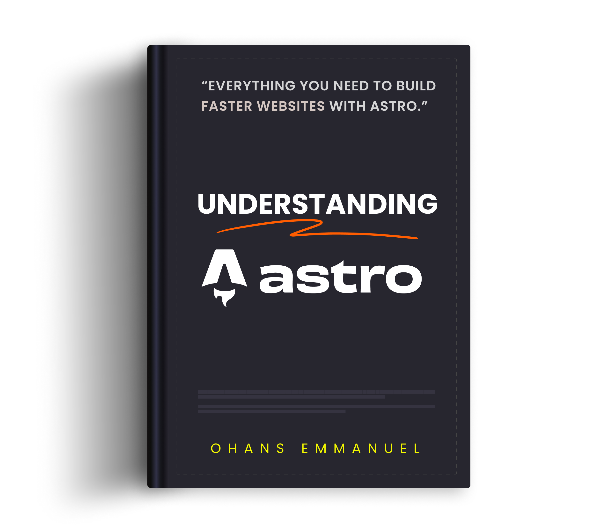

<h1 align="center">
  
</h1>

 

# ✨ Table of contents ✨

## Introduction

- ### [Don't be displeased](https://github.com/understanding-astro/understanding-astro-book/blob/master/preface.md#dont-be-displeased)
- ### [Differences to the official documentation](https://github.com/understanding-astro/understanding-astro-book/blob/master/preface.md#differences-to-the-official-documentation)

- ### [How the book is structured](https://github.com/understanding-astro/understanding-astro-book/blob/master/preface.md#how-the-book-is-structured)
- ### [Chapters overview](https://github.com/understanding-astro/understanding-astro-book/blob/master/preface.md#chapter-overview)

- ### [Typographic conventions](https://github.com/understanding-astro/understanding-astro-book/blob/master/preface.md#typographic-conventions)

## [Chapter 1: Build your first Astro Application](#chapter-1-build-your-first-astro-application)

- ### [What you’ll learn](#what-youll-learn)
- ### [Project Overview](#project-overview)
- ### [Getting started](#getting-started)
  - #### [Install Node.js](#install-nodejs)
  - #### [Setting up your code editor](#setting-up-your-code-editor)
- ### [Project structure](#project-structure)
  - #### [tsconfig.json](#tsconfigjson)
  - #### [package.json](#packagejson)
  - #### [package-lock.json](#package-lockjson)
  - #### [astro.config.mjs](#astroconfigmjs)
  - #### [src/env.d.ts](#srcenvdts)
  - #### [src/pages/index.astro](#srcpagesindexastro)
- ### [Introduction to Astro pages](#introduction-to-astro-pages)
- ### [Anatomy of an Astro component](#anatomy-of-an-astro-component)
- ### [Component styles](#component-styles)
- ### [Page layouts](#page-layouts)
- ### [Rendering components and slots](#rendering-components-and-slots)
- ### [Capitalising component names](#capitalising-component-names)
- ### [The global style directive](#the-global-style-directive)
- ### [Custom fonts and global CSS](#custom-fonts-and-global-css)
- ### [Independent Astro components](#independent-astro-components)
- ### [Adding interactive scripts](#adding-interactive-scripts)
- ### [Interactive theme toggle](#interactive-theme-toggle)
- ### [The :global() selector](#the-global-selector)
- ### [Event Handling](#event-handling)
- ### [Theming via CSS variables](#theming-via-css-variables)
- ### [Accessing global client objects](#accessing-global-client-objects)
- ### [The magic of scripts](#the-magic-of-scripts)
- ### [Leveraging inline scripts](#leveraging-inline-scripts)
- ### [Global selectors in scripts](#global-selectors-in-scripts)
- ### [Markdown pages](#markdown-pages)
- ### [Navigating between pages](#navigating-between-pages)
- ### [Markdown layouts](#markdown-layouts)
- ### [Composing layouts](#composing-layouts)
- ### [Component props](#component-props)
- ### [Leveraging markdown frontmatter properties](#leveraging-markdown-frontmatter-properties)
- ### [Interactive navigation state](#interactive-navigation-state)
- ### [Component composition](#component-composition)
- ### [The template flow of data](#the-template-flow-of-data)
- ### [The dark side of define:vars](#the-dark-side-of-definevars)
- ### [Loading multiple local files](#loading-multiple-local-files)
- ### [Deploying a static Astro site](#deploying-a-static-astro-site)

  - #### [1. Create static production assets](#1-create-static-production-assets)
  - #### [2. Serve the static assets via a static web server](#2-serve-the-static-assets-via-a-static-web-server)
  - #### [The problem with manual deployments](#the-problem-with-manual-deployments)
  - #### [Automating the deployment of a static website](#automating-the-deployment-of-a-static-website)

- ### [How fast is our Astro website?](#how-fast-is-our-astro-website)
- ### [Conclusion](#conclusion)

## Chapter 2: Astro Components In-depth

- ### What you'll learn
- ### Introduction
- ### The backbone of Astro
  - #### The Javascript runtime fatigue
  - #### Ditching the runtime
- ### What is an Astro component?

  - #### An astro component is a .astro file capable of rendering any valid HTML
  - #### Astro components can be composed to make complex pages
    - Styles are local by default
    - The HTML element will always be present
    - Styles and Scripts are Hoisted
    - The `<head>` element and its children will not be hoisted
  - #### Astro components can leverage a powerful templating syntax

    - Consuming variables
    - Create dynamic attributes
    - Dynamic HTML
    - Dynamic Tags
    - Revisiting Slots
    - Not quite JSX

- ### Conclusion

## Chapter 3: Build your own Component Island

- ### What you’ll learn
- ### A brief history of how we got here
  - #### Where it all begins
  - #### Client-side rendering (CSR)
    - The pros of client-side rendering (CSR)
    - The cons of client-side rendering
  - #### Server-side rendering
    - The pros of server-side rendering
    - The cons of server-side rendering
  - #### Partial hydration for the win
    - The pros of partial hydration
    - The cons of partial hydration
  - #### Where does the island architecture come from?
- ### A partial hydration islands architecture implementation
  - #### Objectives
  - #### Installation
  - #### API design

## Chapter 4: The Secret Life of Astro Component Islands

## Chapter 5: Oh my React!

## Chapter 6: Server-side Rendering (SSR) in Astro

## Chapter 7: Be Audible!

## Chapter 8: Build your own Astro Integrations

## Conclusion
