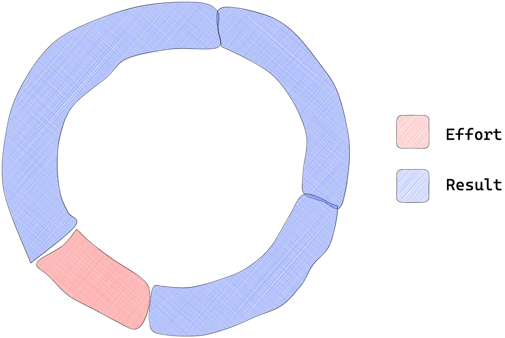
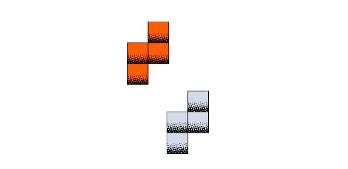
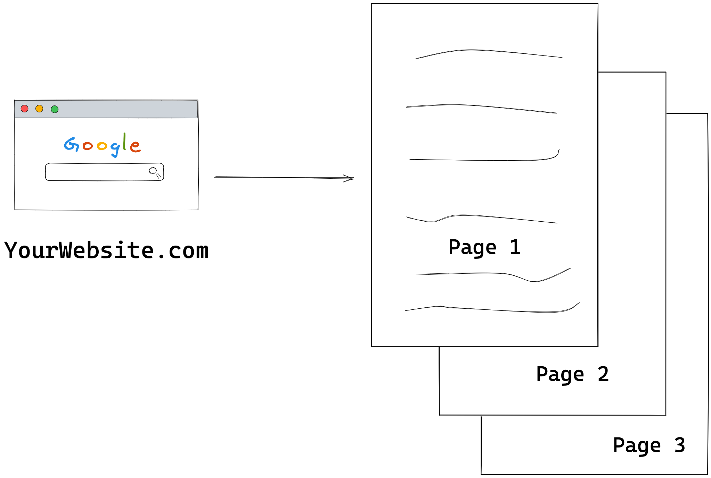
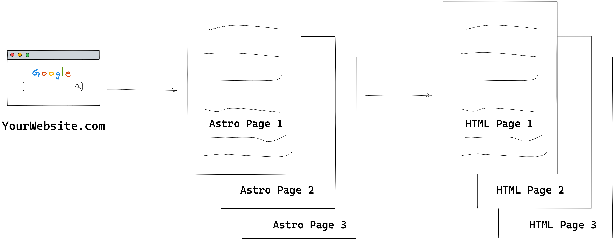
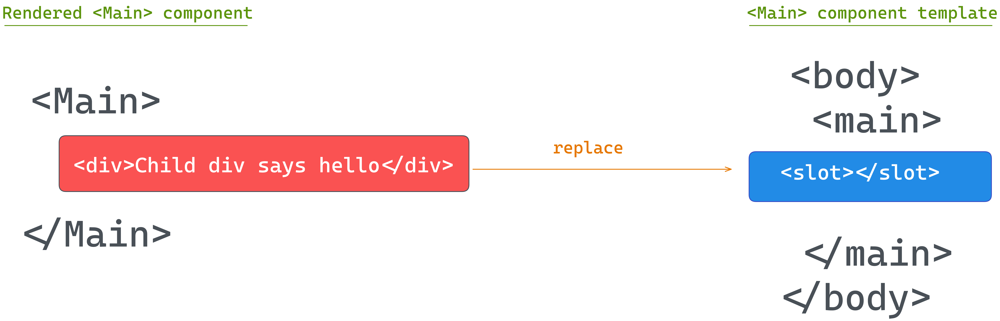
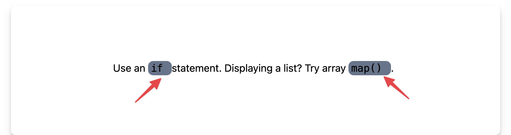

# 🚀 Understanding Astro

By [Ohans Emmanuel](https://www.ohansemmanuel.com/)

<br />

## Chapter 2: Astro Components In-depth

Go beyond the basics and master the essential Astro entity.

## What you’ll learn

- What zero Javascript means in practical terms.
- Why we should consider ditching the Javascript runtime overhead.
- Truly understand what an Astro component is.
- Understand the behaviour of Astro component markup, styles and scripts.
- Learn the powerful Astro template syntax and how it differs from `JSX.`

## Introduction

Consider the Pareto principle:

> The Pareto principle, also known as the 80/20 rule, states that 20% of the input can significantly impact 80% of the outcome in a particular situation or system.

<figure>
    
    <figcaption>
      <em>The pareto principle illustrated</em>
    </figcaption>
    <br><br><br>
</figure>

Now, pay attention because this is where things get spicy. When it comes to working with Astro, I've got a sneaky suspicion that the Astro components are that magic 20% that yields a whopping 80% productivity.

So, let's get cracking and master these Astro components, shall we?

## The backbone of Astro

At the time of writing, consider the definition of Astro components from the official docs:

> Astro components are the basic building blocks of any Astro project. They are HTML-only templating components with no client-side runtime.

The first part of the sentence is clear as daylight: _Astro components are the basic building blocks of any Astro project._

<figure>
    
    <figcaption><em>Like a fun game of Tetris, Astro components are how we build Astro applications.</em></figcaption>
    <br><br><br>
</figure>

The second part of the sentence leaves room for interpretation or ambiguity: _they are HTML-only templating components with no client-side runtime._

However, in this sentence lies the heartbeat of Astro components.

Let’s explore this in practical terms.

### The Javascript runtime fatigue

To truly appreciate Astro components, we must turn to our “standard” user interface framework components, e.g., those provided by `React` or `Vue`.

Your familiarity with these frameworks doesn’t matter. I’ll explain the following steps as clearly as possible. So trust me and follow along.

Firstly, create a new React project called `test-react-app` with the following terminal command:

```bash
npx create-react-app test-react-app
```

This utilises the [create-react-app](https://create-react-app.dev/) utility.

<figure>
    
    <figcaption><em>Creating a new React project from the terminal.</em></figcaption>
    <br><br><br>
</figure>

This will create a new React app in the `test-react-app` directory.

Now change the current directory, install dependencies and start up the React application with the following command:

```bash
cd test-react-app && npm install && npm run start
```

<figure>
    
    <figcaption><em>Starting the test React application.</em></figcaption>
    <br><br><br>
</figure>

This will start a trivial React application on `http://localhost:3000/` or any other available local port.

<figure>
    
    <figcaption><em>The React test application running in the browser.</em></figcaption>
    <br><br><br>
</figure>

This is a contrived React application. It renders text paragraphs, and the React logo, and the application has no significant UI state changes or complex logic.

Now, let’s bundle this application for production.

Stop the local running server and build the application with the following command:

```js
npm run build
```

<figure>
    
    <figcaption><em>Building the test React application for production.</em></figcaption>
    <br><br><br>
</figure>

Let’s take a look at the build output.

Open the `test-react-app` directory in your code editor of choice and observe the `build/index.html` file. This root file will be served to the browser when the React application is visited.

Unwrap the minified file:

```html
<!-- 📂 build/index.html -->

<!DOCTYPE html>
<html lang="en">
  <head>
    <meta charset="utf-8" />
    <link rel="icon" href="/favicon.ico" />
    <meta name="viewport" content="width=device-width,initial-scale=1" />
    <meta name="theme-color" content="#000000" />
    <meta
      name="description"
      content="Web site created using create-react-app"
    />
    <link rel="apple-touch-icon" href="/logo192.png" />
    <link rel="manifest" href="/manifest.json" />
    <title>React App</title>
    <script defer="defer" src="/static/js/main.3b5961bb.js"></script>
    <link href="/static/css/main.073c9b0a.css" rel="stylesheet" />
  </head>
  <body>
    <noscript>You need to enable JavaScript to run this app.</noscript>
    <div id="root"></div>
  </body>
</html>
```

This is a standard HTML file. However, what’s of note in its content is the following:

```html
<!-- 📂 build/index.html -->
...
<script defer="defer" src="/static/js/main.3b5961bb.js"></script>
<link href="/static/css/main.073c9b0a.css" rel="stylesheet" />
...

<div id="root"></div>
...
```

The document renders a `<div id="root"></div>` node, and the bundled `JS` and `CSS` assets are linked in the `<head>`.

Do you see the `defer` attribute on the `<script>`?

With the `defer` attribute, the script will be downloaded in parallel as the page is parsed and will be executed after the page is parsed.

By implication, this page renders an empty `<div>` at first until the Javascript is parsed.

Well, let’s not panic. Instead, let’s explore the Javascript referenced here. First, look at the bundled Javascript asset in `build/static/js/main...js`.

If we unwrap the minified file, we should have a file that’s a little short of `9500` lines of Javascript!

<figure>
    
    <figcaption><em>Unwrapping the minified Javascript asset for the trivial React application.</em></figcaption>
    <br><br><br>
</figure>

Wait … what?! For such a trivial application?! 😱

Oh yes!

I considered adding a funny meme here, but let’s not stray from the point’s importance.

Explaining what goes on within these `9000+` lines of Javascript is beyond the scope of this book. However, what we have in the file is an immediately invoked function (IIFE) with its entire content executed.

```js
// 📂 build/static/js/main...js
!(function () {
  // ... lines of code go here
})();
```

We certainly didn’t write the `9000+` lines of code in the `main` bundle. No! Most of that is the React runtime needed to make our React application work in the way React’s built: state, props, hooks, virtual DOM, and all the lovely abstractions React provides.

### Ditching the runtime

Unlike most Javascript frameworks, Astro advocates for zero Javascript by default. This means no Javascript runtime overhead, e.g., as in the previous React application.

So, I’ve done what any competent investigator would — reconstructed the crime scene.

To do this, I built the same React starter application using Astro.

Use the following command to create the project:

```js
npm create astro@latest -- --template ohansemmanuel/astrojs-ditch-the-runtime-react --yes
```

We use the same `create astro` command to create a new project. The difference here is the `--template` argument that points to `ohansemmanuel/astrojs-ditch-the-runtime-react` and the `--yes` argument to skip all prompts and accept the defaults.

<figure>
    
    <figcaption><em>Creating a new Astro project with a template.</em></figcaption>
    <br><br><br>
</figure>

Choose the project directory, then start the application via:

```js
npm run start
```

<figure>
    
    <figcaption><em>The new Astro project running on localhost.</em></figcaption>
    <br><br><br>
</figure>

Note that the application is similar to the starter React application we explored earlier.

Now let’s go ahead and build this application for production with the following command:

```js
npm run build
```

This will build the Astro application and generate static in the `dist/` directory.

Explore the build output and find the main `HTML`, `CSS` and Image files in `dist/assets`.

<figure>
    
    <figcaption><em>The Astro project build output.</em></figcaption>
    <br><br><br>
</figure>

Look closely, and you’ll realise there’s no Javascript build output!! Instead, we have the `index.html` file, associating `CSS` and image assets.

For the same result, we’ve eliminated the 9000+ lines of Javascript the React example required.

This right here is what’s meant by **zero Javascript by default.** This is the Astro premise!

I’m not advocating that you don’t use React or your favourite framework. However, this example helps you understand Astro’s premise, i.e., to eliminate the need to have such client-side runtime **if you don’t need it.**

The exciting truth is that we don’t need the Javascript runtime overhead for many applications, such as content-driven websites! So ditch it in favour of Astro.

## What is an Astro component?

Before defining Astro components, let’s consider a more generic question. In straightforward terms, what is a website?

My straightforward answer would be: a website is a set of related `HTML` pages under a single domain.

<figure>
    
    <figcaption><em>A multi page website.</em></figcaption>
    <br><br><br>
</figure>

Now, with a single-page application, my definition would need to be updated. This is because a single-page website now consists of a single `HTML` page with routing handled via client-side Javascript.

Regardless of the type of website, there’s a common denominator: the browser renders one or more `HTML` pages.

So, we will start our discussion by exploring the basic `HTML` page shown below:

```js
<!DOCTYPE html>
<html lang="en-GB">
  <head>
    <meta charset="UTF-8" />
    <meta name="viewport" content="width=device-width" />
    <title>HTML 101</title>

    <style>
      p {
        color: red;
      }
    </style>

    <script>
      console.log('Hello world');
    </script>
  </head>
  <body>
    <p>Hello World</p>
  </body>
</html>
```

We won’t win any design awards with this page, but it suffices for our learning purposes.

In the `HTML` above, notice how we’ve produced a paragraph with the text `Hello world`, styled it with some `CSS` and logged a message to the console using `Javascript`.

<figure>
    
    <figcaption><em>The basic HTML page.</em></figcaption>
    <br><br><br>
</figure>

In this seemingly simple file, we’ve combined `style`, `script` and `markup` — the three core components of any web application.

Astro components are identical to HTML files, leading us to our first definition of an Astro component.

### An astro component is a .astro file capable of rendering any valid HTML

An astro component is a document with a `.astro` file ending, e.g., `file.astro` or `anotherFile.astro` capable of rendering valid HTML content.

Let’s start a barebones `hello-astro` project to explore this statement. This time, we will not use the `create astro` utility. Instead, we will manually install Astro.

Create an empty directory and navigate into it:

```bash
mkdir hello-astro
cd hello-astro
```

Run the following command to start the new project:

```js
npm init --yes
```

The `--yes` flag will use all the defaults, skipping the prompts.

Now install `astro`:

```js
npm install astro
```

Create an empty astro page in the project in `src/pages/index.astro`.

This file must be in the `src/pages` directory as `pages` are the entry point to an Astro project.

Now we should have a project structure similar to the following:

<figure>
    
    <figcaption><em>The hello-astro project structure.</em></figcaption>
    <br><br><br>
</figure>

At this point, go ahead and paste the starting `HTML` snippet into the `index.astro` component as follows:

```html
<!-- 📂 src/pages/index.astro -->
<!DOCTYPE html>
<html lang="en-GB">
  <head>
    <meta charset="UTF-8" />
    <meta name="viewport" content="width=device-width" />
    <title>HTML 101</title>

    <style>
      p {
        color: red;
      }
    </style>

    <script>
      console.log("Hello world");
    </script>
  </head>
  <body>
    <p>Hello World</p>
  </body>
</html>
```

Then start up the application with the command:

```html
npx astro dev
```

<figure>
    
    <figcaption><em>The hello astro application.</em></figcaption>
    <br><br><br>
</figure>

We’ve got `Hello World` in red! `index.astro` successfully renders the `HTML` content to our web application’s `index` page.

Valid HTML is thus valid astro.

If you know HTML, you already know some Astro.

The familiarity with HTML makes Astro approachable. However, Astro components would be useless if they were equivalent to `HTML` pages. Building a new library (Astro) identical to HTML would waste resources. Well, apart from the fancy Astro logo, that’s a win.

Luckily, the Astro component syntax provides features expected from a modern frontend library, making it **a superset of HTML**.

This leads to our second definition.

### Astro components can be composed to make complex pages

Standard HTML files cannot be composed. We cannot import HTML files into another HTML file. That would be invalid. [^1]

However, composability is vital to structuring complex user interfaces.

Astro components are composable, which makes them highly flexible and reusable.

<figure>
    
    <figcaption><em>The parent child component relationship.</em></figcaption>
    <br><br><br>
</figure>

The following pseudocode would be a valid representation of parent-child components:

```html
<AstroComponent>
  <!-- render children components in here -->
  <ChildAstroComponent />
  <ChildAstroComponent />
  <ChildAstroComponent />
</AstroComponent>
```

The simplified mental model for building classic websites involves stringing together a bunch of HTML pages to make up a website.

Astro builds upon the same mental model.

So, essentially, an Astro website comprises pages that eventually get compiled into `HTML`.

<figure>
    
    <figcaption><em>A website made of Astro pages.</em></figcaption>
    <br><br><br>
</figure>

Since Astro pages are just Astro components found in the `src/pages` directory of our Astro project, they can also compose other Astro components.

Let’s give this a shot.

Consider the starting `index.astro` page below:

```html
<!-- 📂src/pages/index.astro -->

<!DOCTYPE html>
<html lang="en-GB">
  <head>
    <meta charset="UTF-8" />
    <meta name="viewport" content="width=device-width" />
    <title>HTML 101</title>

    <style>
      p {
        color: red;
      }
    </style>

    <script>
      console.log("Hello world");
    </script>
  </head>
  <body>
    <p>Hello World</p>
  </body>
</html>
```

Conceptually, we could compose the `index.astro` component from two smaller components: `Head` and `Body`.

<figure>
    
    <figcaption><em>Composing the index page from the Head and Body components.</em></figcaption>
    <br><br><br>
</figure>

Here’s how:

```js
<!-- 📂 src/pages/index.astro -->
---
import Body from "../components/Body.astro";
import Head from "../components/Head.astro";
---

<!DOCTYPE html>
<html lang="en-GB">
  <Head />
  <Body />
</html>

```

- The child components are imported within a code fence `---`
- The child components are rendered within the component template, i.e., `<Head />` and `<Body />` — similar to self-closing `HTML` tags.

Where `Body` and `Head` are as follows:

```js
// 📂 src/components/Body.astro
<body>
  <p>Hello World</p>
</body>
```

```js
// 📂 src/components/Head.astro
<head>
  <meta charset="UTF-8" />
  <meta name="viewport" content="width=device-width" />
  <title>HTML 101</title>

  <style>
    p {
      color: red;
    }
  </style>

  <script>
    console.log("Hello world");
  </script>
</head>
```

Note how `Head` and `Body` represent “partial” `HTML` building blocks.

The level of composition we build our pages from is entirely up to us. For example, we could further break down the `Head` component into smaller bits.

Let’s consider introducing isolated components for the `meta`, `title`, `style` and script elements.

<figure>
    
    <figcaption><em>Composing the Head component from other smaller components.</em></figcaption>
    <br><br><br>
</figure>

```js
// 📂 src/components/Head.astro
---
import Meta from "./Meta.astro";
import Title from "./Title.astro";
import Style from "./Style.astro";
import Script from "./Script.astro";
---

<head>
  <Meta />
  <Title />
  <Style />
  <Script />
</head>
```

The `index` page still composes the same top-level components, i.e., `Head` and `Body`. However, `Head` now contains even more components.

This is the level of composition available to us with many modern frontend libraries. However, to prevent unwanted bugs, there are some essential behaviours to be aware of when composing components in Astro.

#### 1. Styles are local by default

It is vital to distinguish how Astro behaves when composing components with styles.

For example, we had a red paragraph when we started with all the `HTML` content in `index.astro`.

Now we’ve lost the paragraph style after our composition.

<figure>
    
    <figcaption><em>The red paragraph style lost after the composition.</em></figcaption>
    <br><br><br>
</figure>

What’s gone wrong?

To understand this, we must determine where the style seats in the component composition.

<figure>
    
    <figcaption><em>Styles in Astro components are local by default and do not leak over.</em></figcaption>
    <br><br><br>
</figure>

We have the `style` defined in the `Head.astro` component and expect it to affect the `<p>` in the `Body.astro` component.

This does not work.

This is because, with Astro components, styles are local by default. This means the `<style>` in `Head.astro` only affects elements defined in the `Head.astro` component.

Since the `<p>Hello world</p>` lives in a separate component, the styles never leak over.

#### 2. The HTML element will always be present

The `<html>` element represents the top-level element of an HTML document. It is often called the root element; other elements must be descendants.

Our current `index.astro` page composition looks like this:

```js
// 📂 src/components/index.astro
---
import Body from "../components/Body.astro";
import Head from "../components/Head.astro";
---

<!DOCTYPE html>
<html lang="en-GB">
  <Head />
  <Body />
</html>
```

Every child component is housed in `Head` and `Body` and rendered within the root `html` element.

However, what happens if we remove this element (and the associated `DOCTYPE` as seen below:

```js
// src/components/index.astro
---
import Body from "../components/Body.astro";
import Head from "../components/Head.astro";
---

<Head />
<Body />
```

The `HTML` page will be rendered with a reasonable default:

```html
<!-- Default HTML wrapper provided -->
<!DOCTYPE html>
<html>
  <!-- Every other component rendered here -->
</html>
```

<figure>
    
    <figcaption><em>The rendered page with a reasonable default.</em></figcaption>
    <br><br><br>
</figure>

Did you know that according to HTML standards, the use of `<html>` is optional? This means that even without it, the browser can still render the page with a suitable default. Browsers can even render invalid HTML pages! That being said, Astro’s default setting allows you to template even invalid HTML. So, be careful.

For accessibility reasons, include a `<html>` element. This is relevant to providing the `lang` attribute for the webpage. Again, this is helpful for screen-reading technologies.

#### 3. Styles and Scripts are Hoisted

Our page’s `<script>` and `<style>` elements exist in the associated `Script` and `Style` components.

<figure>
    
    <figcaption><em>The Style and Script child components.</em></figcaption>
    <br><br><br>
</figure>

These child components are also precisely rendered within the `Head` component, and ultimately, we have a markup with `<style>` and `<script>` in `<head>`.

```html
<head>
  <style> ... </style>
  <script> ... </script>
</head/>
```

As previously mentioned, `HTML` is quite lenient and will even attempt to render invalid HTML markup. However, the `<style>` element must be included in the `<head>` of an `HTML` document.

Let’s attempt to break this rule.

Change `index.astro` to have `Style` and `Script` as adjacent sibling components to `Head`:

```js
---
import Body from "../components/Body.astro";
import Head from "../components/Head.astro";
import Style from "../components/Style.astro";
import Script from "../components/Script.astro";
---

<Head />
<Body />
<Style />
<Script />
```

Instead of rendering `Style` and `Script` within the `<head>` of the document, we’ve placed them adjacent to the `<head>` and `<body>` elements.

From the composition above, you may expect a render markup similar to the following:

```js
<head> ... <head>
<body> .... </body>
<style> ... </style>
<script> ... </script>
```

However, inspect the rendered Astro page, and you’ll find the `style` and `script` elements still placed within the `<head>` of the document.

<figure>
    
    <figcaption><em>The hoisted script and style elements.</em></figcaption>
    <br><br><br>
</figure>

This is because in Astro, we can freely use the `<style>` and `<script>` elements within our components, and they’ll be hoisted to the `<head>` of the rendered document. This is regardless of the component composition.

<figure>
     and <script> are hoisted to the <head> of our page." align="center">
    <figcaption><em>style and script are hoisted to the head of our page.</em></figcaption>
    <br><br><br>
</figure>

As we’ll learn later, there’s an exception to this behaviour with inline scripts.

#### 4. The \<head\> element and its children will not be hoisted

Seeing how `<style>` and `<script>` elements are hoisted may tempt you to use a `<head>` element wrongly in your component composition.

However, note that the `<head>` element and its children will not be hoisted, i.e., it does not get moved to the top of the page or merged with an existing `<head>`.

Let’s add a new adjacent `<head>` element:

```js
// 📂 src/components/index.astro
---
import Body from "../components/Body.astro";
import Head from "../components/Head.astro";
import Style from "../components/Style.astro";
import Script from "../components/Script.astro";
---

<Head />
<Body />
<Style />
<Script />
<head>
  <meta property="og:type" content="article" />
</head>
```

Adding a new `<head>` element to the bottom of the page is a silly composition. However, browsers are forgiving of bad `HTML` markup, so in this case, the extra `<head>` element is ignored, and its content is rendered within the `<body>` element of the page.

<figure>
    
    <figcaption><em>The browser trying to make sense of the wrong composition.</em></figcaption>
    <br><br><br>
</figure>

Always have the `<head>` page elements in a layout component to prevent unwanted behaviours. This is a recommended best practice.

### Astro components can leverage a powerful templating syntax

Templating[^2] is at the heart of most beloved frontend libraries. Think React and JSX or Vue and Vue templates.

Astro isn’t different.

Astro provides powerful templating by splitting a component into two main parts: the component script and the component template sections.


It is important to note that technically, an Astro component is still valid with one or none of the sections present, i.e., an empty (yet valid) Astro component will have none of these sections.

#### Component script

The component script section is identified with a code fence `(---)`.

```js
---
  // This is the component script section
---
```

Typically, the component script section is where we write the Javascript code we need to reference within our template.

<figure>
    
    <figcaption><em>Leverage values from the component script section in the component template.</em></figcaption>
    <br><br><br>
</figure>

Remember that when our Astro component is eventually compiled, the Javascript expressions in the script section are evaluated at build time. Therefore, the Javascript values are used to generate the eventual `HTML` pages once.

The component script section is not the place for dynamic interactive Javascript code.

That being said, there are three main actions we’ll be performing in the component script section.

Let’s take a look at these.

##### 1. Creating or referencing variables

We may need to create variables for various reasons, e.g., to keep our markup DRY (don’t repeat yourself). In addition, the component script section supports standard Javascript and Typescript code. Hence, creating or referencing variables works as we would expect.

```js
---
// Javascript
const newVariable = "This is a new variable"
// Typescript
let newVar: string = "This is a new var";
newVar = 9;
---
```

If the IDE is setup for Typescript, we’ll get a warning within the editor when we try the reassign the `newVar` variable to a number:

```js
Type 'number' is not assignable to type 'string'.
```

Typescript is supported in the component script section by default.

Components are also capable of receiving props. Props are HTML-like attributes passed when we render a component; for example, here is a name prop passed to a `MyAstroComponent` component:

```js
<MyAstroComponent name="Emmanuel" />
```

Within the component script section, props passed to a component may be referenced on the `Astro.props` global as shown below:

```js
<!-- 📂 MyAstroComponent.astro -->
---
const { name } = Astro.props
---
```

Since Typescript is valid within the component script section, we can also type a component’s prop.

To provide prop types, go ahead and define a `Props` interface or type alias in the component script section:

```js
---
// ✅ This is valid
type Props = {
  name: string
}
---
```

```js
---
// ✅ This is equally valid
interface Props {
  name: string
}
---
```

Astro will automatically pick up the defined `Props` type and give relevant type warnings/errors related to wrong component props usage.

##### 2. Handling imports

At the start of most Javascript modules lie imports. Astro components are not any different.

Composing multiple Astro components to build complex pages typically means importing other components or leveraging modules required to get our page working as expected.

Out of the box, Astro supports a wide range of file types, namely:

- Astro Components (`.astro`)
- Markdown (`.md`, `.markdown`, etc.)
- JavaScript (`.js`, `.mjs`)
- TypeScript (`.ts`, `.tsx`)
- NPM Packages
- JSON (`.json`)
- JSX (`.jsx`, `.tsx`)
- CSS (`.css`)
- CSS Modules (`.module.css`)
- Images & Assets (`.svg`, `.jpg`, `.png`, etc.)

That’s a lot of file types supported natively! Here are some examples of import statements:

```js
// Astro
import Book from "./book.astro";

// Javascript
import { getUnderstandingAstro } from "./book.js";

// Typescript
import { getUser } from "./book";
import type { UserType } from "./book";

// NPM package
import { v4 as uuidv4 } from "uuid";

// load JSON via default export
import json from "./data.json";

// load and inject style onto the page
import "./style.css";

// css modules
import styles from "./style.module.css";

// other assets
import imgReference from "./image.png";
import svgReference from "./image.svg";
import txtReference from "./words.txt";
```

The important point to note here is apart from Typescript files and NPM packages; we typically need to add the file ending to the Astro import statement, e.g.:

```js
// ✅ do this
import Book from "./book.astro";

// ❌ not this
import Book from "./book";
```

Astro also supports importing components from other UI frameworks such as React, Vue, Svelte etc. An example import for a React component would look like this:

```js
import { Header } from "./Header.jsx";
// if file ending is .tsx
import { Header } from "./Header";
```

We will explore these in a later chapter.

It’s equally important to note that we can import any asset from the `public` directory. However, note that assets in the `public` directory will remain untouched by Astro, i.e., they will be copied as is into the final build without processing, e.g., minification.

```js
// image in public/img-public.png
import imageRef from "/img-public.png";
```

As a matter of best practices, favour placing images within the `src` directory so Astro can transform, optimise and bundle them where possible. The exception is images in markdown (`.md`) files.

Images within `src` won’t work in markdown files, so use the `public` directory or a remote `src` URL as shown below:

```md
// my-nice-blog.md


```

##### 3. Fetching data

Astro components can utilise the global `fetch` function to establish HTTP requests to remote APIs from the component script section. The fetched data can subsequently be accessed within the component template.

```js
---
{/** Random user generator **/}
const URL = "https://random-data-api.com/api/users/random_user?size=1"
const response = await fetch(URL)
const data = await response.json()
---

// Use data in the template
<pre>{JSON.stringify(data, null, 2)}</pre>

```

The API call will only be made once for statically generated Astro sites to build the `HTML` page.

However, while developing locally, the API requests in the component script section are fetched every time on page refresh. This is only a development behaviour. In our example, we will get a new random user on every page refresh.

Run the production build with `npm run build` and preview the production application with `npm run preview` to see the standard behaviour in action. We will have a single user on every page refresh, i.e., the user fetched at build time.

#### Component template

The variables created, imports made, and data fetched in the component script section exist primarily for one reason: to be consumed in the component template section the component[^3].


If Astro components are eventually built to `HTML`, the template section defines the markup of the said `HTML` page. However, the component template section lets us do this dynamically, i.e., leveraging the power of Javascript expressions.

Let’s explore some of the actions we’re likely to perform within the component template of an Astro component.

##### Consuming variables

To consume a variable, wrap the name of the variable in curly braces as shown below:

```js
---
const book = "Understanding AstroJS";
---

<h1>{book}</h1> // Outputs <h1>Understanding AstroJS</h1>
```

##### Create dynamic attributes

Creating a dynamic attribute is similar to consuming a variable. Use the variable in curly braces to pass attributes to both HTML elements and components:

```js
---
const { author } = Astro.props;
const book = "Understanding AstroJS";
---

<h1 data-name={book}>A new book</h1>
// Outputs <h1 data-name="Understanding AstroJS">A new book</h1>
```

##### Dynamic HTML

Dynamic HTML is quite the lifesaver as we’ll occasionally not want to repeat ourselves. For example, consider how we may create dynamic lists as shown below:

```js
---
const technologies = ['Javascript', 'Typescript', 'NodeJS']
---
// Dynamically create a list of elements from technologies
<ul>
  {items.map((item) => <li>{item}</li>)}
</ul>
```

Or we may find ourselves in need of conditional rendering. To do this, leverage logical operators and ternary expressions as shown below:

```js
---
const showCallToAction = true;
---

// This will render <button>Buy now</button>
{showCallToAction && <button>Buy now</button>}

// Alternatively, represent this with a ternary to provide a fallback
{showCallToAction ?  <button>Buy now</button> : <p>Continue
 shopping</p>}
```

This will render `<button>Buy now</button>` when `showCallToAction` is truthy and `<p>Continue shopping</p>` otherwise.

##### Dynamic Tags

Less commonly used, dynamic tags can still be useful in certain situations, such as building polymorphic components. Depending on the consumer’s prop input, these components can render to various element nodes. An example is the `Text.astro` component that can render any element passed to it:

```js
// usage
<Text as="h1" />
<Text as="div" />
```

In both cases, we want to render the same component with different underlying HTML element nodes, i.e., `h1` and `div` text nodes.

We can handle this dynamically, as shown below:

```js
<!-- 📂 Text.astro -->
---
const { as: As = "h1" } = Astro.props;
---

<As>Text content</As>
```

Within the component script section, we deconstruct the `as` prop and rename it to a capitalised variable `As`. This is important as the variable names for a dynamically rendered component must be capitalised, i.e.:

```js
// ✅ Do this
<As>Text content</As>

// ❌ not this
<as>Text content</as>
```

If we pass a lower cased variable, Astro will try to render the variable name as a literal `HTML` tag. In our example, `<as>Text content</as>` and not the dynamic `<h1>Text content</h1>` or `<div>Text content</div>` element.

##### Revisiting Slots

If you want to easily add external HTML content to your component template, the `<slot />` element is your friend! Any child elements you include will be automatically rendered in a component’s `<slot />`.

<figure>
    
    <figcaption><em>Using the <slot/> element.</em></figcaption>
    <br><br><br>
</figure>

If we had a basic `Main` component with a slot as shown below:

```js
// 📂 src/components/main.astro
---
---

<main>
  <slot />
</main>
```

The child elements of `Main` will be rendered in the `<slot />` as shown below:

```js
// 📂 src/pages/index.astro
---
---
<Main>
  <p>This will be rendered in the slot </p>
</Main>
```

We can also provide fallback `<slot>` content when no child elements are passed to the component. To do this, provide the `<slot />` its own children as shown below:

```js
// 📂 src/components/main.astro
---
---

<main>
  <slot>
    <p>This paragraph will be rendered if no child elements are passed to Main</p>
  </slot>
</main>
```

It is possible to provide more than one slot via named slots! Consider the following example:

```js
// 📂 src/components/main.astro
---
---

<main>
  <h1> This is header </h1>
  <slot />
  <p>This is an INTRO paragraph </p>
  <slot name="after-intro" />
  <footer> &copy; 2023 </footer>
  <slot name="after-footer" />
</main>
```

In this case, we can render specific child elements to the specific slots `after-intro` and `after-footer` as shown below:

```js
// 📂 src/pages/index.astro
---
---
<Main>
  <p slot="after-intro">Hello after Intro</p>
  <p>This will be rendered in the default (nameless) slot </p>
  {/** This will be rendered in the after-footer slot **/}
  <p slot="after-footer">Download my new book </>
</Main>
```

##### Not quite JSX

Astro’s syntax will feel very familiar to React developers because it is designed to feel similar to HTML and JSX. However, there are significant differences to be aware of so we don’t shoot ourselves in the foot.

All `HTML` attributes in `JSX` use `camelCase` formats. In Astro, stick to the standard `kebab-case` format:

```js

<!-- JSX -->
<div className="foo" dataValue="bar" />

<!-- Astro -->
<div class="foo" data-value="bar" />
```

Unlike `JSX`, use `class`, not `className`.

In Astro, we can also use standard Javascript or HTML comments:

```js
---
//This is a comment
---
<!-- HTML-style comment -->
{/* JS style comment also valid */}
```

Both are valid in Astro components. However, in JSX, only Javascript-style comments are supported.

With Astro, it is essential to note that HTML-style comments will be included in the browser DOM upon building the page. However, Javascript-style comments will be skipped. As such, for development-only comments, prefer the use of Javascript-style comments.

My favourite difference is we can use the attribute shorthand for identically named variables in Astro, for example:

```js
---
const name = "Understanding astro"
---

<MyComponent {name} />

// This is identical to writing <MyComponent name={name}>
```

This shorthand is not supported in JSX.

Astro and JSX also differ in how whitespaces are treated. Astro follows the HTML rules as closely as possible. However, unlike JSX, whitespaces are not escaped.

```js
// ❌ will render span (string) with extra whitespace(s)
<span>
  <slot />
</span>

// ✅ will add no extra character spaces
<span><slot /></span>
```

In most cases, this isn’t very important except when you don’t want that space there! e.g., with coloured text backgrounds.

Consider the `Code.astro` component shown below:

```js
// 📂 src/components/Code.astro
---
---

<code>
  <slot />
</code>

<style>
  code {
    background-color: red;
    color: wheat;
  }
</style>
```

Including the `Code` component within a paragraph will result in highlighted white spaces.

<figure>
    
    <figcaption><em>Extra white spaces in coloured text backgrounds.</em></figcaption>
    <br><br><br>
</figure>

```js
// 📂 src/pages/index.astro
---
import Code from "../components/Code.astro";
---

<p>Use an <Code>if</Code> statement. Displaying a list? Try array <Code>map()</Code>.</p>
```

To prevent this, change the `Code` component render to ignore white spaces:

```js
// ✅ will add no extra character spaces
<span>
  <slot />
</span>
```

And that’s it!

## Conclusion

Put these together, and we now have a solid definition for an Astro component: a document with a .`astro` file ending representing a composable superset of HTML. It also provides a powerful templating syntax and renders to HTML with no Javascript runtime overhead.

Wow, if I were to ask a candidate about an Astro component definition in an interview and they gave me this answer, I would knight them on the spot! The job is theirs.

[^1]: HTML imports are deprecated. See [https://web.dev/imports/](https://web.dev/imports/)
[^2]: Javascript templating: [https://en.wikipedia.org/wiki/JavaScript_templating](https://en.wikipedia.org/wiki/JavaScript_templating "Javascript templating")
[^3]: As we’ll see In server-side rendered applications, it’s also possible to talk to a backend service here.
