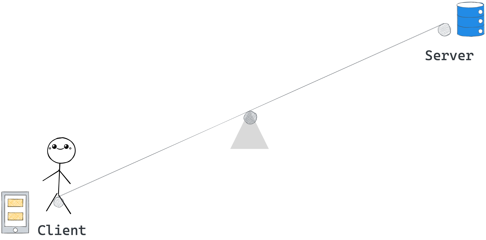
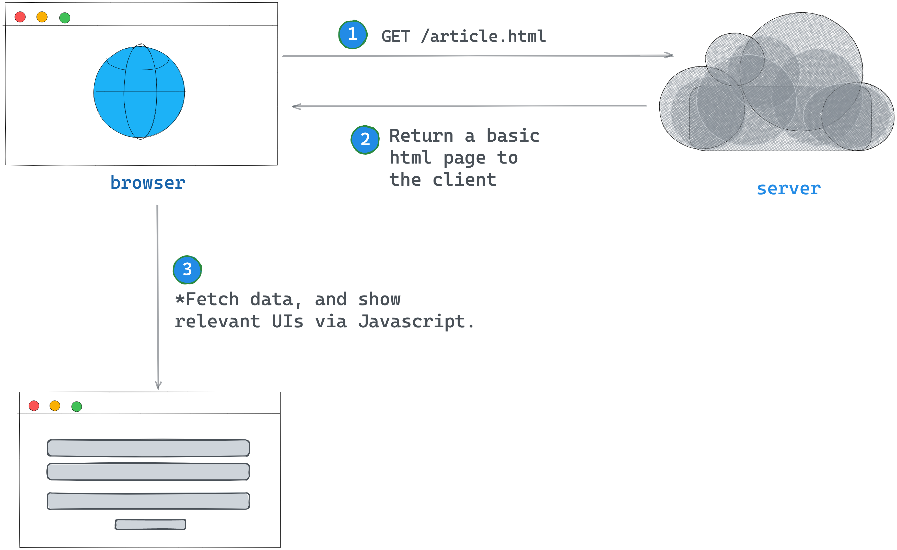
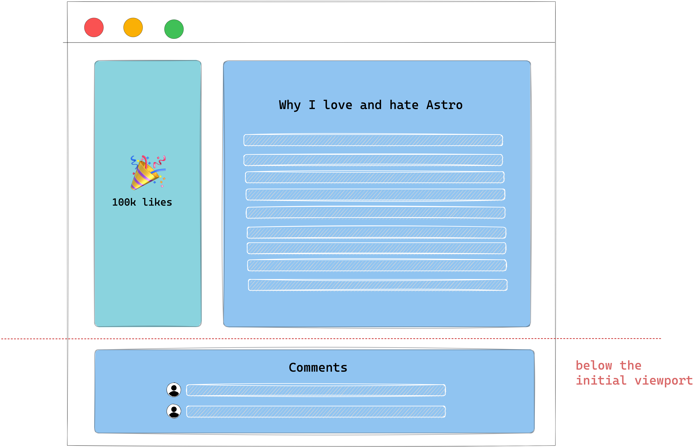
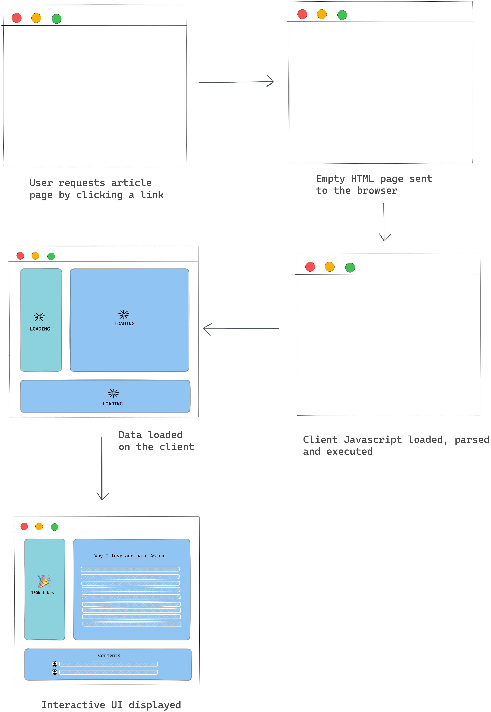
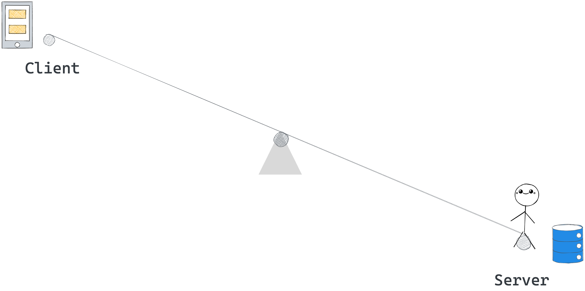
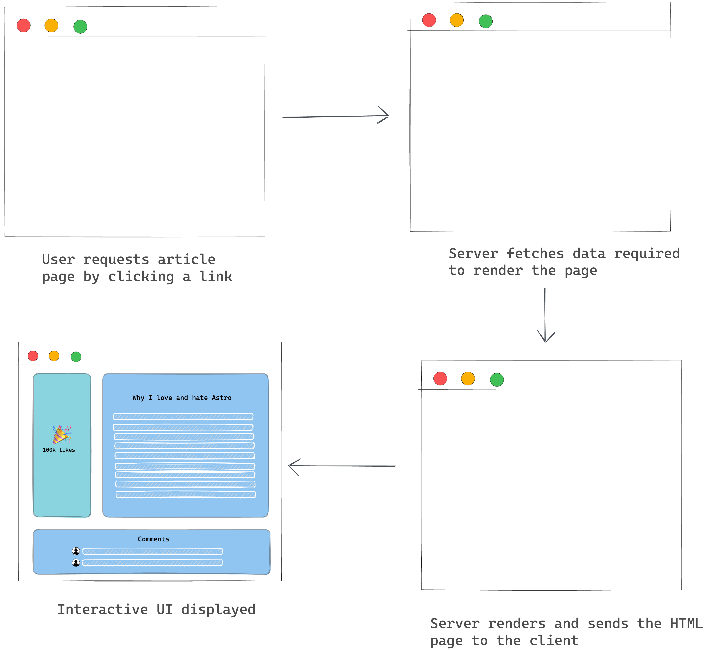
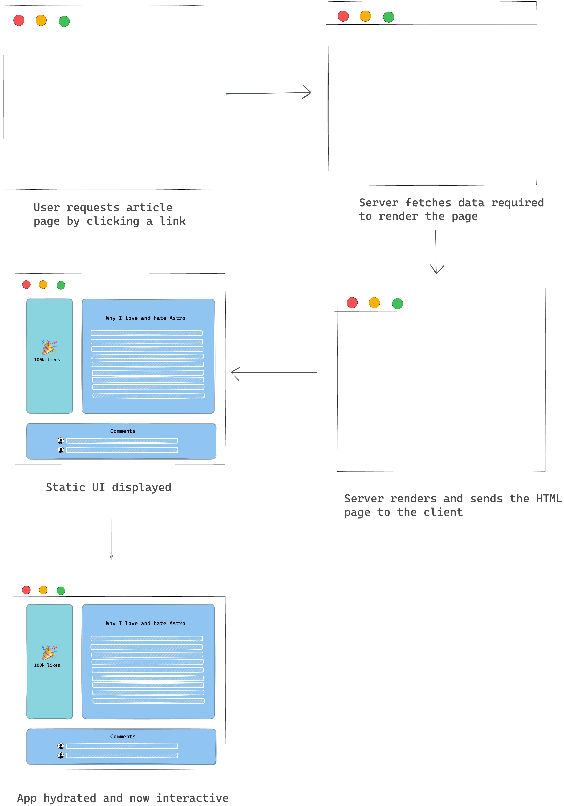
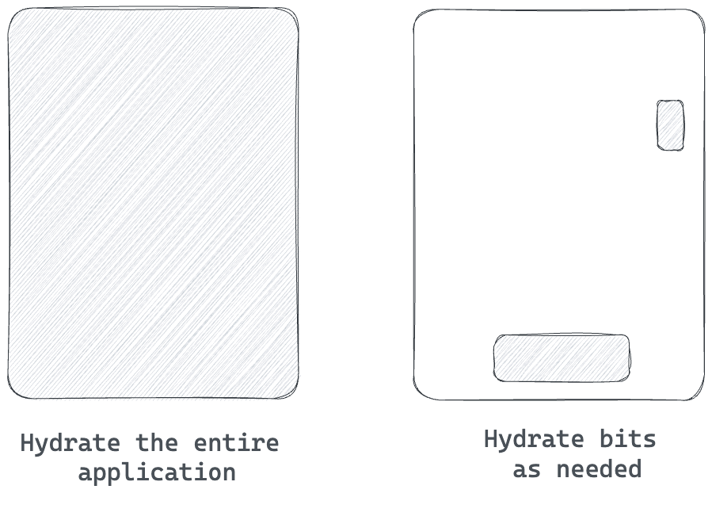
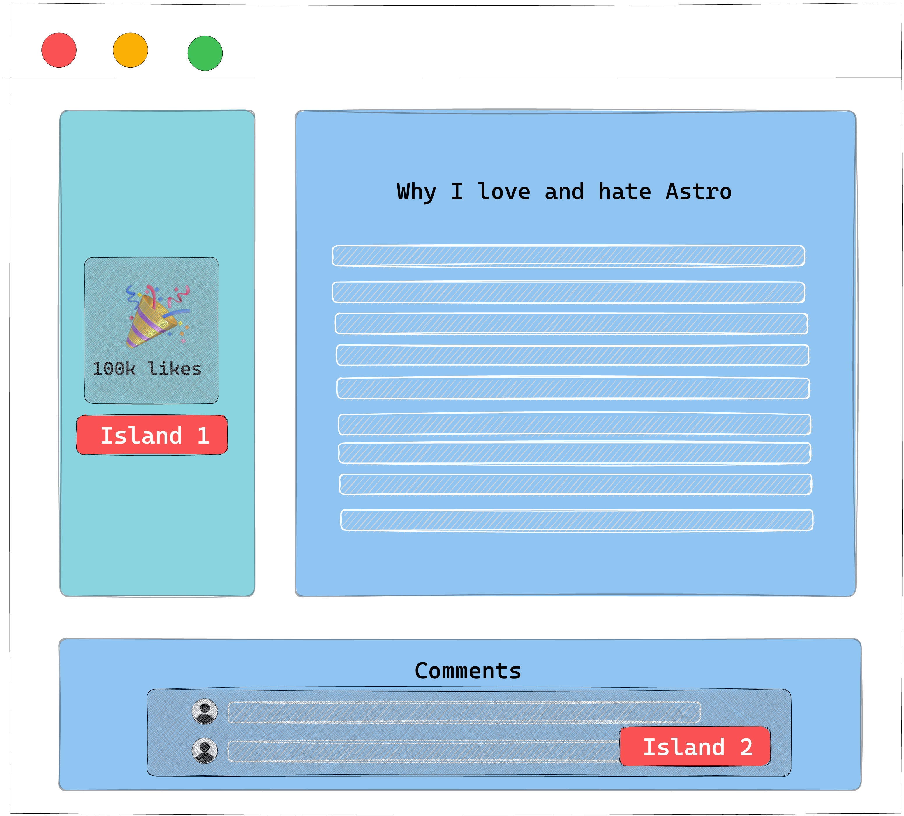
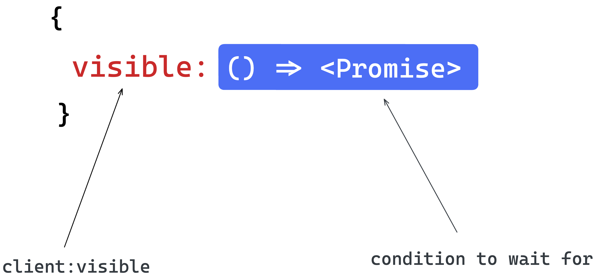

# 🚀 Understanding Astro

By [Ohans Emmanuel](https://www.ohansemmanuel.com/)

<br />

## Chapter 3: Build Your Own Component Island

> “What I cannot create, I do not understand” — Richard Feynman

Astro’s fast narrative relies on component islands, which allow using other framework components like React, Vue, or Svelte in our Astro applications. This chapter will guide us in creating our own component island from the ground up.

<br /> 
<br />

[](https://ohans.me/understanding-astro-udemy)

<br /> 
<br />

[](https://github.com/understanding-astro/build-your-own-component-island)

<br /> 
<br />

## What you’ll learn

- An overview of different web application rendering techniques.
- Build your own component islands implementation from scratch.
- Comprehend the island architecture.

---

## A brief history of how we got here

To ensure the coming technical implementation is built on a solid understanding, let’s peep into the past and explore the several application rendering techniques we may employ on a frontend application.

It is essential to note that this isn’t an exhaustive guide to front-end application rendering. However, we’ll learn enough to understand and appreciate the component islands architecture.

### Where it all begins

In simple terms, there are two main actors in serving an application to a user:

1. The user client, e.g., a web browser
2. The application server

To display a website, a user requests a resource from an application server.

<figure>
    
    <figcaption><em>The web browser requesting article.html from an application server.</em></figcaption>
    <br><br><br>
</figure>

With these two actors at play, a significant architectural decision you’ll make when building any decent frontend application is whether to render an application on the client or server[^1].

Let’s briefly explore both options.

---

### Client-side rendering (CSR)

<figure>
    
    <figcaption><em>Choosing client side rendering.</em></figcaption>
    <br><br><br>
</figure>

By definition, a client-side rendered application renders pages directly in the browser using Javascript. All logic, data-fetching, templating and routing are handled on the client (the user’s browser).

<figure>
    
    <figcaption><em>An overview of a client-side rendered application.</em></figcaption>
    <br><br><br>
</figure>

The past years saw the rise of client-side rendering, particularly among single-page applications. You’ve likely seen this in action if you’ve worked with libraries like React or Vue.

For a practical overview, consider the webpage for a blog article with a like count and a comment section below the initial viewport.

<figure>
    
    <figcaption><em>A blog article with a dynamic sidebar and a comment section below the article.</em></figcaption>
    <br><br><br>
</figure>

If this application was entirely client-side rendered, the simplified rendering flow would look like this:

1. The user visits your website.
2. Your static server returns a near-empty `HTML` page to the browser.
3. The browser fetches the linked script file in the `HTML` page.
4. The Javascript is loaded and parsed.
5. The data for the article, number of comments and comments are fetched.
6. A fully interactive page is shown to the user.

<figure>
    
    <figcaption><em>Visualising the rendering process from a user's perspective.</em></figcaption>
    <br><br><br>
</figure>

#### The pros of client-side rendering (CSR)

- The user gets back the resource from the server quickly. In our case, a near-empty `HTML` page, but on the bright side, the user receives that quickly! In technical terms, client-side rendering yields a high time to first byte (**TTFB**)[^2]
- Arguably accessible to reason about. All logic, data-fetching, templating and routing are handled in one place - the client.

#### The cons of client-side rendering

- It potentially takes the user a long time to see anything tangible on our page, i.e., they’re initially met with an empty screen. Even if we change the initial `HTML` page sent to the browser to be an empty application shell, it still potentially takes time for the user to see eventual data, i.e., after the Javascript is parsed and the data fetched from the server.

- As the application grows, the amount of Javascript parsed and executed before displaying data increases. This can impact mobile performance negatively.

- The page's time to interactivity (**TTI**)[^3] suffers, e.g., it takes long before our users can interact with the comments. All Javascript must be parsed, and all associated data must be fetched first.

- Detrimental SEO if not implemented correctly.

---

### Server-side rendering

<figure>
    
    <figcaption><em>Choosing server-side rendering.</em></figcaption>
    <br><br><br>
</figure>

Let’s assume we’re unhappy with client-side rendering and decide to do the opposite.

On the opposing end of the rendering pole lies server-side rendering.

In a server-side rendered application, a user navigates to our site, and the server generates the full `HTML` for the page and sends it back to the user.

In our example, here’s what a simplified flow would look like:

1. The user visits our website.
2. The data for the article, user profile and comments are fetched on the server.
3. The server renders the `HTML` page with the article, the number of comments and other required assets.
4. The server sends the client a fully formed `HTML` page.

<figure>
    
    <figcaption><em>Visualising the rendering process from a user's perspective.</em></figcaption>
    <br><br><br>
</figure>

NB: it is assumed that the server sends a mostly static `HTML` page with minimal Javascript needed for interactivity.

#### The pros of server-side rendering

- As soon as the user browser receives our fully formed `HTML` page, they can almost immediately interact with it, e.g., the rendered comments. There’s no need to wait for more Javascript to be loaded and parsed. In performance lingo, the time to interactivity (**TTI**) equals the first contentful paint (**FCP**).[^4]
- Great SEO benefits as search engines can index your pages and crawl them just fine.

#### The cons of server-side rendering

- Generating pages on the server takes time. In our case, we must wait for all the relevant data to be fetched on the server. As such, the time to first byte(**TTFB**)[^5] is slow.
- Resource intensive: the server takes on the burden of rendering content for users and bots. As a result, associated server costs increase as rendering needs to be done on the server.
- Full page reloads for every requested server resource.

---

### Server-side rendering with client-side hydration

We’ve explored rendering on both sides of the application rendering pole. However, what if there was a way to use server and client-side rendering? Some strategy right in the middle of the hypothetic rendering pole?

<figure>
    
    <figcaption><em>Choosing SSR with client-side hydration.</em></figcaption>
    <br><br><br>
</figure>

If we were building an interactive application and working with a framework like React or Vue, a widely common approach is to render on the server and hydrate on the client.

Hydration, in layperson’s terms, means re-rendering the entire application again on the client to attach event handlers to the DOM and support interactivity.

In theory, this is supposed to give us the wins of server-side rendering plus the interactivity we get with rich client-side rendered applications.

In our example, here’s what a simplified flow would look like:

1. The user visits our website.
2. The data for the article, user profile and comments are fetched on the server.
3. The server renders the `HTML` page with the article, the number of comments and other required assets.
4. The server sends the client a fully formed `HTML` page alongside the Javascript client runtime.
5. The client then “boots up” Javascript to make the page interactive.

Making an otherwise static page interactive (e.g., attaching event listeners) is called hydration.

<figure>
    
    <figcaption><em>Visualising the rendering process from a user's perspective.</em></figcaption>
    <br><br><br>
</figure>

#### The pros of server-side rendering with client-side hydration

- Benefits of SSR, e.g., quick FP and FMP
- Can power highly interactive applications.
- Supported rendering style in most frontend frameworks such as React and Vue.

#### The cons of server-side rendering with client-side hydration

- Slow time to first byte — similar to standard SSR.
- It can delay time to Interactivity (TTI) by making the user interface look ready before completing client-side processing. The period where the UI looks ready but is unresponsive (not hydrated) is what’s been — quite hilariously — dubbed the uncanny valley.

NB: this assumes certain parts of our application, such as the likes and comments, can be interacted with, e.g., clicked to perform further action.

---

### Partial hydration for the win

Combining server-side rendering with client-side hydration has the potential to offer the best of both worlds. However, it is not without its demerits.

One way to tackle the heavy delay in time to interactivity (TTI) seems obvious. Instead of hydrating the entire application, why not hydrate only the interactive bits?

<figure>
    
    <figcaption><em>Partial hydration vs full-page hydration.</em></figcaption>
    <br><br><br>
</figure>

As opposed to hydrating the entire application client side, partial hydration refers to hydrating specific parts of an application while leaving the rest static.

For example, in our application, we’d leave the rest of the page static while hydrating just the like button and comment section.

We may also take partial hydration further and implement what’s known as lazy hydration. For example, our application has a comment section below the initial viewport.

In this case, we may hydrate the like button when the page is loaded and hydrate the comment section only when the user scrolls below the initial viewport.

<figure>
    
    <figcaption><em>Hydrate the comment section at a later time.</em></figcaption>
    <br><br><br>
</figure>

Talk about flexibility!

#### The pros of partial hydration

- The same benefits of server-side rendering with client-side hydration.
- Faster time to interactivity as the entire application isn’t hydrated.

#### The cons of partial hydration

- If most of the parts of the application are interactive and have a high priority, the advantage of partial hydration could be arguably minimal, i.e., the entire application would take just as long to be hydrated.

### Where does the island architecture come from?

The island architecture is built upon the foundation of partial hydration. Essentially, the islands architecture refers to having “islands of interactivity” on an otherwise static `HTML` page.

<figure>
    
    <figcaption><em>Islands of interactivity on an otherwise static webpage.</em></figcaption>
    <br><br><br>
</figure>

To make sense of this, think of these islands as partially hydrated components. So our entire page isn’t hydrated, but rather these islands.

---

## A partial hydration islands architecture implementation

It’s game time, mate.

This section might seem challenging, but I suggest taking your time and coding along if possible. But, of course, you’ll probably be fine if you’re a more experienced engineer!

We will begin building our own island architecture implementation from the ground up. In more technical terms, we will implement a framework-independent partial hydration islands architecture implementation.

Phew! That’s a mouth full.

Let’s break that down.

### Objectives

The goal of this exercise is not to build a full-blown library or to create an exact clone of the Astro Island implementation. No!

Our objective is to peel back the perceived layer of complexity and strip down component islands to a fundamental digestible unit.

Here are the functional requirements for our island implementation:

1. Framework-independent: our solution must work across multiple frameworks, e.g., `Preact`, `Vue`, `Petite-Vue` and `React`.
2. A partial hydration islands architecture implementation: we will strip away Javascript by default and only hydrate on an as-needed basis.
3. No frontend build step: for simplicity, our implementation will disregard a frontend build step, e.g., using `babel.`
4. Support lazy hydration: this is a form of partial hydration where we can trigger hydration later and not immediately after loading the site. e.g., if an island is off-screen (not in the viewport), we will not load the Javascript for the island. We will only do so when the island is in view.

### Installation

Let’s call our island module `mini-island`.

To install `mini-island`, a developer will import our _soon-to-be-built_ module as shown below:

```js
<script type="module">
  {/** import a mini-island.js module **/}
  import "/mini-island.js"
</script>
```

To enjoy the benefits of partial hydration, developers will add `mini-island.js` to their page with the promise of having a small JS footprint — a small price to pay to get partially hydrated islands of interactivity.

### API design

Our first objective is to make sure our solution is framework agnostic. An excellent native solution for framework-agnostic implementations is **web components**[^6].

By definition, web components are a suite of technologies that allows us to create reusable custom elements.

If you’re new to web components, instead of rendering a standard HTML element, e.g., a `div`, we will create our custom HTML element, `mini-island`.

`mini-island.js` will expose a custom element with the following basic usage:

```js
<mini-island>This is an island</mini-island>
```

Within `<mini-island>`, a developer will be able to leverage an island of interactivity on an otherwise static page.

We will support three different `<mini-island>` attributes to handle partial and lazy hydration: `client:idle`, `client:visible` and `client:media={QUERY}`.

Here’s an example of how they’d be used on `<mini-island>`:

```js
<mini-island client:idle />
<mini-island client:visible />
<mini-island client:media="(max-width: 400px)" />
```

These attributes will affect how the island is hydrated.

- `client:idle`: load and hydrate javascript when the whole page is loaded[^7] and the browser is idle.[^8]
- `client:visible`: we will load and hydrate the island javascript once the island is visible, e.g., entered the user’s viewport.
- `client:media`: we will load and hydrate the island once the query is satisfied, e.g., `client:media="(max-width: 400px)"`.

There’s one final piece to our API design. How will developers define the scripts or markup to be hydrated?

We will use the `<template>`  HTML element, the content template element.

```html
<!-- ❌ incorrect usage: -->
<mini-island client:idle>
  <script>
    console.log("this should be partially hydrated");
  </script>
</mini-island>

<!-- ✅ correct usage: -->
<mini-island client:idle>
  <!-- use the <template> element -->
  <template>
    <script>
      console.log("this should be partially hydrated");
    </script>
  </template>
</mini-island>
```

`<template>` is generally used for holding `HTML` that shouldn’t be rendered immediately on page load. However, the `HTML` may be instantiated via Javascript.

For example, assuming a user wanted to log a warning to the console but wanted to use our island implementation, they’d do the following:

```js
<mini-island>
  <h2> Warning, something may be wrong </h2>
  <template data-island>
     <script type="module">
		console.error("something has gone wrong")
     </script>
  </template>
<mini-island>
```

When the above is rendered, the `<h2> Warning, something may be wrong </h2>` message will be displayed. However, child elements of the `template` will not be rendered by default, i.e., the `script` will never be executed.

Our `mini-island` implementation will grab the content of the `template` and initialise the `<script>` when desired.

For example, if the user passes a `client:visible` attribute, we will ensure the script only runs when the island is visible.

```js
<mini-island client:visible>
  <h2> Warning, something may be wrong </h2>
  <template data-island>
     <script type="module">
		console.error("something has gone wrong")
     </script>
  </template>
<mini-island>
```

It’s important to note that we expect the developer to pass a `data-island` attribute to the `template`. We will only hydrate templates with the `data-island` attribute to avoid interfering with other potential user-defined templates.

Don’t worry if these seem fuzzy right now; we will implement and test these with examples that’ll solidify your understanding.

### Getting started

Ready?

Start by creating a `mini-island.js` file in whatever directory you want.

In `mini-island`, create a barebones custom component as annotated below:

```js
// 📂 mini-island.js

/**
 * Define a MiniIsland class to encapsulate the behaviour of 
our custom element, <mini-island>
 * This class extends HTMLElement where the HTMLElement 
interface represents any HTML element.
 */
class MiniIsland extends HTMLElement {
  /**
   * Define the name for the custom element as a static class 
property.
   * Custom element names require a dash to be used in them 
(kebab-case).
   * The name can't be a single word. ✅ mini-island ❌ 
miniIsland
   */
  static tagName = "mini-island";
  /**
   * Define the island element attributes
   *, e.g., <mini-island data-island>
   */
  static attributes = {
    dataIsland: "data-island",
  };
}

/**
 * Our solution relies heavily on web components. Check that the
 * browser supports web components via the 'customElements' property
 */

if ("customElements" in window) {
  /**
   * Register our custom element on the CustomElementRegistry object using the define method.
   *
   * NB: The CustomElementRegistry interface provides methods for registering custom elements and querying registered elements.
   *
   * NB: The arguments to the define method are the name of the custom element (mini-island)
   * and the class (MiniIsland) that defines the behaviour of the custom element.
   *
   * NB: "MiniIsland.tagName" below represents the static class property, i.e., "static tagName".
   */
  window.customElements.define(MiniIsland.tagName, MiniIsland);
} else {
  /**
   * custom elements not supported, log an error to the console
   */
  console.error(
    "Island cannot be initiated because Window.customElements is unavailable."
  );
}
```

Let’s get some basic manual testing to nudge us in the right direction.

Create a new `demos/initial.html` file with the following content:

```js
<!DOCTYPE html>
<html lang="en">
  <head>
    <meta charset="UTF-8" />
    <meta http-equiv="X-UA-Compatible" content="IE=edge" />
    <meta name="viewport" content="width=device-width, initial-scale=1.0" />
    <title>Initial island demo</title>

    <script type="module">
      import "../mini-island.js";
    </script>
  </head>
  <body>
    <h1>Initial island demo</h1>
  </body>
</html>

```

To view this via a local web server, run the following command from the project directory:

```bash
 npx local-web-server
```

By default, this should start a local static web server on port `8000`. We may now view the initial demo page on `http://localhost:8000/demos/initial.html`

<figure>
    
    <figcaption><em>The initial demo page.</em></figcaption>
    <br><br><br>
</figure>

Let’s confirm that our custom element `mini-island` is registered rendering the custom element with a simple paragraph child element:

```html
<!-- 📂 demos/initial.html -->
...
<body>
  <h1>Initial island demo</h1>
  <mini-island>
    <p>Hello future island</p>
  </mini-island>
</body>
```

This will render the custom element and the `Hello future island` paragraph as expected:

<figure>
    
    <figcaption><em>Rendering the custom element with a child element.</em></figcaption>
    <br><br><br>
</figure>

Now, let’s go ahead and add some Javascript within `<mini-island>` as shown below:

```html
<!-- 📂 demos/initial.html -->
...
<mini-island>
  <p>Hello future island</p>
  <script type="module">
    console.warn("THIS IS A WARNING FROM AN ISLAND");
  </script>
</mini-island>
```

If you refresh the page and check the browser console, we should see the warning logged.

<figure>
    
    <figcaption><em>Console warning from the island.</em></figcaption>
    <br><br><br>
</figure>

This means the script was fired almost immediately. Not our ideal solution.

While images and video account for over 70% of the bytes downloaded for the average website, byte per byte, JavaScript has a more significant negative impact on performance.

So, our goal is to ensure Javascript doesn’t run by default. We will render any relevant markup in the island (HTML and CSS) but defer the loading of Javascript.

### Leveraging the content template element

`<template>` is a native HTML element that’s near perfect for our use case.

The contents within a `<template>` element are parsed for correctness by the browser but not rendered.

For example, let’s go ahead and wrap the script from the previous example in a `<template>` element as shown below:

```html
<!-- 📂 demos/initial.html -->
...
<mini-island>
  <p>Hello future island</p>
  <template>
    <script type="module">
      console.warn("THIS IS A WARNING FROM AN ISLAND");
    </script>
  </template>
</mini-island>
```

If you refresh the page, you’ll notice that the `Hello future island` paragraph is rendered, but the `script` within `<template>` isn’t, i.e., no log to the console.

This is step one: isolate javascript from being loaded right away.

However, the eventual goal here is to ensure the developer can decide when to run the `script` within our island `template`.

As discussed in the proposed API implementation, consider the following:

```html
<mini-island client:visible>
  <p>Hello future island</p>
  <template>
    <script type="module">
      console.warn("THIS IS A WARNING FROM AN ISLAND");
    </script>
  </template>
</mini-island>
```

With the `client:visible` attribute, we will only initialise the script when the island is visible (within the user viewport).

Without taking the `client:` attributes into question, let’s go ahead and initialise any template content as soon as the `<mini-island>` element is attached to the DOM.

Consider the annotated code below:

```js
// 📂 mini-island.js
class MiniIsland extends HTMLElement {
  // ...

  /**
   * The connectedCallback is a part of the custom elements lifecycle callback.
   * It is invoked anytime the custom element is attached to the DOM
   */
  async connectedCallback() {
    /**
     * As soon as the island is connected, we will go ahead and hydrate the island
     */
    await this.hydrate();
  }

  hydrate() {
    /**
     * Retrieve the relevant <template> child elements of the island
     */
    const relevantChildTemplates = this.getTemplates();
  }
}
```

Now, we will turn our attention to `getTemplates()`.

Since `<mini-island>` is a custom element extending a standard `HTMLElement`, we can access traditional DOM querying methods such as `querySelectorAll`[^9].

So, let’s use `querySelectorAll` to retrieve a list of all child template elements with a `data-island` attribute.

```js
// 📂 mini-island.js
// ...

getTemplates() {
  /**
   * querySelectorAll() returns a list of the document's elements that match the specified group of selectors.
   * The selector, in this case, is of the form "template[data-island]."
   *, i.e., this.querySelectorAll("template[data-island]")
  */
  return this.querySelectorAll(
    `template[${MiniIsland.attributes.dataIsland}]`
  );
}
```

Note that the `data-island` attribute is retrieved in the code above via `MiniIsland.attributes.dataIsland`.

Also, do you remember why we’re using the `data-island` attribute?

This is because we want to give developers the flexibility to use standard `<template>` elements within our island. So, our island will only concern itself with `<template data-island>` elements.

Now that we’ve retrieved the template node via `getTemplates()`, we will grab its content and hydrate it.

Let’s update the `hydrate` method as shown below:

```js
// 📂 mini-island.js
// ...
hydrate() {
    /**
     * Retrieve the relevant <template> child elements of the island
     */
    const relevantChildTemplates = this.getTemplates();
    /**
     * Grab the DOM subtree within the template and replace the template with live content
     */
    this.replaceTemplates(relevantChildTemplates);
}
```

The `replaceTemplates` method is as shown below:

```js
// 📂 mini-island.js
// ...
 replaceTemplates(templates) {
    /**
     * Iterate over all nodes in the template list.
     * templates refer to a NodeList of templates
     * node refers to a single <template>
     */
    for (const node of templates) {
      /**
       * replace the <template> with its HTML content
       * e.g., <template><p>Hello</p></template> becomes <p>Hello</p>
       */
      node.replaceWith(node.content);
    }
  }
```

Do you see what we’re doing here?

We’re grabbing the template DOM subtree, accessing its content and removing the `<template>` element.

```html
<!-- 👀 before -->
<mini-island>
  <template>
    <p>Hello</p>
  </template>
  <mini-island>
    <!-- ✅ after -->
    <mini-island>
      <p>Hello</p>
      <mini-island></mini-island></mini-island></mini-island
></mini-island>
```

This will attach the content to the DOM and kick off rendering and script loading.

With the templates now replaced, let’s go ahead and change the initial demo file to hold a more tangible example, as shown below:

```js
<!-- 📂 demos/initial.html -->
<mini-island>
  <p>Hello future island</p>
  <template data-island>
    <script type="module">
      console.warn("THIS IS A WARNING FROM AN ISLAND");
    </script>
  </template>
</mini-island>
```

Note that the `<template>` element has the `data-island` attribute. This is how we signal to the island to hydrate the template content.

Now, refresh your browser and notice how the `console.warn` is triggered.

<figure>
    
    <figcaption><em>Hydrated island script.</em></figcaption>
    <br><br><br>
</figure>

If you also inspect the elements, you’ll notice that the `<template>` has been replaced with its live child content.

<figure>
     element." align="center">
    <figcaption><em>Replaced island template element.</em></figcaption>
    <br><br><br>
</figure>

We’re officially hydrating our island!

### Handling lazy hydration via “client:” attributes

Our current solution isn’t going to win us any awards. As soon as the island is attached to the DOM, we hydrate the island. Let’s make it better by introducing lazy hydration.

Lazy hydration is a form of partial hydration where we hydration later — not immediately after page load.

Lazy hydration is powerful because we can determine what’s essential or priority for our site, i.e., we can choose to delay the execution of unimportant Javascript.

Update the `initial.html` document to consider our first use case. Here’s the updated code:

```html
<!-- 📂 demos/initial.html -->
<!DOCTYPE html>
<html lang="en">
  <head>
    <meta charset="UTF-8" />
    <meta http-equiv="X-UA-Compatible" content="IE=edge" />
    <meta name="viewport" content="width=device-width, initial-scale=1.0" />
    <title>Initial island demo</title>

    <script type="module">
      import "../mini-island.js";
    </script>
  </head>
  <body>
    <h1>Initial island demo</h1>
    <!-- 👀 look here  -->
    <p style="padding-bottom: 100vh">Scroll down</p>
    <!-- 👀 look here  -->
    <mini-island client:visible>
      <p>Hello island</p>

      <template data-island>
        <script type="module">
          console.warn("THIS IS A WARNING FROM AN ISLAND");
        </script>
      </template>
    </mini-island>
  </body>
</html>
```

<figure>
    
    <figcaption><em>The client:visible demo.</em></figcaption>
    <br><br><br>
</figure>

We now have a paragraph that reads `scroll down`, which has a large enough bottom padding to push the island off the viewport.

With the `client:visible` attribute on the `<mini-island>`, we should not hydrate the island except when it’s visible, i.e., the user scrolls to view the island.

However, test this in your browser.

<figure>
    
    <figcaption><em>The island is hydrated before being in view.</em></figcaption>
    <br><br><br>
</figure>

The script is hydrated before we scroll (as soon as the page loads), and the `THIS IS A WARNING FROM AN ISLAND` message is logged.

Let’s prevent this from happening.

To achieve this, take a second look at the island hydrate method:

```js
  hydrate() {
    const relevantChildTemplates = this.getTemplates();
    this.replaceTemplates(relevantChildTemplates);
  }
```

Conceptually, we aim to wait for specific loading conditions to be met before we replace the island templates. In this case, we want to wait until the island is visible.

In pseudo-code:

```js
  hydrate() {
     // Get island conditions, e.g., client:visible, client:idle
    // If these exist, wait for the conditions to be met before the next steps
    const relevantChildTemplates = this.getTemplates();
    this.replaceTemplates(relevantChildTemplates);
  }
```

To manage our island loading conditions, let’s introduce a new `Conditions` class as shown below:

```js
// 📂 mini-island.js

// ...
class Conditions {}

// same existing code ...
if ("customElements" in window) {
  window.customElements.define(MiniIsland.tagName, MiniIsland);
} else {
  console.error(
    "Island cannot be initiated because Window.customElements is unavailable."
  );
}
```

Within `Conditions`, we will introduce a static property that’s a key-value representation of the `client:` attribute and async methods.

<figure>
    
    <figcaption><em>An object with key-value corresponding to attribute and promise condition.</em></figcaption>
    <br><br><br>
</figure>

Our conditions will be fulfilled at a later unknown time. So, we will represent these with async functions. These async functions will return promises that are resolved when the associated condition is met.

Here’s the representation of this in code:

```js
// // 📂 mini-island.js
// ...
class Conditions {
  /**
   * A map of loading conditions and their respective async methods
   */
  static map = {
    idle: Conditions.waitForIdle,
    visible: Conditions.waitForVisible,
    media: Conditions.waitForMedia,
  };

  static waitForIdle() {
    return new Promise((resolve) => resolve());
  }

  static waitForVisible() {
    return new Promise((resolve) => resolve());
  }

  static waitForMedia() {
    return new Promise((resolve) => resolve());
  }
}
```

At the moment, the promises resolve immediately. However, let’s go ahead and flesh out our use case for `client:visible`.

First, we will expose a `getConditions` method on the `Conditions` class. The method will check if a certain DOM node (in our case, our `mini-island`) has an attribute in the form of `client:${condition}`.

Below’s the annotated implementation:

```js
// 📂 mini-island.js

class Conditions {
  // ...
  static getConditions(node) {
    /**
     * The result variable will hold the
     * key:value representing condition:attribute.
     * e.g., For <mini-island client:visible>
     * result should be { visible: "" }
     * and for <mini-island client:media="(max-width: 400px)" />
     * result should be { media: "(max-width: 400px)" }
     */
    let result = {};

    /**
     * Loop over all keys of the static map,
     *, i.e., ["idle", "visible", "media"]
     */
    for (const condition of Object.keys(Conditions.map)) {
      /**
       * Check if the node has the attribute
       * of the form "client:${key}".
       */
      if (node.hasAttribute(`client:${condition}`)) {
        /**
         * If the node has the attribute...
         * save the condition (key) - attribute (value)
         * to the result object
         */
        result[condition] = node.getAttribute(`client:${condition}`);
      }
    }
    /** return the result */
    return result;
  }
}
```

Next, we will expose a `hasConditions` method responsible for checking if an island has one or more conditions:

```js
// 📂 mini-island.js
// ...
class Conditions {
  // ...
  static hasConditions(node) {
    /**
     * Using the "getConditions" static class method, retrieve
     * a conditions attributes map
     */
    const conditionAttributesMap = Conditions.getConditions(node);

    /**
     * Check the length of the result keys to determine if there are
     * any loading conditions on the node
     */
    return Object.keys(conditionAttributesMap).length > 0;
  }
}
```

With `hasConditions` and `getConditions` ready, let’s go ahead and use these within the `MiniIsland` hydrate method.

First, here’s the current state of the `hydrate` method.

```js
// 📂 mini-island.js

class MiniIsland extends HTMLElement {
  // ...
  hydrate() {
    const relevantChildTemplates = this.getTemplates();
    this.replaceTemplates(relevantChildTemplates);
  }
  // ...
}
```

Now, update the method with the following. I have provided annotations to make it easier to understand.

```js
// 📂 mini-island.js

class MiniIsland extends HTMLElement {
  // ...
  async hydrate() {
    /**
     * conditions will hold an array of potential
     * promises to be resolved before hydration
     */
    const conditions = [];

    /**
     * Get the condition - attribute value map
     * NB: the argument passed to
     * `Conditions.getConditions` is the island node
     */
    let conditionAttributesMap = Conditions.getConditions(this);

    /**
     * Loop over the conditionAttributesMap variable
     */
    for (const condition in conditionAttributesMap) {
      /**
       * Grab the condition async function from the static map
       * Remember that the function that returns a promise when invoked
       */
      const conditionFn = Conditions.map[condition];

      /**
       * Check if the condition function exists
       */
      if (conditionFn) {
        /**
         * Invoke the condition function with two arguments:
         * (1) The value of the condition attribute set on the node
         * For example:
         * for <mini-island client:visible /> this is an empty string ""
         * for <mini-island client:media="(max-width: 400px)" />
         * This is the string "(max-width: 400px)"
         *
         * (2) The node, i.e., the island DOM node
         */
        const conditionPromise = conditionFn(
          conditionAttributesMap[condition],
          this
        );

        /**
         * append the promise to the conditions array
         */

        conditions.push(conditionPromise);
      }

      /**
       * Await all promise conditions to be
       * resolved before replacing the template nodes
       */
      await Promise.all(conditions);
      /**
       * Retrieve the relevant <template> child elements of the island
       */
      const relevantChildTemplates = this.getTemplates();
      /**
       * Grab the DOM subtree in the template
       * and replace the template with live content
       */
      this.replaceTemplates(relevantChildTemplates);
    }
  }
}
```

At the moment, remember that our condition promises in `Conditions` resolve immediately.

Before we test our solution, we must satisfy the condition for the `client:visible` attribute.

How do we ensure that the island is visible?

The best solution here is to use the `IntersectionObserver` API[^10]. Let’s take advantage of that as shown below:

```js
// 📂 mini-island.js

class Conditions {
  // ...
  /**
   *
   * @param noop - the value of the condition attribute.
   * This is named "noop" as it is not relevant in this condition, i.e.,
   * as per our API, client:visible always has a falsy attribute value, e.g.,
   * ✅ <mini-island client:visible />
   * ❌ <mini-island client:visible={some-value} />
   * @param el - the node element.
   * This represents our island DOM node passed during hydration
   * @returns - a Promise that resolves when "el" is visible
   * NB: relies on the Intersection Observer API
   */
  static waitForVisible(noop, el) {
    /**
     * If the Intersection Observer API is not available,
     * go ahead and exit immediately.
     */
    if (!("IntersectionObserver" in window)) {
      return;
    }

    /**
     * Otherwise, set up a new Promise that is resolved when the
     * node parameter (our island DOM node) is visible
     */
    return new Promise((resolve) => {
      let observer = new IntersectionObserver((entries) => {
        let [entry] = entries;

        /**
         * is it visible?
         */
        if (entry.isIntersecting) {
          /**
           * remove observer
           */
          observer.unobserve(entry.target);
          /**
           * resolve promise
           */
          resolve();
        }
      });

      /**
       * set up the observer on the "el" argument
       */
      observer.observe(el);
    });
  }
}
```

This is excellent work!

Return to the demo `initial.html` application running in your browser, refresh, and notice how the island behaves.

The island is no longer hydrated until we scroll down and the island is visible 🎉

Well done, mate! Give yourself a round of applause and a cuppa tea. We’ve smashed it! Take a pause if you need one, and let’s get on the next set of requirements when you’re ready.

### Supporting the client:idle and client:media conditions

We have a pretty robust solution within the `hydrate` method. So, to support more loading conditions, we have to flesh out the other condition promises.

#### waitForIdle

Take a pause and consider how we should do this. For example, what heuristic do we rely on the determine when the browser is “idle”?

It begs the question, what’s “idle” in this case?

Well, for our implementation, the definition of idle is when the browser is not actively loading any resources, and no latency-critical events, such as animation and input responses, are in progress.

To achieve this, we will rely on two properties
(i) The `document.readyState` event [^11]

If the value of this event is `complete`, the document and all sub-resources have finished loading. This includes all dependent resources such as stylesheets, scripts, iframes, and images.

Listening to this event ensures we hydrate the island when all other essential assets have been downloaded.

(ii) The `window.requestIdleCallback()` method [^12]

By definition, the `window.requestIdleCallback()` method will queue a function to be called when a browser is idle. This ensures the function is only executed when the browser handles no latency-critical event.

Let’s put these together and create a promise that resolves when the `document.readyState` event is `complete`, and no latency-critical events are being handled.

Here’s the implementation below:

```js
// 📂 mini-island.js
// ...
class Conditions {
  // ...
  static waitForIdle() {
    const onLoad = new Promise((resolve) => {
      /**
       * The document.readyState property
       * describes the loading state of the document.
       */
      if (document.readyState !== "complete") {
        /**
         * Set up an event listener for the "load" event.
         * The load event is fired when the whole page
         * has loaded, including all dependent resources
         * such as stylesheets, scripts, iframes, and
         * images.
         */
        window.addEventListener(
          "load",
          () => {
            /**
             * resolve this promise once the "load" event is fired.
             */
            resolve();
          },
          /**
           * Remove the listener after the first
           * invocation of the "load" event.
           */
          { once: true }
        );
      } else {
        resolve();
      }
    });

    /**
     * The window.requestIdleCallback() method queues a
     * function to be called during a browser's idle periods.
     * This enables developers to perform background
     * and low-priority work on the main event loop
     */

    const onIdle = new Promise((resolve) => {
      /**
       * Check for "requestIdleCallback" support
       */
      if ("requestIdleCallback" in window) {
        requestIdleCallback(() => {
          /**
           * pass the promise resolve function
           * as the operation to be queued
           */
          resolve();
        });
      } else {
        /**
         * resolve the promise immediately
         * if requestIdleCallback isn't supported
         */
        resolve();
      }
    });

    /**
     * waitForIdle will wait for both
     * promises to be resolved, i.e., onIdle and onLoad
     */
    return Promise.all([onIdle, onLoad]);
  }
}
```

Now, go to the `initial.html` demo file and update the file as shown below:

```html
<!-- 📂 demos/initial.html -->
<!DOCTYPE html>
<html lang="en">
  <!-- ... -->
  <!-- content unchanged -->
  <body>
    <h1>Initial island demo</h1>
    

    <mini-island client:idle>
      <p>Hello island</p>

      <template data-island>
        <script type="module">
          console.warn("THIS IS A WARNING FROM AN ISLAND");
        </script>
      </template>
    </mini-island>
  </body>
</html>
```

Note that we’ve introduced a large `34MB` image from [Effigis](https://effigis.com/en/solutions/satellite-images/satellite-image-samples/) and passed a `client:idle` attribute to `<mini-island>`.

> Consider downloading the large image and referencing it locally instead of hitting the GitHub servers repeatedly.

The large image will keep the browser busy for some time. Before testing this in the browser, I suggest disabling the browser cache via developer tools.

<figure>
    
    <figcaption><em>The disable cache property in Firefox.</em></figcaption>
    <br><br><br>
</figure>

Open the page in the browser and notice how the script is not invoked until the browser has finished loading the large image and is in an idle state.

This is great!

Instead of potentially allowing non-priority Javascript code to compete for the browser resources, we’ve shelved that to be initialised later during the browser’s idle period.

#### waitForMedia

The media condition is fascinating. The island is only hydrated when a CSS media query is met. This is useful for mobile toggles or other elements only visible on specific screen sizes.

We will leverage the `window.matchMedia()` to determine if the document matches the media query string.

Here’s the annotated implementation:

```js
// 📂 mini-island.js
// ...
class Conditions {
  /**
   *
   * @param {*} query - the query string
   * passed to the client:media attribute
   * @returns Promise that resolves when
   * the document matches the passed CSS media query
   */
  static waitForMedia(query) {
    /**
     * window.matchMedia(query) returns A MediaQueryList object.
     * This object stores information on a media query
     * applied to a document and one of the properties
     * on this object is "matches" - a boolean for
     * whether the document matches the media query or not.
     * Create a new simple object of similar form, i.e.,
     * with a "matches" property
     */
    let queryList = {
      matches: true,
    };

    if (query && "matchMedia" in window) {
      /** 
       Override our stub with the actual query list
     */
      queryList = window.matchMedia(query);
    }

    /**
     * If matchMedia isn't supported or the
     * query is truthy, return immediately
     * e.g., truthy if matchMedia isn't in the window object
     */
    if (queryList.matches) {
      return;
    }

    return new Promise((resolve) => {
      /**
       * Set a new listener on the queryList object
       * and resolve the promise when there's a match
       */
      queryList.addListener((e) => {
        if (e.matches) {
          resolve();
        }
      });
    });
  }
}
```

With this in place, we may update the `initial.html` demo file to the following:

```html
<!DOCTYPE html>
<html lang="en">
  <!-- content remains the same -->
  <body>
    <h1>Initial island demo</h1>

    <mini-island client:media="(max-width: 400px)">
      <p>Hello island</p>

      <template data-island>
        <script type="module">
          console.warn("THIS IS A WARNING FROM AN ISLAND");
        </script>
      </template>
    </mini-island>
  </body>
</html>
```

Now refresh the page in your browser and notice how the script is never initialised until you resize your browser window to match the css query, i.e., a maximum width of `400px`.

### Supporting frameworks: Vue, Petite-vue and Preact

Our `<mini-island>` implementation is simple yet effective. However, you may not appreciate it until you’ve seen it used with other frameworks. Coincidentally, this is also a part of our objectives, i.e., to develop a framework-agnostic solution.

The following sections show framework examples utilising `<mini-island>`. To do this, we will build out the same framework user interface in the form of a simple counter.

#### Vue

Vue is a Javascript framework for building user interfaces. Vue’s mental model builds on top of standard HTML, CSS and Javascript, making it easy to understand for most people.

As expected of a modern UI framework, Vue is declarative and reactive.

Let’s go ahead and build a counter application leveraging Vue and `<mini-island>` as shown below:

```html
<!-- 📂 demos/vue.html -->

<!DOCTYPE html>
<html lang="en">
  <head>
    <meta charset="UTF-8" />
    <meta http-equiv="X-UA-Compatible" content="IE=edge" />
    <meta name="viewport" content="width=device-width, initial-scale=1.0" />
    <title>Vue mini-island demo</title>

    <script type="module">
      import "../mini-island.js";
    </script>
  </head>
  <body>
    <h1>Vue</h1>
    <mark>This is a vue counter </mark>

    <p>
      By default, this button does not load any Javascript and isn't hydrated.
    </p>

    <p>
      Resize your browser to match the media query:
      <code>(max-width: 400px)</code> to hydrate the island
    </p>

    <mini-island client:media="(max-width: 400px)">
      <div id="vue-app">
        <button @click="count++">
          <span>⬆️</span>

          <div>
            <strong>Vue</strong>
            <div>
              <span v-html="count">0</span>
              <span>-</span>
              <span>clicks</span>
            </div>
          </div>
        </button>
      </div>

      <template data-island>
        <script type="module">
          import { createApp } from "https://unpkg.com/vue@3.2.36/dist/vue.esm-browser.prod.js";

          createApp({
            data: () => ({ count: 0 }),
          }).mount("#vue-app");
        </script>
      </template>
    </mini-island>
  </body>
</html>
```

It’s okay if you do not understand the Vue code snippets. What’s important is the following:

- The HTML markup is rendered as soon as the HTML page is loaded and parsed.
- This includes the static counter markup within `mini-island`, i.e.,

  ```html
  <div id="vue-app">
    <button @click="count++">
      <span>⬆️</span>

      <div>
        <strong>Vue</strong>
        <div>
          <span v-html="count">0</span>
          <span>-</span>
          <span>clicks</span>
        </div>
      </div>
    </button>
  </div>
  ```

- However, the counter is not hydrated at this point. So, clicking the counter will not increase the count. This is because Vue hasn’t been loaded, and the counter button is not yet hydrated.
- Consider the loading condition set on the island, i.e., `client:media="(max-width: 400px)"`.
- Now, resize your browser (use the developer tools) to a width less than `400px` to hydrate the island.
- This will import Vue and hydrate the counter. Here’s the code responsible for within the island `template`:

  ```html
  <template data-island>
    <script type="module">
      import { createApp } from "https://unpkg.com/vue@3.2.36/dist/vue.esm-browser.prod.js";

      createApp({
        data: () => ({ count: 0 }),
      }).mount("#vue-app");
    </script>
  </template>
  ```

- The counter should now be hydrated; we may now click to our heart’s content.

#### Petite-vue

From the official Vue [documentation](https://vuejs.org/guide/extras/ways-of-using-vue.html#standalone-script), Vue also provides an alternative distribution called petite-vue that is optimised for progressively enhancing existing HTML.

This is perfect for our use case.

Let’s go ahead and create a similar demo using `petite-vue` as shown below:

```html
<!-- 📂 demos/petite-vue.html -->

<!DOCTYPE html>
<html lang="en">
  <head>
    <meta charset="UTF-8" />
    <meta http-equiv="X-UA-Compatible" content="IE=edge" />
    <meta name="viewport" content="width=device-width, initial-scale=1.0" />
    <title>Vue mini-island demo</title>

    <script type="module">
      import "../mini-island.js";
    </script>
  </head>
  <body>
    <h1>Petite-vue</h1>
    <mark>This is a petite-vue counter </mark>

    <p>
      By default, this button does not load any Javascript and isn't hydrated.
    </p>

    <p>
      Resize your browser to match the media query:
      <code>(max-width: 400px)</code> to hydrate the island
    </p>

    <mini-island client:media="(max-width: 400px)">
      <div id="vue-app" v-scope="{ count: 0 }">
        <button @click="count++">
          <span>⬆️</span>

          <div>
            <strong>Petite-vue</strong>
            <div>
              <span v-html="count">0</span>
              <span>-</span>
              <span>clicks</span>
            </div>
          </div>
        </button>
      </div>

      <template data-island>
        <script type="module">
          import { createApp } from "https://unpkg.com/petite-vue@0.4.1/dist/petite-vue.es.js";

          createApp().mount("#vue-app");
        </script>
      </template>
    </mini-island>
  </body>
</html>
```

Apart from a few changes, the code above is identical to the standard Vue API.
Here’s how this works:

- The HTML markup is rendered as soon as the HTML page is loaded and parsed.
- This includes the static counter markup within `mini-island`, i.e.,

  ```html
  <div id="vue-app" v-scope="{ count: 0 }">
    <button @click="count++">
      <span>⬆️</span>

      <div>
        <strong>Vue</strong>
        <div>
          <span v-html="count">0</span>
          <span>-</span>
          <span>clicks</span>
        </div>
      </div>
    </button>
  </div>
  ```

- NB: the significant difference in the code above is the introduction of the `v-scope` attribute to hold our count data variable.
- The counter, however, is not hydrated at this point. So, clicking the counter will not increase the count. This is because petite-vue hasn’t been loaded, and the counter button is not yet hydrated.
- Consider the loading condition set on the island, i.e., `client:media="(max-width: 400px)"`
- Now, resize your browser (take advantage of the developer tools) to a width less than `400px` to hydrate the island.
- This will import Petite-vue and hydrate the counter. Here’s the code responsible for within the island `template`:

  ```html
  <template data-island>
    <script type="module">
      import { createApp } from "https://unpkg.com/petite-vue@0.4.1/dist/petite-vue.es.js";

      createApp().mount("#vue-app");
    </script>
  </template>
  ```

- The counter should now be hydrated; we may now click to our heart’s content.

#### Preact

Preact is a fast 3kB alternative to React with the same modern API, and it can be used in the browser without any transpiration steps.

Let’s go ahead and create a similar demo using Preact, as shown below:

```html
<!-- 📂 demos/preact.html -->

<!DOCTYPE html>
<html lang="en">
  <head>
    <meta charset="UTF-8" />
    <meta http-equiv="X-UA-Compatible" content="IE=edge" />
    <meta name="viewport" content="width=device-width, initial-scale=1.0" />
    <title>Preact mini-island demo</title>

    <script type="module">
      import "../mini-island.js";
    </script>
  </head>

  <body>
    <h1>Preact</h1>
    <p>This is a preact counter</p>

    <p>By default, this button is not rendered or hydrated</p>

    <mini-island client:idle>
      <div id="preact-app">
        <mark
          >The counter island will be rendered and hydrated just above this mark
          when the browser is idle</mark
        >
      </div>

      <template data-island>
        <script type="module">
          import { h, Component, render } from "https://esm.sh/preact";
          import { useState } from "https://esm.sh/preact/hooks";
          import htm from "https://esm.sh/htm";

          // Initialize htm with Preact
          const html = htm.bind(h);

          function App(props) {
            const [count, setCount] = useState(0);

            const increment = () =>
              setCount((currentCount) => currentCount + 1);

            return html`<div>
              <button onClick=${() => increment()}>
                <span>⬆️ </span>

                <div>
                  <strong>Preact</strong>
                  <div>
                    <span>${count}</span>
                    <span>-</span>
                    <span>clicks</span>
                  </div>
                </div>
              </button>
            </div>`;
          }

          render(html`<${App} />`, document.getElementById("preact-app"));
        </script>
      </template>
    </mini-island>

    <ul>
      <li>The document must be completely loaded</li>
      <li>The large image below must complete loading</li>
    </ul>

    
  </body>
</html>
```

The code above behaves differently from the previous framework examples.

Here’s how this works:

- The HTML markup is rendered after loading and parsing the HTML.
- The counter, however, is not rendered or hydrated. This is because `mini-island` has a `client: idle` loading condition.
- The counter will be rendered and hydrated when the browser is idle. For this to be the case, the large image in the document must complete loading.
- Once this is loaded (including other associated document resources), Preact renders and hydrates the counter when the browser is idle.
- The counter should now be hydrated; we may now click to our heart’s content.

### Conclusion

When it comes to performance and deciding what rendering solution works for your application, no single solution fits all applications. Depending on the application, we always have to make tradeoffs. However, the island architecture provides very performant client applications without sacrificing rich interactivity.

The main goal of this chapter was to peel back the perceived layer of complexity and strip down component islands to a fundamental digestible unit with `<mini-island>`.

Now, we will take this knowledge into exploring component islands in Astro, and (almost) nothing will surprise you. That’s the definition of proper understanding!

[^1]: There are other rendering techniques in between rendering on the client or server.
[^2]: Time to first byte refers to the time between navigation to the site and when the first bytes of are received.
[^3]: The TTI measure the duration it takes for a webpage to achieve complete interactivity.
[^4]: When a browser displays the initial content from the DOM, it is known as the First Contentful Paint (FCP). This is the first indication to the user that the page is loading.
[^5]: Time to first byte (TTFB): the time from when the user navigates the page to when the first bit of content comes in.
[^6]: Web components on MDN: [https://developer.mozilla.org/en-US/docs/Web/API/Web_components](https://developer.mozilla.org/en-US/docs/Web/API/Web_components)
[^7]: The whole page is loaded when dependent resources such as stylesheets, scripts, iframes, and images have been fetched.
[^8]: Leverage window.requestIdleCallback for idle state: [https://developer.mozilla.org/en-US/docs/Web/API/Window/requestIdleCallback](https://developer.mozilla.org/en-US/docs/Web/API/Window/requestIdleCallback)
[^9]: querySelectorAll on MDN: [https://developer.mozilla.org/en-US/docs/Web/API/Document/querySelectorAll](https://developer.mozilla.org/en-US/docs/Web/API/Document/querySelectorAll)
[^10]: The IntersectionObserver API on MDN [https://developer.mozilla.org/en-US/docs/Web/API/Intersection_Observer_API](https://developer.mozilla.org/en-US/docs/Web/API/Intersection_Observer_API)
[^11]: [https://developer.mozilla.org/en-US/docs/Web/API/Document/readyState](https://developer.mozilla.org/en-US/docs/Web/API/Document/readyState "readyState")
[^12]: [https://developer.mozilla.org/en-US/docs/Web/API/Window/requestIdleCallback](https://developer.mozilla.org/en-US/docs/Web/API/Window/requestIdleCallback "requestIdleCallback")
