# 🚀 Understanding Astro

By [Ohans Emmanuel](https://www.ohansemmanuel.com/)

<br />

<br /> 
<br />

[](https://ohans.me/understanding-astro-udemy)

<br /> 
<br />

[](https://github.com/understanding-astro/astro-islands-showcase)

<br /> 
<br />

## Chapter 4: The Secret Life of Astro Component Islands

Component islands are the secret to Astro’s super-fast narrative. It’s time to learn everything about them.

## What you’ll learn

- Hands-on experience working with framework components in Astro.
- Responsible hydration and why it matters.
- How component islands work in Astro.
- Why islands are essential.

## How islands work in Astro

Assume we’ve got an Astro application with static content: a navigation bar, some main content, a footer and a side pane.

<figure>
    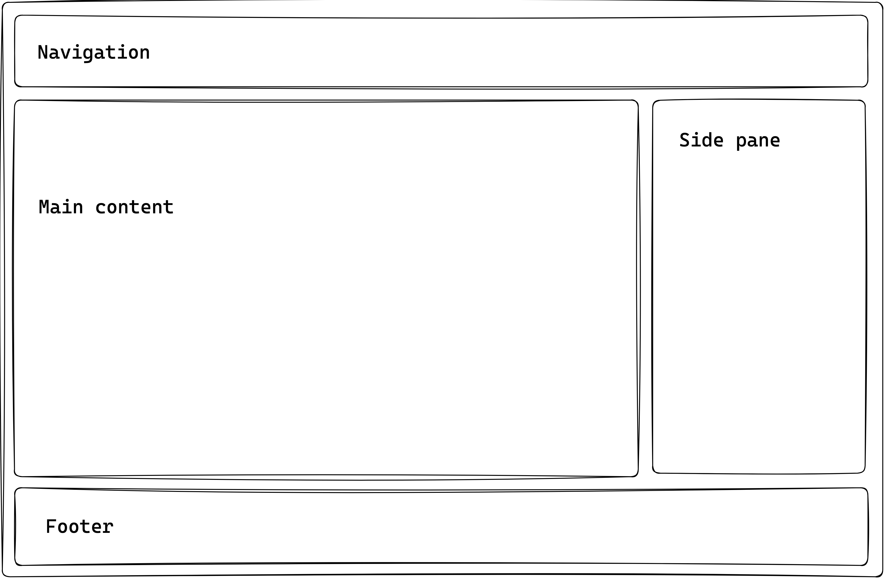
    <figcaption><em>A static astro page structure.</em></figcaption>
    <br><br><br>
</figure>

If we need to introduce some interactivity content in the side pane of the application, how could we achieve this?

<figure>
    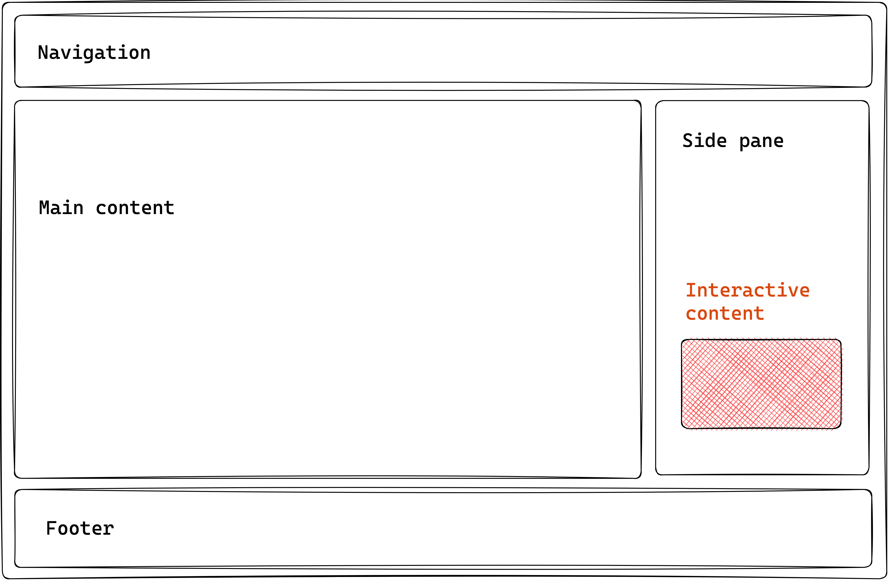
    <figcaption><em>Adding interactive content to the static page.</em></figcaption>
    <br><br><br>
</figure>

Astro provides the following ways to do this:

- We've seen how this works: introduce a `<script>` element to handle interactivity within your Astro component.
- Use a supported framework component, and leverage a component island.

The second option is the focus of this chapter.

At the time of writing, Astro lets you use components built with `React`, `Preact`, `Svelte`, `Vue`, `SolidJS`, `AlpineJS` or `Lit` in your Astro components. Moving on, I’ll refer to these as **framework components**.

<figure>
    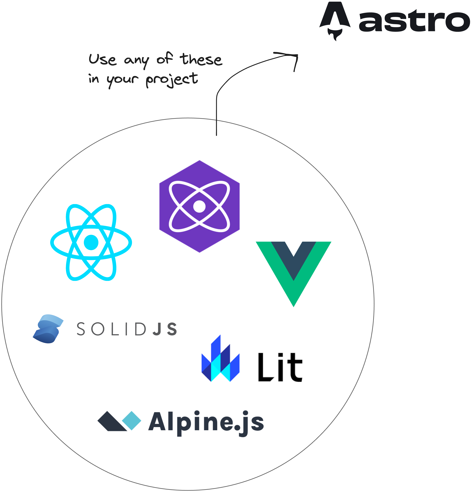
    <figcaption><em>Leveraging framework components in Astro.</em></figcaption>
    <br><br><br>
</figure>

So, why would we use framework components and not just provide native support via a `<script>` element?

It would be best to stick with a `<script>` element in cases where you can get by with vanilla Javascript or Typescript. However, there are cases where we may favour a framework component. For example:

-**Design systems**: using a pre-existing design system in an Astro project can save time, depending on the use case. It also helps keep all your applications looking and feeling the same way.

-**Open-source**: we might consider utilising a feature-rich open-source framework component already existing instead of building some highly interactive component from scratch. This way, we can easily use an open-source framework component in Astro.

-**Ease of development**: we may find building richer stateful user interfaces easier, more manageable, and faster to implement via framework components than vanilla Javascript / Typescript provided in `<script>`.

<br />

To use a framework component in Astro, we leverage component islands.

Let’s return to our example application.

Assuming we’ve weighed the pros and cons and decided to introduce a framework component, the following section highlights the steps to take.

### Step 1: Build an Astro site

We can’t use framework components without having some Astro site to use them in.

We’ve already seen how to build static sites with Astro, so creating a new static project is unnecessary. Instead, let’s start a new Astro with a project I’ve prepared.

Clone the project:

```bash
git clone https://github.com/understanding-astro/astro-islands-visual-example.git
```

Then, install dependencies and start the application via the following:

```bash
npm install
npm run start
```

This will run the project in one of your local ports.

<figure>
    
    <figcaption><em>The astro islands visual example project.</em></figcaption>
    <br><br><br>
</figure>

The project takes the same form as our hypothetical example — it’s got a navigation, main content, footer and side pane.

<figure>
    
    <figcaption><em>A static astro page structure.</em></figcaption>
    <br><br><br>
</figure>

Within the side pane, there’s a `slot` to render our interactive content via a framework component.

In `src/pages/index.astro`, you’ll find the code responsible for rendering the page as shown below:

```js
// 📂 src/pages/index.astro
---
import DefaultIslandLayout from "../layouts/DefaultIslandLayout.astro";
---

<DefaultIslandLayout />
```

`DefaultIslandLayout` provides the layout for the entire page and includes a `slot` for rendering whatever children elements are passed to it. Initialise the project locally and take a look!

### Step 2: Install the framework integration

Astro provides official integrations for the supported framework components. In this example, we’ll use the `react` framework.

It’s important to note that the steps described here are the same regardless of the framework component of your choosing. Therefore, I’m sticking to `react` as many more developers arguably use it.

The most convenient way to add your framework integration is to use the `astro add` command, e.g., to add `react`, run the following commands:

```bash
# using NPM
npx astro add react
# Using Yarn
yarn astro add react
# Using PNPM
pnpm astro add react
```

This will automatically add the relevant framework dependencies to our project.

<figure>
    
    <figcaption><em>Running astro add react.</em></figcaption>
    <br><br><br>
</figure>

The command will also automatically update our project configuration, `astro.config.mjs`, to include the framework integration.

<figure>
    
    <figcaption><em>Updating the project config file.</em></figcaption>
    <br><br><br>
</figure>

Essentially, this breaks down the installation of a framework into our Astro project into two distinct processes:

1.  Install the framework dependencies.
2.  Add the relevant framework integration in the project config file.

If we didn’t use the `Astro add` command, we could achieve the same results manually by installing the framework dependencies and adding the framework integration in our project configuration file.

### Step 3: Write the component framework

Our framework component will be a glorified counter. Assuming the page consists of an article a reader can upvote, we’ll build an upvote button.

<figure>
    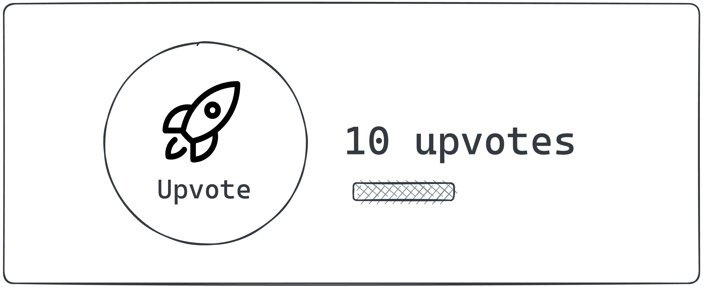
    <figcaption><em>The upvote counter illustrated.</em></figcaption>
    <br><br><br>
</figure>

Here’s the annotated `UpvoteContent` React component:

```js
<!-- 📂 src/components/UpvoteContent.tsx -->

import { useState } from "react";

// The maximum number of upvotes available
const MAX_COUNT = 50;

export const UpvoteContent = () => {
  // the initial state of the upvote counter
  const [upvoteCount, setUpvoteCount] = useState(0);

  return (
    <div>
      <button
       // update state when a user clicks the counter. check if
       //The maximum count value was reached first.
        onClick={() => {
          setUpvoteCount((prevCount) =>
            prevCount < MAX_COUNT ? prevCount + 1 : prevCount
          );
        }}
      >
       { /** Upvote counter SVG icon. shortened for brevity **/}
        <svg />
        Upvote
      </button>

      <div>
        <div>{`${upvoteCount} upvotes`}</div>

		{/** show a growing visual bar based on the upvote count **/}
        <div
          style={{
            width: `${upvoteCount}%`,
          }}
        />

		{/** show a warning if the maximum count has been reached**/}
        {upvoteCount === MAX_COUNT && (
          <div>
            Max upvote reached
          </div>
        )}
      </div>
    </div>
  );
};

```

Don’t worry if you don’t understand `react`. The goal here is to know how to work with framework components in Astro. We could build the same component using any other framework we choose, e.g., Vue or Svelte.

### Step 4: Render the component framework

Let’s go ahead and render the framework component as shown below:

```js
<!-- 📂 src/pages/none.astro -->
---
import { UpvoteContent } from "../components/UpvoteContent.jsx";
import DefaultIslandLayout from "../layouts/DefaultIslandLayout.astro";
---

<DefaultIslandLayout>
  <UpvoteContent />
</DefaultIslandLayout>
```

- Create a new page in `src/pages/none.astro`
- Render the `UpvoteContent` component as a child of `DefaultIslandLayout`, i.e.:

  ```js
  <DefaultIslandLayout>
    <UpvoteContent />
  </DefaultIslandLayout>
  ```

- `DefaultIslandLayout` takes the `UpvoteContent` child component and renders it within its layout slot.

Now, open the `/none` page in the browser, and we should have the rendered `UpvoteContent` component rendered.

<figure>
    
    <figcaption><em>Rendering the framework component.</em></figcaption>
    <br><br><br>
</figure>

The upvote counter is successfully rendered, but clicking the button doesn’t increase the count!

What’s going on? 🥹

#### It’s not a bug. It’s a feature.

By default, when you render a framework component, Astro automatically renders it to HTML ahead of time, i.e., Astro strips out all of the component JavaScript.

Essentially, you get no interactivity from framework components by default.

<figure>
    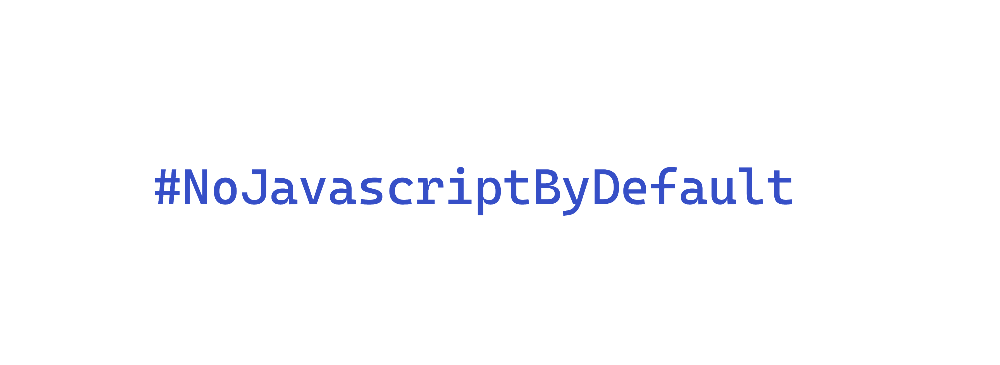
    <figcaption><em>If Astro launched a Twitter campaign, #NoJavscriptByDefault would make an excellent hashtag.</em></figcaption>
    <br><br><br>
</figure>

As it stands, what we currently have is technically not an island. We have the component markup rendered with no interactivity.

## Responsible hydration

Astro helps you minimise Javascript bloat when using framework components by leveraging responsible hydration.

If Astro renders your framework component to `100%` HTML, how do you hydrate (make interactive) the framework component?

In the context of Astro development, responsible hydration refers to Astro making no decision on when to hydrate your framework component and leaving that decision entirely up to the developer.

This is powerful but comes with the burden of decision resting on us — developers.

When technical decisions such as this need to be made, they must be made against specific requirements. In this case, the decision lies in evaluating two criteria, namely **priority** and **interactivity**.

- Priority: is this a high or low-priority user interface element?
- Interactivity: should this element be interactive as soon as possible?

We may represent this on a 2d plane as follows:

<figure>
    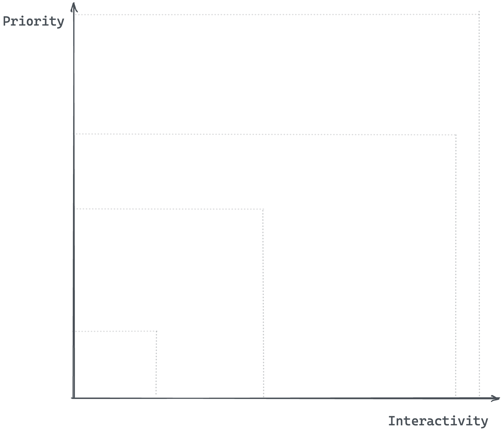
    <figcaption><em>Representing priority and interactivity on a 2d plane.</em></figcaption>
    <br><br><br>
</figure>

There are four attributes you can pass to your rendered framework component, e.g.,

```js
<ReactComponent attribute />
```

These attributes are called client directives (or, more generically, template directives). Here are the five client directives that control the hydration of your framework component:

- `client:load`
- `client:only`
- `client:visible`
- `client:media`
- `client:idle`

<figure>
    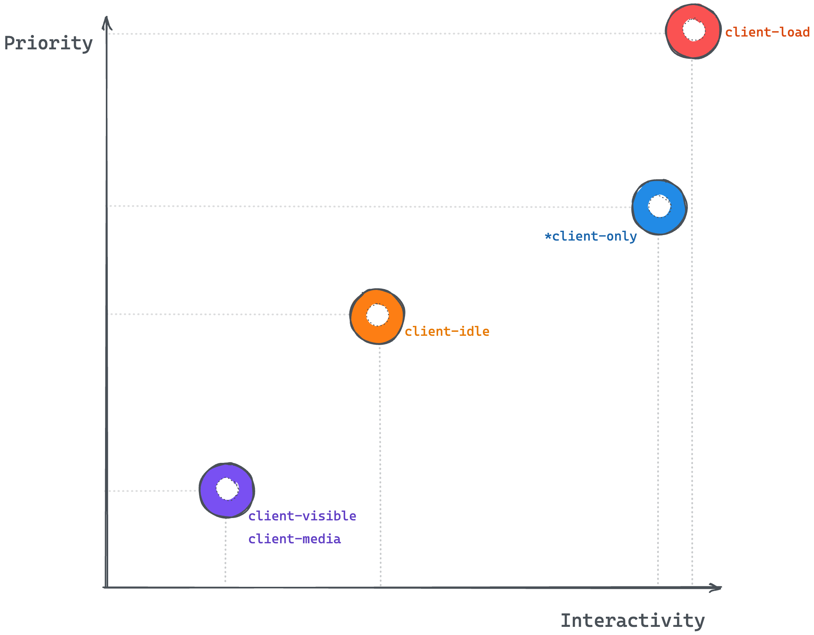
    <figcaption><em>Representing the client template directives on a priority - interactivity plane.</em></figcaption>
    <br><br><br>
</figure>

### client:load

`client:load` should be used for high-priority interface elements that must be interactive as soon as possible.

- Priority: high
- Interactivity: high

We may go ahead and render our `UpvoteContent` component as shown below:

```js
// 📂 src/pages/index.astro
---
import { UpvoteContent } from "../components/UpvoteContent.jsx";
import DefaultIslandLayout from "../layouts/DefaultIslandLayout.astro";
---

<DefaultIslandLayout>
  <UpvoteContent client:load />
</DefaultIslandLayout>
```

Here are the hydration steps:

1. Render the component HTML (not hydrated).
2. Wait for the page to load.
3. Load component Javascript.
4. Hydrate component.

The load event is fired when the page has loaded, including all dependent resources such as stylesheets, scripts, iframes, and images.

It’s important to note that clicking the upvote button will not trigger any upvotes before hydration.

### client:only

`client:only` behaves similarly to `client:load`. It should be used for elements where you want to skip server-side rendering (the component will not be initially rendered to HTML) but make it interactive as soon as it’s shown to the user on the client.

- Priority: medium (we’re okay not showing the initial component HTML)
- Interactivity: high (as soon as it’s shown to the user)

We may go ahead and render our `UpvoteContent` component as shown below:

```js
// 📂 src/pages/index.astro
---
import { UpvoteContent } from "../components/UpvoteContent.jsx";
import DefaultIslandLayout from "../layouts/DefaultIslandLayout.astro";
---

<DefaultIslandLayout>
  <UpvoteContent client:only="react" />
</DefaultIslandLayout>
```

It’s essential to pass the framework name as shown above. Otherwise, Astro doesn’t know what framework Javascript to load. This is because this isn’t determined on the server.

```js
<ReactComponent client:only="react" />
<PreactComponent client:only="preact" />
<SvelteComponent client:only="svelte" />
<VueComponent client:only="vue" />
<SolidComponent client:only="solid-js" />
```

Here are the hydration steps:

1. Do not render component HTML.
2. Wait for the page to load.
3. Load component Javascript.
4. Hydrate component.

The difference between `client:only` and `client:load` is whether to render a static component HTML before the element is interactive. `client:only` is particularly handy when rendering components requiring client (browser) APIs.

### client:visible

`client:visible` should be used for low-priority interface elements below the fold (far down the page) or resource-intensive; you don’t want to load them if the user never sees the component.

- Priority: low
- Interactivity: low

We may go ahead and render our `UpvoteContent` component as shown below:

```js
// 📂 src/pages/index.astro
---
import LargeMainContentLayout from "../layouts/LargeMainContentLayout.astro";
import { UpvoteContent } from "../components/UpvoteContent.jsx";
---

<LargeMainContentLayout>
  <UpvoteContent client:visible />
</LargeMainContentLayout>
```

Note that I’m importing a different `LargeMainContentLayout` layout in the code block above. The layout is responsible for pushing the island off the initial viewport.

Here are the hydration steps:

1. Render component HTML.
2. Wait for the element to be visible (uses `IntersectionObserver` ).
3. Load component Javascript.
4. Hydrate component.

### client:media

`client:media` should be used for low-priority interface elements only visible on specific screen sizes, e.g., sidebar toggles.

- Priority: low
- Interactivity: low

We may go ahead and render our `UpvoteContent` component as shown below:

```js
// 📂 src/pages/index.astro
---
import { UpvoteContent } from "../components/UpvoteContent.jsx";
import DefaultIslandLayout from "../layouts/DefaultIslandLayout.astro";
---

<DefaultIslandLayout>
  <UpvoteContent client:media="(max-width: 30em)" />
</DefaultIslandLayout>
```

Here are the hydration steps:

1. Render component HTML
2. Check if the media query matches
3. Load component Javascript
4. Hydrate component

### client:idle

`client:idle` should be used for low-priority interface elements that don’t need to be immediately interactive.

- Priority: medium
- Interactivity: medium (lower priority in comparison to `client:load`)

We may go ahead and render our `UpvoteContent` component as shown below:

```js
// 📂 src/pages/index.astro
---
import { UpvoteContent } from "../components/UpvoteContent.jsx";
import DefaultIslandLayout from "../layouts/DefaultIslandLayout.astro";
---

<DefaultIslandLayout>
  <UpvoteContent client:idle />
</DefaultIslandLayout>
```

Here’s the hydration step visualised:

1. Render component HTML.
2. Wait for the page to load.
3. Wait for the `requestIdleCallback` event to be fired
   > If `requestIdleCallback` isn’t supported, use only the document `load` event.
4. Load component Javascript.
5. Hydrate component.

## Using multiple frameworks

Theoretically, we can use multiple framework components in an Astro application. This is a powerful feature, but it shouldn’t be abused.

It does make for powerful demos of what’s possible with Astro. However, there are only a few real-world cases where we might want to do this, e.g., composing autonomous micro frontends on an Astro page.

Within an Astro component, the following is valid:

```js
---
 // import different framework components
 import SpecialReactComponent from '../components/
SpecialReactComponent.jsx'

 import SpecialVueComponent from '../components/
SpecialVueComponent.jsx'


import SpecialSvelteComponent from '../components/
SpecialSvelteComponent.jsx'
---

<!-- render the components -->
<SpecialReactComponent client:load/>
<SpecialVueComponent client:idle/>
<SpecialSvelteComponent client:load/>
```

Let’s see a real example in practice.

### An upvote counter in Vue

Recall that we built the initial `UpvoteContent` component using React. We’ll now create the `UpvoteContent` component using Vue and render both components in our Astro project.

Here’s the annotated implementation:

```vue
<!-- 📂 src/components/UpvoteContent.vue -->
<script>
export default {
  data() {
   // data properties used in the UI template
    return {
      upvoteCount: 0,
      maxUpvoteCount: 50,
    };
  },
  methods: {
	// method called when you click the upvote button
    upvote() {
      if (this.upvoteCount < this.maxUpvoteCount) {
        this.upvoteCount++;
      }
    },
  },
};
</script>

<template>
  <div>
    <button
	  // Attach a click event handler and invoke "upvote."
      @click="upvote"
    >
	 {/** Collapsed svg for brevity **/}
      <svg ../>
      Upvote
    </button>

    <div>
      <div>
        Vue
      </div>
      <div>{{ `${upvoteCount} upvotes` }}</div>

	   {/** Increase the width of the div by "count percentage"**/}
      <div :style="{ width: `${upvoteCount}%` }" />

		{/** Render this section only if
		  the count is equal to the max count  **/}
      <div
        v-if="upvoteCount === maxUpvoteCount"
      >
        Max upvote reached
      </div>
    </div>
  </div>
</template>
```

And that’s it!

### Rendering different framework components

The rendering process for framework components is essentially the same. Let’s go ahead and render the React and Vue `UpvoteContent` components on a new page, as shown below:

```js
<!-- 📂 src/pages/multiple-frameworks.astro -->
---
import { UpvoteContent } from "../components/UpvoteContent.jsx";
import UpvoteContentVue from "../components/UpvoteContent.vue";
import DefaultIslandLayout from "../layouts/DefaultIslandLayout.astro";
---

<DefaultIslandLayout>
  <UpvoteContent client:load />
  <UpvoteContentVue client:load />
</DefaultIslandLayout>
```

- We create a new page in `pages/multiple-frameworks.astro`.
- We import both React and Vue components.
- We render both components in an identical pattern and with the same client directive, `client:load`.

It’s also essential to add Vue support to the project by running the following:

```js
npx astro add vue
```

This will install the relevant Vue dependencies and add the integration support in the Astro config file.

Once that’s done, we may view the running application on route `/multiple-frameworks`.

<figure>
    
    <figcaption><em>The React and Vue component rendered in a single Astro page Route.</em></figcaption>
    <br><br><br>
</figure>

As expected, both components are rendered and work just as expected.

## Sharing state between component islands

As we work with component islands in Astro, you will inevitably need to share certain application states between component islands.

<figure>
    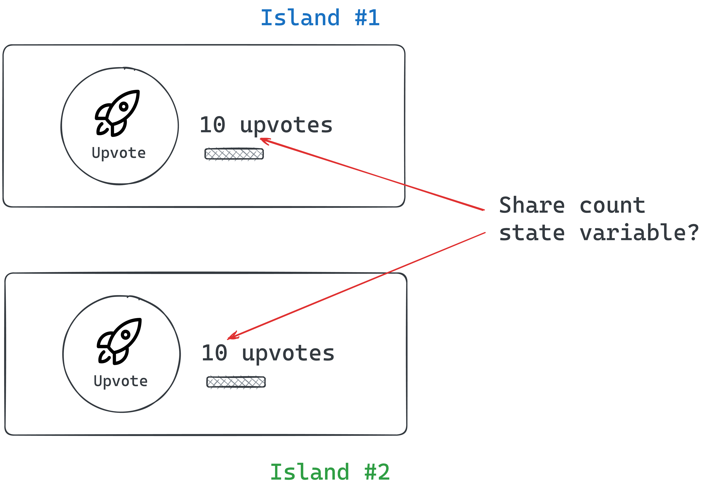
    <figcaption><em>Sharing state between two upvote islands.</em></figcaption>
    <br><br><br>
</figure>

For example, let’s assume we want our `UpvoteContent` components to share the same counter values.

Regardless of the component framework, every framework has its construct for sharing UI state between components, e.g., between React or Vue components.

However, when working within Astro components, we need a solution that works framework agnostic, i.e., not tied to a single framework.

Here are some tremendous framework-agnostic solutions we can choose from:

- **Signals**: These are great for expressing state based on reactive principles. We may use [signals from Preact](https://github.com/preactjs/signals), [signia from tldraw](https://github.com/tldraw/signia) or [Solid signals](https://www.solidjs.com/docs/latest) outside a component context.
- **[Vue’s reactivity API](https://vuejs.org/guide/scaling-up/state-management.html#simple-state-management-with-reactivity-api)**: This can be an excellent ready-to-use solution if you already utilise Vue components in your Astro project.
- **[Svelte’s stores](https://svelte.dev/tutorial/writable-stores)**: This can also be a great out-of-the-box solution if you already use Svelte components in your Astro project.
- **[Nano stores](https://github.com/nanostores/nanostores)**: This is a tiny framework-agnostic library for state management.

In this example, we’ll use Nano stores mainly because they are lightweight (less than 1kb) and don’t add a lot of Javascript footprint to our application.

### How nano store works

At a high level, what we’re trying to achieve is to remove the state values from within our framework components and manage them via `nanastores`.

We’ll create a new `upvoteCounter` state variable within nanostore. We will then propagate changes to this state variable to our framework components.

<figure>
    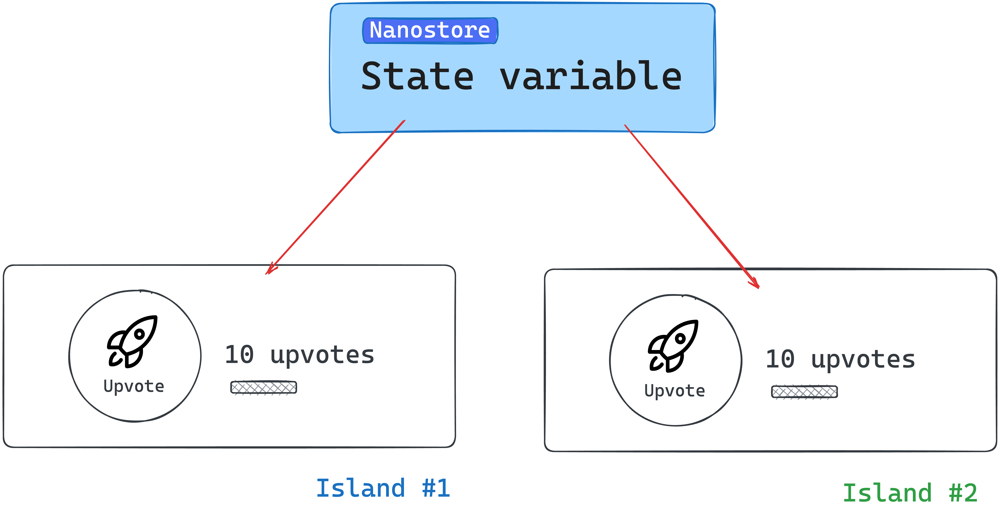
    <figcaption><em>Propagating state variables from nanostore.</em></figcaption>
    <br><br><br>
</figure>

### Install nano store

To use nanostore, we must install the library into our project. Run the following installation command:

```bash
npm install nanostores @nanostores/vue @nanostores/react
```

- `nanostores` represents the base library for creating and managing our state values
- To guarantee that the framework component is re-rendered whenever a state value changes, we will use the React and Vue integrations for nanostores through `@nanostores/react` and `@nanostores/vue`, respectively.

### Create the state value

Our example includes sharing the upvote count value across multiple framework components.

To create a state value, nanostores use atoms to store strings, numbers, and arrays.

Let’s create an atom to hold the counter state variable:

```js
<!-- 📂 src/stores/upvote.ts -->
import { atom } from "nanostores";

export const upvoteCountStore = atom(0);
```

- We create a new file in `src/stores/upvote.ts`.
- We import `atom` from `nanostore`.
- We create a new state number value called `upvoteCountStore`.

We may think of atoms as small pieces of state to be shared across components in our application.

### Using the state value in framework components

In the React component, we will leverage the `useStore` hook provided in `@nanostores/react` to retrieve the state value from the `upvoteCountStore`:

```js
// 📂 src/components/UpvoteContent.tsx

import { useStore } from "@nanostores/react";
import { upvoteCountStore } from "../stores/upvote";

const MAX_COUNT = 50;

export const UpvoteContent = () => {
  // Get the state value from the created store
  const upvoteCount = useStore(upvoteCountStore);

  return (
    <div>
      <button
        onClick={() => {
          if (upvoteCount < MAX_COUNT) {
            //Update the store via the set method
            upvoteCountStore.set(upvoteCount + 1);
          }
        }}
      >
        {/** The rest of the code stays the same **/}
        Upvote
      </button>
      {/** The rest of the code stays the same **/}
    </div>
  );
};
```

The code has been annotated for ease of comprehension. Take a look.

With the Vue component, we may leverage `props` for reactivity as shown below:

```html
<script>
  import { useStore } from "@nanostores/vue";
  import { upvoteCountStore } from "../stores/upvote";

  export default {
    // setup props to be used in the UI template
    setup(props) {
      return {
        // Set the value of the upvoteCount from the store
        upvoteCount: useStore(upvoteCountStore),
        maxUpvoteCount: 50,
      };
    },

    methods: {
      upvote() {
        if (this.upvoteCount < this.maxUpvoteCount) {
          // Update the store via the set method
          upvoteCountStore.set(this.upvoteCount + 1);
        }
      },
    },
  };
</script>

<template> { /** The rest of the code stays the same **/} </template>
```

Lovely!

Now, if we try the application, both framework components should have synced upvote values!

<figure>
    
    <figcaption><em>Synced upvote state values via nanostores.</em></figcaption>
    <br><br><br>
</figure>

## Passing props and children to framework components

Most framework components support receiving data via props and children. These are equally supported when rendering framework components in Astro.

For example, we currently have the upvote button label hardcoded.

<figure>
    
    <figcaption><em>The upvote label.</em></figcaption>
    <br><br><br>
</figure>

We could make this dynamic via props as shown below:

```html
// 📂 src/pages/load.astro --- import { UpvoteContent } from
"../components/UpvoteContent.jsx"; import DefaultIslandLayout from
"../layouts/DefaultIslandLayout.astro"; ---

<DefaultIslandLayout>
  <UpvoteContent client:load label="Click" />
</DefaultIslandLayout>
```

We’d then handle the prop in the `UpvoteContent` React component as usual:

```ts
// 📂 src/components/UpvoteContent.tsx
export const UpvoteContent = (props: { label: string }) => {
  // ... render props.label
};
```

It’s important to note that we can pass any primitive as props, and they will work as expected.

However, be careful with function props. Function props will only work during server rendering and fail when used in a hydrated client component, e.g., as an event handler. This is because functions cannot be serialised (transferred from the server to the client).

Children are often treated as a prop type - depending on the framework component used. For example, React, Preact and Solid use the special `children` prop, while Svelte and Vue use the `<slot />` element. These are both supported when working with framework components in Astro.

For example, with our React `<UpvoteContent />` component, we could go ahead and receive a component description as `children`:

```js
<UpvoteContent client:load>
  <em>An upvote counter created using React</em>
</UpvoteContent>
```

This will change nothing until we explicitly handle the `children` prop within the `<UpvoteContent>` component, as shown below:

```js
// The component accepts props as an argument
export const UpvoteContent = (props: PropsWithChildren<{}>) => {
  const upvoteCount = useStore(upvoteCountStore);

  return (
    <>
      {/** Render the content of the children prop**/}
      <div>{props.children}</div>

      <div>{/** The rest of the component goes here**/}</div>
    </>
  );
};
```

<figure>
    
    <figcaption><em>Rendering the React component child element.</em></figcaption>
    <br><br><br>
</figure>

With our Vue `<UpvoteContent />` component, we could equally receive a component description as children:

```js
<UpvoteContentVue client:load>
  <em>An upvote counter created using Vue</em>
</UpvoteContentVue>
```

However, we must reference this via a `<slot>` element. This is a fundamental difference in how libraries like React / Preact and Vue / Svelte deal with references to the children prop.

Here’s how to reference the children element in `UpvoteContentVue`:

```js
// 📂 src/components/UpvoteContent.vue
<template>
 <div>
  <div>
    <!-- the slot element renders the children element -->
    <slot />
  </div>

  <div>
   <!-- The rest of the template goes here -->
  </div>
 </div>
</template>
```

Additionally, we may use multiple slots to group and reference children within our framework components.

Consider the following example with multiple children elements:

```js
---
 import { UpvoteContent } from "../components/UpvoteContent.jsx"
---


<UpvoteContent>
  <ul slot="social-links">
	<li><a href="https://twitter.com/understanding-astro">Twitter</a></li>
    <li><a href="https://github.com/understanding-astro">GitHub</a></li>
  </ul>

  <em slot="description">An upvote counter created using React</em>
</UpvoteContent>
```

Note that we have two children nodes referenced by the slot names `social-links` and `description`, respectively.

Within `<UpvoteContent />`, we may reference these separately as shown below:

```js
export const UpvoteContent = ({ props }) => {
  return (
    <>
      <div>{props.description}</div>
      <div>{props.socialLinks}</div>
      {/** ... **/}
    </>
  );
};
```

It is important to note that the `kebab-case` slot names in the Astro component are referenced as `camelCase` values on the `props` object.

<figure>
    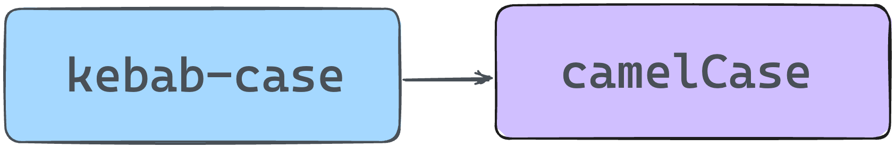
    <figcaption><em>Reference the kebab-case slot names as camelCase in React or Preact.</em></figcaption>
    <br><br><br>
</figure>

In Svelte and Vue, the slots will be referenced using a `<slot>` element with a `name` attribute. Here’s the implementation in `<UpvoteContentVue />` :

```js
<template>
  <slot name="description" />
  <slot name="social-links" />
</template>
```

Please note how the slot `kebab-case` names are preserved.

<figure>
    
    <figcaption><em>Rendering the React and Vue component children elements.</em></figcaption>
    <br><br><br>
</figure>

## Nested framework components

In an Astro file, we may also nest framework components, i.e., pass framework components as children. For example, the following is valid:

```js
<DefaultIslandLayout>
  <UpvoteContent client:load>
    <div slot="description">
     <!-- This is a nested <UpvoteContent /> component -->
      <UpvoteContent client:load>
        <em slot="description">This is the nested component</em>
      </UpvoteContent>
    </div>
  </UpvoteContent>
</DefaultIslandLayout>

```

As expected, this renders the nested `UpvoteContent` component:

<figure>
    
    <figcaption><em>Rendering nested framework components.</em></figcaption>
    <br><br><br>
</figure>

Recursively rendering the same component is rarely the goal we want to achieve. However, rendering nested framework components is powerful because we can compose an entire framework component application as we see fit.

<figure>
    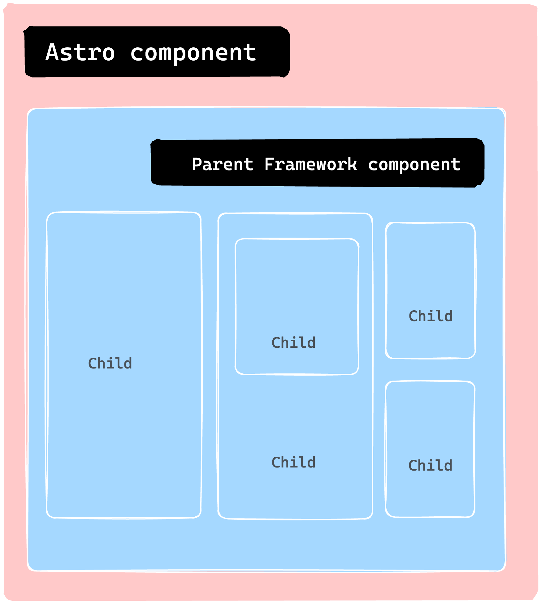
    <figcaption><em>Nesting multiple child components to make a more significant application.</em></figcaption>
    <br><br><br>
</figure>

## Astro Island gotchas

As developers, we are often responsible for inadvertently breaking things. Although debugging can be an enjoyable challenge, consider the following boundaries with Astro Islands.

### 1. Do not use an Astro component in a framework component

Consider the following example of importing a `.astro` component and rendering it within a React component:

```js
import { OurAstroComponent } from "../components/OurAstroComponent";

const OurReactComponent = () => {
  return (
    <div>
      <OurAstroComponent />
    </div>
  );
};
```

```js
<OurReactComponent client:load />
```

This is an invalid use. The reason is that the React component is rendered a React “island”. Consequently, the island should contain only valid React code. This is the same for other framework component islands.

<figure>
    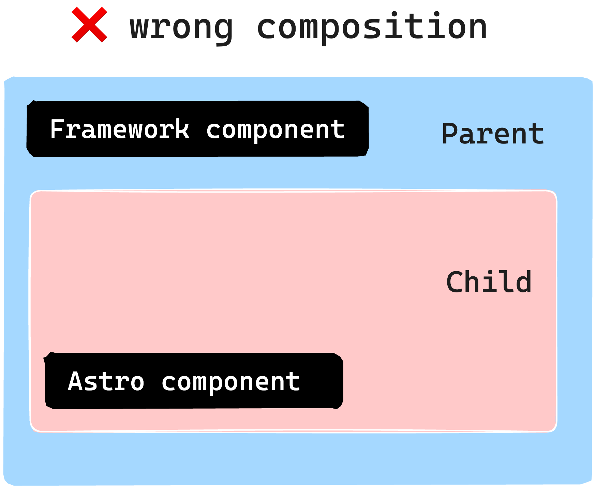." align="center">
    <figcaption><em>Do not render an Astro component as a framework component child without a slot.</em></figcaption>
    <br><br><br>
</figure>

To overcome this, consider using the slot pattern earlier discussed to pass static content from an Astro component:

```js
---
 import { OurReactComponent } from "../components/OurReactComponent"
import { OurAstroComponent } from "../components/OurAstroComponent"
---

<OurReactComponent client:load>
 <!-- pass Astro component as a child via a named slot -->
 <OurAstroComponent slot="description" />
</OurReactComponent>
```

### 2. Do not hydrate an Astro component

Consider the following naive example to hydrate an Astro component using a client directive:

```js
---
 import { OurAstroComponent } from "../components/OurAstroComponent"
---

<OurAstroComponent client:load />
```

This is invalid. Astro components have no client-side runtime. However, use a `<script>` tag if you need to interactivity.

## Why islands?

Typically, most materials would place this section at the start of the chapter. However, there are certain instances where it's more beneficial to showcase practical use cases before diving into the reasons behind them. In addition, this approach could foster an intuitive understanding, which is what I've adopted here.

So, why focus on islands? What advantages do they offer?

### 1. Performance

One of the main advantages is improved performance. We can significantly enhance our site’s speed by converting most of our website to static HTML and selectively loading Javascript through islands only when necessary. This is because Javascript is one of the slowest assets to load per byte.

### 2. Responsible hydration

If Javascript is expensive to parse and execute, the decision to load it should be carefully taken (from a performance perspective). Also, no one solution fits all application types and use cases. As such, controlling when a component island is hydrated puts you in charge of your website performance.

### 3. Parallel loading

Lastly, it’s essential to utilise parallel loading. This means that when we load several islands, they won’t have to wait for each other to become hydrated. Instead, each island is considered a distinct unit that loads and becomes hydrated independently, in isolation.

## Conclusion

In this chapter, we learned about component islands in Astro and how they work. We also explored why framework components are sometimes preferred over vanilla Javascript or Typescript via a `<script>` element.

We also went through the steps to use a framework component in an Astro application, including building a static site, installing the framework, and writing the component. Finally, we experimented using a React and Vue component to demonstrate the use of framework components. See you in the next chapter!
