# 🚀 Understanding Astro

By [Ohans Emmanuel](https://www.ohansemmanuel.com/)

<br />

## Chapter 5: Oh my React!

Everything you need to know to develop rich content websites with real-world best practices. This is a practical section best served with you coding along.

<br /> 
<br />

[](https://ohans.me/understanding-astro-udemy)

<br /> 
<br />

[](https://github.com/understanding-astro/react.dev-astro)

---

## What you’ll learn

- Styling Astro projects with Tailwind.
- Several syntax highlighting solutions for Astro.
- Leveraging content collections for scalable and type-safe development.
- Understand dynamic routing in Astro.

---

## Set up the starter project

We’ve spent ample time learning the ins and outs of building static websites with Astro. So, in this chapter, we will not start from scratch.

Instead, we’ll begin with a basic static project we’ll build upon throughout the chapter.

<figure>
    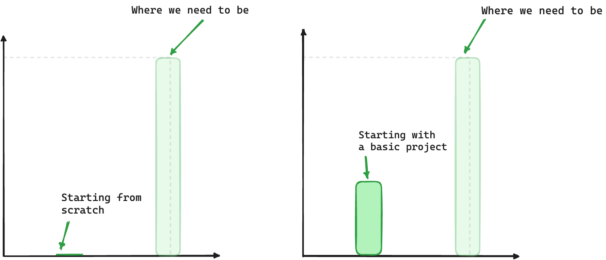
    <figcaption><em>Building from a starter project.</em></figcaption>
    <br><br><br>
</figure>

In this chapter, we will adopt a solution-oriented approach similar to that of detectives. We aim to solve various `TODOs` scattered throughout the starter project.

<figure>
    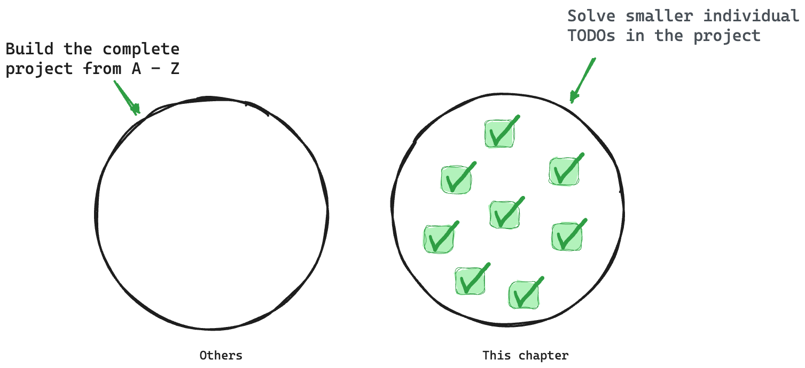
    <figcaption><em>Solving small isolated problems.</em></figcaption>
    <br><br><br>
</figure>

The reason for this is to ignore already learned concepts and focus on learning new concepts or consolidating older concepts via practice — solving isolated problems.

To get started, go ahead and clone the project:

```bash
git clone https://github.com/understanding-astro/react.dev-astro.git
```

Then change directories:

```bash
cd react.dev-astro
```

Finally, checkout to the `clean-slate` branch I’ve prepared so we can systematically build upon the base application.

```bash
git checkout clean-slate
```

## Installing dependencies

Go ahead and install the project’s dependencies via the following:

```bash
npm install
```

Then install the Astro `react` integration:

```bash
npx astro add react
```

When prompted, type “y” to accept each prompt. “y” means “yes”!

The complete installation will add all relevant react dependencies and updates the `astro.config.mjs` project configuration file.

<figure>
    
    <figcaption><em>Installing the React integration and dependencies.</em></figcaption>
    <br><br><br>
</figure>

Finally, go ahead and install the `mdx` integration. I’ll describe the what and why later in the chapter. For now, go ahead and install the integration by running the following:

```bash
npx astro add mdx
```

This will install the `@astrojs/mdx` integration and also update the `astro.config.mjs` project configuration file.

<figure>
    
    <figcaption><em>Installing the MDX integration.</em></figcaption>
    <br><br><br>
</figure>

Now run the application:

```bash
npm start
```

This will run the application in an available local port e.g., the default `localhost:3000`.

Visit the local server and you’ll find the base unstyled application running in the browser as shown below:

<figure>
    
    <figcaption><em>The unstyled homepage.</em></figcaption>
    <br><br><br>
</figure>

I’ve got to say that’s one ugly-looking page.

We’ll fix that next.

## Styling Astro projects with Tailwind

Love or hate it, CSS is how we make beautiful web applications.

In Chapter One, we wrote the styles for the personal website by hand i.e., by writing out every CSS declaration, however, in this chapter, we will use a CSS framework called Tailwind.

So, what’s Tailwind?

An overly simple definition would be, Tailwind is the modern [bootstrap](https://getbootstrap.com/). Never used Bootstrap? Then think of Tailwind as a utility-first CSS framework that provides class names like `flex`, `text-lg`, `items-center` and many more that you can apply to your markup for styles.

Tailwind will enable us to build modern-looking websites — fast.

### Installing Tailwind

Keep the project running in your terminal and open another terminal tab. Run the following install command:

```bash
npx astro add tailwind
```

This will install the Astro tailwind integration in the project and update the project configuration.

<figure>
    
    <figcaption><em>Installing the Astro Tailwind integration.</em></figcaption>
    <br><br><br>
</figure>

Once the installation is complete, the existing application styles will now take effect. Visit the application on your local port to see the styled application.

<figure>
    
    <figcaption><em>The styled application.</em></figcaption>
    <br><br><br>
</figure>

What a difference styling makes!

Take your time and browse the different pages of the styled application.

### How does Tailwind work?

Using Tailwind in Astro is straightforward. Install the Tailwind integration and provide a `class` attribute with Tailwind utility classes in your component markup.

For example, consider the styled text “The library for web and native user interfaces” on the project homepage:

<figure>
    
    <figcaption><em>The homepage subtitle.</em></figcaption>
    <br><br><br>
</figure>

Now, consider the code responsible for the styles:

```js
// pages/index.astro
// ...
<p class="max-w-lg py-1 text-center font-display text-4xl leading-snug text-secondary dark:text-primary-dark md:max-w-full">
  The library for web and native user interfaces
</p>
```

In the example above, the classes applied are as shown below:

```html
"max-w-lg py-1 text-center font-display text-4xl leading-snug text-secondary
dark:text-primary-dark md:max-w-full"
```

While this is not a Tailwind book, it’s only fair to give a general explanation of what’s going on here.

Firstly, most Tailwind utility classes are well-named and you can infer what they do. Others might not.

If you’re coding along in VSCode, I recommend installing the official Tailwind integration:

<figure>
    
    <figcaption><em>Installing the official VSCode Tailwind plugin.</em></figcaption>
    <br><br><br>
</figure>

If you’re not using VSCode, consider finding your [editor setup](https://tailwindcss.com/docs/editor-setup) in the official Tailwind docs.

Installing the integration brings a lot of benefits. The important benefit I’d love to highlight here is you can hover over any of the Tailwind utility classes to see the exact CSS property value the class corresponds to.

For example, hovering over the `max-w-lg` displays the css property value for the utility class as shown below:

```css
.max-w-lg {
  max-width: 32rem /* 512px */;
}
```

<figure>
    
    <figcaption><em>Hovering over Tailwind classes.</em></figcaption>
    <br><br><br>
</figure>

This is very helpful because you can now inspect whatever classes are added to any markup in the project!

### Tailwind configuration

Upon installing Tailwind, it ships with its default theme.

It’s not a bad theme, however, when you build projects, you likely want control over the project theme.

In our example, we want a theme that models the official React documentation theme.

To customise Tailwind, we can provide a `tailwind.config.js` file where we can define our project’s fonts, colour palette, type scale, border radius values, breakpoints and much more.

Look at the `tailwind.config.cjs` file in the project’s root. This is where the project’s tailwind configuration magic happens.

For more details on customising Tailwind, please consult the [official documentation](https://tailwindcss.com/docs/theme).

## Typescript import alias

Let’s be honest, no one likes those ugly relative imports, eh?

```js
import MyComponent from '../../components/MyComponent.astro
```

Ugh!!

C’mon, we can do better.

This is where import aliases come in. The easiest way to get this set up in an Astro project is to define the aliases in the `tsconfig.json` file.

For example, we may do the following:

```js
// 📂 tsconfig.json

{
  "compilerOptions": {
    "baseUrl": ".",
    "paths": {
      "@components/*": ["src/components/*"],
    }
  }
}
```

We’re essentially mapping any directories in the `src/components` import path to `@components`.

Now, wait for it.

The result of this is we can take our previous ugly import path and turn it into a work of art as shown below:

```js
// Before
import MyComponent from '../../components/MyComponent.astro

// After
import MyComponent from '@components/MyComponent.astro'
```

Beautiful and clean, isn’t it?

The reason I mention this is the starter project has been set up to use import aliases. So, don’t get confused.

Go ahead and look in the `tsconfig.json` file where you’ll find the following import aliases:

```js
"paths": {
   "@components/*": ["src/components/*"],
   "@layouts/*": ["src/layouts/*"],
   "@utils/*": ["src/utils/*"]
}
```

You’re welcome 😉

## Islands & colocating page components

We’ve learned that appropriate file types in the `src/pages` directory get transformed into HTML pages.

However, what if we need to have some files collocated in the `src/pages` directory without being transformed into accompanying `HTML` pages?

<figure>
    
    <figcaption><em>Colocating files in the pages directory.</em></figcaption>
    <br><br><br>
</figure>

This can be helpful for collocating tests, utilities and components along the associating pages.

Well, there’s a solution for that.

To exclude a valid page file type in the `src/pages` directory from being compiled into an associating HTML page, prefix the file name with an underscore `_`.

<figure>
    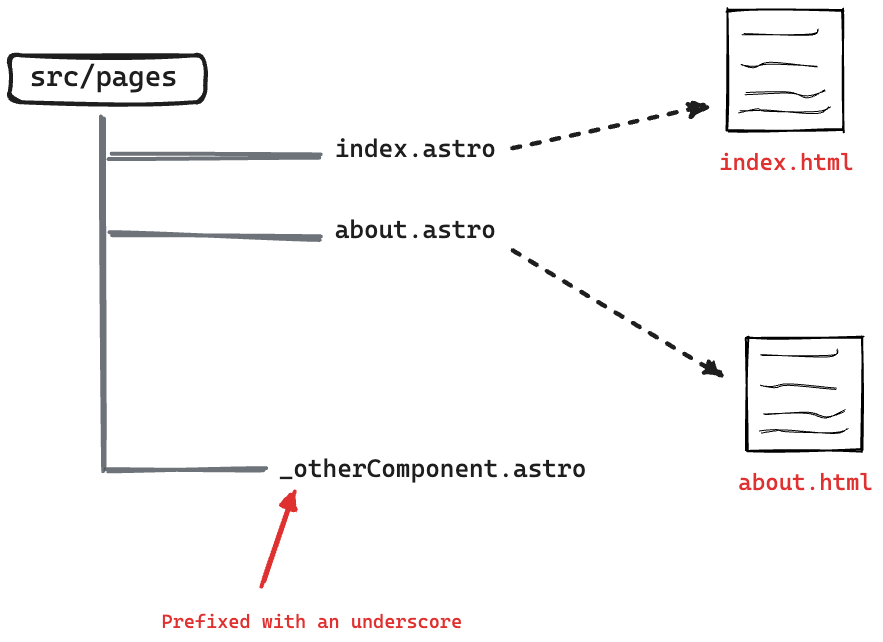
    <figcaption><em>Prefix file name with a underscore to not transform into HTML pages.</em></figcaption>
    <br><br><br>
</figure>

For example, take a look at the `pages/_components/Home` directory in the project.

This directory contains a handful of components that aren’t meant to be reusable across the project. They only exist to be used on the project’s homepage.

To exclude these from being separate browser pages, note how the `_components` directory is named.

As an example, if you visited `/_components/Home/Code` in the browser, this will return a `404`. Even though the `Code` components exist, it is not a page.

Now, let’s bring our knowledge of collocated components and Astro islands together to solve our first TODO in the project.

Take a look at the `index.astro` and consider the `TODO` to render the `Video` React component as shown below:

```js
// 📂 src/pages/index.astro
❗️ <Code class="text-white">TODO:</Code> (Astro Island): Render the ...
```

<figure>
    
    <figcaption><em>TODO: Render the Video React component island.</em></figcaption>
    <br><br><br>
</figure>

Now consider the annotated solution below:

```js
// 📂 src/pages/index.astro
===
// Import the Video component from "_components ..."
import { Video } from "./_components/home/Video";
// ...
---
<ExampleResultPanel slot="right-content">
  {/** Render the Video component. NB: this is a React component **/}
   <Video
     client:visible {/** 👈 Add the client directive **/}
     video={{ title: "My video", description: "Video description" }}
    />
</ExampleResultPanel>
```

- Render the `Video` React component
- Pass a `client:visible` attribute to hydrate the island as soon as the component is visible
- Finally pass the required `video` object props to the `Video` component: `{title: "my video", description: "Video description"}`.

<figure>
    
    <figcaption><em>The rendered video island.</em></figcaption>
    <br><br><br>
</figure>

Similarly, let’s resolve the second TODO. This time around we’ll render multiple `Video` components.

```js
// 📂 src/pages/index.astro
❗️ <Code class="text-white">TODO:</Code> (Astro Island): Render two ...
```

<figure>
    
    <figcaption><em>TODO: Render two React component islands.</em></figcaption>
    <br><br><br>
</figure>

Consider the solution below:

```js
<ExampleResultPanel slot="right-content">
  <div class="flex w-full flex-col gap-4">
    {/** ... **/}
    {/** Render both islands **/}
    <Video
      client:visible
      video={{ title: "My video", description: "Video description" }}
    />
    <Video
      client:visible
      video={{ title: "My video", description: "Video description" }}
    />
  </div>
</ExampleResultPanel>
```

<figure>
    
    <figcaption><em>The rendered Astro islands.</em></figcaption>
    <br><br><br>
</figure>

## Syntax highlighting

I never understood the intricacies of syntax highlighting until I started researching this section of the book. It’s a bliss how much’s abstracted in libraries.

Anyway, I’ll skip the nuances and provide what I believe to be the most important bits.

So, how do we tackle syntax highlighting in an Astro application?

By default, Astro uses [Shiki](https://github.com/shikijs/shiki) - a syntax highlighting library under the hood, and broadly speaking, there are two ways to go about syntax highlighting your code blocks in an Astro component[^1].

Let’s have a look at these.

### The default Code component

Astro ships with a `<Code />` component that provides syntax highlights at build time.

<figure>
    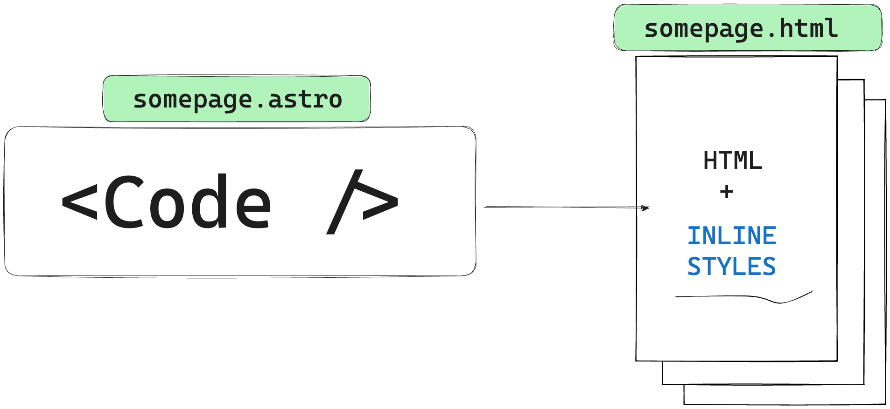
    <figcaption><em>The Code component renders to HTML and inline styles without any Javascript.</em></figcaption>
    <br><br><br>
</figure>

By implication, there’s no runtime overhead to this method of syntax highlighting as no computations are done at runtime and the eventual result is a bunch of elements with inline styles.

This is powered by Shiki.

<figure>
    
    <figcaption><em>Sample syntax highlighted DOM output.</em></figcaption>
    <br><br><br>
</figure>

Let’s go back to our starter project and resolve another TODO.

```js
📂 src/pages/index.astro

// ...
❗️ <Code class="text-white">TODO:</Code> Replace with Syntax highlighted code
```

<figure>
    
    <figcaption><em>TODO: Add syntax highlighted code block.</em></figcaption>
    <br><br><br>
</figure>

The goal here is to provide syntax-highlighted code within the component markup.

To solve this, we’ll leverage the `Code` component from Astro as shown in the annotated code block below:

```js
// 📂 src/pages/index.astro
---
// import Code from "astro/components"
import { Code as AstroCode } from "astro/components";
//... other imports
---

// ...Render the component and pass the code and lang string props
<div slot="left-content">
  <AstroCode
            code={`function Video({ video }) {
  return (
    <div>
      <Thumbnail video={video} />
      <a href={video.url}>
        <h3>{video.title}</h3>
        <p>{video.description}</p>
      </a>
      <LikeButton video={video} />
    </div>
  );
}`}
    lang="jsx" {/** 👈 code language for syntax highlighting **/}
   />
</div>
```

<figure>
    
    <figcaption><em>The syntax highlighted code block.</em></figcaption>
    <br><br><br>
</figure>

Since the code snippets are just good old HTML DOM nodes, we can apply some styles on the parent `div` to style them further as shown below:

```js
// 📂 src/pages/index.astro
<div
   slot="left-content"
   class="[&_pre]:!bg-transparent [&_pre]:!text-sm [&_pre]:!leading-6">
	<AstroCode ... />
</div>
```

This will reduce the size of the font, reduce the type leading and make the code background transparent. Note that the square braces are how we write arbitrary [custom styles](https://tailwindcss.com/docs/adding-custom-styles#using-arbitrary-values) in Tailwind.

See the results below:

<figure>
    
    <figcaption><em>Better styled syntax highlighted code block.</em></figcaption>
    <br><br><br>
</figure>

Much better, eh?

We can go ahead and do the same for the other `TODO` :

```js
// 📂 src/pages/index.astro
❗️ <Code class="text-white">TODO:</Code> Replace with Syntax highlighted code
```

Consider the identical solution below:

```js
<div
   slot="left-content"
   {/** Similar style as before. Leverages Tailwind **/}
   class="[&_pre]:!bg-transparent [&_pre]:!text-sm [&_pre]:!leading-6"
        >
          <AstroCode
            code={`function VideoList({ videos, emptyHeading }) {
  const count = videos.length;
  let heading = emptyHeading;
  if (count > 0) {
    const noun = count > 1 ? 'Videos' : 'Video';
    heading = count + ' ' + noun;
  }
  return (
    <section>
      <h2>{heading}</h2>
      {videos.map(video =>
        <Video key={video.id} video={video} />
      )}
    </section>
  );
}`}
   lang="jsx"
 />
```

<figure>
    
    <figcaption><em>The syntax highlighted code block.</em></figcaption>
    <br><br><br>
</figure>

The default `Code` component also supports all the official Shiki [themes](https://github.com/shikijs/shiki/blob/main/docs/themes.md#all-themes). For example, we can change the component theme to `poimandres` as shown below:

```js
<AstroCode
  // ...
  lang="jsx"
  theme="poimandres"
/>
```

<figure>
    
    <figcaption><em>The poimandres theme.</em></figcaption>
    <br><br><br>
</figure>

Let’s consider the PROs and CONs of using the default `Code` component provided by Astro.

#### Pros

- Easy to use
- Great results for low effort
- Lots of available themes by default

#### Cons

- More work is required to customise your themes e.g., Our www.react.dev clone requires its custom theme
- No default support for dark and light theme

### Bring your theme

Using your specific syntax themes is probably not the top on everyone’s list.

However, Shiki supports the same syntax for VSCode themes. For example, we could load some custom open-source VSCode theme (or build on top of it) for our code blocks.

Let’s take a look at [Nightowl](https://github.com/sdras/night-owl-vscode-theme) : a VS Code dark theme for contrast for nighttime coding.

Go ahead and copy the code [snippet theme](https://raw.githubusercontent.com/sdras/night-owl-vscode-theme/main/themes/Night%20Owl-color-theme.json) to a `src/snippet-theme.json` file.

Next, we’ll write a simple component to load our custom theme as shown below:

```js
// 📂 src/components/Shiki.astro

---
import type { Lang } from "shiki";

// Similar to Astro's Code component, this is built on shiki
import shiki, { getHighlighter } from "shiki";

// Similar to Astro's Code component, receive lang and code as props
type Props = {
  lang: Lang;
  code: string;
};

const { code = "", lang = "jsx" } = Astro.props;

// 👀 Load the custom theme
const theme = await shiki.loadTheme("../../snippet-theme.json");

const highlighter = await getHighlighter({
  theme,
  langs: [lang],
});
---

{/**
  A fragment is an available Astro component. Use Fragment to prevent unnecessary markup.
The set:html directive is used to inject an HTML string into an element e.g., similar to el.innerHTML.
**/}
<Fragment
  set:html={highlighter.codeToHtml(code, {
    lang,
  })}
/>
```

Import and use the new component:

```js
// 📂 src/pages/index.astro
---
import Shiki from "@components/Shiki.astro";
// ...
---

// Change AstroCode to Shiki (new component)

<Shiki
 code={`function Video({ video }) {
  return (
    <div>
      <Thumbnail video={video} />
      <a href={video.url}>
        <h3>{video.title}</h3>
        <p>{video.description}</p>
      </a>
      <LikeButton video={video} />
    </div>
  );
}`}
  lang="jsx"
/>
```

And there we go! We’ve successfully loaded a custom theme.

<figure>
    
    <figcaption><em>Comparing the previous highlighted code with the new Night Owl theme.</em></figcaption>
    <br><br><br>
</figure>

For more customisations, we could spend time tweaking the different theme tokens in the `snippet-theme.json` file.

#### Pros

- Flexibility: we can customise the theme tokens as granularly as needed

#### Cons

- Requires more work
- Support for dark and light theme

### Handling light and dark themes

Supporting light and dark themes in Shiki (the underlying Astro syntax highlighter) is tricky because Shiki generates themes at build time.

At the time a user toggles the site theme, no changes will be made to the syntax highlighting since it was generated at build time.

When working with Astro components, a simple solution is to leverage CSS variables.

```js
---
import { Code as AstroCode } from "astro/components";
---

// Among, other properties, pass a "css-variables" theme prop to the Code component
 <AstroCode theme="css-variables" />
```

Then provide style tokens for both dark and light themes. Remember that this should be global. For example, we may do this in the `Baselayout.astro` layout component as shown below:

```js
// 📂 src/layouts/BaseLayout.astro
<style is:global>
  @media (prefers-color-scheme: dark) {
    :root {
      --astro-code-color-text: #ffffff;
      --astro-code-color-background: black;
      --astro-code-token-constant: #86d9ca;
      --astro-code-token-string: #977cdc;
      --astro-code-token-comment: #757575;
      --astro-code-token-keyword: #77b7d7;
      --astro-code-token-parameter: #ffffff;
      --astro-code-token-function: #86d9ca;
      --astro-code-token-string-expression: #c64640;
      --astro-code-token-punctuation: #ffffff;
      --astro-code-token-link: #977cdc;
    }
  }

  :root {
    --astro-code-color-text: #24292e;
    --astro-code-color-background: #ffffff;
    --astro-code-token-constant: #032f62;
    --astro-code-token-string: #032f62;
    --astro-code-token-comment: #6a737d;
    --astro-code-token-keyword: #d73a49;
    --astro-code-token-parameter: #24292e;
    --astro-code-token-function: #6f42c1;
    --astro-code-token-string-expression: #c64640;
    --astro-code-token-punctuation: #ffffff;
    --astro-code-token-link: #977cdc;
  }
</style>
```

If dark and light theme syntax highlighting is critical for your application, take a look at the [official documentation](https://github.com/shikijs/shiki/blob/main/docs/themes.md#theming-with-css-variables) for more information.

## Getting Started with Content Collections

Consider building a large application driven by a lot of content whether that’s Markdown (`/md`), MDX (`.mdx`), JSON (`.json`) or YAML (`.yaml`) files.

One solution to best organise the project’s content could be to save the content data in a database where we can validate the document schema and make sure the required content fits the data model we desire.

We may visually model these as collections of data saved in a database with a predefined data schema.

<figure>
    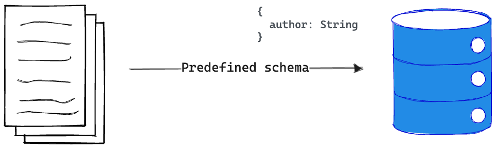
    <figcaption><em>Modelling data with a predefined schema in a database.</em></figcaption>
    <br><br><br>
</figure>

With Astro projects, we don’t particularly need a database to store and enforce our content data models.

Enter content collections.

Regardless of the size of the Astro project, content collections are the best way to organise our content document, validate the structure of the document and also enjoy out-of-the-box Typescript support when querying or manipulating the content collection.

So, what’s a content collection?

A content collection is any top-level directory in the `src/content` folder of an Astro project.

<figure>
    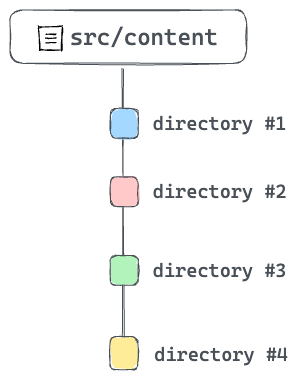
    <figcaption><em>Content collections - top directories in src/content.</em></figcaption>
    <br><br><br>
</figure>

Note that the `src/content` directory is strictly reserved for content collections. Don’t use this directory for anything else.

Now that we know what a content collection is, the individual documents or entries within a collection are referred to as collection entries.

<figure>
    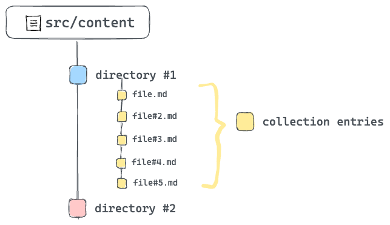
    <figcaption><em>Collection entries within a single collection.</em></figcaption>
    <br><br><br>
</figure>

Collection entries are documents in formats such as Markdown or MDX. They can also be in data formats such as JSON or YAML. For consistency, you’ll find most collection entries with a consistent naming pattern e.g., kebab-case.

### What Problems Do Content Collections Solve?

Littering a project with different content documents and no clear structure is a surefire way to create a mess.

The better solution: use content collections.

Now, content collections aim to address three main problems:

1. Organising documents.
2. Validating the document structure e.g., validating the frontmatter properties of a markdown file.
3. Provides strong type safety while querying and working with content collections.

### Organising content collections

When working with content collections, note that only top-level directories in `src/content` count as collections. For example, with multiple collections such as `blogs`, `authors` and `comments`, we could accurately represent these distinct content types with three top-level directories within `src/content`.

<figure>
    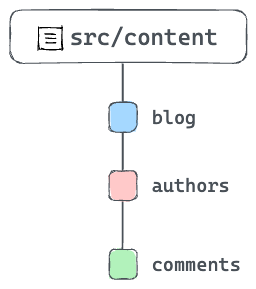
    <figcaption><em>Organising different content collections.</em></figcaption>
    <br><br><br>
</figure>

If there’s a need to further organise content via subdirectories within a collection, that’s entirely acceptable! For example. The `blogs` content collection may have subdirectories to organise content via languages e.g., `en`, `fr`, etc.

<figure>
    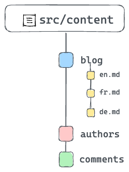
    <figcaption><em>Subdirectories within content collections.</em></figcaption>
    <br><br><br>
</figure>

### Authoring content with MDX

Take a look at the existing content collection in the project.

What do you see?

You should find a `blog` collection in `src/content/blog` with a handful of `.mdx` files.

<figure>
    
    <figcaption><em>Entries in the blog collection.</em></figcaption>
    <br><br><br>
</figure>

Each `mdx` file refers to the collection entry for the blog collection. However, what is an `mdx` file?

MDX touts itself as the markdown for the component era. Think, what if we could use components in markdown? Well, with `MDX`, we can!

In these files, we can import components and embed them within our standard markdown content.

In the installation section of this chapter, we installed the Astro MDX plugin by running `npx astro add mdx`.

It’s about time we got started utilising MDX.

### Configuring content collections

A big part of content collections is ensuring a consistent collection entry format for every content collection.

For example, assuming a number markdown or MDX collection entries, we can go ahead and ensure that every collection entry has the same frontmatter properties. As you can imagine, this protects the integrity of each collection entry and breeds confidence that no surprising bug will spring at us when working with the entries.

So, how do we ensure such consistency?

The way we do this is by creating collection schemas.

A schema enforces consistent collection entry data within a collection. This is also what powers the Typescript support we’ll get when working with the collection entries.

To create our collection schema, go ahead and create a `src/content/config.ts` file with the following content:

```js
// Import utilities from astro:content
import { z, defineCollection } from "astro:content";

// Define the type and schema for one or more collections
const blogCollection = defineCollection({
  type: "content",
  // an object of strings - title, year, month, day, and intro
  schema: z.object({
    title: z.string(),
    year: z.string(),
    month: z.string(),
    day: z.string(),
    intro: z.string(),
  }),
});

// Export a single collections object to register the collections
// The key should match the collection directory name in "src/content"
export const collections = {
  blog: blogCollection, // add the blog collection
};
```

Take a look at the annotated code above.

You don’t need to memorise how to do this as you can always refer to the official documentation. However, remember that the schema for a project’s content collections is defined in a `src/content/config.ts` (or `.js` and `.mjs`) file.

If we break down what goes on in a collection configuration file, we have three main actions:

1. Import utilities from `astro:content`.
2. Define the content collection(s) schema via the `z` utility.
3. Export a single object of collection name key and schema value.

The schema is the brain behind guaranteeing our content contains the right data and also provides Typescript support — autocompletion and type-checking when querying the collection.

I know the question you’re likely asking.

What’s the `z` utility exported from `astro:content`?

The `z` utility re-exports the widely popular [zod ](https://github.com/colinhacks/zod)library — a TypeScript-first schema validation library with static type inference. The `z` variable in the `config` is a convenient export from `zod`.

#### Quick Zod

While this is not a Zod book, the truth remains that if we will be defining schemas with Zod, it pays to understand the basics.

So, here’s a quick intro.

First, consider the schema for our `blog` collection:

```js
z.object({
  title: z.string(),
  year: z.string(),
  month: z.string(),
  day: z.string(),
  intro: z.string(),
});
```

Let’s deconstruct this.

Creating a schema starts with importing Zod. With, Astro that’s done via the import from `astro:content`

```js
import { z } from "astro:content";
```

To create a schema for a string property, use the `string` method as shown below:

```js
const stringSchema = z.string();
```

To create an object schema, you guessed right. We use the `object` method as shown below:

```js
const myObjectSchema = z.object({});
```

Now, within this object, we may define properties as shown below:

```js
const myObjectSchema = z.object({
  someString: z.string(),
});
```

In our blog collection schema, we’re essentially saying that the markdown (and MDX) files within the `blog` collection must have string front matter properties of `title`, `year`, `month`, `day` and `intro`.

The frontmatter is represented by the object schema and its properties, the object keys.

Now, go ahead and view all the collection entries in the `blog` collection and note how they all have defined properties.

#### The .astro folder

As you create and work with content collections, Astro creates a `.astro` directory in the root of our project to keep track of important metadata for our content collections — mostly generated type information.

It’s safe to ignore this directory.

The `.astro` directory is updated automatically as we run `astro dev` or `astro build` commands. However, if we find the type information not in sync, we can manually run `astro sync` at any time to update the `.astro` directory manually.

## Query and render content collections

So, we know how to create content collections and define their schemas. What next?

Content collections exist to be consumed in some way — typically by querying and rendering the collections.

So, how do we get started with this?

A collection consists of one or more collection entries. So, to query an entire collection, Astro provides the `getCollection()` method.

Consider how we may fetch all blog posts in our project:

```js
---
import { getCollection } from 'astro:content'

// Get all entries from the blog collection
const allBlogPosts = await getCollection('blog')
---
```

To filter the collection entries, we may pass a second function argument to `getCollection` as shown below:

```js
---
import { getCollection } from 'astro:content'

// Get all entries from the blog collection
const allBlogPosts = await getCollection('blog', ({data}) => {
  // return only blogs from a certain year
  return data.year === '2023'
})
---
```

Note that in our case, the `data` above refers to the frontmatter properties of our `MDX` blog entries.

How about getting a single collection entry?

Your first inclination may be to filter as shown below:

```js
---
import { getCollection } from 'astro:content'

// Get all entries from the blog collection
const allBlogPosts = await getCollection('blog', ({data}) => {
  // return only a specific title
  return data.title === 'my-single-blog-title"
})
---
```

The above is technically valid. However, Astro provides a `getEntry()` method specifically for this case.

Consider the usage below:

```js
import { getEntry } from "astro:content";

// Get a single blog entry with the entry slug
const blog = await getEntry("blog", "introduction-to-react");
```

The example above will fetch the entry in the `src/content/blog/introduction-to-react.mdx` route.

Note that both `getCollection` and `getEntry` return a [CollectionEntry](https://docs.astro.build/en/reference/api-reference/#collection-entry-type) type.

Enough with the theory, let’s get back to building our project.

Find the next TODO on the `blog/index.astro` page:

```js
📂 src/pages/blog/index.astro

<!-- ❗️TODO: List and render (all) blog post cards -->
```

The goal is to fetch all the blogs in the blog content collection and render visual cards for each entry. Also, note that clicking each card should point to the actual blog.

<figure>
    
    <figcaption><em>Rendering blog post cards.</em></figcaption>
    <br><br><br>
</figure>

Consider the solution below:

```js
📂 src/pages/blog/index.astro

---
// Import getCollection from astro:content
import { getCollection } from "astro:content";
// Import the BlogCard visual component
import BlogCard from "@components/BlogCard.astro";
// Import the getMonthName utility
import { getMonthName } from "@utils/getMonthName";

// Fetch all the blog posts
const allBlogPosts = await getCollection("blog");
---

{/** render all blog posts **/}
  <div class="mt-12 flex flex-col gap-5 px-5 sm:-mx-5 lg:px-4">
    {
      allBlogPosts.map(({ data, slug }) => {
        const url = `/blog/${data.year}/${data.month}/${data.day}/${slug}`;

        return (
          <BlogCard
            url={url}
            date={`${getMonthName(+data.month)} ${data.day}, ${data.year}`}
            title={data.title}
          >
            {data.intro}
          </BlogCard>
        );
      })
    }
  </div>
```

Note the URL of each blog constructed in the solution above:

```js
const url = `/blog/${data.year}/${data.month}/${data.day}/${slug}`;
```

For example, the blog collection entry `data-fetching-with-react-server-components.mdx` will have the path: `/blog/2020/12/21/data-fetching-with-react-server-components`.

Go ahead and click any of the blog cards. At the moment, they should lead to an empty page.

Let’s resolve that.

## Dynamic routing

Static routes are arguably easy to reason about. For example, `.astro`, `.md` and `.mdx` files in `src/pages` will automatically become pages on our website.

However, sometimes we require dynamic routes to prevent repetition. This typically happens when we have different routes with minimal UI changes between them.

For example, consider our current project. The blogs will have different routes, but each blog’s look and feel are identical.

```ts
// example routes for different blogs
/blog/2020/12/21/data-fetching-with-react-server-components
/blog/2023/04/24/some-other-blog-title
/blog/2023/07/12/getting-started-with-react
```

```ts
// 👀 Manually creating multiple pages for each blog
/pages/2020/12/21/data-fetching-with-react-server-components.astro
/pages/2023/04/24/some-other-blog-title.astro
/pages/2023/07/12/getting-started-with-react.astro
```

Manually providing multiple pages for each blog is arguably tedious.

Instead of manually creating different pages to represent each blog, we may dynamically handle the routing in one of two ways.

### 1. Named parameters

The URL structure of the blogs could be represented by `/${year}/${month}/${day}/${title}` where `title` represents the blog’s title and `year`, `month` and `day`, describe when the blog was published.

We could represent the variables in the route path with named parameters surrounded by square brackets.

For example, we can create a file in the `pages/blog` directory with the following file name:

```md
/[year]/[month]/[day]/[title].astro
```

Since our pages are statically built e.g., when we run the build script, all the routes must be determined at build time.

To achieve this, we must export a `getStaticPaths` function that returns an array of objects that correspond to each route. Here’s how:

```js
// 📂 pages/blog/[year]/[month]/[day]/[title].astro
---
import BlogLayout from "@layouts/BlogLayout.astro";

export function getStaticPaths() {
    return [
        {
            params: {
                title: "data-fetching-with-react-server-components",
                year: "2020",
                month: "12",
                day: "21",
            },
        },
    ];
}
---
```

Note that `getStaticPaths` specifically returns an object with a `params` field that defines all the variables in the route path i.e., `title`, `year`, `month` and `day`

To add another blog route, simply add another object with its `params` property:

```js
// 📂 pages/blog/[year]/[month]/[day]/[title].astro
---
export function getStaticPaths() {
    return [
        {
            params: {
                title: "data-fetching-with-react-server-components",
                year: "2020",
                month: "12",
                day: "21",
            },
        },
        {
            params: {
                title: "introducing-react-dev",
                year: "2023",
                month: "03",
                day: "16",
            },
        },
    ];
}
---
```

With the route `params` defined, we then grab the variables and render each blog as shown below:

```js
// 📂 pages/blog/[year]/[month]/[day]/[title].astro
---
import BlogLayout from "@layouts/BlogLayout.astro";

export function getStaticPaths() {
    return [
        {
            params: {
                title: "data-fetching-with-react-server-components",
                year: "2020",
                month: "12",
                day: "21",
            },
        },
        {
            params: {
                title: "introducing-react-dev",
                year: "2023",
                month: "03",
                day: "16",
            },
        },
    ];
}

// Get the path variables from Astro.params
const { title, year, month, day } = Astro.params;
---

// Provide markup for each matched page
<BlogLayout title="React Blog - React" header="React Blog">
    <h1>{title}</h1>
    <p>{year}</p>
    <p>{month}</p>
    <p>{day}</p>
</BlogLayout>

```

Clicking on the _data fetching with react server components_ and _introducing react dev blog_ cards should now render their accompanying page.

<figure>
    
    <figcaption><em>Rendered blog markup.</em></figcaption>
    <br><br><br>
</figure>

### 2. Rest parameters

Rest parameters provide ultimate flexibility in our URL routing. For example, we may use `[...path]` to match file paths **of any depth**. Where `path` could be represented by any string, e.g., `[...file]` or `[...somestring]`.

Following our existing example, how may we reduce the path `pages/blog/[year]/[month]/[day]/[title].astro` to simply `pages/blog/[...path].astro`

Delete the previous directories and file that made up `[year]/[month]/[day]/[title].astro` and create a single `blog/[...path].astro`.

This new file will match the blog route.

Similarly, we need to provide a `getStaticPaths` function, however, the variable to be provided here is `path` as shown below:

```js
---
import BlogLayout from "@layouts/BlogLayout.astro";

export function getStaticPaths() {
    return [
        {
            params: {
                path: "2020/12/21/data-fetching-with-react-server-components",
            },
        },
        {
            params: {
                path: "2023/03/16/introducing-react-dev",
            },
        },
    ];
}

const { path } = Astro.params;
---

<BlogLayout title="React Blog - React" header="React Blog">
    <h1>{path}</h1>
</BlogLayout>
```

Clicking on the _data fetching with react server components_ and _introducing react dev blog_ cards should now render their accompanying page.

<figure>
    
    <figcaption><em>Rendered blog markup.</em></figcaption>
    <br><br><br>
</figure>

### Priority order

As we’ve discussed, URL paths can be matched in different ways, which begs the question, what happens when different file paths match the same URL path in our project?

Well, Astro needs to make a decision, and that’s following the priority list below:

1. Static routes, i.e., without path parameters, have the highest priority, e.g., `/pages/products/this-is-a-product`.
2. Dynamic routes with named parameters have the next priority, e.g., `/pages/products/[id]`.
3. Dynamic routes with rest parameters have the lowest priority, e.g., `/pages/products/[...path]`.
4. Following the above, any ties will be resolved alphabetically.

<figure>
    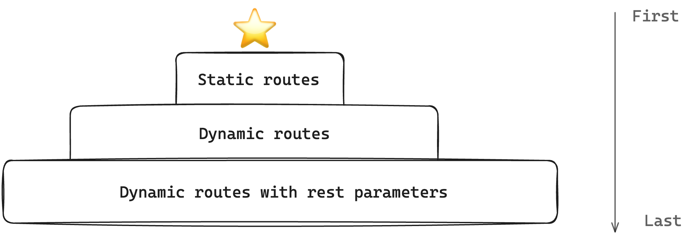
    <figcaption><em>Route priority order from first to last.</em></figcaption>
    <br><br><br>
</figure>

A decent example is to note that even though the dynamic path `[...path.astro]` matches the root path `/blog`, the static route `blog/index.astro` always takes priority while the dynamic route `[...path.astro]` kicks in for each blog page.

## Generate routes with content collections

Right now, we’re manually adding objects to the exported `getStaticPaths` function to define our blog paths.

However, our desired solution is to generate these from the blog content collection.

<figure>
    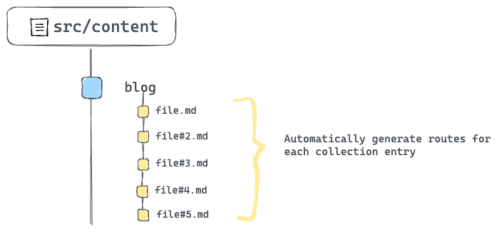
    <figcaption><em>Automatically generate routes for each collection entry.</em></figcaption>
    <br><br><br>
</figure>

To achieve this, we need to rework the `getStaticPaths` implementation to fetch all blog posts from the content collection and generate the required paths.

Consider the solution below:

```js
---
import { getCollection } from "astro:content";
import BlogLayout from "@layouts/BlogLayout.astro";

// Make the function async
export async function getStaticPaths() {
    // Fetch all blog posts
    const allBlogPosts = await getCollection("blog");
    // Dynamically construct the blog paths
    const paths = allBlogPosts.map((blogEntry) => ({
        // construct params
        params: {
            path: `${blogEntry.data.year}/${blogEntry.data.month}/${blogEntry.data.day}/${blogEntry.slug}`,
        },
    }));

    // Eventually return the constructed paths
    return paths;
}

const { path } = Astro.params;
---

<BlogLayout title="React Blog - React" header="React Blog">
    <h1>{path}</h1>
</BlogLayout>
```

Now, every single blog entry now has an associating path defined. Give this a try by clicking any blog link from the home page.

<figure>
    
    <figcaption><em>All blog paths now automatically handled.</em></figcaption>
    <br><br><br>
</figure>

### Rendering each blog content

Just rendering the path of the blog was great for simplifying the previous concepts, however, that’s not quite our result.

Let’s properly render each blog content. First here’s the solution:

```js
---
import { getCollection } from "astro:content";
import BlogLayout from "@layouts/BlogLayout.astro";

// Make the function async
export async function getStaticPaths() {
    const allBlogPosts = await getCollection("blog");
    // dynamically construct the blog paths
    const paths = allBlogPosts.map((blogEntry) => ({
        // construct params
        params: {
            path: `${blogEntry.data.year}/${blogEntry.data.month}/${blogEntry.data.day}/${blogEntry.slug}`,
        },
        // 👀 Pass blogEntry as props to be later accessed in the markup via Astro.props
        props: {
            blogEntry,
        },
    }));

    //Eventually return the constructed paths
    return paths;
}

// Get the blog entry from the props
const { blogEntry } = Astro.props;

// get blog content via entry.render()
const { Content } = await blogEntry.render();
---

<BlogLayout title="React Blog - React" header="React Blog">
    <!-- Render the Content -->
    <Content />
</BlogLayout>
```

Let’s deconstruct this solution.

The most important piece to the solution puzzle is passing every single blog entry as a `prop` in the `getStaticPath` function.

Doing this allows us to reference each entry in the component markup section via `Astro.props`.

Secondly, every queried collection entry has a `render()` method that renders the entry to `HTML`. The solution utilises this to render each blog.

```js
const { Content } = await blogEntry.render();
//...
<Content />;
```

<figure>
    
    <figcaption><em>The rendered blog content.</em></figcaption>
    <br><br><br>
</figure>

## MDX components

Let’s get back to MDX.

The most impressive feature of MDX is the ability to use components with standard markdown content.

Let’s consider practical examples.

### Customised HTML elements

When MDX content is rendered to HTML, the eventual output uses standard HTML elements.

For example, if we had the following MDX content:

```js
# Title

This is a paragraph
```

This will yield an HTML result similar to the following:

```js
<h1>Title</h1>
<p>This is a paragraph</p>
```

The good news is, instead of relying on standard HTML elements, we can specific components to be used instead of HTML elements. For example, we may provide our own styled header and paragraph components in place of the standard `h1` and `p` HTML elements.

To do this, create an object of HTML element to custom component mapping.

```js
// sample MDX component map

// Provide custom header and paragraph
import H1 from "./H1.astro"; // custom Astro component
import P from "./P.astro"; // custom paragraph component

// map of HTML element to custom component
export const mdxComponents = {
  h1: H1,
  p: P,
};
```

Now, when the MDX content is rendered to HTML, pass the component map as shown below:

```js
---
import {getEntry} from 'astro:content'
// import the component map
import { mdxComponents } from '../mdxComponents'

// Get a collection entry
const blogCollection = await getEntry('blog', 'some-title')
// Get the entry Content
const { Content } = await blogEntry.render();
---

{/** Render to HTML and pass the components map**/}
<Content components={mdxComponents} />
```

Let’s put this into action.

Take a look at the `src/components/mdxComponents.ts` file in the project. It contains a list of HTML elements and associated custom Astro components.

We’ll import this object and pass it to the blog entry `<Content />` as shown below:

```js
// 📂 pages/blog/[...path].astro
---
import { mdxComponents } from "@components/mdxComponents";
// ... other imports
---

<BlogLayout title="React Blog - React" header="React Blog">
    {/** 👀 pass the components down to Content **/}
    <Content components={mdxComponents} />
</BlogLayout>
```

With this, we should now have properly styled components in place of the bland HTML elements.

<figure>
    
    <figcaption><em>Leveraging custom components for the MDX HTML output.</em></figcaption>
    <br><br><br>
</figure>

Consider the full list of available HTML elements that can be overwritten with custom components in the [official MDX documentation]([https://mdxjs.com/table-of-components/]).

### Internal components

Components can also be imported and directly rendered within MDX. That’s part of the fun!

Go ahead and open the first blog route in `/blog/2020/12/21/data-fetching-with-react-server-components` and find the first `TODO` on the page.

<figure>
    
    <figcaption><em>TODO: add the Intro component.</em></figcaption>
    <br><br><br>
</figure>

To resolve this TODO, we need to import and render the `Intro` component in `src/components/Intro.astro`.

Consider the solution below:

```js
// 📂 src/content/blog/data-fetching-with-react-server-components.mdx
---

import Intro from "@components/Intro.astro";

{/** First content after the frontmatter and other imports**/}
<Intro>
  2020 has been a long year. As it comes to an end we wanted to share a special
  Holiday Update on our research into zero-bundle-size **React Server
  Components**.
</Intro>
---
```

<figure>
    
    <figcaption><em>The rendered Intro component.</em></figcaption>
    <br><br><br>
</figure>

We imported and rendered an Astro component right in the MDX file. How amazing!

Note that the `---` syntax represents dividers (as seen in 1 and 2 above) and not code fences as used to define markdown frontmatter.

There’s no limit to how many components we can import and render in an MDX file. So, we can go further and render another component as shown below:

```js
{
  /** Import the Note component **/
}
import Note from "@components/Note.astro";

{
  /** Render at the bottom of the file **/
}
<Note>React Server Components are still in research and development.</Note>;
```

<figure>
    
    <figcaption><em>The rendered Note component.</em></figcaption>
    <br><br><br>
</figure>

Note that, unlike JavaScript imports that must be at the top of the file, we can import components in an MDX file anywhere aside from the frontmatter section.

I typically prefer to keep the imports at the top of the document, right after the frontmatter, but you may also colocate the imports close to where they are rendered. Both options work!

### External imports

We’ve seen different imported components in our MDX documents. Luckily, it gets even more fun.

We can also import and render external components e.g., from NPM in MDX.

Go ahead and install `astro-embed`

```
npm install astro-embed
```

`astro-embed` lets us embed components such as Tweets and Youtube videos in an Astro project.

In the same blog in `/blog/2020/12/21/data-fetching-with-react-server-components` consider the next TODO:

```md
## Reference

To introduce React Server Components, we have prepared a talk
and a demo. If you want, you can check them out during the.
holidays, or later when work picks back up in the new year.

❗️TODO: Add Youtube video embed here
```

To resolve this, go ahead and import the `Youtube` component from `astro-embed` and render the component with an `id` prop as shown below:

```md
## Reference

To introduce React Server Components, we have prepared a talk and a demo. If you want, you can check them out during the holidays, or later when work picks back up in the new year.

import { YouTube } from "astro-embed";

<YouTube id="https://youtu.be/TQQPAU21ZUw" />
```

<figure>
    
    <figcaption><em>The rendered Youtube component.</em></figcaption>
    <br><br><br>
</figure>

Note that we’re colocating the import statement close to the component render. However, we may move the import higher up the file as well.

```md
{/** ✅ This is correct **/}

import { YouTube } from "astro-embed";

<YouTube id="https://youtu.be/TQQPAU21ZUw" />
```

```md
{/** ✅ This is equally correct **/}

{/** Keep all imports on top, right after the frontmatter **/}

import Intro from "@components/Intro.astro";
import { YouTube } from "astro-embed";

{/** Render other content ... and component much later **/}

<YouTube id="https://youtu.be/TQQPAU21ZUw" />
```

### AutoImport

The `Youtube`, `Intro` and `Note` components are used across all the blogs. Right now, importing the components every single time seems repetitive.

With components we want to be reused across our entire MDX files, how about we automatically import these i.e. without manually duplicating the import in every MDX document?

To achieve this, we will leverage the `astro-auto-import` package.

With `astro-auto-import`, we can easily import components or modules automatically and utilize them in MDX files without the need for manual importing.

First, install `astro-auto-import`:

```md
npm install astro-auto-import
```

`astro-auto-import` works as an Astro integration. To use it, we must update the project `astro.config.mjs` file as shown below:

```js
// other imports ...
// import AutoImport
import AutoImport from "astro-auto-import";

export default defineConfig({
  integrations: [
    // Pass AutoImport in the integrations array
    AutoImport({
      imports: [
        /**
         * Generates:
         * import Intro from './src/components/Intro.astro';
         */
        "./src/components/Intro.astro",
        "./src/components/Note.astro",
        /**
         * Generates:
         * import { YouTube } from 'astro-embed';
         */
        { "astro-embed": ["YouTube"] },
      ],
    }),
    react(),
    tailwind(),
    mdx(),
  ],
});
```

To use `AutoImport` we pass it into the `integrations` array and invoke `AutoImport` with an imports list:

```js
AutoImport({
  imports: [
    "./src/components/Intro.astro",
    "./src/components/Note.astro",
    { "astro-embed": ["YouTube"] },
  ],
});
```

The `imports` represents a list of imports to be automatically added to our MDX files.

A string with the path of the import such as `"./src/components/Intro.astro"` will generate a default import such as `import Intro from './src/components/Intro.astro'`.

An object such as `{ "astro-embed": ["YouTube"] }` generates a named import such as `import { Tweet, YouTube } from 'astro-embed'`.

With these in place, we must now remove the manual imports in the MDX files and rely on the `AutoImport` magic ✨

Neat!

## Integration spotlight: Astro SEO

You’ve seen a lot of Astro integrations already! Think `@astrojs/react` for having React islands in an Astro project, or the official `@astrojs/tailwind` integration for using tailwind in Astro.

Generally speaking, integrations add new functionality and behaviour to an Astro project, usually with just a few lines of code.

Sounds like a win!

In this section, let’s discuss `astro-seo`, an integration that makes it straightforward to add SEO-relevant information to any Astro app.

You know the rodeo.

First, install the integration:

```js
npm install astro-seo
```

To use `astro-seo`, we import the `SEO` component and pass it relevant props as seen below:

```js
// 📂 src/layouts/BaseLayout.astro
---
import { SEO } from "astro-seo";
// ...
---
<html lang="en">
  <head>
    <meta charset="utf-8" />
    <link rel="icon" type="image/svg+xml" href="/favicon.svg" />
    <meta name="viewport" content="width=device-width" />
    <meta name="generator" content={Astro.generator} />

    <SEO
      title={title}
      description={description}
      openGraph={{
        basic: {
          title,
          type: "website",
          image: "https://react.dev/images/og-home.png",
        },
      }}
      twitter={{
        creator: "@reactjs",
      }}
      extend={{
        meta: [
          {
            name: "twitter:image",
            content: "https://react.dev/images/og-home.png",
          },
          { name: "twitter:title", content: "@reactjs" },
          {
            name: "twitter:description",
            content: description,
          },
        ],
      }}
    />
  {/** ... **/}
</head>
{/** ... **/}
</html>
```

This will generate relevant meta tags including open-graph meta tags for a more SEO-compliant application.

## Custom 404 pages in Astro

Custom 404 pages are easy to reason about in Astro. Create a `404.astro` or any other relevant page file ending in `src/pages`. This will build a `404.html` page that most deployment services will use if an invalid page is requested and not found.

Let’s do this for our project.

Create a `404.astro` page in `src/pages` with the following content:

```js
// 📂 src/pages/404.astro
---
import BaseLayout from "@layouts/BaseLayout.astro";
---

<BaseLayout title="Redirecting ..." page="index" />

<script is:inline>
// lazy redirect. This is better done server-side: discussed in the next book's chapter
const { pathname } = window.location;

window.location.replace(`https://www.react.dev${pathname}`);
</script>
```

Our `404` page comes with a twist.

It renders a blank page via `<BaseLayout />` and automatically redirects the user to the accompanying path on `www.react.dev`. Viola!

Give this a try by visiting the API reference link on the homepage.

<figure>
    
    <figcaption><em>The API reference link.</em></figcaption>
    <br><br><br>
</figure>

## Conclusion

Building rich content applications is right up Astro’s alley! With content collections, we can build large content-driven applications with organisation and confidence.

[^1]: For Markdown files, it’s possible to use a number of plugins such as [https://rehype-pretty-code.netlify.app/](https://rehype-pretty-code.netlify.app/)
