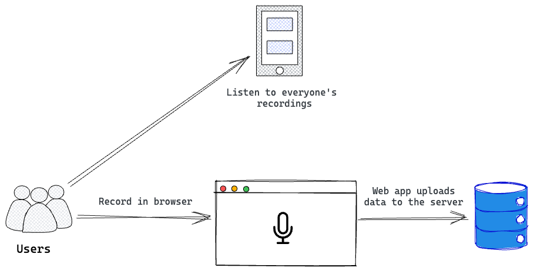
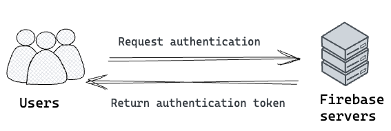
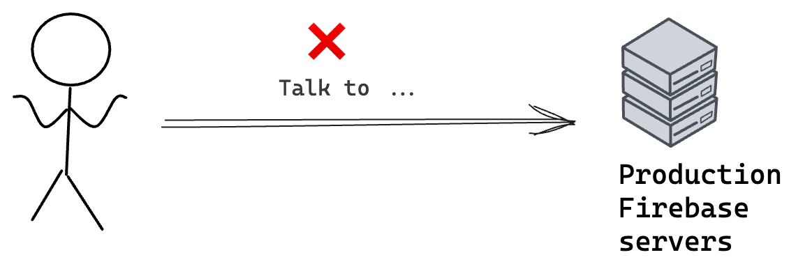
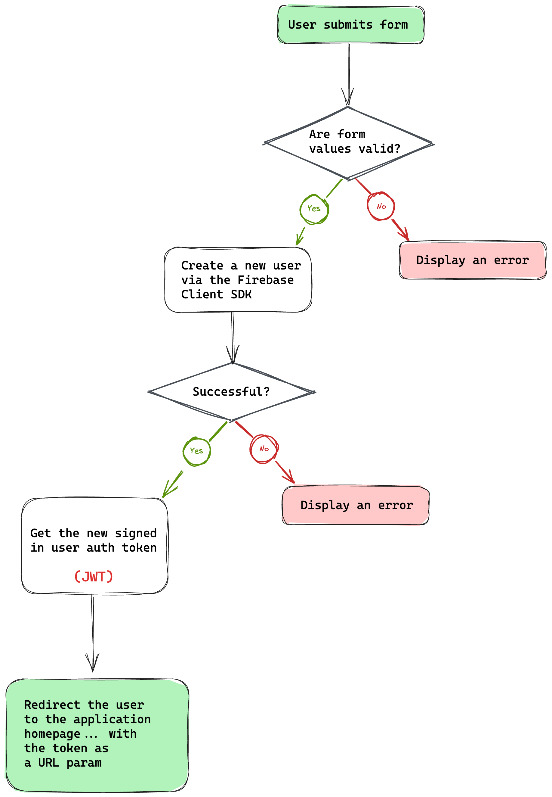
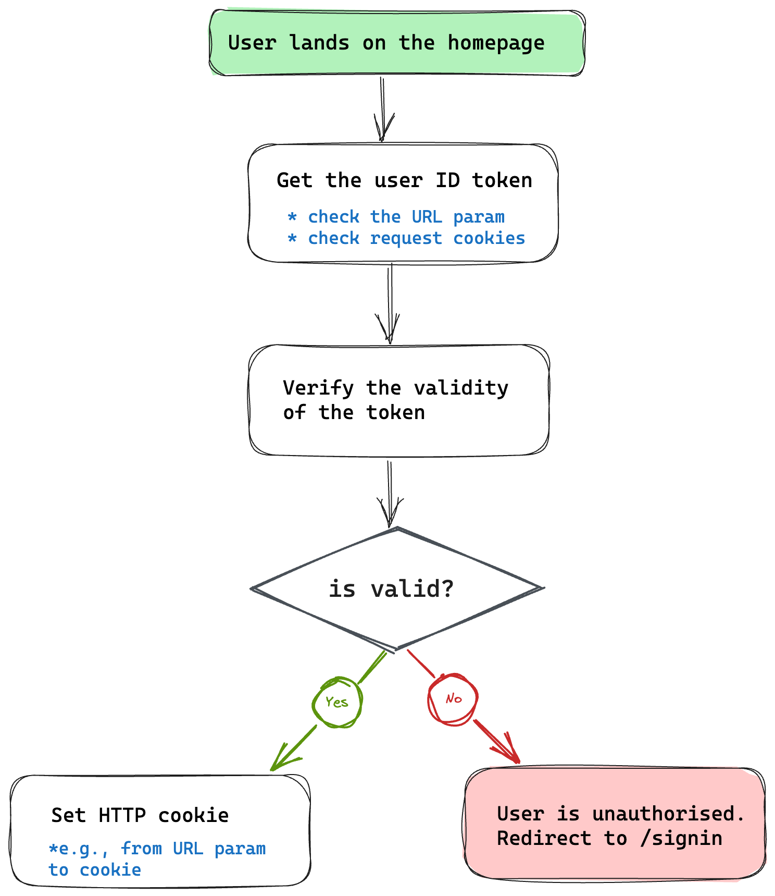
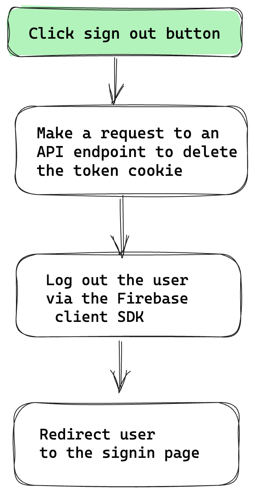
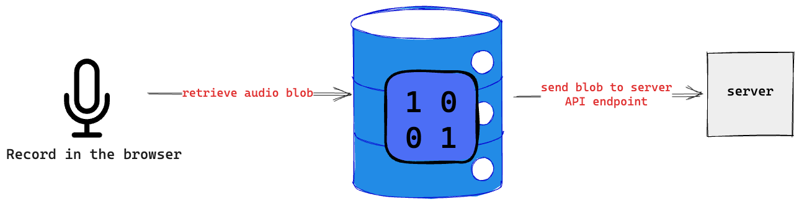
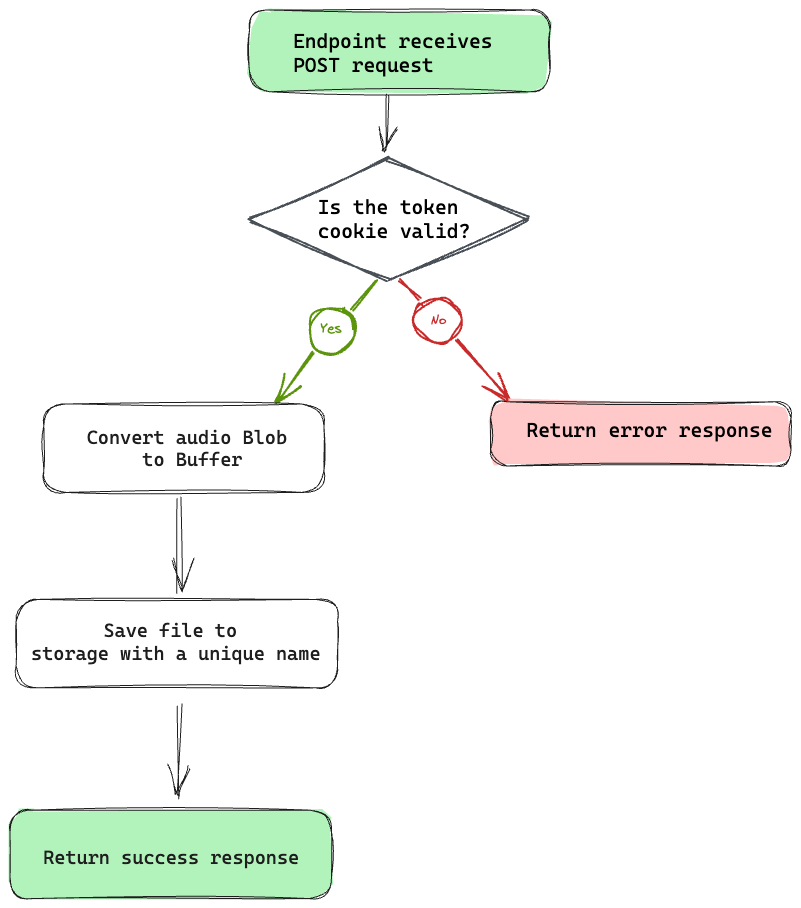

# 🚀 Understanding Astro

By [Ohans Emmanuel](https://www.ohansemmanuel.com/)

<br />

## Chapter 7: Be Audible! (Fullstack Astro Project)

> … People will believe what they see. Let them see.  
>  ― Henry David Thoreau

In this chapter, I’ll employ you to see beyond static apps and build fullstack applications with Astro.

<br /> 
<br /> 
<br /> 
<br />

[](https://ohans.me/understanding-astro-udemy)

<br /> 
<br />

[]([https://github.com/understanding-astro/fullstack-astro])

## What you’ll learn

- The ability to add authentication to an Astro application.
- An understanding of setting up a backend for an Astro application.
- A working knowledge of handling form submissions without dedicated API routes.
- Hands-on experience uploading and retrieving data in an Astro application.
- An understanding of the kind of apps you can build with Astro.

## Project setup

We’ve seen how to build static sites with Astro. So, to make this section laser-focused on scripting and Astro features, I’ve set up a static site for us to work on in this chapter.

The site has been stripped of any relevant functionality. We will build those step-by-step together.

Start by cloning the project:

```bash
git clone https://github.com/understanding-astro/fullstack-astro
```

Change directories:

```bash
cd fullstack-astro
```

You should be on the `clean-slate` branch by default. Otherwise, check out to `clean-slate`.

Next, install dependencies and start the application:

```bash
npm install && npm run start
```

The application should successfully run on one of the local server ports.

<figure>
    
    <figcaption><em>The BeAudible app initialised.</em></figcaption>
    <br><br><br>
</figure>

## Project overview

Our application is for a hypothetical startup, BeAudible, whose mission is to discover the voices of the world.

In technical terms, BeAudible lets authorised users create audio recordings, upload them to their servers, and have a timeline where people can listen to everyone’s recordings.

<figure>
    
    <figcaption><em>An overview of the BeAudible application.</em></figcaption>
    <br><br><br>
</figure>

The project we just cloned will receive and upload a user’s recording and eventually display every recording on a shared timeline.

Let’s explore the pages in the project.

#### The homepage

Firstly, consider the homepage, i.e., the base route `/`.

<figure>
    
    <figcaption><em>The sections of the BeAudible application.</em></figcaption>
    <br><br><br>
</figure>

1. The navigation bar holds a feedback form for users to send their thoughts.
2. The navigation bar includes a record link to navigate to a dedicated page for recording a user’s audio.
3. The navigation bar contains a sign-out button. By implication, the homepage should be protected, i.e., only authenticated users should land here.
4. Finally, in the centre of the page lies the timeline that should list all users’ recordings.

#### The record page

If you click “Record” from the navigation bar, you will be navigated to the `/record` route where a user can record their audio.

<figure>
    
    <figcaption><em>The record page.</em></figcaption>
    <br><br><br>
</figure>

A React component hydrated in the Astro application powers the recording user interface element.

#### The signup page

Now, go to the `/signup` route.

<figure>
    
    <figcaption><em>The sign up page.</em></figcaption>
    <br><br><br>
</figure>

This is the page to sign up users to BeAudible!

#### The sign-in page

Finally, visit the `/signin` route.

<figure>
    
    <figcaption><em>The signin page.</em></figcaption>
    <br><br><br>
</figure>

This is the page for previously authenticated users to log in to the application.

Go ahead and kill the running application from the terminal. Then, we’ll continue with some setup.

#### Helper components and utilities

To ensure our focus remains on Astro, I created UI components and stored them in the `src/components` folder.
We will import and use these components to develop our solution as we proceed.

Similarly, constants have been stored in `src/constants` and utility scripts in `src/scripts`. We aim to concentrate on the critical objective of this chapter, which is to build a fullstack application with Astro.

## Technology choices

1. Firebase as a backend service: we can choose any backend service with Astro, but we’ll use Firebase for simplicity. The principles we’ll discuss work with any other preferred service. We will leverage Firebase’s authentication and cloud storage services.
2. Tailwind for styling: Tailwind is famous for styling applications. Instead of writing the styles manually, the project uses Tailwind.
3. Astro as the primary web framework: Of course, the web framework of choice for our application is Astro. No questions asked! However, we will also leverage React components for islands of interactivity.

## Backend setup

Let’s point our attention to setting up our backend server. Remember, we will use Firebase as our backend service.

Go to the [Firebase homepage]([https://firebase.google.com/]) and visit the Firebase console.

<figure>
    
    <figcaption><em>The Firebase homepage.</em></figcaption>
    <br><br><br>
</figure>

The process is much smoother if you have (and are signed in to) a Google account (e.g., Gmail).

Next, create a new Firebase project.

<figure>
    
    <figcaption><em>Creating a new Firebase project.</em></figcaption>
    <br><br><br>
</figure>

Name the project `BeAudible` and choose whether to use Google Analytics in the project.

<figure>
    
    <figcaption><em>Choosing Google analytics and creating the project.</em></figcaption>
    <br><br><br>
</figure>

After successfully creating the project, add a web application to the Firebase project.

<figure>
    
    <figcaption><em>Adding a web application to the Firebase project.</em></figcaption>
    <br><br><br>
</figure>

Now, continue the web app set-up process by choosing a name (preferably the same as before), setup Firebase hosting and registering the web application.

<figure>
    
    <figcaption><em>Continuing the application set-up.</em></figcaption>
    <br><br><br>
</figure>

The next step is critical.

**Copy your web app’s Firebase configuration**. We’ll use that to initialise the Firebase application client side.

<figure>
    
    <figcaption><em>Copying the Firebase configuration for the client SDK.</em></figcaption>
    <br><br><br>
</figure>

The next steps are optional. Follow the guided prompt from Firebase and continue to the Firebase console.

<figure>
    
    <figcaption><em>Following the guided prompt from Firebase.</em></figcaption>
    <br><br><br>
</figure>

Upon completion, we’ll be redirected to the Firebase application dashboard.

Go to the project settings, find the service account section and generate a new private key we’ll leverage in our server application.

<figure>
     Project settings" align="center">
    <figcaption><em>Project overview > Project settings.</em></figcaption>
    <br><br><br>
</figure>

<figure>
    
    <figcaption><em>Generating a new private key.</em></figcaption>
    <br><br><br>
</figure>

This will download a JSON file to your machine. Keep it secure as it provides access to Firebase’s service. We will leverage this to access Firebase’s server resources from our application server.

## Handling authentication

Generally speaking, authentication is serious business and can take different forms.

Firebase provides an authentication service, so we will leverage its client libraries to authenticate the user client-side.

<figure>
    
    <figcaption><em>Simplified authentication process.</em></figcaption>
    <br><br><br>
</figure>

The client authentication will communicate with Firebase’s servers, but later on, we will look at verifying a user’s authentication token (JWT) on our server.

First, set up the Firebase application to receive client authentication requests.

Return to the Firebase console and set up authentication.

<figure>
    
    <figcaption><em>Select authentication from the list of provided services.</em></figcaption>
    <br><br><br>
</figure>

Firebase provides different sign-in methods. Let’s keep this simple. Enable the Email and password method from the Firebase console.

<figure>
    
    <figcaption><em>Selecting the email / password sign-in method.</em></figcaption>
    <br><br><br>
</figure>

Make sure to enable the option and hit save.

<figure>
    
    <figcaption><em>Enabling and saving the Email / Password sign-in method.</em></figcaption>
    <br><br><br>
</figure>

### Initialising firebase on the client

`src/scripts/firebase/init.ts` contains the initialisation script for our client application.

The code responsible for initialising the application is shown below:

```js
// ...
// 📂 src/scripts/firebase/init.ts
export const app = initializeApp(firebaseConfig);
export const auth = getAuth(app);
```

The script exports the initialised application via `app` and the authentication client module via `auth` where `initializeApp` and `getAuth` are methods imported from the Firebase SDK.

We must now replace the `firebaseConfig` variable with the object copied while initialising the firebase application.

<figure>
    
    <figcaption><em>The firebase client configuration.</em></figcaption>
    <br><br><br>
</figure>

Once this is done, we should have the Firebase client rightly initialised.

### Using the Firebase emulators

Talking to the production firebase services while testing and developing locally is rather silly.

<figure>
    
    <figcaption><em>Sending requests to the production Firebase servers while developing locally.</em></figcaption>
    <br><br><br>
</figure>

Instead, we can use the Firebase Emulator Suite while developing locally. The emulator suite will intercept our Firebase service requests and provide a testing ground locally without hitting the production services.

I’ve set up the project to use the Firebase emulators. So let’s get it running.

Make sure you have the Firebase CLI tools installed. If you don’t, install the CLI via the following command:

```bash
npm install -g firebase-tools
```

Assuming you have the application running in one tab of your terminal, open another tab and run the firebase `emulators` script to start the firebase emulators:

```bash
npm run emulators
```

This will start the authentication and storage emulators with a user interface running on `localhost:4001`. We can view the development data in the emulator user interface, e.g., application user signups and uploaded recordings.

<figure>
    
    <figcaption><em>Starting the Firebase emulators.</em></figcaption>
    <br><br><br>
</figure>

### Handling user signups

So, how are we going to handle user signups?

Please consider the overall flow diagram below:

<figure>
    
    <figcaption><em>The signup flow.</em></figcaption>
    <br><br><br>
</figure>

- The flow kicks off with the user submitting the signup form.
- Then check if the submitted email and password are valid.
- If the form values are invalid, display an error.
- Create a new user via the `createUserWithEmailAndPassword` method of the Firebase auth module.
- If the new user creation fails, display an error.
- Otherwise, our new user is now in a signed-in state.
- Grab the user auth token (this is called ID token in Firebase lingo and represents a JSON Web Token (JWT))[^1].
- Redirect the user to the homepage with the token as a URL parameter, i.e., `/?token=${USER_AUTH_TOKEN}`.

Before delving into the code for how to do this, I’d like to point out that the project has module aliasing set up to prevent pesky relative imports. e.g.,

```js
// This ...
import { auth } from "../../firebase/init";

// Becomes this ...
import { auth } from "@scripts/firebase/init";
```

This is achieved by updating the `tsconfig.json` file to include the alias:

```js
// 📂 tsconfig.json
{
   // ...
    "baseUrl": ".",
    "paths": {
      "@components/*": ["src/components/*"],
      "@layouts/*": ["src/layouts/*"],
      "@scripts/*": ["src/scripts/*"],
      "@stores/*": ["src/stores/*"],
      "@constants/*": ["src/constants/*"]
    }
  }
}
```

We will reference existing modules in the project via the relevant module alias.
Now, here is the annotated code for handling the user sign-up:

```html
<!-- 📂 src/pages/signup.astro -->
<script>
   // import the Validator from the tiny "validator.tool" library
   import Validator from "validator.tool";
   import { createUserWithEmailAndPassword } from "firebase/auth";
   // Import the auth module from `src/scripts`
   import { auth } from "@scripts/firebase/init";
   // Import basic form validation rules
   import { authClientValidationRules } from "@scripts/authClientValidationRules";

  // Type alias for the form values
   type FormValues = {
     email?: string;
     password?: string;
   };

   // Grab the submit button element
   const submitButton = document.getElementById(
     "submit-signup-form"
   ) as HTMLButtonElement | null;

   // Grab the form element
   const form = document.getElementById("signup-form") as HTMLFormElement | null;

    // Initialise the validator
   const validator = new Validator({
     form,
     // Pass in basic rules already existing in the project
     rules: authClientValidationRules,
   });


   if (validator.form) {
     // Attach a submit event handler on the form
     validator.form.onsubmit = async (evt) => {
       evt.preventDefault();

       const errors = validator.errorMessages;
       const values = validator.getValues() as FormValues;

       //Check for errors
       if (Object.keys(errors).length > 0) {
         const errorMessages = Object.values(errors).join("...and...");
         return alert(errorMessages);
       }

       const { email, password } = values as Required<FormValues>;

       if (!submitButton) {
         return alert("Missing form button");
       }

       try {
         // Show submitting state
         submitButton.innerText = "Submitting";
         submitButton.disabled = true;

         // Create the new user
         const { user } = await createUserWithEmailAndPassword(
           auth,
           email,
           password
         );

  		// redirect the user to the homepage with their token
         const token = await user.getIdToken();
         window.location.href = `/?token=${token}`;
       } catch (error) {
         submitButton.innerText = "Signup";
         submitButton.disabled = false;

         alert(error);
       }
     };
   }
</script>
```

In the solution above, we’re handling form validation via [validator.js](https://github.com/jaywcjlove/validator.js) but could have used any other library. Another minimal framework agnostic library that makes a good choice is [Felte](https://github.com/pablo-abc/felte).

### Handling user sign in

With user signup handled, the process for user signup is the same except for one change. Instead of calling the `createUserWithEmailAndPassword` method, we’ll use the `signInWithEmailAndPassword` firebase auth method.

Notice how the flow is identical in the code below:

```html
<!-- 📂 src/pages/signin.astro -->
<!-- ... -->

<script>
  import { signInWithEmailAndPassword } from "firebase/auth";
  import Validator from "validator.tool";
  import { auth } from "@scripts/firebase/init";
  import { authClientValidationRules } from "@scripts/authClientValidationRules";

  type FormValues = {
    email?: string;
    password?: string;
  };

  const form = document.getElementById("signin-form") as HTMLFormElement | null;
  const submitButton = document.querySelector(
    "#signin-form button[type='submit']"
  ) as HTMLButtonElement | null;

  const validator = new Validator({
    form,
    rules: authClientValidationRules,
  });

  if (validator.form) {
    validator.form.onsubmit = async (evt) => {
      evt.preventDefault();

      const errors = validator.errorMessages;
      const values = validator.getValues() as FormValues;

      if (Object.keys(errors).length > 0) {
        const errorMessages = Object.values(errors).join("...and...");
        return alert(errorMessages);
      }

      const { email, password } = values as Required<FormValues>;

      if (!submitButton) {
        return alert("Missing form button");
      }

      try {
        submitButton.innerText = "Submitting";
        submitButton.disabled = true;

        const { user } = await signInWithEmailAndPassword(
          auth,
          email,
          password
        );

        const token = await user.getIdToken();
        window.location.href = `/?token=${token}`;
      } catch (error) {
        submitButton.innerText = "Signin";
        submitButton.disabled = false;

        alert(error);
      }
    };
  }
</script>
```

With these in place, we’ve got authentication handled!

However, a question that may remain in your heart is, why exactly are we sending the user token in the homepage redirect URL?

## Implementing protected pages

Every page in our application is statically generated except for `index.astro` I.e., the homepage.

The homepage is server-side rendered because we want to ensure it’s protected, i.e., only authenticated users ever land here.

We will discuss how we’ll achieve this, but first, we need to write some code that runs on the server here.

### Initialising Firebase on the server

During the project initialisation, we downloaded a private key for server access. This is a JSON file in the form:

```js
{
  type: "...",
  project_id: "..."
   // more properties
}
```

We need these values to initialise our server application. So, create a `.env` file to store these secrets. Then, we’ll break up the JSON keys into individual environment variables as shown below:

```js
FIREBASE_PRIVATE_KEY_ID = "...";
FIREBASE_PRIVATE_KEY = "...";
FIREBASE_PROJECT_ID = "...";
FIREBASE_CLIENT_EMAIL = "...";
FIREBASE_CLIENT_ID = "...";
FIREBASE_AUTH_URI = "...";
FIREBASE_TOKEN_URI = "...";
FIREBASE_AUTH_PROVIDER_CERT_URL = "...";
FIREBASE_CLIENT_CERT_URL = "...";
```

Save the `env` file. Without this, we won’t be able to access the application resources from our server.

> ✨ Fun fact: As discussed in Chapter 5, we’re providing Typescript support for these environment values in `.env.d.ts`.

### Protecting the home page route

Once a user has successfully signed in, Firebase generates a unique ID token that serves as their unique identifier and provides access to various resources, such as Firebase Cloud Storage.

I have loosely referred to this as auth tokens. We will use this ID token to recognise the user on our server.

> ✨ Fun fact: Firebase ID tokens are short-lived and last for an hour.

Consider the flow below:

<figure>
    
    <figcaption><em>The protected route flow.</em></figcaption>
    <br><br><br>
</figure>

- The flow kicks off with the user landing on the homepage.
  > Note that the following steps are performed on the server, i.e., within the frontmatter section of our server-side rendered page.
- Then, retrieve the user ID token from the URL (first-time user) or the request cookies (returning user).
- Verify the validity of the token. We will use the Firebase server SDK (Firebase admin) to check this.
- If the token is invalid or doesn’t exist, the user is unauthorised. Redirect them to the `/signin` page.
- If the token is valid, set the `token` as a cookie.

> ✨Fun fact: by setting the token via cookies, we can remove the token from the URL and refresh without losing the user signed-in state. Every request will send back the cookie to the server, where we can recheck its validity.

Now, here’s the implementation:

```js
// 📂 src/pages/index.astro

// ...
import { serverApp } from "@scripts/firebase/initServer";
import { getAuth } from "firebase-admin/auth";
import { TOKEN } from "@constants/cookies";

// Get client token from the URL param
const url = new URL(Astro.request.url);
const urlTokenParam = url.searchParams.get("token");

// Get token from cookies
const cookieToken = Astro.cookies.get(TOKEN);
const token = urlTokenParam || cookieToken.value;

if (!token) {
  // Unauthorised user. Redirect to sign in
  return Astro.redirect("/signin");
}

const auth = getAuth(serverApp);

try {
  // verify the auth token
  await auth.verifyIdToken(token);

  // set token cookie
  // Note that the "TOKEN" constant refers to the string "X-Token."
  Astro.cookies.set(TOKEN, token, {
    path: "/",
    httpOnly: true,
    secure: true,
  });
} catch (error) {
  console.error("Could not decode token", {
    fromCookie: !!cookieToken.value,
    fromUrl: !!urlTokenParam,
  });

  // Error occurred, e.g., invalid token. Redirect to sign in
  return Astro.redirect("/signin");
}
```

<figure>
    
    <figcaption><em>The token cookie set in the browser response.</em></figcaption>
    <br><br><br>
</figure>

### Updating the redirect URL

When a user successfully signs in, the user looks something like `localhost:3000/?token=${some-long-string}`.

After performing our token validation on the server and returning the protected `HTML` page, we may update the URL to remove the `token` parameter.

```js
// Before
localhost:3000/?token=${some-long-string}

// After
localhost:3000
```

This is not necessary, but a nice UX touch.

Since we want to do this on the client, our go-to solution is to add a client `<script>` to the page!

Consider the solution below:

```html
<!-- 📂 src/pages/index.astro -->
<!-- ... -->

<script>
  // Enhancement: remove the token from the URL after the page's parsed.
  const url = new URL(window.location.href);
  const urlTokenParam = url.searchParams.get("token");

  if (urlTokenParam) {
    // delete the token param from the URL
    url.searchParams.delete("token");

    // update history without a refresh with the new URL
    window.history.pushState({}, "", url.href);
  }
</script>
```

The solution is arguably easy to reason about, with the crux after getting the search parameter being `window.history.pushState(...).` [^2]

### Log out a user from the protected page

The top left section of the application’s navigation bar includes a sign-out button. When a user clicks this, we will sign them out of the application.

To sign out a user, we will use the Firebase client SDK to log a user out of the device.

However, remember that the protected index page checks the `token` request cookie value.

When we sign out a user using the Firebase client SDK, the issued client `token` remains valid for up to an hour (depending on when it was issued).

So, consider the flow for our solution below:

<figure>
    
    <figcaption><em>The user sign out flow..</em></figcaption>
    <br><br><br>
</figure>

Let’s start our implementation by updating the client application to handle the click event on the sign-out button and initiate our flow as shown below:

```html
<!-- 📂 src/pages/layouts/BaseLayout.astro -->
<!-- ... -->
<script>
  import { auth } from "@scripts/firebase/init";

   // Grab the sign-out button
  const signoutButton = document.getElementById("sign-out-button") as
    | HTMLButtonElement
    | undefined;

  if (signoutButton) {
    // Add a click event listener on the button
    signoutButton.addEventListener("click", async () => {
      try {
        // Disable the button while we log the user out
        signoutButton.disabled = true;
        // Change button text to read "Signing out ..."
        signoutButton.innerText = "Signing out ...";
        // Invalidate server http cookie
        const response = await fetch("/api/auth/signout", {
          method: "POST",
        });

        if (!response.ok) {
          throw new Error("server signout failed");
        }
  /**
  	* sign the user out via the signOut method
  * on the Firebase auth module
  */
        await auth.signOut ();
  // Redirect to the signin page
        window.location.href = "/signin";
      } catch (error) {
        signoutButton.disabled = false;
        alert(error);
      }
    });
  }
</script>
```

We’re making a request to `/api/auth/signout`, but the API route does not exist.

Let’s change that with the following code:

```js
// 📂 src/pages/api/auth/signout.ts
// ...

import { TOKEN } from "@constants/cookies";

export const post: APIRoute = (ctx) => {
  ctx.cookies.delete(TOKEN, {
    path: "/",
  });

  return {
    body: JSON.stringify({ message: "successfully signed out" }),
  };
};
```

After successful sign-out, attempt to visit the protected page `localhost:3000`, and you’ll be automatically redirected to `/sign`.

We’re now cooking with gas! 🔥

## Cloud storage setup

We’ve got a big part of our application functioning — largely the authentication and keeping the index page protected. However, we’re protecting an empty page at the moment. So users cannot record or view other users’ recordings.

Let’s fix this by setting up cloud storage to save user recordings on the server.

Go to the Firebase console and click “See all build features” to find the cloud storage service.

<figure>
    
    <figcaption><em>Viewing all build features on the Firebase console.</em></figcaption>
    <br><br><br>
</figure>

Next, select the Storage service.

<figure>
    
    <figcaption><em>Selecting the storage service.</em></figcaption>
    <br><br><br>
</figure>

Then begin the setup.

<figure>
    
    <figcaption><em>Clicking get started on the Storage service page.</em></figcaption>
    <br><br><br>
</figure>

Keep the storage rules as-is:

<figure>
    
    <figcaption><em>The default storage rule.</em></figcaption>
    <br><br><br>
</figure>

Then select a server location.

BeAudible is a hypothetical US startup, so I’ll choose a US location here.

<figure>
    
    <figcaption><em>Selecting a Storage location.</em></figcaption>
    <br><br><br>
</figure>

Once the setup is complete, visit the Storage page and copy the bucket name in the form `gs://{name-of-project}.appspot.com.`

<figure>
    
    <figcaption><em>The Storage bucket name.</em></figcaption>
    <br><br><br>
</figure>

Excellent!

When we upload and get the user recordings, we’ll need this to connect to the storage servers.

## Uploading audio recordings

The recorder user interface is powered by a React Recorder component hydrated via the `client:load` directive.

```js
<Recorder client:load>...</Recorder>
```

Open the `Recorder` component and consider the `onAudioDownload` callback.

```js
// src/components/AudioRecorder.tsx
// ...
<VoiceRecorder
  onAudioDownload={(blob: Blob) => {
    // 👀 upload recording
  }}
/>
```

After a user completes the recording, this callback will be invoked. Our first task is to go ahead and upload the audio blob to the server.

<figure>
    
    <figcaption><em>Sending audio blob to a server endpoint.</em></figcaption>
    <br><br><br>
</figure>

### Handling uploads via an API route

Let’s go ahead and create the API endpoint that’ll receive the audio blob from the client.

Consider the flow for our solution below:

<figure>
    
    <figcaption><em>The save recording endpoint flow diagram.</em></figcaption>
    <br><br><br>
</figure>

Now, here’s the annotated code:

```js
// 📂 src/pages/api/recording.ts
// ...
import type { APIRoute } from "astro";

// nanoid will be used to generate unique IDs
import { nanoid } from "nanoid";
import { TOKEN } from "@constants/cookies";
import { getAuth } from "firebase-admin/auth";
import { BUCKET_NAME } from "@constants/firebase";
import { getStorage } from "firebase-admin/storage";
import { serverApp } from "@scripts/firebase/initServer";

// get firebase server auth module
const auth = getAuth(serverApp);

export const post: APIRoute = async (ctx) => {
  // Create an error response
  const authUserError = new Response("Unauthenticated user", { status: 401 });

  try {
    // Get token cookie
    const authToken = ctx.cookies.get(TOKEN).value;

    // not present, return error response
    if (!authToken) {
      return authUserError;
    }

    // verify the user token
    await auth.verifyIdToken(authToken);
  } catch (error) {
    /**
     * Return error response, e.g.,
     * if the token verification fails
     */
    return authUserError;
  }

  try {
    // Get the audio blob from the client request
    const blob = await ctx.request.blob();

    // Get access to the firebase storage
    const storage = getStorage(serverApp);
    const bucket = storage.bucket(BUCKET_NAME);

    // convert Blob to native Node Buffer for server storage
    const buffer = Buffer.from(await blob.arrayBuffer());
    const file = bucket.file(`recording-${nanoid()}.wav`);

    // save to firebase storage
    await file.save(buffer);

    // return a successful response
    return {
      body: JSON.stringify({
        message: "Recording uploaded",
      }),
    };
  } catch (error) {
    console.error(error);
    return new Response("Something went horribly wrong", { status: 500 });
  }
};
// ...
```

### Uploading recordings from the client

Now that we’ve got the API endpoint ready to receive client requests let’s go ahead and upload the user recordings from the client.

Instead of clogging our user interface components with the upload logic, I find it more maintainable to move such business logic away from the UI components and, in our case, have this collocated with the application state managed via `nanastores`.

Remember `nanostores`?

We’ll use [nanostores](https://github.com/nanostores/nanostores) for state management. The `~1kb` library is simple and efficient for our use case.

Create a new `audioRecording.ts` file to handle our recording state and also be responsible for exposing a `uploadRecording` method.

Consider the implementation below:

```js
// 📂 src/stores/audioRecording.ts
import { atom } from "nanostores";

/**
 * Deterministic state representation
 */
type Store =
  | {
      blob: null,
      status: "idle",
    }
  | {
      blob: Blob,
      status: "uploading" | "completed" | "failed",
    };

/**
 * Optional naming convention: $[name_of_store]
 * instead of [name_of_store]Store
 *, i.e., $audioRecording instead of audioRecordingStore
 */
export const $audioRecording =
  atom <
  Store >
  {
    // Initialise the atom with the default state
    blob: null,
    status: "idle",
  };

/**
 * upload audio recording action
 */
export const uploadRecording = async (blob: Blob) => {
  // Update $audioRecording state to "uploading."
  $audioRecording.set({
    status: "uploading",
    blob,
  });

  try {
    // POST request to our recording endpoint
    const response = await fetch("/api/recording", {
      method: "POST",
      body: blob, // pass blob as the request body
    });

    if (response.ok) {
      // Successful? Update state to "completed."
      $audioRecording.set({
        status: "completed",
        blob,
      });
    } else {
      // Request failed. Update state to "failed."
      $audioRecording.set({
        status: "failed",
        blob,
      });
    }
  } catch (error) {
    $audioRecording.set({
      status: "failed",
      blob,
    });
  } finally {
    // after 't' revert state to idle again
    const timeout = 3000;
    setTimeout(() => {
      $audioRecording.set({
        status: "idle",
        blob: null,
      });
    }, timeout);
  }
};
```

Our UI state is well-represented, and the upload action is defined. However, this will only take effect when used in the UI component.

### Reacting to UI changes in framework components

We will now update the `AudioRecorder` UI component to react to the state in the `$audioRecording` store as shown below:

```js
// 📂 src/components/AudioRecorder.tsx

/**
 * The useStore hook will help with the React
 * component rerenders. In simple terms, it'll hook into the
 * store and react upon any change.
 */
import { useStore } from "@nanostores/react";
import { VoiceRecorder } from "react-voice-recorder-player";
// Import the store and the upload recording action
import { $audioRecording, uploadRecording } from "@stores/audioRecording";

type Props = {
  cta?: string,
};

export const Recorder = (props: Props) => {
  // Get the current application state from the store
  const state = useStore($audioRecording);

  // React deterministically based on the status of the store
  switch (state.status) {
    case "idle":
      return (
        <div>
          <VoiceRecorder
            // 👀 Invoke uploadRecording after a user completes the recording
            onAudioDownload={(blob: Blob) => uploadRecording(blob)}
          />

          {props.cta}
        </div>
      );
    /** 
 Show relevant UI during the uploading state. 
**/
    case "uploading":
      return (
        <div className="flex items-center justify-center w-56 h-56 border border-gray-200 rounded-lg bg-gray-50 dark:bg-gray-800 dark:border-gray-700">
          <div className="px-3 py-1 text-xs font-medium leading-none text-center text-blue-800 bg-blue-200 rounded-full animate-pulse dark:bg-blue-900 dark:text-blue-200">
            Uploading ...
          </div>
        </div>
      );
    /** 
 Show relevant UI during the failed state. 
**/
    case "failed":
      return (
        <div className="bg-red-400 rounded-md py-6 px-3 text-slate-100 motion-safe:animate-bounce">
          An error occurred uploading your recording
        </div>
      );
    /** 
 Show relevant UI during the completed state. 
**/
    case "completed":
      return (
        <div className="bg-green-400 rounded-md py-6 px-3 text-slate-100 motion-safe:animate-bounce">
          Successfully published your recording!
        </div>
      );
    /** 
 Typescript exhaustive checking
 @see https://www.typescriptlang.org/docs/handbook/2/narrowing.html#exhaustiveness-checking
**/

    default:
      const _exhaustiveCheck: never = state;
      return _exhaustiveCheck;
  }
};
```

Now, a user should be able to record in the browser, and we will go ahead and save the recording on our backend!

<figure>
    
    <figcaption><em>Viewing saved recordings in the Firebase emulator.</em></figcaption>
    <br><br><br>
</figure>

## Fetching data from the server

We’re rightly saving user recordings, but at the moment, they can’t be viewed on the homepage.

Let’s resolve that.

Our solution is to fetch the recordings on the server and send the rendered HTML page to the client.

Here’s the code solution:

```js
// 📂 src/pages/index.astro


import { BUCKET_NAME } from "@constants/firebase";
import LinkCTA from "@components/LinkCTA.astro";
import AudioPlayer from "@components/AudioPlayer.astro";
// ...

// Represent the recordings with the "Audible" type alias
type Audible = { url: string; timeCreated: string };

// audibles will hold the list of "Audibles."
let audibles: Audible[] = [];
const storage = getStorage(serverApp);


try {
   /**
	 *  After verifying the user auth token
  	 * and setting the token cookie ...
	*/
    try {
    // get all recordings in the storage bucket
    const bucket = storage.bucket(BUCKET_NAME);
    const [files] = await bucket.getFiles();

    audibles = await Promise.all(
      files.map(async (file) => {
        const [metadata] = await file.getMetadata();

        // return the url and timeCreated metadata
        return {
          url: file.publicUrl(),
          timeCreated: metadata.timeCreated,
        };
      })
    );
  } catch (error) {
    console.error(error);
    console.error("Error fetching audibles");
    return Astro.redirect("/signin");
  }
}

//...

```

Now update the component template section to render the “audibles”. We’ll leverage the `AudioPlayer` component, passing it the audible `url` and the `timeCreated` metadata.

```html
<div class="flex flex-col items-center">
    {
      audibles.length === 0 ? (
        <>
          <Empty />
          <LinkCTA href="/record">Record</LinkCTA>
        </>
      ) : (
        audibles
          .sort((a, b) =>
            new Date(a.timeCreated) < new Date(b.timeCreated) ? 1 : -1
          )
          .map((audible) => (
            <AudioPlayer url={audible.url} timeCreated={audible.timeCreated} />
          ))
      )
    }
</div>
```

In the code above, we display an `Empty` user interface empty if there are no audibles. Otherwise, we render a sorted list of audibles.

<figure>
    
    <figcaption><em>Rendering the sorted list of audio recordings.</em></figcaption>
    <br><br><br>
</figure>

## Submitting HTML forms

The final puzzle in our application is handling the submission of the feedback form.

I’ve included this feature to show an example of handling a form within the same server-side rendered page, i.e., without creating an API endpoint to handle the form request.

Take a look at the form element and notice how its method attribute is set to `POST`:

```js
// 📂 src/layouts/BaseLayout.astro
// ...
<form class="mx-auto flex" method="POST">
  ...
</form>
```

By default, the browser will send a POST request to the server when this form is submitted, which we can capture and react upon.

In the frontmatter section of the `index.astro` page, we can add a condition to handle the feedback form requests as shown below:

```js
// ...
if (Astro.request.method === "POST") {
  try {
    // Get the form data
    const data = await Astro.request.formData();
    /**
     * Get the feedback value.
     * Corresponds to the form input element value of the name, "feedback".
     */
    const feedback = data.get("feedback");

    // Do something with the data
    console.log({ feedback });

    // Do something with the data
  } catch (error) {
    if (error instanceof Error) {
      console.error(error.message);
    }
  }
}
// ...
```

I’m keeping this simple by just logging the feedback on the server. However, we could save this value to a database in the real world. The crux here is receiving the form values, as shown above.

<figure>
    
    <figcaption><em>The logged feedback data.</em></figcaption>
    <br><br><br>
</figure>

## Conclusion

Astro is great for building content-focused websites such as blogs, landing pages etc. However, we can do much more with Astro!

Suppose you can build the application as a multi-page application (MPA), i.e., not a single-page application, and can leverage islands of interactivity (component islands). In that case, you can build it with Astro.

[^1]: What is a JWT? [https://jwt.io/introduction](https://jwt.io/introduction)
[^2]: The pushState method: [https://developer.mozilla.org/en-US/docs/Web/API/History/pushState](https://developer.mozilla.org/en-US/docs/Web/API/History/pushState)
