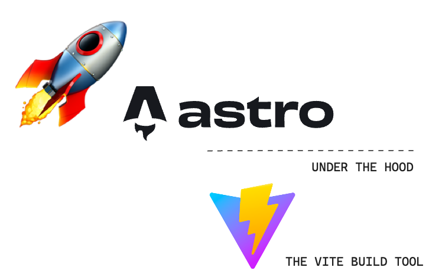
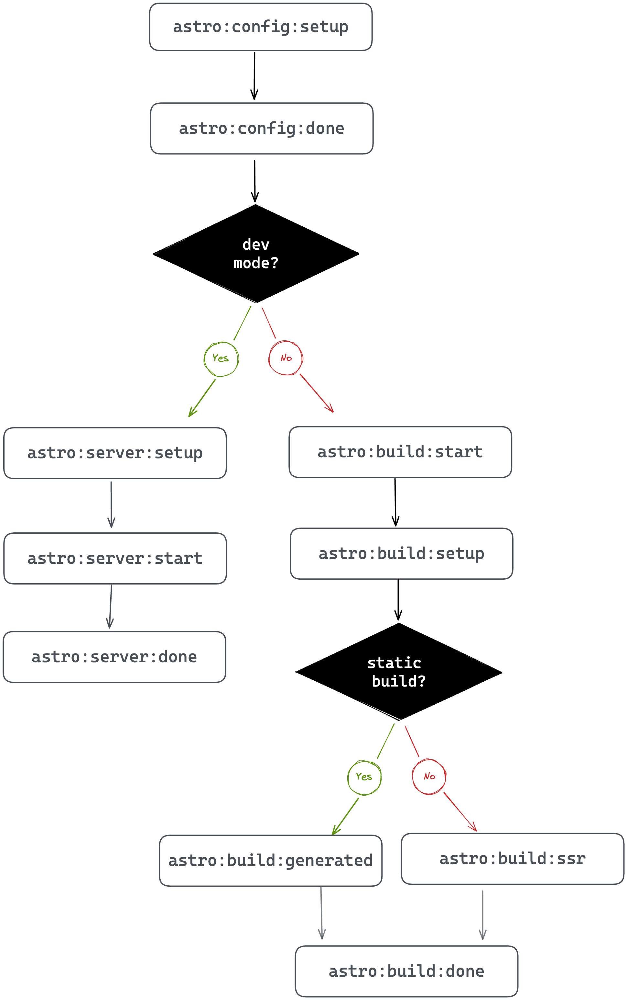

# 🚀 Understanding Astro

By [Ohans Emmanuel](https://www.ohansemmanuel.com/)

<br />

## Chapter 8: Build Your Own Astro Integrations

At the end of this chapter, you’ll join the order of mages who wield great power to bend Astro to their will with new functionality and behaviour.

## What you’ll learn

- The relationship between Astro and the Vite module bundler
- The different types of integrations available in Astro
- Build your first Astro integration
- Understand the Astro hooks lifecycle
- Deepen your knowledge of building custom Astro feature integrations

## Astro and Vite

Before we dive into the beautiful world of Astro integrations, we need to know who’s powering the Astro build ship - and that’s [Vite](https://vitejs.dev/), the build tool all about speed, efficiency and flexibility. Think of Vite as our trusty co-pilot, helping us bundle our web pages and creating a lightning-fast development environment.

<figure>
    
    <figcaption><em>The Astro Vite relationship.</em></figcaption>
    <br><br><br>
</figure>

To build the custom integrations we’re dreaming of, we may need to go beyond Astro and venture deep into Vite territory, e.g., customising the build step with Vite plugins.

Now, I know this might not be very clear, especially when we start talking about Vite in the upcoming sections of this chapter. But fear not - you now know why Vite is essential to the build process, and I’ll explain with examples in the coming sections of this chapter.

## What are Astro integrations

By definition, Astro integrations extend Astro with new functionality and behaviour within your project.

We’ll find ourselves building three types of Astro integrations, namely:

1. **Renderers**: these integrations enable a framework component’s rendering (typically server-side rendering and client-side hydration). Examples of this include the official React, Preact and Vue Astro integrations.
2. **Libraries**: these integrations enable external library support within Astro. Examples of this include the official Tailwind and Partytown integrations.
3. **Features**: these are integrations that extend the behaviour of Astro in a specific way, usually to support a user-defined feature set. Examples include the official [sitemap](https://docs.astro.build/en/guides/integrations-guide/sitemap/) integration that generates a sitemap[^1] when you build your Astro project.

For most people, the majority of integration you build will be to support a particular feature, i.e., feature integrations. This will be the sole focus of this chapter. Once you have sufficient knowledge of building feature integrations, you can transfer the knowledge to library or renderer integrations.

Let’s get started with a contrived Astro integration.

## Hello world. Sorry, Hello, Integration

<br /> 
<br />

[](https://ohans.me/understanding-astro-udemy)
<br />
<br />

[](https://github.com/understanding-astro/hello-astro-integration)

Let’s get you acquainted with a basic hello world Astro integration. Even though we will be wielding swords and slaying dragons soon, before that, you must get introduced to the tools of the trade.

### Project objective

The goal for our first Astro integration is arguably straightforward: we will write a custom Astro integration that automatically logs a hello world message to the browser console on every application page.

Have you got it?

I heard a yes!

### Your first custom integration

We will approach this solution by injecting a script on every application page.

How?

Where?

When?

Hold your horses, mate!

Start by beginning a new Astro project with the familiar command:

```js
npm create astro@latest hello-astro-integration
```

Now that you’re a pro at this name the project whatever you like, e.g., `hello-astro-integration` and use a minimal (empty) template.

Open the application directory in your favourite director and head over to the `astro.config.mjs` file.

The `astro.config.mjs` file includes configuration options for our Astro project. This is where we define integrations for our project, i.e., this is where the magic happens.

At the moment, our `astro.config.mjs` file should be in the default empty state, as shown below:

```js
// 📂 astro.config.mjs
import { defineConfig } from "astro/config";

export default defineConfig({});
```

Let’s change that by adding an empty `integrations` list to the configuration:

```js
// 📂 astro.config.mjs
import { defineConfig } from "astro/config";

export default defineConfig({
  integrations: [], // 👀 look here
});
```

In a nutshell, an Astro integration is represented by an object with `name` and `hooks` properties, as shown below:

```js
// 📂 astro.config.mjs
import { defineConfig } from "astro/config";

// https://astro.build/config
export default defineConfig({
  // 👀 look here
  integrations: [
    {
      name: "astro-hello",
      hooks: {},
    },
  ],
});
```

In the code block above, we’ve outlined the object in the `integrations` array.

The name of the integration is `astro-hello`. We’ll discuss hooks in the coming section, but it represents extendable “hook” points within the Astro build lifecycle process.

For example, let’s leverage the first hook in the lifecycle process called `astro:config:setup`.

This hook is the starting point for the entire build lifecycle. It is triggered on initialisation before Astro has resolved the project configuration. It’s the perfect place to inject scripts onto a new page or extend the project configuration before it’s resolved.

Let’s take advantage of that by passing it into the hooks object and pointing it to a function invoked when the hook is triggered.

```js
// 📂 astro.config.mjs
import { defineConfig } from "astro/config";

export default defineConfig({
  integrations: [
    {
      name: "astro-hello",
      hooks: {
        // 👀 hook: callbackFn
        "astro:config:setup": (options) => {},
      },
    },
  ],
});
```

Note the `options` parameter in the hook callback. It is an object with the following type definition:

```js
{
  config: AstroConfig;
  command: 'dev' | 'build';
  isRestart: boolean;
  updateConfig: (newConfig: Record<string, any>) => void;
  addRenderer: (renderer: AstroRenderer) => void;
  addWatchFile: (path: URL | string) => void;
  injectScript: (stage: InjectedScriptStage, content: string) => void;
  injectRoute: ({ pattern: string, entryPoint: string }) => void;
}
```

Luckily it contains the `injectScript` method we’re interested in:

```js
  injectScript: (stage: InjectedScriptStage, content: string) => void;
```

`stage` denotes how the script `content` should be injected into the page, and there are four possible values [^2]: `head-inline`, `before-hydration`, `page`, and `page-ssr`.

The `page` option will bundle and inject the script with other `<script>` tags defined in any Astro components on the page. The final output will eventually load this with a `<script type="module>`.

When I started tinkering with the integrations API, I tried silly things to get `injectScript` to work. I can confidently tell you these won’t work:

```js
// 👀 Error: Failed to parse source for import analysis
// because the content contains invalid JS syntax.
injectScript("page", "console.log('Hello World')");

const log = () => console.log("me");
// 👀 Uncaught ReferenceError: log is not defined
options.injectScript("page", "log()");
```

This saves you the futility I experienced until I looked in the Astro source code.

The `content` string parameter in `injectScript` refers to an import path. This is as shown below:

```js
import { defineConfig } from "astro/config";

// https://astro.build/config
export default defineConfig({
  integrations: [
    {
      name: "astro-hello",
      hooks: {
        "astro:config:setup": (options) => {
          //  👀 "page" option with an import path
          options.injectScript(
            "page",
            `import '/src/scripts/
  globalLog.js'`
          );
        },
      },
    },
  ],
});
```

Since we’re passing an import path to the script, let’s ensure the script exists.

Create a new script with the following content in `src/scripts/globalLog.js`:

```js
// 📂 src/scripts/globalLog.js
const logger = () => {
  const msg = "Hello Integrations";
  console.log(`%c ${msg}`, "background: black;  color: yellow");
};

logger();
```

The `logger` method calls the `console.log` method with a `Hello integrations` string while adding some colour[^3] to the message.

And voila!

We have our first integration running as expected.

<figure>
    
    <figcaption><em>Working integration log printed in the browser console.</em></figcaption>
    <br><br><br>
</figure>

We may create more pages, and the console message will be logged on every page in the application.

### Printing a message to the server console

Since we have hook points into the Astro build process, it is also possible to output logs to the server console.

This may be useful for usability or ascertaining that our custom integration works as expected.

At the moment, here’s the mess my server logs look like:

<figure>
    
    <figcaption><em>The (messy) Astro server logs.</em></figcaption>
    <br><br><br>
</figure>

Yours should look familiar. This is from the incremental process of building our first integration.

Let’s go ahead and print something to the logs once we’ve successfully injected our script onto the page.

```js
// ...

hooks: {
    "astro:config:setup": (options) => {
      options.injectScript("page", `import '/src/scripts/
    globalLog.js'`);

     // 👀 add a new log
     console.log("Injected hello integration script");
    },
},
```

Restart the server for a clean slate, and we should have the log printed as shown below:

<figure>
    
    <figcaption><em>The server log from our hello world integration.</em></figcaption>
    <br><br><br>
</figure>

Since we’re fancy developers who care about usability, let’s go ahead and make the log feel native to other Astro logs by adding some text formatting and colour via `kleur`.

Install the `kelur` package:

```js
npm install kleur
```

Once the installation is complete, we should now have a new log in the dev server that reads:

```js
05:41:02 AM [astro] update /package-lock.json
```

<figure>
    
    <figcaption><em>Example native astro server log.</em></figcaption>
    <br><br><br>
</figure>

`05:41:02` represents my current time.

Please do not ask me why I’m writing this chapter so early in the morning.

Let’s go ahead and make our log look similar. Instead of just using `console.log`, let’s introduce a `logServerMessage` that does our beautiful bidding as shown below:

```js
// 📂 astro.config.mjs

import kleur from "kleur";
import { defineConfig } from "astro/config";

// 👀 The Intl.DateTimeFormat object enables language-sensitive
// date and time formatting.
const dateTimeFormat = new Intl.DateTimeFormat([], {
  hour: "2-digit",
  minute: "2-digit",
  second: "2-digit",
});

const logServerMessage = (message) => {
  // 👀 Get a new date string using the dateTimeFormat object
  const date = dateTimeFormat.format(new Date());

  // log to console with kleur colours and formatting
  console.log(`${kleur.gray(date)} ${kleur
    .bold()
    .cyan("[astro-hello-integration]")} ${message}
  `);
};

export default defineConfig({
  // ... same content as before
});
```

Now we should have a beautiful log message that feels native to Astro, i.e., like the other server console logs.

<figure>
    
    <figcaption><em>The custom integration 'native feeling' server log.</em></figcaption>
    <br><br><br>
</figure>

### Custom integrations as factory functions

Our current implementation is beginning to clog the Astro configuration file.

In practice, Instead of inlining our custom Astro integration, it’s likely to live in a separate file as a factory function, i.e., a function that creates and returns the Astro integration object.

Let’s do that, i.e., something of a refactor.

Move the entire integration content into a new `src/integrations/astro-hello.ts` file.

```js
// 📂 src/integrations/astro-hello.ts
import kleur from "kleur";

const dateTimeFormat = new Intl.DateTimeFormat([], {
  hour: "2-digit",
  minute: "2-digit",
  second: "2-digit",
});

const logServerMessage = (message) => {
  const date = dateTimeFormat.format(new Date());
  console.log(`${kleur.gray(date)} ${kleur
    .bold()
    .cyan("[astro-hello-integration]")} ${message}
    `);
};

// 👀 Introduce a default export function that returns the Astro
// integration object.
export default function helloIntegration() {
  return {
    name: "astro-hello",
    hooks: {
      "astro:config:setup": (options) => {
        options.injectScript(
          "page",
          `import '/src/scripts/
    globalLog.js'`
        );

        logServerMessage("Injected script");
      },
    },
  };
}
```

Now, add in Typescript types:

```js
// 📂 src/integrations/astro-hello.ts

import type { AstroIntegration } from "astro";

const logServerMessage = (message: string) => {
  // ...
};

export default function helloIntegration(): AstroIntegration {
  // ...
}
```

Oh yeah!

Our implementation is coming around nicely.

Now, let’s clean up `astro.config.mjs` by importing our integration as shown below:

```js
// 📂 astro.config.mjs
import { defineConfig } from "astro/config";
import astroHello from "./src/integrations/astro-hello";

export default defineConfig({
  // 👀 invoke the imported astroHello function in the list
  integrations: [astroHello()],
});
```

And there we have it! A sparkly clean, custom Astro integration.

## The Astro hooks lifecycle

By definition, lifecycle refers to the series of changes in the life of an organism. For example, a butterfly starts as an egg, larva, pupa and then a full-blown adult.

Until human cloning becomes available, there’s a decent chance you also started as an infant, toddler, puberty then adulthood. At least, I hope so!

In software, the term lifecycle represents a process’s different stages.

With Astro hooks, we explicitly refer to the stages Astro goes through while building your application pages. This is the process from resolving the Astro configuration setup to spinning up a local server to bundling your pages statically or server-side rendered in production.

The entire process is what I call the Astro hooks lifecycle.

To get productive in developing custom integrations, we’ll need to know where in the lifecycle we need to effect a change or react to.

Hooks are functions which are called at various stages of the build, and to interact with the build process, we leverage the following ten hooks:

- `astro:config:setup`
- `astro:config:done`
- `astro:server:setup`
- `astro:server:start`
- `astro:server:done`
- `astro:build:start`
- `astro:build:setup`
- `astro:build:generated`
- `astro:build:ssr`
- `astro:build:done`

Ten seems like a lot to remember. Good thing it isn’t a dozen hooks (twelve). And you don’t have to memorise these. Instead, understand how they work; you can always refer to the official reference[^4] when needed.

### The when and why of hooks

One of the first questions I asked myself when I started tinkering with astro integrations was when exactly are these triggered, and is there some order of execution to them?

Well, the answer to these lies below, but first, consider the following diagram that depicts the order in which the hooks are executed:

<figure>
    
    <figcaption><em>Execution order of Astro hooks .</em></figcaption>
    <br><br><br>
</figure>

Kicking off the process are two hooks:

1.  `astro:config:setup`
2.  `astro:config:done`

These hooks are always executed regardless of the Astro build process.

Here’s a breakdown of when these are executed and how we could leverage these in our custom integrations:

<br />

<br />

| Hook                  | Executed when …                                                                                                                           | Why use this …                                                                                                                                                                                                                                                                                                                       |
| --------------------- | ----------------------------------------------------------------------------------------------------------------------------------------- | ------------------------------------------------------------------------------------------------------------------------------------------------------------------------------------------------------------------------------------------------------------------------------------------------------------------------------------ |
| `astro:config: setup` | Astro is initialised. This happens before the Astro project configuration (or Vite config) are resolved.                                  | Consider being the first one at the pub before it opens. You can cause a ruckus before anyone else even shows up! Similarly, this is where you swoop in to extend the project configuration e.g., updating the Astro config, applying Vite plugins, adding component renderers and injecting scripts before Astro knows what hit it. |
| `astro:config:done`   | The Astro config has been resolved. At this point, every `astro:config:setup` hook has been invoked for every integration in the project. | Like a perfect pint of beer, we patiently wait to grab the glass only after it’s been poured. Similarly, after the Astro config has finally got its act together and all the other integrations have done their thing, this is where we retrieve the final config for use in our integration.                                        |

Once `astro:config:done` is fired, there are two branches to consider: development and production mode.

When developing your apps locally, without initiating a production build typically via `npm run build` or `astro build`, the left side of the chart depicts the order of hooks execution in developer mode, i.e., the following hooks are invoked:

3. `astro:server:setup`
4. `astro:server:start`
5. `astro:server:done`

These hooks are executed when building your app for local development.

Here’s a breakdown of when these are executed and how we could leverage these in our custom integrations:

<br />

| Hook                  | Executed when …                                                                                                                                 | Why use this …                                                                                                                                                                                                                                                                 |
| --------------------- | ----------------------------------------------------------------------------------------------------------------------------------------------- | ------------------------------------------------------------------------------------------------------------------------------------------------------------------------------------------------------------------------------------------------------------------------------ |
| `astro:server: setup` | The Vite server has just been created in development mode. This is before the `listen()`server event is fired i.e., before starting the server. | This is where we may update the Vite server options and middleware. The Vite dev server object is passed as an argument to our hook.                                                                                                                                           |
| `astro:server:start`  | The Vite `listen()`method has just been fired i.e., the server is running.                                                                      | Like tech-savvy superheroes, we can jump in here to save the day at the last minute - well, if that involves intercepting network requests. This is where we may jump in to intercept network requests at the specified dev server address (passed as an argument to our hook) |
| `astro:server:done`   | The dev server has just been closed.                                                                                                            | Like cleaners coming in after the party to sweep up the mess, this is where we run cleanups. If you wish to clean up any side effects triggered during `astro:server:setup` or `astro:server:start`, here’s where you do so!                                                   |

When we run a production build, two hooks will always be triggered. These are

6. `astro:build:start`
7. `astro:build:setup`

And here’s a breakdown of when these are executed and how we could leverage these in our custom integrations:

| Hook                 | Executed when …                                                                               | Why use this …                                                                                                                                                                                                                                                                                                                                                                                                                                                                                                           |
| -------------------- | --------------------------------------------------------------------------------------------- | ------------------------------------------------------------------------------------------------------------------------------------------------------------------------------------------------------------------------------------------------------------------------------------------------------------------------------------------------------------------------------------------------------------------------------------------------------------------------------------------------------------------------ |
| `astro:build: start` | The Astro config is completely resolved but before the production build begins.               | The production build is about to start but perhaps you want to set up some global objects or clients needed during the build? Here’s where we do so.                                                                                                                                                                                                                                                                                                                                                                     |
| `astro:build:setup`  | The build is just about to get started. At this point, the build config is fully constructed. | To steal the perfect phrase from the official Astro documentation: this is our final chance to modify the build. It's like getting ready for a night out - we’ve put on our best outfit and look sharp, but we just need to add that one last accessory to complete the look. This is our chance to do just that - to overwrite some defaults and make sure everything is looking top-notch. I must mention that if you're not sure whether to use this hook or `astro:build:start`, go for `astro:build:start` instead. |

Now, depending on whether the page being built is statically generated or to be server-side rendered, either `astro:build:generated` or `astro:build:ssr` will be invoked, and finally, `astro:build:done`.

Yes, you guessed it. Here’s the final breakdown of when these are executed and how we could leverage these in our custom integrations:

| Hook                     | Executed when …                                                         | Why use this …                                                                                                                                                                                                                                               |
| ------------------------ | ----------------------------------------------------------------------- | ------------------------------------------------------------------------------------------------------------------------------------------------------------------------------------------------------------------------------------------------------------ |
| `astro:build: generated` | The static production build has completely generated routes and assets. | Access generated routes and assets before build artefacts are cleaned up. As per the official docs, this is an uncommon case and we might be better off using `astro:build:done` in many cases., except we really need to access these files before cleanup. |
| `astro:build:ssr`        | A production SSR build is completed.                                    | To get access to the SSR manifest. This is helpful when creating custom SSR builds.                                                                                                                                                                          |
| `astro:build:done`       | The production build is complete!                                       | This is where we may access the generated routes and assets e.g., to be copied somewhere. For transforming generated assets, consider using a Vite plugin and configuring `astro:config:setup`.                                                              |

### Examining the hooks evaluation order

Even though we’ve taken time to explore when the Astro hooks are invoked, there’s no better teacher than practice.

Let’s go ahead and write out a simple integration that spits out a log to the server console when invoked. Then, you can tinker with building several pages for production and inspect the logs.

Our eventual goal is to have a custom integration that looks something like this:

```js
{
  name: "some-identifier",
  hooks: {
   "hook-name": () => {
     // log hook name so we know it's been invoked
   }
  }
}
```

Makes sense?

Let’s go ahead and build this out.

If building along, extend the hello world application or create a new Astro application with the following custom integration:

```js
// 📂 src/integrations/lifecycle-logs.ts

import kleur from "kleur";
import type { AstroIntegration } from "astro";

//Create a new dateTimeFormat object
const dateTimeFormat = new Intl.DateTimeFormat([], {
  hour: "2-digit",
  minute: "2-digit",
  second: "2-digit",
});

export const lifecycleLogs = () => {
  const hooks = [
    `astro:config:setup`,
    `astro:config:done`,
    `astro:server:setup`,
    `astro:server:start`,
    `astro:server:done`,
    `astro:build:start`,
    `astro:build:setup`,
    `astro:build:generated`,
    `astro:build:ssr`,
    `astro:build:done`,
  ] as const;

  // base integration structure. "hooks" will be updated
  let integration: AstroIntegration = {
    name: "astro-lifecycle-logs",
    hooks: {},
  };

  // loop over the hooks list and add the name and log
  for (const hook of hooks) {
    integration.hooks[hook] = () => {
      // 👀 Get a new date string
      const date = dateTimeFormat.format(new Date());

      // log with kleur colours and formatting
      console.log(`${kleur.gray(date)} ${kleur
        .bold()
        .yellow("[lifecycle-log]")} ${kleur.green(hook)}
        `);
    };
  }

  return integration;
};

export default lifecycleLogs;
```

Import `lifecycleLogs` and add it to your project’s integration list, then (re)start your application to see the logs in the console as shown below:

<figure>
    
    <figcaption><em>The dev lifecycle hooks.</em></figcaption>
    <br><br><br>
</figure>

As an exercise, I suggest you add a new SSR page and run a production build to see the order of hooks execution logged.

Here’s an example with two pages:

- a static `index.astro` page
- a server-side rendered `ssr.astro` page

<figure>
    
    <figcaption><em>The entire hook lifecycle logged.</em></figcaption>
    <br><br><br>
</figure>

## Build a default prerender integration

<br /> 
<br />

[](https://ohans.me/understanding-astro-udemy)

<br /> 
<br />

[](https://github.com/understanding-astro/astro-integration-prerender-by-default)
<br />
<br />

When we enable SSR in our project, we can also opt-in to prerendering, i.e., to statically render some files at build time.

The way to do this is to add an `export const prerender = true` to the desired static page(s).

There was a time Astro didn’t support hybrid rendering, so this is an excellent feature.

However, in practice, we may have multiple static pages and just a few server-side rendered ones; adding `export const prerender = true` to all the static pages gets painfully annoying.

The other day I started building an Astro application predominantly statically rendered, and then I realised I needed one server-side rendered route. At this point, I change my `astro.config.mjs` file to include `output: server`. Consequently, I had to go to all the existing static pages to add `export const prerender = true`. This wasn’t pleasant.

### Project objective

The goal of our custom integration is to flip the default hybrid rendering behaviour of Astro.

By default, with an `output: server` in our configuration, all pages are assumed to be server-rendered, and we must explicitly add `export const prerender = true` to our static pages.

We want to achieve a different behaviour for cases when we have more static pages, i.e.,

- By default, with `output: server` in our configuration, render all pages statically at build time, i.e., prerender by default.
- Add `export const prerender = false` to render a page server-side explicitly.

See what we’ve done there?

Now, please give it a think. How do we achieve this?

> At the time of writing, there’s a public roadmap for Astro to [support default pre-rendering](https://github.com/withastro/roadmap/issues/539) internally. Until then, let’s bend Astro to our will.

### Integration API

We will design our integration as a factory function named `prerenderByDefault`.

Our users will go ahead and invoke this function within their `integrations` list, as shown below:

```js
export default defineConfig({
  integrations: [prerenderByDefault()],
});
```

By default, we will log messages to the server console but expose a `silent` parameter to prevent server console logs.

Astro integrations usually support configurations by passing arguments to the factory function. Below’s our proposed API:

```js
export default defineConfig({
  integrations: [
    prerenderByDefault({
      silent: true, // or false (boolean)
    }),
  ],
});
```

Finally, we will add some basic validation within our integration. If the user doesn’t have an `output: server` or `adapter` option in their configuration, we will skip pre-rendering by default. This is because we only want our integration to take effect during hybrid rendering, which is only activated with `output: server` in the user’s project configuration.

### Technical solution overview

At its core, our integration will take advantage of two lifecycle hooks: `astro:config:setup` and `astro:config:done` as shown below:

```js
export default function prerenderByDefault() {
  return {
    name: "astro-prerender-by-default",
    hooks: {
      "astro:config:setup"() {},
      "astro:config:done"(options) {},
    },
  };
}
```

In `astro:config:done`, we will retrieve the project’s resolved configuration and perform our validation.

```js
"astro:config:done"(options) {

   // 1. Get resolved config from options.config
   // 2. Validate that the config object has the right
    //   output and adapter values

}
```

In `astro:config:setup`, we will swoop in and extend the user’s Astro project configuration by applying a custom Vite plugin.

```js
"astro:config:setup"(options) {
    // Apply a custom Vite plugin here
}
```

When Astro builds our project, it does so using Vite. Integrations are to Astro what plugins are to Vite. To extend Vite, we use plugins.

We can tap into the Vite build lifecycle to access the user’s Astro code (particularly their `pages`) during the build process.

Now, here comes the fun part.

First, we will parse the Astro code into Abstract Syntax Trees (ASTs).

Essentially, an AST serves as a means of representing the code’s structure in a programming language. Just as a sentence can be broken down into nouns, verbs, and adjectives, an AST dissects code into its essential components - variables, functions, and operations - and reflects their relationships in a tree-like structure.

A valid Astro component may take different forms; however, the `frontmatter` must always be the first child node of the root node.

For example, the following is correct:

```js
// frontmatter

// markup goes here
<h1> Hello world </h1>
```

The following is invalid:

```js
<h1> Hello world </h1>

// frontmatter
```

With this heuristic, we will grab the first child node in the root of our parsed AST and make some decisions:

- If the file already has a `prerender` export, do nothing, i.e., leave the file as is.
- Otherwise, update the code to include `export const prerender = true`, i.e., we will update the code within our integration. It’s important to note that this only transforms the page’s code to be built. It does not update the local file.
- Finally, if a page has no frontmatter, we will create one and include the `export const prerender = true` code snippet.

### Initialising projects via CLI flags

The `create astro` command is robust. However, sometimes you don’t have the patience to select every option via prompts.

In such cases, use the CLI flags as shown below.

Initialise a new project with the following command:

```bash
npm create astro@latest -- --template=minimal
--typescript=strictest --git --install
astro-integration-prerender-by-default
```

This will set up a new Astro project in the `prerenderbyDefault`directory with CLI flags passed instead of via prompts, i.e., `--template=minimal` will use the minimal template, `--template=strictest` will use the `strictest` typescript config, `--git` will initialise a git repo and `--install` will install the dependencies.

Here’s a quick table of the available CLI flags:

<br />

| Name                         | Description                                                                                                                                                                             |
| ---------------------------- | --------------------------------------------------------------------------------------------------------------------------------------------------------------------------------------- |
| `--template <name>`          | Specify the template. Where `name` could be any of the directories in [https://github.com/withastro/astro/tree/main/examples/](https://github.com/withastro/astro/tree/main/examples/). |
| `--install` / `--no-install` | Install dependencies (or not).                                                                                                                                                          |
| `--git` / `--no-git`         | Initialize git repo (or not).                                                                                                                                                           |
| `--yes` (`-y`)               | Skip all prompts and accept the defaults.                                                                                                                                               |
| `--no` (`-n`)                | Skip all prompts and decline the defaults.                                                                                                                                              |
| `--dry-run`                  | Walk through the project creation steps without any actual execution. Useful for a “dry run”                                                                                            |
| `--skip-houston`             | Skip the Houston animation. If in a hurry, this saves some time and starts the prompt directly.                                                                                         |
| `--typescript <option>`      | Where `option` is `strict` , `strictest` or`relaxed`                                                                                                                                    |

Now, change the directory and run the new Astro application:

```bash
cd ./astro-integration-prerender-by-default && npm run start
```

By default, this should start the application on an available port, e.g., `localhost:3000`.

### Setting up the integration

Create a new `index` file in `integrations/prerenderByDefault` and create the integration factory function as shown below:

```bash
export default function prerenderByDefault() {
  return {
    name: "astro-prerender-by-default",
    hooks: {
      "astro:config:setup"() {},
      "astro:config:done"() {},
    },
  };
}

```

Let’s add support for configuring the integration by accepting a configuration object.

Go ahead and create a `types.ts` file in `integrations/prerenderByDefault` as shown below:

```js
export type Config =
  | {
      silent?: boolean,
    }
  | undefined;
```

Now, let’s add a `config` parameter to the `prerenderByDefault` factory function and type its return value as shown below:

```js
import type { AstroIntegration } from "astro";
import type { Config } from "./types";

export default function prerenderByDefault(config: Config): AstroIntegration {
  // ...
}
```

Now go ahead and add the integration in the project’s config file:

```js
import { defineConfig } from "astro/config";
import prerenderByDefault from "./integrations/prerenderByDefault";

export default defineConfig({
  integrations: [prerenderByDefault()],
});
```

### Validating a resolved Astro configuration

Let’s go ahead to handle our integration validation. First, we will create an `isValidAstroConfig` method to receive an Astro configuration and a validation result.

Here’s the implementation below:

```js
// 📂 prerenderByDefault/isValidAstroConfig.ts

import type { AstroConfig } from "astro";

/**
 * @param config: the fully resolved astro project config
 * @returns validation result
 */
export const isValidAstroConfig = (config: AstroConfig) => {
  if (config.output !== "server") {
    return { type: "invalid_output_config", value: false } as const;
  }

  if (!config.adapter) {
    return { type: "invalid_adapter_config", value: false } as const;
  }

  /**
   * configuration is valid
   */
  return { type: "success", value: true } as const;
};
```

I’ve decided to return an object instead of simple boolean values to utilise typescript’s [exhaustiveness checking](https://www.typescriptlang.org/docs/handbook/2/narrowing.html#exhaustiveness-checking).

Now, let’s leverage `isValidAstroConfig` in the `astro:config:done` hook by doing the following:

- Retrieve the final Astro project configuration
- Validate the configuration
- Log messages to the server console based on the validation result

Here’s how:

```js
export default function prerenderByDefault(config: Config): AstroIntegration {
  return {
    name: "astro-prerender-by-default",
    hooks: {
      "astro:config:setup"() {},
      // 👀 look below
      "astro:config:done"(options) {
        // get the 'silent' integration config property, default to false.
        const silent = config?.silent ?? false;

        // validate the resolved project configuration
        const validationResult = isValidAstroConfig(options.config);

        /**
         * Leverage Typescript exhaustive check to handle all
         * validation types and log messages where appropriate
         */
        switch (validationResult.type) {
          case "invalid_adapter_config":
            log({
              silent,
              message: `Adapter not set for hybrid rendering. Skipping`,
            });
            return;

          case "invalid_output_config":
            log({
              silent,
              message: `Config output not set to "server". Skipping`,
            });
            return;

          case "success":
            return;

          default:
            const _exhaustiveCheck: never = validationResult;
            return _exhaustiveCheck;
        }
      },
    },
  };
}
```

We’re calling a `log` function to write messages to the server console depending on the validation result, but this function does not exist.

We’ve written similar log functions, so here’s the code for this one:

```js
// 📂 prerenderByDefault/log.ts

import kleur from "kleur";

type LogOptions = {
  silent: boolean,
  message: string,
};

const dateTimeFormat = new Intl.DateTimeFormat([], {
  hour: "2-digit",
  minute: "2-digit",
  second: "2-digit",
});

export const log = (options: LogOptions) => {
  // do not log if the "silent" argument is passed
  if (options.silent) {
    return;
  }

  // get new date
  const date = dateTimeFormat.format(new Date());

  // log to the console with colours and text formatting
  console.log(`${kleur.gray(date)} ${kleur
    .bold()
    .magenta("[astro-prerender-by-default]")} ${options.message}
  `);
};
```

Now make sure to import the `log` function in `prerenderByDefault/index.ts`:

```js
import { log } from "./log";
...
```

Now if we go ahead and build the project with `npm run build`, we should have our integration validation log displayed as shown below:

<figure>
    
    <figcaption><em>Validation server log.</em></figcaption>
    <br><br><br>
</figure>

This is expected because the project does not have a `server` output configured. In this case, hybrid rendering cannot be utilised.

### Applying Vite plugins in custom integrations

Astro uses Vite under the hood; as such, it’s possible to pass additional configurations[^5] to Vite in the `astro.config.mjs` file, e.g.,

```js
{
  vite: {
    //This adds a custom plugin directly to the Astro config
    plugins: [myPlugin()];
  }
}
```

Consequently, we can take advantage of this in our integration.

Remember from the lifecycle hooks section that `astro:config:setup` is where we may swoop in to extend the project configuration. Let’s do so now:

```js
import { injectVitePlugin } from "./injectVitePlugin";
// ...

  return {
    name: "astro-prerender-by-default",
    hooks: {
      // 👀 look here
      "astro:config:setup"(options) {
        options.updateConfig({
          vite: {
            plugins: [injectVitePlugin()],
          },
        });
      },
}
// ...
```

In the plugins array, we’re invoking `injectVitePlugin()`, which should return a valid Vite plugin.

Oh, but what’s a valid Vite plugin, you might ask?

Similar to Astro integrations, a Vite plugin is represented by an object with a name property and specific hooks, which are methods on the object, e.g.,

```js
{
  name: "vite-plugin-${name},
  configResolved() {
   // Called after the Vite config is resolved
  }
}
```

Let’s go ahead and write out a basic version of `injectVitePlugin`:

```js
import type { Plugin } from "vite";

export const injectVitePlugin = (): Plugin => {
  //Our prerender plugin to be fleshed out
  const prerenderByDefaultPlugin = { name: "" };

  return {
    // name follows the pattern vite-plugin-${framework}-${feature}
    name: "vite-plugin-astro-inject-default-prerender",
    configResolved: (options) => {
      //Grab the Vite plugins in the resolved config
	 // and add our plugin as the first in the list
      (options.plugins as Plugin[]).unshift(prerenderByDefaultPlugin);
    },
  };
};
```

We will flesh out this basic structure, but first consider that in the astro hooks lifecycle, `astro:config:setup` runs before `astro:config:done`.

We're updating the Vite plugins in `astro:config:setup`. However, we're validating the project config in `astro:config:done`.

We’ll likely run into a race condition here, i.e., updating the Vite plugin list in `astro:config:setup` before `astro:config:done` has wholly validated the project’s config.

How may we resolve this?

Let’s leverage a promise.

We will initialise a promise that’s only resolved after validation is complete, and we will await the promise resolution in `injectVitePlugin`. Luckily, `astro:config:setup` can take in async functions. Particularly in the vite plugin function(s).

Let’s walk through the changes required to achieve this.

First, let’s introduce a `ValidationResult` type in our `types.ts` file:

```js
// 📂 prerenderByDefault/types.ts

import type { isValidAstroConfig } from "./isValidAstroConfig";

export type ValidationResult = ReturnType<typeof isValidAstroConfig>;

// ...
```

Now, create a new promise in the main `index` file:

```js
// ...
import type { Config, ValidationResult } from "./types";

let resolveValidationResult: (value: ValidationResult) => void;

let validationResultPromise =
  new Promise() <
  ValidationResult >
  ((resolve) => {
    resolveValidationResult = resolve;
  });

// ...
```

Right after validation is done in`astro:config:done`, let’s go ahead and resolve the promise with the result of the validation:

```js
// ...
"astro:config:done"(options) {
   const silent = config?.silent ?? false;
   const validationResult = isValidAstroConfig(options.config);

   // resolve the validation promise
   resolveValidationResult(validationResult);

   // ...
}
```

Then pass both the integration configuration and validation result promise to `injectVitePlugin`:

```js
// ...
plugins: [injectVitePlugin(config, validationResultPromise)],
```

We must now update `injectVitePlugin` to await the validation result promise as shown below:

```js
import type { Plugin } from "vite";
import type { Config, ValidationResult } from "./types";

export const injectVitePlugin = async (
  config: Config,
  validationResultPromise: Promise<ValidationResult>
): Promise<Plugin | null> => {

  // await the validation result promise before continuing
  const validationResult = await validationResultPromise;

  // exit if the validation result value is false
  if (!validationResult.value) {
    return null;
  }

  // TBD ..
  const prerenderByDefaultPlugin = { name: "" };

  return {
    name: "vite-plugin-astro-inject-default-prerender",
    configResolved: (options) => {
      (options.plugins as Plugin[]).unshift(prerenderByDefaultPlugin);
    },
  };
};
```

Phew! We’ve eradicated the pesky race condition. So our solution is shaping up nicely, eh?

### Writing Vite plugins for Astro

We know what a Vite plugin looks like now. However, the core functionality of our integration hasn’t been written yet. This is currently represented by the `prerenderByDefaultPlugin` variable, i.e.,

```js
// TBD...
const prerenderByDefaultPlugin = { name: "" };
```

Let’s change this to be returned from a separate `getVitePlugin` function:

```js
// ...
import { getVitePlugin } from "./getVitePlugin";

export const injectVitePlugin = async (
  config: Config,
  validationResultPromise: Promise<ValidationResult>
): Promise<Plugin | null> => {
  // ...

  const prerenderByDefaultPlugin = getVitePlugin(config);

  // ...
};
```

Where `getVitePlugin` is the following:

```js
import type { Config } from "./types";

export const getVitePlugin = (config: Config) => ({
  name: "vite-plugin-astro-prerender-by-default",
});
```

### Parsing and transforming ASTs

We want to transform a user’s Astro code and make updates before it is eventually built.

Luckily Vite has a `transform` [^6] hook we can leverage just for this. Let’s play around with this a bit in our `getVitePlugin` function:

```js
import type { Plugin } from "vite";
import type { Config } from "./types";
import { log } from "./log";

export const getVitePlugin = (config: Config): Plugin => {
  const silent = config?.silent ?? false;

  return {
    name: "vite-plugin-astro-prerender-by-default",
    async transform(code, id) {
      // 👀 log the value of the id
      log({
        silent,
        message: id,
      });
    },
  };
};
```

The `transform` hook is ideal for transforming individual modules in the build process, and we receive the `code` in the file as a `string` and an `id` representing the `string` path to the file name.

To test how this works, update the Astro project config to include a `server` output.

```js
export default defineConfig({
  output: "server",
  integrations: [prerenderByDefault()],
});
```

Then add an adapter to handle server-side rendering with:

```bash
npx astro add netlify
```

We may now explore the log from`getVitePlugin` by running `npm run build` from the terminal.

Notice how many more files are transformed than just the user’s `.astro` pages.

<figure>
    
    <figcaption><em>Exploring the list of transformed files.</em></figcaption>
    <br><br><br>
</figure>

Most of the files here are related to Astro internals. Therefore, we must only concern ourselves with the user’s `.astro` pages. We want to transform those files while leaving everything else as is.

Let’s add a simple conditional:

```js
// ...
return {
  name: "vite-plugin-astro-prerender-by-default",
  async transform(code, id) {
    // 👀 filter out other file types
    if (!id.endsWith(".astro")) {
      return;
    }

    // log the value of the id
    log({
      silent,
      message: id,
    });
  },
};
```

Now, rerun the build, and we should have just the user’s `.astro` page files.

<figure>
    
    <figcaption><em>Logging the project page files.</em></figcaption>
    <br><br><br>
</figure>

This is excellent.

Just after the conditional, we can get on with parsing the code. To do this, we will leverage the `parse` utility exported from Astro’s compiler as shown below:

```js
    // ...
    async transform(code, id) {
      if (!id.endsWith(".astro")) {
        return;
      }

	  // 👀
      const { ast } = await parse(code);

      // 👀 logs for debugging
      log({
        silent,
        message: "Parsed AST",
      });

      console.log(ast);
    }
```

This project only has a single page in `src/index.astro`. So, essentially, only that page will be transformed.

Here’s the content of the page:

```js
<html lang="en">
  <head>
    <meta charset="utf-8" />
    <link rel="icon" type="image/svg+xml" href="/favicon.svg" />
    <meta name="viewport" content="width=device-width" />
    <meta name="generator" content={Astro.generator} />
    <title>Astro</title>
  </head>
  <body>
    <h1>Astro</h1>
  </body>
</html>
```

Here’s the corresponding AST logged to the console:

```js
{
  type: 'root',
  children: [
    { type: 'frontmatter', value: '\n', position: [Object] },
    {
      type: 'element',
      name: 'html',
      attributes: [Array],
      children: [Array]
    },
    { type: 'text', value: '\n', position: [Object] }
  ]
}
```

Every parsed AST will have a `root` element. An empty file will have the shape:

```js
{
  type: "root";
}
```

Knowing this, we can build out our parsing logic. However, we need a way to walk the entire AST. We could write a sophisticated function to loop over every element in the tree. However, we can leverage the `walk` utility from the Astro compiler, which will traverse every node in the tree, and we could perform any actions on a specified node via a callback.

Let’s take that for a spin by adding the following:

```js
const { ast } = await parse(code);

// 👀
walk(ast, (node) => {
  console.log("=========== \n", node);
});
```

Inspect the logs, and we should have the different nodes logged to the console, for example:

```js
===========
 {
  type: 'root',
  children: [
    { type: 'frontmatter', value: '\n', position: [Object] },
    {
      type: 'element',
      name: 'html',
      attributes: [Array],
      children: [Array]
    },
    { type: 'text', value: '\n', position: [Object] }
  ]
}
===========
 {
  type: 'frontmatter',
  value: '\n',
  position: {
    start: { line: 1, column: 1, offset: 0 },
    end: { line: 2, column: 4, offset: 7 }
  }
}
===========
// ... see logs
```

It’s game time. Let’s go ahead and write out the complete code, which involves

- Walking the AST
- Checking if the file has a frontmatter
- Checking if the file already has a `prerender` export in its frontmatter. For this, we will use [es-module-lexer](https://github.com/guybedford/es-module-lexer#readme) , which outputs the list of exports of import specifiers
- Adding `export const prerender = true` to the code where required
- After transforming the AST, i.e., adding `export const prerender = true` where needed, we will return the AST to code via the `serialize` utility from the Astro compiler.

Here we go:

```js
import type { Plugin } from "vite";
import type { Config } from "./types";
import { parse } from "@astrojs/compiler";
import { walk, is, serialize } from "@astrojs/compiler/utils";
import { parse as parseESModuleLexer } from "es-module-lexer";

import { log } from "./log";

export const getVitePlugin = (config: Config): Plugin => {
  const silent = config?.silent ?? false;

  return {
    name: "vite-plugin-astro-prerender-by-default",
    async transform(code, id) {
      if (!id.endsWith(".astro")) {
        return;
      }

      const { ast } = await parse(code);

      walk(ast, (node) => {
        if (is.root(node)) {
          const firstChildNode = node.children?.[0];

          //Check that a frontmatter exists as the first child node
          if (firstChildNode?.type === "frontmatter") {
            //Using es-module-lexer, get the list of exports
            const [, exports] = parseESModuleLexer(firstChildNode.value);

            //Check if any export is named "prerender". "n" stands for "name."
            if (exports.some((e) => e.n === "prerender")) {
              log({
                silent,
                message: "'prerender' export found. Skipping",
              });

              // exit - let whatever prerender value is exported take effect
              return;
            }

            // add prerender export for the static build, i.e., "export const prerender = true."
            // note that we concatenate this to whatever the current string value of the node is
            firstChildNode.value = `\nexport const prerender = true; \n ${firstChildNode.value}`;

            log({
              silent,
              message: "Added 'prerender' export to frontmatter",
            });
          } else {
            // No frontmatter in this astro component. Add frontmatter node and default export
            log({
              silent,
              message: "No frontmatter, going ahead to add one",
            });

            // "unshift" to add this to the start of the list, i.e., the first child
            node.children.unshift({
              type: "frontmatter",
              value: "\nexport const prerender = true\n",
            });
          }
        }
      });

      //serialise the AST and return the result
      const result = serialize(ast);

      // added for the reader's debugging
      console.log(result);
      return result;
    },
  };
};
```

The code block above is annotated. Please take a close look at it. If something is unclear, add some `console.log`. Together with the annotation, I’m sure you’ll understand the explanations even better!

### Manual testing

We have our solution complete. Now, let’s test it. First, build the project with `npm run build`, and even though we have a `server` output in the Astro config, we now have the `index.astro` page statically built by default!

<figure>
    
    <figcaption><em>Pre-rendering the index.astro static route.</em></figcaption>
    <br><br><br>
</figure>

To render a server-side page, we need to manually add `export const prerender = false`.

Create a new page with identical content as `index.astro` and have the `prerender` export.

```js
export const prerender = false;

<html lang="en">
  <head>
    <meta charset="utf-8" />
    <link rel="icon" type="image/svg+xml" href="/favicon.svg" />
    <meta name="viewport" content="width=device-width" />
    <meta name="generator" content={Astro.generator} />
    <title>SSR</title>
  </head>
  <body>
    <h1>SSR</h1>
  </body>
</html>;
```

Now rerun the build and notice how only the `index.astro` page is pre-rendered.

<figure>
    
    <figcaption><em>Skipping prerender when export is found.</em></figcaption>
    <br><br><br>
</figure>

## Building renderers and library Integrations

As stated earlier in the chapter, the focus here is feature integrations. For building renderers and library integrations, I strongly recommend taking a look at the source code for popular integrations such as:

- The [React ](https://github.com/withastro/astro/tree/main/packages/integrations/react), [Preact](https://github.com/withastro/astro/tree/main/packages/integrations/preact)or [Vue](https://github.com/withastro/astro/tree/main/packages/integrations/vue) renderer integrations.
- The [tailwind](https://github.com/withastro/astro/tree/main/packages/integrations/tailwind) or [partytown](https://github.com/withastro/astro/tree/main/packages/integrations/partytown) library integrations.

Most of these integrations are barely 100 lines of code at the core. Dig into them!

## Conclusion

Building custom integrations isn’t a practice we should leave to the “smart” ones among us. Heck! Writing compilers isn’t a prerequisite! Building upon the explanations and examples discussed here, we’ve seen how mere mortals like us can reach down into the internals of Astro and bend it to our will. Now, put this knowledge to practice.

[^1]: What is a sitemap? [https://developers.google.com/search/docs/crawling-indexing/sitemaps/overview](https://developers.google.com/search/docs/crawling-indexing/sitemaps/overview)
[^2]: The injectSctipt option: [https://docs.astro.build/en/reference/integrations-reference/#injectscript-option](https://docs.astro.build/en/reference/integrations-reference/#injectscript-option)
[^3]: Colours in Javascript console (SO) [https://stackoverflow.com/questions/7505623/colors-in-javascript-console](https://stackoverflow.com/questions/7505623/colors-in-javascript-console)
[^4]: Astro integration API: [https://docs.astro.build/en/reference/integrations-reference/](https://docs.astro.build/en/reference/integrations-reference/)
[^5]: The Vite configuration options [https://vitejs.dev/config/](https://vitejs.dev/config/)
[^6]:
    Transforming custom file types in Vite : [https://vitejs.dev/guide/api-plugin.html#transforming-custom-file-types](https://vitejs.dev/guide/api-plugin.html#transforming-custom-file-types "Transforming custom file types in Vite")

    The transform hook: [https://rollupjs.org/plugin-development/#transform](https://rollupjs.org/plugin-development/#transform "The transform hook")
