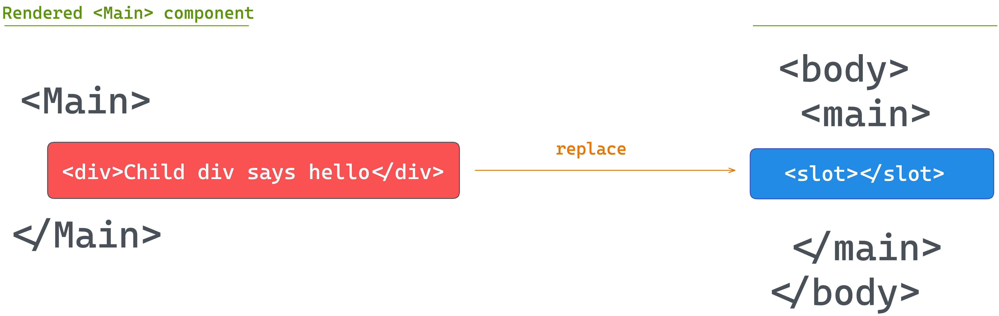
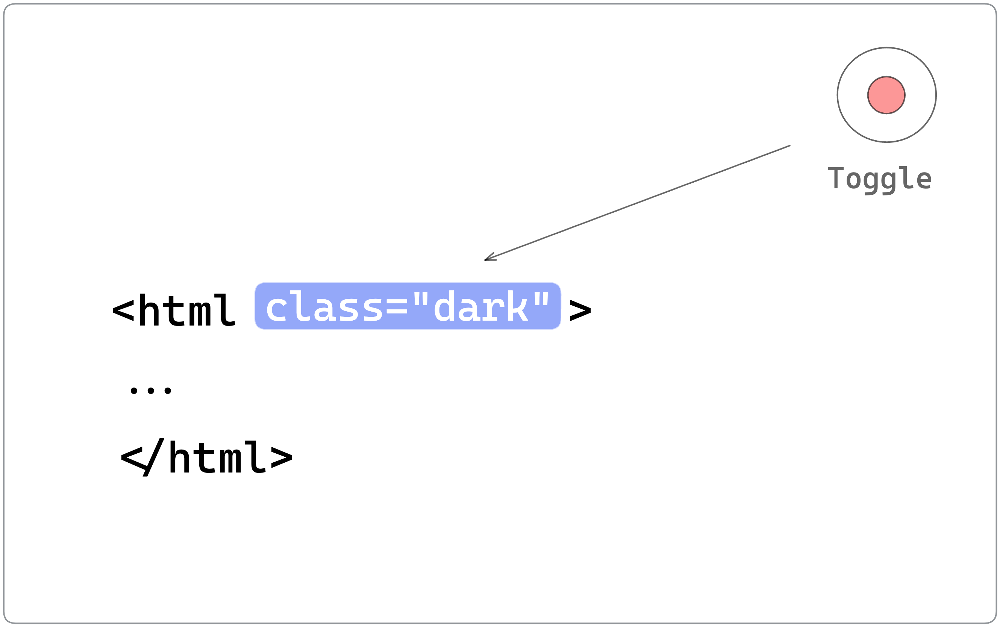
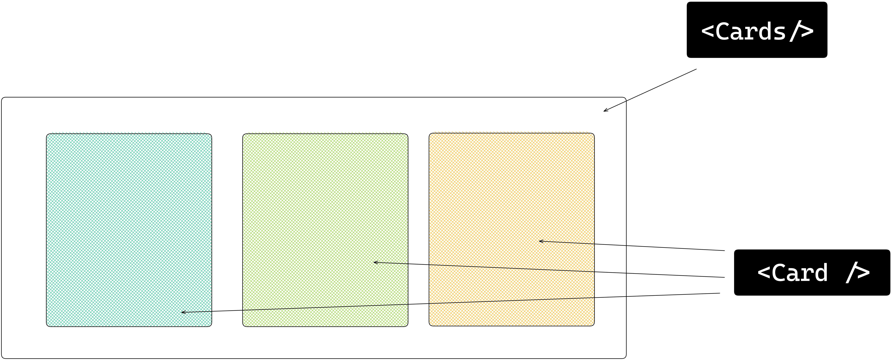

## Chapter 1: Build your first Astro Application

> Long is the road to learning by precepts, but short and successful by examples - Seneca the Younger.

Get started with the basics of Astro by building a practical application: a personal site. 

<br /> 
<br /> 
<br /> 
<br /> 

[](https://astro-beginner-project.vercel.app/)

<br /> 
<br /> 
[](https://ohans.me/understanding-astro-udemy)
<br /> 
<br /> 

[](https://github.com/understanding-astro/astro-beginner-project)

---- 
## What you’ll learn 
- Build a personal website with Astro. 
- Set up a local development environment for Astro.
- Familiarity with Astro components, layouts and pages. 
- A working knowledge of styles and scripts in Astro.
- Theming Astro sites via CSS variables. 
- Leveraging markdown pages for ease. 
- Deployment of a static Astro application. 


---- 
## Project Overview 
I remember my first commercial web development project. In retrospect, it was a disaster. One built by a passionate self-taught engineer, but a disaster still. 

Let’s make your first Astro project one we’ll remember for good. 

## Getting started 
**Astro is a web framework designed for speed**. Before we get to the good stuff, let’s ensure we’re both on the same page. 

### Install Node.js 
Firstly, make sure you have nodejs installed. 

If unsure, run `node --version` in your terminal. You will get back a node version if you have nodejs installed.


Don’t have nodejs installed? Then, visit the official [download](https://nodejs.org/en/download) page and install the necessary package for your operating system. It’s as easy as installing any other computer program. Click, click, click! 


### Setting up your code editor 
I’ll avoid any heated debate(s) on what code editor you should be writing software with. The truth is I do not care. Quite frankly. 

However, I use Visual Studio Code (VSCode).

You can develop Astro applications with any code editor, but VSCode is also the officially recommended editor for Astro. 

If you’re building with VSCode[^1], install the official [Astro extension](https://marketplace.visualstudio.com/items?itemName=astro-build.astro-vscode). This helps with syntax and semantic highlighting, diagnostic messages, IntelliSense, and more. 


Let’s now get started setting up our first Astro project. To do this, we must install Astro, and the fastest way to do this is to use the Astro automatic CLI. 

To start the install wizard, run the following command: 

```bash
npm create astro@latest 
```

If on `pnpm` or `yarn`, the command looks as follows: 

```bash
# using pnpm
pnpm create astro@latest


# using yarn 
yarn create astro
```


This will start the wizard, which will guide us through helpful prompts. It’s important to mention that we can run this from anywhere on our machine and later choose where exactly we want the project created. 

When asked, “Where should we create your new project?” go ahead and pass a file path. In my case, this is `documents/dev/books/understanding-astro/astro-beginner-project`. 

Alternatively, we could have run the `npm create astro@latest`  command in our desired directory and just entered a shorter file path, e.g., `./astro-beginner-project`. 

When asked, “How would you like to start your new project?” go ahead and choose “Empty”. 


We want a fresh start to explore Astro from the ground up. 

Now, we will be asked whether to install dependencies or not. Select yes and hit enter to continue the installation. 


Once the dependencies are installed, answer the “Do you plan to write TypeScript?” prompt with a yes and choose the “strictest” option. 

We want strong type safety. 


Afterwards, answer the “Initialise a new git repository?” question with whatever works for you. I’ll go with a yes here and hit enter. 


And voila! Believe it or not, our new project is created and ready to go! 

Change into the directory where you set up the project. In my case, this looks like the following: 

```html
cd ./documents/dev/books/understanding-astro/astro-beginner-project
```

And then run the application via the following: 

```html
npm run start
```

This will start the live application on an available local port 🚀


---- 
## Project structure 
Open the newly created project in your code editor, and you’ll notice that the `create astro` CLI wizard has included some files and folders. 

Astro has an opinionated folder structure. We can see some of this in our new project. By design, every Astro project will include the following in the root directory:  


| File / Directory  |                                                                                                                                                          |
| ----------------- | -------------------------------------------------------------------------------------------------------------------------------------------------------- |
|  astro.config.mjs |  The Astro configuration file. This is where we provide configuration options for our Astro project.                                                     |
|  tsconfig.json    |  A Typescript configuration file. This specifies the root files and Typescript compiler options.                                                         |
|  package.json     |  A JSON file that holds the project metadata. This is typically found at the root of most Node.js projects.                                              |
|  public/*         |  This directory holds files and assets that will be copied into the Astro build directory untouched, e.g., fonts, images and files such as `robots.txt`  |
|  src/*            |  The source code of our project resides here.                                                                                                            |

Let’s now look at the files in our newly generated project. 

### tsconfig.json
The content of our `tsconfig.json` file is the following: 

```js
{
  "extends": "astro/tsconfigs/strictest"
}
```

The `extends` property points to the base configuration file path to inherit from, i.e., inherit the typescript configuration from the file in `astro/tsconfigs/strictest`. 

Using your editor, we may navigate to the referenced path, e.g., in `vscode` by clicking on the link while holding `CMD`. This will navigate us to `node_modules/astro/tsconfigs/strictest.json`, where we’ll find a well-annotated file: 

```js
{
  ...
  "compilerOptions": {
    // Report errors for fallthrough cases in switch statements
    "noFallthroughCasesInSwitch": true,

    // Force functions designed to override their parent class to be specified as `override`.
    "noImplicitOverride": true,

    // Force functions to specify that they can return `undefined` if a possible code path does not return a value.
    "noImplicitReturns": true,
	 ...
  }
}
```

This is very well annotated, so we won’t spend time on this. However, the `compilerOptions` for Typescript are set in this file. The point to make here is Astro keeps a list of typescript configurations (`base`, `strict` and `strictest`) that our project leverage when we initialise via the CLI wizard. 

In this example, we’ll leave the `tsconfig.json` file as is. Typescript (and consequently the `tsconfig.json` file is optional in Astro projects. However, I strongly recommend you leverage Typescript. We’ll do so all through the book.

### package.json
The `package.json` file is easy to reason about. It holds metadata about our project and includes scripts for managing our Astro project, e.g., `npm start`, `npm run build`, and `npm preview`. 

### package-lock.json
The `package-lock.json` file is an autogenerated file that holds information on the dependencies/packages for our project. We won’t be touching this file manually. Instead, it is automatically generated (and updated) by npm.

> A project’s lock file may differ depending on the package manager, e.g., yarn or pnpm. 

### astro.config.mjs 
Most frameworks define a way for us to specify our project-specific configurations. For example, Astro achieves this via the `astro.config` file. 

```js
import { defineConfig } from 'astro/config';

export default defineConfig({});
```

At the moment, it defines an empty configuration. So we’ll leave it as is. However, this is the right place to specify different build and server options, for example.

### src/env.d.ts 
`d.ts` files are called type declaration files[^2]. Yes, that’s for Typescript alone, and they exist for one purpose: to describe the shape of some existing module. The information in this file is used for type checking by Typescript.

```js
/// <reference types="astro/client" />
```

The content of the file points to `astro/client`. This is essentially a reference to another declaration file at `astro/client.d.ts`

### src/pages/index.astro 
As mentioned earlier, the `src` folder is where the source code for our project resides. But what’s the `pages` directory, and why’s there an `index.astro` file? 

First, consider the contents of the `index.astro` file: 

```js
---
---

<html lang="en">
  <head>
    <meta charset="utf-8" />
    <link rel="icon" type="image/svg+xml" href="/favicon.svg" />
    <meta name="viewport" content="width=device-width" />
    <meta name="generator" content={Astro.generator} />
    <title>Astro</title>
  </head>
  <body>
    <h1>Astro</h1>
  </body>
</html>
```

You’d notice that it looks remarkably similar to standard HTML, with some exceptions. 

Also, notice what’s written within the `<body>` tag. An `<h1>` element with the text `Astro`. 

If we visit the running application in the browser, we have the `<h1>` rendered. 


Now change the text to read `<h1>Hello world</h1>` and notice how the page is updated in the browser! 


This leads us nicely to discuss pages in Astro — what I consider the entry point to our application.
---- 

## Introduction to Astro pages 
Astro leverages a file-based routing system and achieves this by using the files in the `src/pages` directory. 

For example, the `src/pages/index.astro` file corresponds to the `index` page served in the browser. 


Let’s go ahead and create an `src/pages/about.astro` page with similar content to `index.astro` as shown below: 

```js
// 📂 src/pages/about.astro
---
---

<html lang="en">
  <head>
    <meta charset="utf-8" />
    <link rel="icon" type="image/svg+xml" href="/favicon.svg" />
    <meta name="viewport" content="width=device-width" />
    <meta name="generator" content={Astro.generator} />
    <title>About us</title>
  </head>
  <body>
    <h1>About us</h1>
  </body>
</html>
```

- Copy and paste the exact content of `index.astro` in `about.astro`.
- Change the  `<h1>` to have the text `About us`. 

Now, if we navigate to `/about` in the browser, we should have the new page rendered. 


### What makes a valid Astro page? 
We’ve defined Astro pages as files in the `src/pages/`directory. Unfortunately, this is only partly correct. 

For example, if we duplicate the `favicon.svg` file in `public/favicon.svg` into the `pages` directory, does this represent a `favicon` page? 


Even though `index.astro` and `about.astro` correspond to our website’s index and about pages, `/favicon` will return a `404: Not found` error. 


This is because only specific files make a valid astro page. For example, if we consider the `index` and `about` files in the `pages` directory, you perhaps notice something: they both have the `.astro`  file ending! 

In layperson’s terms, these are Astro files, but a more technical terminology for these is Astro components. 

So, quick quiz: what is an Astro component? 

That’s easy—a file with the `.astro` ending.

10 points to you! Well done.

---- 
## Anatomy of an Astro component 
We’ve established that `index.astro` and `about.astro` represent Astro components and are valid Astro pages. 

Now, let’s dig into the content of these files. 

Consider the contents of the `index.astro` page: 

```js
// 📂 src/pages/index.astro
---
---

<html lang="en">
  <!-- removed for brevity -->

</html>
```

Notice the distinction between the two parts of this file’s content. 

The section at the bottom contains the page’s markup: 

```js
// 📂 src/pages/index.astro
// ... 
<html lang="en">
  <!-- removed for brevity -->
</html>
```

This part is called the **component template** section. 

While the top section contains a rather strange divider-looking syntax: 

```js
---
---
```

This part is called the **component script** section, and the `---` is called fence.

Together, these make up an Astro component. 

Let’s take the component script section for a spin. 

The section’s name hints at what this section of the component does. Within the component script code fence, we may declare variables, import packages and fully take advantage of Javascript or Typescript. 

Oh yes, Typescript! 

Let’s start by creating a variable to hold our user’s profile picture, as shown below: 

```js
// 📂 src/pages/index.astro
---
const profilePicture = "https://i.imgur.com/JPGFE75.jpg";
---
```

We may then take advantage of the component template section to reference this image as shown below: 

```js
// 📂 src/pages/index.astro
---
const profilePicture = "https://i.imgur.com/JPGFE75.jpg";
---

<html lang="en">
  <head>
    <meta charset="utf-8" />
    <link rel="icon" type="image/svg+xml" href="/favicon.svg" />
    <meta name="viewport" content="width=device-width" />
    <meta name="generator" content={Astro.generator} />
    <title>Astro</title>
  </head>
  <body>
    <!-- 👀 Look here  -->
    
  </body>
</html>

```

Note that the `profilePicture` variable is referenced using curly braces `{ }`. This is how to reference variables from the component script in the component markup. 

Now we should have the image rendered on the home page: 


It’s not much, but it’s honest work, eh? 

Let’s go ahead and flesh out the page to have the user’s profile markup: 

```js
// 📂 src/pages/index.astro
// ...
  <body>
    <!-- Look here 👀 -->
    <div>
      
      <div>
        <h1>Frau Katerina</h1>
        <h2>VP of Engineering at Goooogle</h2>
        <p>
          Helping developers be excellent and succeed at building scalable
          products
        </p>
      </div>
    </div>
  </body>
// ... 
```

As you might have noticed, we’re writing `HTML` looking syntax in the component markup section! 

Now we should have the user photo and their bio rendered in the browser as follows: 


## Component styles
Styling in Astro is relatively easy to reason about. Add a `<style>` tag to a component, and Astro will automatically handle its styling. 

While it’s possible to select elements directly, let’s go ahead and add classes to the component markup for ease: 

```js
// 📂 src/pages/index.astro  
// ...
<div class="profile">
    
    <div class="profile__details">
      <h1>Frau Katerina</h1>
      {/** ... **/}
    </div>
</div>
// ...
```

Add a `<style>` tag, and write CSS as usual!  

```js
// ...
<style>
  .profile {
    display: flex;
    align-items: flex-start;
    flex-wrap: wrap;
    padding: 1rem 0 3rem 0;
  }

  .profile__details {
    flex: 1 0 300px;
  }

  .profile__details > h1 {
    margin-top: 0;
  }

  .profile__picture {
    border-radius: 50%;
    margin: 0 2rem 1rem 0;
  }
</style>

```

The user details should now be styled as expected. 


If we inspect the eventual styles applied to our UI elements via the browser developer tools, we’ll notice that the style selectors look different. 

For example, to style the user name, we’ve written the following CSS: 

```js
.profile__details > h1 {
  margin-top: 0;
}
```

However, what’s applied in the browser looks something like this: 

```js
.profile__details:where(.astro-J7PV25F6) > h1:where(.astro-J7PV25F6) {
  margin-top: 0;
}
```

Why is this? 

The actual style declarations for the  `h1` element remain unchanged. The only difference here is the selector. 

The `h1` element now has auto-generated class names, and the selector is now scoped via the `:where` CSS selector. 

This is done internally by Astro. This makes sure the styles we write don’t leak beyond our component; for example, if we styled every `h1` in our component as follows: 

```css
h1 {
  color: red
}
```

The eventual style applied in the browser will be similar to the following: 

```css
h1:where(.astro-some-unique-id) {
  color: red
}
```

This will ensure all other `h1` in our project remains the same, and this style only applies to our specific component `h1`. 

## Page layouts 
Please look at the pages of our completed application, and realise how they all have identical forms. 


There’s a navigation bar, a footer, and some container that holds the page’s main content. 

Should we repeat these similar UI structures across all pages? 

Most people will answer “No”. So, is there a way to share reusable UI structures across pages? 

Yes, yes, yes! This is where layouts come in. 

Layouts are Astro components with a twist. They are used to provide reusable UI structures across pages, e.g., navigation bars and footers. 

Conventionally, layouts are placed in the `src/layouts` directory. This is not compulsory but a widespread pattern. 

Let’s go ahead and create our first layout in `src/layouts/Main`. We’ll do this by moving away all the reusable UI structures currently in `index.astro` as follows: 

```js
// 📂 src/layouts/Main.astro
---
---

<html lang="en">
  <head>
    <meta charset="utf-8" />
    <link rel="icon" type="image/svg+xml" href="/favicon.svg" />
    <meta name="viewport" content="width=device-width" />
    <meta name="generator" content={Astro.generator} />
    {/* Add a new meta description tag */}
    <meta name="description" content="Frau Katarina's website" />
    {/* Title is hardcoded as Astro, for now. */}
    <title>Astro</title>
  </head>
  <body>
    <main>
      {/* We want the content of each page to go here */}
    </main>
  </body>
</html>
```

- We’ve moved the `<html>`, `<head>` and `<body>` elements to the `Main.astro` layout.
- We’ve also introduced a new `<meta name=description />` tag for SEO.
- We’ve equally introduced a `<main>` element where we want the rest of our page to go in. 
- Note that the file name of the layout is capitalised, i.e., `Main.astro`, not `main.astro`.


On the one hand, layouts are unique because they mostly do one thing - provide reusable structures. But, on the other hand, they aren’t unique. They are like other Astro components and can do everything a component can!

## Rendering components and slots 
Rendering an Astro component is similar to how you’d attempt to render an HTML element, e.g., we’d render a div by writing the following: 

```js
<div>
 render something within the div
</div>
```

The same goes for Astro components. 

To render the `Main.astro` component, we’d do similar: 

```js
<Main>
  render something within the Main component
</Main>
```

Let’s put this into practice. We may now use the `Main` layout in the `index.astro` page. To do this, we will do the following: 

- Import the `Main` layout from `"../layouts/Main.astro"`
- Substitute the `<html>`, `<head>` and `<body>` elements for the `<Main>` layout in `index.astro`.

```js
---
import Main from "../layouts/Main.astro";

const profilePicture = "https://i.imgur.com/JPGFE75.jpg";
---

<Main>
  <div class="profile">
    
    <div class="profile__details">
      <h1>Frau Katerina</h1>
      <h2>VP of Engineering at Goooogle</h2>
      <p>
        Helping developers be excellent and succeed at building scalable
        products
      </p>
    </div>
  </div>
</Main>
```

 If we checked our app, we’d have a blank `index` page. 


Why’s that? 

Unlike HTML elements, the child elements in the `<Main>` tag aren’t automatically rendered. 

```js
{/** Child div will not be automatically rendered */}
<Main>
  <div>Hello from child</div>
<Main>
```

The `<Main>` layout component is rendered, and nothing else. The child components aren’t. Hence, the empty page. 

To render the child elements of an Astro component, we must specify where to render these using a `<slot />` element. 



Let’s add a `<slot>` within `Main.astro` : 

```js
//...
  <body>
    <main>
      {/* We want the content of each page to go here */}
       <slot /> 
    </main>
  </body>
```


We should now have our page rendered with the reusable layout in place. 


## Capitalising component names 
We’ve capitalised the file name of the `Main.astro` layout component but is this important? 

Theoretically, the answer to that is no. 

We could create a file with a lower cased name, e.g., `mainLayout.astro` and import the component as follows: 

```js
import Main from "../layouts/mainLayout.astro";
```

This is perfectly correct. 

However, where we encounter issues is if we name the imported component with a lowercase: 

```js
// main NOT Main
import main from "../layouts/mainLayout.astro";
```

In this case, we’ll encounter issues when we attempt to render the component as the name collides with the standard HTML `main` element. 

For this reason, it’s common practice to capitalise both component file names and the imported variable name. 

## The global style directive 
The `Main` layout is in place but doesn’t add much to our page. Let’s start by adding some styles for the headers and also centre the page’s content: 

```html
<!-- 📂 src/layouts/Main.astro -->
<style>
  h1 {
    font-size: 3rem;
    line-height: 1;
  }

  h1 + h2 {
    font-size: 1.1rem;
    margin-top: -1.4rem;
    opacity: 0.9;
    font-weight: 400;
  }

  main {
    max-width: 40rem;
    margin: auto;
  }
</style>
```

With this, we’ll have the `main` element centred, but the headers, `h1` and `h2` remain unstyled.


This is because styles applied via the `<style>` tag are locally scoped by default. 

Can you tell me why? 

The `main` element resides in the `Main` layout. However, the header `h1` and `h2` exist in a different `index.astro` component!

For our use case, we need global styles. 

We need to break out of the default locally scoped styles the Astro component provides, but how do we do this? 

Global styles can be a nightmare — except when truly needed. For such cases, Astro provides several solutions. The first is using what’s known as a global style template directive. 

I know that sounds like a mouthful! However, in simple terms, template directives in Astro are different kinds of HTML attributes that can be used in Astro component templates[^3]. 

For example, to break out of the default locally scoped `<style>` behaviour, we can add a `is:global` attribute as shown below: 

```html
<style is:global>
 ...
</style>
```

This will remove the local CSS scoping and make the styles available globally. 


## Custom fonts and global CSS
Base layout components like `Main.astro` are a great place to have global properties such as global styles and custom fonts. 

We’ve added global styles via the `is:global` template directive, but alternatively, we could have all global styles imported into `Main.astro`  from a `global.css` file.

In cases where a project requires importing some existing global css file, this is the more straightforward approach. 

For example, let’s refactor our project to use `global.css`. To do so, move the entire CSS content within the `<style is:global>`  element into `src/styles/global.css`. Then import the styles in the `Main.astro` component frontmatter:

```js
// 📂 src/layouts/Main.astro
---
import "../styles/global.css";
---
```

This will load and inject style onto the page. 

Now, let’s turn our attention to global fonts. 

We will use the Google [Inter](https://fonts.google.com/specimen/Inter) font for the project, but how do we do this? 

Technically speaking, to add Inter to our project, we must add the `<link>`s to Inter on every page required. 

However, instead of repeating ourselves on every page, we can leverage the shared `Main.astro` layout component. 

Go ahead and add the `<link>`s to the Inter font as shown below: 

```js
// 📂 src/layouts/Main.astro
<html lang="en">
  <head>
    {/** 👀 Look here ... */}
    <link rel="preconnect" href="https://fonts.googleapis.com" />
    <link rel="preconnect" href="https://fonts.gstatic.com" crossorigin />
    <link
      href="https://fonts.googleapis.com/css2?family=Inter:wght@400;500;700&display=swap"
      rel="stylesheet"
    />
  </head>
  {/** ... */}
</html>
```

We may now update the `global.css` file to use the new font family: 

```css
body {
  font-family: "Inter", sans-serif;
  padding: 0 0.5rem; /* Additional body style */
}
```

And boom! We have sorted global fonts. 


## Independent Astro components
We’ve discussed two special types of Astro components: layouts and pages. 

However, a working site is made up of more than just layouts and pages. For example, different blocks of user interfaces are typically embedded within a page. These independent and reusable blocks of user interfaces can also be represented using Astro components. 

Let’s put this to practice by creating  `NavigationBar` and `Footer` components to be used in the `Main.astro` layout. 

When creating components, a standard convention is to have them in the `src/components` directory. Let’s go ahead and create one.

```js
// 📂 src/components/Footer.astro
<footer>&copy; Frau Katerina</footer>

<style>
  footer {
    /* Applies top and bottom paddings */
    padding: 3rem 0;
    /* Centers the text content */
    text-align: center;
    /* Makes the font smaller */
    font-size: 0.9rem;
  }
</style>
```

Let’s also create a `NavigationBar` component: 

```js
// 📂 src/components/NavigationBar.astro
---
---

<nav>
  <ul>
    <li>
      <a href="/">Home</a>
    </li>

    <li>
      {/** Link points nowhere for now*/}
      <a href="#">Philosophies</a>
    </li>

    <li>
      {/** Link points nowhere for now*/}
      <a href="#">Beyond technology</a>
    </li>
  </ul>
</nav>

<style>
  nav {
    display: flex;
    align-items: flex-start;
    padding: 2rem 0;
  }

  ul {
    display: flex;
    flex-wrap: wrap;
    padding: 0;
    margin: 0 auto 0 0;
  }

  nav li {
    opacity: 0.8;
    list-style: none;
    font-size: 0.95rem;
  }

  a {
    padding: 0.5rem 1rem;
    border-radius: 10px;
    text-decoration: none;
  }
</style>
```

Now render the `NavigationBar` and `Footer` as shown below: 

```js
// 📂 src/layouts/Main.astro
---
//...
import Footer from "../components/Footer.astro";
import NavigationBar from "../components/NavigationBar.astro";
---

{/** ... **/}
<main>
  <NavigationBar />

  <slot />

  <Footer />
</main>
```


## Adding interactive scripts 
An integral part of Astro’s philosophy is shipping zero Javascript by default to the browser. 

This means our pages get compiled into `HTML`  pages with all Javascript stripped away by default. 

You might ask, what about all the Javascript written in the component script section of an Astro component? 

The component script and markup will be used to generate the eventual `HTML` page(s) sent to the browser. 

For example, go ahead and add a simple `console.log` to the frontmatter of the `index.astro` page: 

```js
// 📂 src/pages/index.astro
---
console.log("Hello world!");
---
```

Inspect the browser console and notice how the log never makes it to the browser! 

So, where’s the log? 

Astro runs on the server. In our case, this represents our local development server. So, the `console.log` will appear in the terminal where Astro serves our local application. 


When we eventually build our application for production with `npm run build`, Astro will output `HTML` files corresponding to our pages in `src/pages`. 

In this example, the `Hello world!` message will be logged but not get into the compiled `HTML` pages. 


To add interactive scripts, i.e., scripts that make it into the final `HTML` page build output, add a `<script>`  element in the component markup section. 

For example, let’s move the `console.log` from the frontmatter to the markup via a `<script>` element: 


```js
// 📂 src/pages/index.astro
---
--- 
// ...

<script>
  console.log("Hello world!");
</script>
```

We should have `Hello world!`  logged in the browser console! 


## Interactive theme toggle
Let’s put our newly found knowledge of client-side scripts to good use. 

Create a new `ThemeToggler.astro` component in the `src/components` directory. 

Add the following markup: 

```js
// 📂 src/components/ThemeToggler.astro
<button aria-label="Theme toggler">
  <svg width="25px" xmlns="http://www.w3.org/2000/svg" viewBox="0 0 24 24">
    <path
      class="sun"
      fill-rule="evenodd"
      d="M12 17.5a5.5 5.5 0 1 0 0-11 5.5 5.5 0 0 0 0 11zm0 1.5a7 7 0 1 0 0-14 7 7 0 0 0 0 14zm12-7a.8.8 0 0 1-.8.8h-2.4a.8.8 0 0 1 0-1.6h2.4a.8.8 0 0 1 .8.8zM4 12a.8.8 0 0 1-.8.8H.8a.8.8 0 0 1 0-1.6h2.5a.8.8 0 0 1 .8.8zm16.5-8.5a.8.8 0 0 1 0 1l-1.8 1.8a.8.8 0 0 1-1-1l1.7-1.8a.8.8 0 0 1 1 0zM6.3 17.7a.8.8 0 0 1 0 1l-1.7 1.8a.8.8 0 1 1-1-1l1.7-1.8a.8.8 0 0 1 1 0zM12 0a.8.8 0 0 1 .8.8v2.5a.8.8 0 0 1-1.6 0V.8A.8.8 0 0 1 12 0zm0 20a.8.8 0 0 1 .8.8v2.4a.8.8 0 0 1-1.6 0v-2.4a.8.8 0 0 1 .8-.8zM3.5 3.5a.8.8 0 0 1 1 0l1.8 1.8a.8.8 0 1 1-1 1L3.5 4.6a.8.8 0 0 1 0-1zm14.2 14.2a.8.8 0 0 1 1 0l1.8 1.7a.8.8 0 0 1-1 1l-1.8-1.7a.8.8 0 0 1 0-1z"
    ></path>
    <path
      class="moon"
      fill-rule="evenodd"
      d="M16.5 6A10.5 10.5 0 0 1 4.7 16.4 8.5 8.5 0 1 0 16.4 4.7l.1 1.3zm-1.7-2a9 9 0 0 1 .2 2 9 9 0 0 1-11 8.8 9.4 9.4 0 0 1-.8-.3c-.4 0-.8.3-.7.7a10 10 0 0 0 .3.8 10 10 0 0 0 9.2 6 10 10 0 0 0 4-19.2 9.7 9.7 0 0 0-.9-.3c-.3-.1-.7.3-.6.7a9 9 0 0 1 .3.8z"
    ></path>
  </svg>
</button>
```

- For accessibility, the button has an `aria-label` of `Theme toggler`].
- The `SVG` has a fixed width of `25px`, rendering two `<path>` elements.
- The first `<path>` visually represents a sun icon. The second is a moon icon. 
- By default, both icons (sun and moon) are rendered. Our goal is to toggle the displayed icon based on the active theme.

Then import the component and render it in the `NavigationBar`: 

```js
// 📂 src/components/NavigationBar
---
import ThemeToggler from "./ThemeToggler.astro";
---

<nav>
  <ul>
    {/** ... **/}
  </ul>
  {/** 👀 Look here **/}
  <ThemeToggler />
</nav>
```


Let’s add some `<style>` to `ThemeToggler`: 

```js
// 📂 src/components/ThemeToggler.astro
// ... 
<style>
  button {
    cursor: pointer;
    border-radius: 10px;
    border: 0;
    padding: 5px 10px;
    transition: all 0.2s ease-in-out;
  }

  button:hover {
    /* Make the button smaller (scale down) when hovered */
    transform: scale(0.9);
  }

  button:active {
    /** Return the button to its standard size when active */
    transform: scale(1);
  }

  .sun {
    /* Hide the sun icon by default. This assumes a light theme by default */
    fill: transparent;
  }
</style>
```

Now, we should have a decent-looking theme toggler.


## The :global() selector
Let’s take a moment to consider the strategy we’ll use for toggling the theme. 

We’ll toggle a CSS class on the root element whenever a user clicks the toggle. 



For example, if the user was viewing the site in light mode and clicked to toggle, we’ll add a `.dark` class to the root element and, based on that, apply dark-themed styles. 

If the user is in dark mode, clicking the toggle will remove the `.dark` class. We’ll refer to this as a class strategy for toggling dark mode. 

Based on this strategy, we must update our local `ThemeToggler` style to display the relevant icon depending on the global `.dark` class.

To do this, we will leverage the `:global` selector. 

Here’s how we’d achieve this: 

```html
<!-- 📂 src/components/ThemeToggler.astro -->
<style>
 /**...**/

 /** If a parent element has a .dark class, target the .sun icon and make the path black (shows the icon) */
 :global(.dark) .sun {
   fill: black;
 }

 /** If a parent element has a .dark class, target the .moon icon and make the path transparent (hides the icon) */
 :global(.dark) .moon {
   fill: transparent;
 }
</style>
```

To see this at work, inspect the page via the developer tools, and add a `dark` class to the root element. The toggle icon will be appropriately changed. 


In practice, limit `:global` only to appropriate use cases because mixing global and locally scoped component styles will become challenging to debug. However, this is permissible, given our use case. 

## Event Handling 
We’ve handled the styles for our toggle, assuming a `.dark` root class. Now, Let’s go ahead and handle the toggle click event with a `<script>` element. 

```html
<!-- 📂 src/components/ThemeToggler.astro -->
<script>
  /** Represent the toggle theme class with a variable */
  const DARK_THEME_CLASS = "dark";

  /** Grab the toggle */
  const toggle = document.querySelector("button");
  /** Grab the document root element. In this case <html>  */
  const rootEl = document.documentElement;

  if (toggle) {
    toggle.addEventListener("click", () => {
      /** toggle the "dark" class on the root element */
      rootEl.classList.toggle(DARK_THEME_CLASS);
    });
  }
</script>
```

Notice that this is standard Javascript. Nothing fancy going on here. 

- The toggle is selected via `document.querySelector("button")`.
- To set up an event listener, we use the `.addEventListener` method on the button. 
- On clicking the button, we toggle the class list on the root element: adding or removing the “dark” class. 

With this in place, the toggle icon changes when clicked to either that of the sun or moon. 

Excellent! 

## Theming via CSS variables 
CSS variables[^4] are outstanding, and we’ll leverage them for theming our application. 

Firstly, let’s go ahead and define the colour variables we’ll use in the project. 

```js
// 📂 styles/global.css
html {
  --background: white;
  --grey-200: #222222;
  --grey-400: #444444;
  --grey-600: #333333;
  --grey-900: #111111;
}

html.dark {
  --background: black;
  --grey-200: #eaeaea;
  --grey-400: #acacac;
  --grey-600: #ffffff;
  --grey-900: #fafafa;
}
```

- Set the variables on the root `HTML` element to be globally scoped. 
- A CSS variable is a property that begins with two dashes, `--` e.g., `--background`.
-  For simplicity, we’ll stick to the minimal grey palette above.

The first visual change we’ll make is to add the following `color` and `background` style declarations to the `body` element: 

```js
// 📂 styles/global.css
body {
  color: var(--grey-600);
  background: var(--background);
}
```

With this seemingly simple change, we should now have the text and background colour of the `body` react to clicking the toggle. 


Finally, update the navigation links in `NavigationBar` to reflect theme preferences: 

```css
/* 📂 src/components/NavigationBar.astro */
<style>
  /* ... */
  a {
    color: var(--grey-400);
    padding: 0.5rem 1rem;
    border-radius: 10px;
    text-decoration: none;
  }

  a:hover {
    color: var(--grey-900);
  }
</style>
```


## Accessing global client objects 
Question! 🙋🏼

Where should we access global objects such as `window.localStorage`? Within an Astro component frontmatter or an interactive `<script>`? 

At this point, I hope the answer to the question is clear from previous examples. 

Since Astro runs on the server, attempting to access a `window` property within the frontmatter of a component will result in an error. 

```css
---
{/** ❌ this will fail with the error: window is undefined **/}
 const value = window.localStorage.getItem("value")
---
```

To access `window` properties, we need the script to run on the client, I.e., in the browser. So, we must leverage one or more client-side scripts. 

A good use case for this is remembering the user’s theme choice. 

If users toggle their theme from light to dark and refresh the browser, they lose the selected theme state. 

How about we save this state to the browser’s local storage and restore the selected theme upon refresh? 

Well, let’s do that! 

Here are the first steps we’ll take: 

- Grab the current state of the theme, i.e., dark or light, when the theme toggle is clicked.
- Save the theme value to the browser’s local storage in the form: 
	```ts
	{
	  COLOUR_MODE: "LIGHT" | "DARK"
	}
	```

Here’s that translated in code: 

```html
<!-- 📂 src/components/ThemeToggler.astro -->
<script>
  const DARK_THEME_CLASS = "dark";
  /** Represent the local storage key by a variable */
  const COLOUR_MODE = "COLOUR_MODE";
  /** Represent the local storage values by variables */
  const LIGHT_THEME = "LIGHT";
  const DARK_THEME = "DARK";
  /** ... **/
  toggle.addEventListener("click", () => {
    /** ... */
    /**Get the current theme mode, i.e., light or dark */
    const colourMode = rootEl.classList.contains(DARK_THEME_CLASS)
      ? DARK_THEME
      : LIGHT_THEME;

    /** Save the current theme to local storage   */
    window.localStorage.setItem(COLOUR_MODE, colourMode);
  });
</script>
```

We have saved the theme to local storage but must now set the active theme as soon as the page is loaded and the `script` is executed.  

Here’s the annotated code required to achieve this: 

```html
<!-- 📂 src/components/ThemeToggler.astro -->
<script>
  {/**... **/}
  const getInitialColourMode = () => {
    /** Get colour mode from local storage **/
    const previouslySavedColourMode = window.localStorage.getItem(COLOUR_MODE);
    if (previouslySavedColourMode) {
      return previouslySavedColourMode;
    }
    /** Does the user prefer dark mode, e.g., through an operating system or user agent setting? */
    if (window.matchMedia("(prefers-color-scheme: dark)").matches) {
      return DARK_THEME;
    }
    /** Default to the light theme */
    return LIGHT_THEME;
  };
  /**Get initial colour mode */
  const initialColourMode = getInitialColourMode();
  const setInitialColourMode = (mode: string) => {
    if (mode === LIGHT_THEME) {
      rootEl.classList.remove(DARK_THEME_CLASS);
    } else {
      rootEl.classList.add(DARK_THEME_CLASS);
    }
  };
  /** Set the initial colour mode as soon as the script is executed */
  setInitialColourMode(initialColourMode);
{/**... **/}
</script>
```

Now, give this a try. First, toggle the theme and refresh to see the theme choice preserved! 

## The magic of scripts 
Client-side scripts added via a `<script>` may seem like your typical Javascript vanilla JS, but they’re more capable in specific ways. 

The most crucial point is that Astro processes these. This means within a `<script>`, we can import other scripts or import npm packages, and Astro will resolve and package the script for use in the browser. 

```html
<script>
 /** ✅ valid package import **/
 import { titleCase } from "title-case";

 const title = titleCase("string") 

 alert(title)
</script>
```


```html
/** ✅ valid script reference **/
<script src="path-to-script.js"/>
```

Another critical point is the `<script>` fully supports Typescript. For example, in our solution, we typed the parameter for the `setInitialColourMode` function: 


```ts
// mode is of type string 
const setInitialColourMode = (mode: string) => {
  ...
};
```

We don’t have to sacrifice type safety within the client `<script>` elements and can go on to write standard Typescript code.  Astro will strip out the types at build time and only serve the processed Javascript to the browser. 

Here’s a summary of what Astro does: 

- `NPM` packages and local files can be imported and will be bundled. 
- Typescript is fully supported within the `<script>`.
- If a single `Astro` component with a `<script>` is used multiple times on a page, the `<script>` is processed and only included once. 
- Astro will process and insert the script in the `<head>` of the page with a `type=module` attribute. 
- ❗️The implication of `type=module` is that the browser will defer the script, i.e., load in parallel and **execute it only after** the page’s parsed. 


## Leveraging inline scripts 
By default, Astro processes `<script>`s. However, to opt out of Astro’s default script processing, we may pass a `is:inline` directive as shown below: 

```ts
<script is:inline> 
 // Imports will not be processed 
 // Typescript not supported by default 
 // Script will be added as is, e.g., multiple times if the component is used more than once on a page. 
</script>
```

In the real world, we quickly realise that the defaults don’t always satisfy every project requirement. 

For example, consider the unstyled flash of content when we refresh our home page. For a user who chose the dark theme previously, refreshing the page shows light-themed rendered content before changing to dark after the script is parsed. 


This occurs because we restore the user-chosen theme only after the page’s HTML has been parsed, i.e, the default behaviour of processed Astro scripts. 

To prevent this, we will use the `is:inline` directive, which will make the script blocking, i.e., executed immediately and stops parsing until completed. 

Since scripts with the `is:inline` attribute aren’t processed, they’ll be added multiple times if used in reusable components that appear more than once on the page. 

So, let’s go ahead and move the theme restoration code bit into `Main.astro` — because the `Main` layout is only included once per page. 

We’ll also make sure to add this within the `<head>` of the layout, as shown below:

```html
<!-- 📂 src/layouts/Main.astro -->
<head> 
   <!-- ... -->    
    <!-- 👀 add is:inline -->
    <script is:inline>
      const DARK_THEME_CLASS = "dark";
      const COLOUR_MODE = "COLOUR_MODE";
      const LIGHT_THEME = "LIGHT";
      const DARK_THEME = "DARK";
      const rootEl = document.documentElement;
      const getInitialColourMode = () => {
        /** ... */
      }
      const initialColourMode = getInitialColourMode();
      // 👀 remove string type on mode 
      const setInitialColourMode = (mode) => {
         /** ... */
      };
      /** Set the initial colour mode as soon as the script is executed */
      setInitialColourMode(initialColourMode);
    </script>
  </head>
```

We’re explicitly adding this to the `<head>` because Astro will not process the `is:inline` script. As such, it won’t be moved to the `head` by Astro. 

Be careful with `is:inline` as it removes the default non-blocking nature of scripts. But it’s ideal for this use case.

Open your developer tools and throttle the network. Then go ahead and refresh after toggling dark mode. We should have eradicated the flash of unstyled content! 


## Global selectors in scripts 
Understanding how Astro processes the `<script>` in our components helps us make informed decisions. 

We know the `<script>` will eventually be bundled and injected into our page’s `<head>`. 

However, consider our selector for registering the theme toggle clicks: 

```ts
// 📂 src/components/ThemeToggler.astro 
const toggle = document.querySelector("button");
```

The problem with this seemingly harmless code is that `document.querySelector`  will return the first element that matches the selector — a button element. 

This will be selected if we add a random button somewhere on the page before our theme toggle button. 

```js
// 📂 src/layouts/Main.astro
<button> Donate to charity </button>
<Nav />

//...
```


This button, which has nothing to do with theme toggling, will now be responsible for toggling the user’s theme. 

Clicking “donate to charity” now toggles the theme. This is unacceptable. 

The lesson here is to be mindful of your DOM selectors and be specific where possible, e.g., via ids or classes: 

```js
document.querySelector("#some-unique-id")
```
 
Let’s refactor our solution to use a data attribute. 

```html
<!-- 📂 src/components/ThemeToggler.astro -->
<button aria-label="Theme toggler" data-theme-toggle>
  <!-- ... -->
</button>

<script>
  /** 👀 Look here */
  const toggle = document.querySelector("[data-theme-toggle]");
  // ... 
</script>
```

With the more specific selector, only an element with the data attribute `theme-toggle` will be selected, leaving  `<button> Donate to charity </button>` out of our theme toggle business. 

## Markdown pages 
We’ve established that not all file types are valid pages in Astro. We’ve seen Astro components as pages, but allow me to introduce markdown pages! 

Markdown[^5] is a popular, easy-to-use markup language for creating formatted text. I’m sure my nan does not know markdown, so it’s safer to say it’s a famous text format among developers. 

It’s no surprise Astro supports creating pages via markdown. So, let’s put this to the test. 

We’ll create two new pages to replace our dead  `Philosophies` and `Beyond technology`  navigation links. 


Create the first page in `src/pages/philosophies.md` with the following content: 

```md
- 5X **Marathoner**
- Olympic gold medalist
- Fashion _model_
- Michelin-star restaurant owner
- Adviser to the vice president
```

Create the second page in `src/pages/beyond-tech.md` with the following content: 

```md
- Be present and **enjoy the now**
- Be driven by values
- Health is _wealth_
- Be deliberate
- Laugh out loud
```

These files are written in markdown syntax[^6]. 

As with Astro component pages, markdown pages eventually get compiled to standard `HTML` pages rendered in the browser. The same file-based routing is also used. For example, to access the `philosophies`  and `beyond-tech` pages, visit the `/philosophies` and `/beyond-tech ` routes, respectively. 


## Navigating between pages 
Navigating between pages in Astro requires no magic wand. Surprise! 

Astro uses the standard `<a>` element to navigate between pages. This makes sense as each page is a separate `HTML` page. 

Let’s update the navigation links to point to the new markdown pages as shown below: 

```html
<!-- 📂 NavigationBar.astro -->

<li>
  <a href="/">Home</a>
</li>

<li>
  <a href="/philosophies">Philosophies</a>
</li>

<li>
  <a href="/beyond-tech">Beyond technology</a>
</li>
```

Clicking any of these links should now lead us to their appropriate pages. 

## Markdown layouts 
Let’s face it; we won’t be winning any design awards for our current markdown pages. This is because they seem off and don’t share the same layout as our existing page. Can we fix this? 

You’ve probably realised I ask questions and then provide answers. All right, you’ve got me. So that’s my trick to make you think about a problem — hoverer brief — before explaining the solution. 

Believe it or not, Astro component frontmatter was inspired by markdown! The original markdown syntax supports frontmatter for providing metadata about the document. For example, we could add a `title` metadata as shown below: 

```ts
---
title: Understanding Astro
---
```

This is excellent news because Astro leverages this to provide layouts for markdown pages! 

Instead of the *so dull I can’t take it* page, we can utilise a layout to bring some reusable structure to all our markdown pages. 

Let’s get started.

With Astro markdown pages, we can provide layouts for a markdown page by providing a layout frontmatter metadata as shown below: 

```ts
---
layout: path-to-layout
---
```

First, let’s reuse the same `Main` layout by adding the following to both markdown pages: 

```ts
// add at the top of the Markdown pages.
---
layout: ../layouts/Main.astro
---
```

The markdown pages should now reuse our existing layout with the theming, navigation and footer all set in place! 


Since  `Main.astro` includes our `global.css` files, let’s go ahead and provide some default global styles for paragraphs and lists: 

```css
{/** 📂 src/styles/global.css **/}
p,
li {
  font-size: 1rem;
  color: var(--gray-400);
  opacity: 0.8;
}

li {
  margin: 1rem 0;
}
```


We should now have these styles take effect on our markdown pages! Isn’t life better with shared layout components? 😉

## Composing layouts 
Layouts are Astro components, meaning we can compose them, i.e., render a layout in another. 

For example, let’s create a separate `Blog.astro` layout that composes our base `Main.astro` layout. 

```js
// 📂 src/layouts/Blog.astro
---
import Main from "./Main.astro";
---

<Main>
  <slot />
</Main>
```

Composing the layouts in this way means we can reuse all the good stuff in `Main.astro` while extending `Blog.astro` to include only blog-specific elements. 

The separation of concern significantly improves legibility and forces each layout to have a single responsibility. 

Now, at this point, the markdown pages have the same layout markup and styles from `Main.astro`. We’ve made no customisations. 
## Component props 
As we build reusable components, we often find situations where we must customise certain values within a component. For example, consider the `<title>` in our `Main.astro` layout component: 

```js
// 📂 src/layouts/Main.astro
<title>Astro</title>
```

A hardcoded `title` on every page where the `Main` layout is used is ridiculous. 

To foster reusability, components can accept properties. These are commonly known as **props**. 

Props are passed to components as attributes. 

```js
<Main title="Some title" />
```

The prop values are then accessed via `Astro.props`. This is better explained with an example. 

Go ahead and update `Main` to accept a `title` prop as shown below: 

```js
// 📂 src/layouts/Main.astro 
--- 
// ...
const { title } = Astro.props;
---

<html lang="en">
  <head>
    {/** ... **/}
    {/** 👀 look here **/}
    <title>{title}</title>
  </head>
     {/** ... **/}
</html>
```

To enforce Typescript checks, define the `Props` type alias or interface. 

```js
// Either of these is valid 
type Props = {
  title: string 
}

interface Props {
  title: string 
}
```

For simplicity, I’ll stick to a type alias for the `Main` layout: 

```js
// 📂 src/layouts/Main.astro
---
type Props = {
  title: string 
}

const { title } = Astro.props;
---
// ...
```

With the type declared, we’ll have Typescript error(s) in files where we’ve used `<Main>` without the required `title` prop. 


Update the `index.astro` and `Blog.astro` pages to pass a `title` prop to `Main`: 

```js
// 📂 src/layouts/index.astro
<Main title="Frau Katarina"> 
{/* ... */}
```

```js
// 📂 src/layouts/Blog.astro
<Main title="Frau Katarina | Blog">
{/* ... */}
```

## Leveraging markdown frontmatter properties
All markdown pages in our application will have a title, subtitle and poster. Luckily, a great way to represent these is via frontmatter properties. 

Update the markdown pages to now include these properties, as shown below. 

`📂 src/pages/beyond-tech.md`:
```md
---
layout: ../layouts/Blog.astro
poster: "/images/road-trip.jpg"
title: "Beyond Technology"
subtitle: "Humans are multi-faceted. Beyond tech, I indulge in the following:"
---
...
```


`📂 src/pages/philosophies.md`:
```md
---
layout: ../layouts/Blog.astro
poster: "/images/philosophies.jpg"
title: "My Guiding Philosophies"
subtitle: "These are the philosophies that guide every decision and action I make."
---
...
```

Note that `poster` points to image paths. These paths reference the `public` directory. So `/images/philosophies.jpg` points to an image in `public/images/philosophies.jpg`.

If you’re coding along, feel free to download any image from Unsplash and move them to the `public` directory.

Adding metadata to our markdown pages doesn’t do us any good if we can use them. 

Luckily, markdown layouts have a unique superpower — they can access markdown frontmatter via `Astro.props.frontmatter`. 

Let’s go ahead and globally handle this in our `Blog.astro` layout component. Below’s the component script section: 

```ts
// 📂 src/layouts/Blog.astro 
---
// import the type utility for the markdown layout props
import type { MarkdownLayoutProps } from "astro";
// import the base layout: Main.astro
import Main from "./Main.astro";

// defined the Props type 
type Props = MarkdownLayoutProps<{
  // Define the expected frontmatter props here
  title: string;
  poster: string;
  subtitle: string;
}>;

// get properties from the markdown frontmatter
const { poster, title, subtitle } = Astro.props.frontmatter;
---
```

- The `MarkdownLayoutProps` utility type accepts a generic and returns the type for all the properties available to a markdown layout. So feel free to inspect the entire shape[^7].
- `MarkdownLayoutProps` accepts our frontmatter property type definition as a generic, i.e., `title`, `poster` and `subtitle`. These are properties we’ve added in the frontmatter of our Markdown pages. 
- `type Props = ...`  or `interface Props {}` is how we provide types for an Astro component.
- The final line deconstructs the properties from `Astro.props.frontmatter` with full Typescript support. 


Equally update the layout markup to render the image, title and subtitle: 

```html
<!-- 📂 src/layouts/Blog.astro -->
<Main>
  <figure class="figure">
    
    <figcaption class="figure__caption">
      Poster image for {title.toLowerCase()}
    </figcaption>
  </figure>

  <h1>{title}</h1>
  <h2>{subtitle}</h2>

  <slot />
</Main>

<style>
  h1 + h2 {
    margin-bottom: 3rem;
  }

  .figure {
    margin: 0;
  }

  .figure__image {
    max-width: 100%;
    border-radius: 10px;
  }

  .figure__caption {
    font-size: 0.9rem;
  }
</style>
```

Most of the markup is arguably standard. However, note the `title.toLowerCase()` call for the poster image caption. This is possible because any valid JavaScript expression can be evaluated within curly braces `{ }` in the component markup.

Our markdown pages will now have styled titles, subtitles and poster images! With all this handled in one place — the markdown layout. 


## Interactive navigation state
Now that we’re pros at handling interactive scripts in Astro let’s go ahead and make sure that we style our active navigation links differently. 

As with all things programming, there are different ways to achieve this, but we will go ahead and script this. 

```html
<!-- 📂 src/components/NavigationBar.astro -->
<script>
  const { pathname } = window.location;
  const activeNavigationElement = document.querySelector(
    `nav a[href="${pathname}"]`
  );

  if (activeNavigationElement) {
    activeNavigationElement.classList.add("active");
  }
</script>
```

- Get the `pathname` from the `location` object. This will be in the form `"/beyond-tech"`, `"/philosophies` or `"/"`.
- Since the `pathname` corresponds to the `href` on the anchor tag element, we may select the active anchor tag via: ``document.querySelector(`nav a[href="${pathname}"]`).``
- Finally, we add the `active` class to the active anchor tag. 

Finally, add the relevant style for the active tag: 

```css
/* 📂 src/components/NavigationBar.astro */
<style>
  /* ... */
 a.active {
  background: var(--grey-900);
  color: var(--background);
 }
</style>
```


Viola! We should now have the active anchor tag styled differently.


## Component composition 
Our first look at component composition was with the `Main` and `Blog` layouts. Let’s take this further. 

Our goal is to create a set of different yet identical cards. Each card acts as a link to a blog and will have a title and some background gradient.


To achieve this, we’ll have a `Cards.astro` component that renders multiple `Card.astro` components. 



Let’s start by creating `Card.astro`. 

Define the relevant component props and relevant markup as shown below: 

```js
// 📂 src/components/Card.astro
---
{/** Export the Props type alias **/}
export type Props = {
  to: string;
  title: string;
  gradientFrom: string;
  gradientTo: string;
};

// Get component props from Astro.props
const { title, to } = Astro.props;
---
```

```html
<a href={to} class="card">
  <div class="card__inner">
    <div class="card__title">{title}</div>
    <!-- Render the arrow via HTML entity name: → = &rarr;-->
    <div class="card__footer">&rarr;</div>
  </div>
</a>

<style>
  .card {
   /** local CSS variable reused below */
    --radius: 10px;

    padding: 4px;
    border-radius: var(--radius);
    text-decoration: none;
    transition: all 0.2s ease-in-out;
  }

  .card:hover {
    transform: scale(0.95);
  }

  .card__inner {
    background: var(--background);
    padding: 1.5rem;
    border-radius: var(--radius);
    display: flex;
    flex-direction: column;
  }

  .card__title {
    font-size: 1.2rem;
    color: var(--grey-900);
    font-weight: 500;
    line-height: 1.75rem;
  }

  .card__footer {
    padding-top: 2rem;
    font-size: 1.2rem;
	color: var(--grey-900);
    margin: auto 0 0 auto;
  }
</style>
```

Now, go ahead and create the `Cards.astro` component as follows: 

```js
// 📂 src/components/Cards.astro
---
// Import the Card component
import Card from "./Card.astro";
// Import the Card Props type
import type { Props as CardProp } from "./Card.astro";

// Define the Props for this component
type Props = {
  cards: CardProp[]; // accepts an array of CardProps
};

// Retrieve the cards prop
const { cards } = Astro.props;
---
```
 
```html
<div class="cards">
  <!-- Dynamically render multiple Card components and spread the required card props -->
   {cards.map((card) => <Card {...card} />)}
</div>

<style>
  .cards {
    display: flex;
    flex-direction: column;
    gap: 1rem;
  }

  /* Since this is standard CSS, we can have media queries here */
  @media screen and (min-width: 768px) {
    .cards {
      flex-direction: row;
    }
  }
</style>
```

To see the fruits of our labour, we must now import and render `Cards` in the `index.astro` page component. 

```js
// 📂 src/pages/index.astro 
---
// ...
import Cards from "../components/Cards.astro";
---
<Main>
  <div class="profile">
   {/** ... **/}
  </div>
  {/** 👀 look here **/}
  <Cards
    cards={[
      {
        title: "Here are my guiding philosophies for life",
        gradientFrom: "#818cf8",
        gradientTo: "#d8b4fe",
        to: "/philosophies",
      },
      {
        title: "A summary of my work history",
        gradientFrom: "#fde68a",
        gradientTo: "#fca5a5",
        to: "/work-summary",
      },
      {
        title: "What I do beyond technology",
        gradientFrom: "#6ee7b7",
        gradientTo: "#9333ea",
        to: "/beyond-tech",
      },
    ]}
  />
</Main>
```


Clicking any of the links will point to the respective blog page. 

Let’s not forget to add the new `work-summary.md` page: 

```js
// 📂 src/pages/work-summary.md
---
layout: ../layouts/Blog.astro
poster: "/images/work-summary.jpg"
title: "Work summary"
subtitle: "A summary of my work:"
---

- VP Engineering at Google
- VP Engineering at Facebook
- VP Engineering at Tesla
- VP Engineering at Amazon
- VP Engineering at Netflix
```

There we go! 

## The template flow of data 
As we’ve discussed, the data in the frontmatter runs on the server and is not available in the browser. 

As we’ve built our application, we’ve frequently leveraged data in the frontmatter in the template section, as shown below: 

```js
---
 const data = "Understanding Astro"
---

//Use data in the template 
<h1>{data}</h1>
```

This is easy to reason about for our static website. We know this will eventually be compiled into HTML. 

However, consider a more robust markup that includes  `<style>` and `<script>` elements. How do we reference data from the frontmatter in these markup sections?

```js
---
 const data = "Understanding Astro"
---

// ✅ Use data in the template 
<h1>{data}</h1>

// styles 
<style>
 {/** ❌referencing data here will fail */}
</style> 

// scripts 
<script>
{/** ❌referencing data here will fail */}
 console.log(data)
</script>
```

One answer is via the `define:vars` template directive. 

`define:vars`  will pass our variables from the frontmatter into the client `<script>` or `<style>`. It’s important to note that only JSON serialisable values work here. 

Let’s give this a shot. 

We must reference the `gradientFrom` and `gradientTo` variables passed as props in our `<style>`. 

First, to make the variables available within `<style>`,  we’ll go ahead and use `define:vars` as follows: 

```js
// 📂 src/components/Card.astro
---
const { title, to, gradientFrom, gradientTo } = Astro.props;
// ... 
---

<style define:vars={{gradientFrom, gradientTo }}>
  {/** ... **/}
</style>
```

`define:vars` accepts an object of variables we want available within `<style>`.

The variables are defined but not used yet! 

Now, we can reference the variables via custom properties (aka css variables) as shown below: 

```css
/** 📂 src/components/Card.astro **/
<style define:vars={{gradientFrom, gradientTo }}>
  /** 👀 look here **/
  .card {
    background-image: linear-gradient(
      to right,
      var(--gradientFrom), 
      var(--gradientTo)
    );
  }
 /** ... **/
</style>
```

And voila! 

Our cards are now more beautiful than ever. 


## The dark side of define:vars
We’ve seen `define:vars` come in handy for using variables from the frontmatter of an Astro component. However, be careful when using `define:vars` with scripts. 

Using `define:vars` with a `<script>` is similar to using the `is:inline` directive. 

Astro will not bundle the script and will be added multiple times if the same component is rendered more than once on a page. 

Here’s an example to make this clear. 

In `Card.astro` go ahead and add a `<script>` with the `define:vars` directive as follows: 

```js
/** 📂 src/components/Card.astro **/
<script define:vars={{ gradientFrom }}>
  console.log(gradientFrom);
</script>
```

Inspect the elements via the developer tools. You’ll notice that the `<script>` is inlined and unprocessed, i.e., just as we’ve written it, apart from being wrapped in an immediately invoked function execution (IIFE). 


The script is also added three times — with a different value of `gradientFrom` for each rendered card. 

With scripts, a better solution (except the inline behaviour is ideal for your use case) is to pass the data from the component frontmatter to the rendered element via `data-` attributes and then access these via Javascript. 

For example, we may rewrite the previous solution as shown below: 

```html
---

---
<a href={to} class="card" data-gradientfrom={gradientFrom}>
 ...
</a>
...
<script>
  const card = document.querySelector(".card");
  
  // narrow the type of card to HTMLElement to access ".dataset" 
  if (card instanceof HTMLElement) {
    // access data in dataset.gradientfrom
    console.log(card.dataset.gradientfrom);
  }
</script>
```

Note that this is a contrived example and only retrieves the first card element with its associated `gradientfrom` data. Still, this demonstrates how to prevent unwanted behaviours with  `define:vars` in `<script>`s. 

## Loading multiple local files 
Let’s go ahead and create a new `blog` directory to hold some more markdown pages. The pages and their content are shown below: 

`📂 pages/blogs/rust-javascript-tooling.md` : 

```md
---
layout: "../../layouts/Blog.astro"
poster: "/images/adventure.jpg"
title: "Why Rust is the Future of Javascript Tooling"
subtitle: "How to create fast, speedy developer experiences."
---

- Rust is fast
- Yes, it is fast
- Touted as the new C++
- Did I mention it's pretty fast?
```

`📂 pages/blogs/sleep-more.md` : 

```md
---
layout: "../../layouts/Blog.astro"
poster: "/images/sleeping-cat.jpg"
title: "Why you should sleep more"
subtitle: "Sleep is great for you. Here's why:"
---

- Sleep
- Sleep more
- Sleep a little more
```

`📂 pages/blogs/typescript-new-javascript.md ` : 

```md
---
layout: "../../layouts/Blog.astro"
poster: "/images/coding.jpg"
title: "Typescript is the new Javascript"
subtitle: "Typescript is becoming a standard for web development these days:"
---

- Type safety
- Type safety!
- Even more type safety!
```

We aim to list these blog titles on our home page. One way to do this would be to render all link elements in `index.astro` manually: 

```html
<!-- 📂 src/pages/index.astro --> 
...
<Main>
 ... 
 <div class="featured-blogs">
    <h3 class="featured-blogs__title">Featured Blogs</h3>
    <p class="featured-blogs__description">
      Opinion pieces that will change everything you know about web development.
    </p>
 </div>

 <ol class="blogs">
    <li class="blogs__list">
      <a href="blogs/typescript-new-javascript" class="blog__link"
        >Typescript is the new Javascript</a
      >
    </li>

    <li class="blogs__list">
      <a href="/blogs/rust-javascript-tooling" class="blog__link"
        >Why Rust is the future of Javascript tooling</a
      >
    </li>

    <li class="blogs__list">
      <a href="/blogs/sleep-more" class="blog__link"
        >Why you should sleep more</a
      >
    </li>
 </ol>
</Main>
```

Then update our component styles: 

```html
<!-- 📂 src/pages/index.astro --> 
...
<style>
  ... 
  .featured-blogs {
    margin: 0;
    padding: 3rem 0 0 0;
  }
  .featured-blogs__title {
    font-size: 2rem;
    color: var(--gray-900);
  }

  .featured-blogs__description {
    margin-top: -1.2rem;
  }

  .blogs {
    font-size: 1rem;
    font-weight: 500;
  }

  .blogs__list {
    border-bottom: 1px solid;
    border-color: var(--gray-200);
  }

  .blog__link {
    opacity: 1;
    height: 100%;
    display: block;
    padding: 1rem 0;
    color: var(--gray-200);
    text-decoration: none;
    transition: opacity 0.2s ease-in-out;
  }

  .blog__link:hover {
    opacity: 0.7;
  }
</style>
```

This isn’t necessarily a wrong approach to getting this done. We will now have a list of the blogs, as expected. 


A better solution is to use `Astro.glob()` to load multiple files. 

`Astro.glob()` accepts a single `URL`  glob parameter of the files we’d like to import. `glob()` will then return an array of the exports from the matching file. 

Talk is cheap, so let’s put this into action. 

Instead of manually writing out the list of blog articles, we will use `Astro.glob()` to fetch all the blog posts: 

```js
// 📂 src/pages/index.astro 
---
const blogs = await Astro.glob<{
  poster: string;
  title: string;
  subtitle: string;
}>("../pages/blogs/*.md");
...
---
...
```

- Note the argument passed to `.glob`, i.e., `../pages/blogs/*.md`. This relative glob path represents all markdown files in the `/blogs` directory. 
- Also note the typing provided.  `.glob` implements a generic, which, in this case, represents the markdown frontmatter object type. 
	```js
	{
	  poster: string;
	  title: string;
	  subtitle: string;
	}
	```

Now, we may replace the manual list with a dynamically rendered list, as shown below:  

```js
// 📂 src/pages/index.astro 
...
  <ol>
    {
      blogs.map((blog) => (
        <li class="blogs__list">
          <a href={blog.url} class="blog__link">
            {blog.frontmatter.title}
          </a>
        </li>
      ))
    }
  </ol>
```


- Dynamically render the blog list using the `.map`  array function.
- `Astro.glob()` returns markdown properties including frontmatter and `url` where `blog.url`   refers to the browser url path for the markdown file. 

And voila! Same result with a much neater implementation. 

---- 
## Deploying a static Astro site 
We’ve come a long way! Now, let’s deploy this baby to the wild. 

Deploying a static website is relatively the same regardless of the technology used to create the site. 

At the end of your deployment build, we’ll have static assets to deploy to any service we choose. 


Once this is done, we must wire up a static web server to serve this content when your users visit the deployed site. 

NB: a static web server is a web server that serves static content. It essentially serves any files (e.g., HTML, CSS, JS) the client requests. 

This breaks down the process of deploying a static website into two: 

(1) Create the static production assets 
(2) Serve the static assets via a static web server 

Let’s do these. 

### 1. Create static production assets 
To build our application for production, run the command: 

```bash
npm run build
```

This will internally run the `astro build` command and build our application production static assets. 

By default, these assets will exist in the `dist` folder. 

### 2. Serve the static assets via a static web server 
Choosing a web server will come down to your choice. I’ll go ahead and explain how to use Netlify. However, the steps you must take with your web server provider will look similar. 

Go over to Netlify and create an account. 


Once you create an account and sign in, you’ll find a manual section to deploy a site. 


Now, click `browse to upload` and upload the `dist` folder containing our static production assets.

Once the upload is completed, you’ll have your site deployed with a random public URL, as shown below: 


Visit the URL to view your newly deployed website! 

## The problem with manual deployments 
Manual deployments are great for conceptually breaking down the process of deploying a static website. 

However, in the real world, you may find this less optimal. 

The main challenge here is that every change made to your website requires you to build the application and re-upload it to your server manually. 


This is a well-known problem with a standardised solution. The solution 
involves automating the entire process of deploying static websites by connecting your website to a git provider. 


## Automating the deployment of a static website 
Automating the deployment of a static website looks something like this: 

**Step 1**:  Write and push your code to a Git provider like GitHub. 
**Step 2**: Connect the GitHub project to your static web server provider, e.g., Netlify. 
**Step 3**: You provide your website’s `build` command and the location of the built assets to your web server provider, e.g., Netlify.
**Step 4**: Your web server provider automatically runs the build command and serves your static assets.
**Step 5**: Anytime you make changes to the GitHub project, your web server provider picks up the changes and reruns step 4, i.e., automatically deploying your website changes. 

To see this process in practice with Netlify, go over [to your dashboard](https://app.netlify.com/start) and connect a Git provider (step 1). 


I’ll go ahead to select Github, authorise Netlify and select the GitHub project  (step 2).


Once that’s selected, provide the settings for your application deployment (Step 3). By default, Netlify will suggest the `build` and `publish directory`. Check these to make sure there are no errors. 


Hit deploy, and your site will be live in seconds (step 4). 

To see the redeployment after a new change, push a new change to the connected git repository. 
 
## How fast is our Astro website? 
Astro boasts of insanely fast websites compared to frameworks like React or Vue. 

Let’s put this to the test by following the steps below: 

- Visit the newly deployed website on Chrome.
- Open the Chrome developer tools.
- Go to the Lighthouse tab.
- Analyse the page load. 


Here’s my result running the test: 


If this were a school examination, we would have just scored A+ on performance without trying! 

This is a fast website! 

Feel free to run the test on other pages!

## Conclusion 
This has been a lengthy discourse on Astro! We’ve delved into building a project and learned a handful of Astro’s capabilities, from installation to project structure to the nuances of inline scripts and, eventually, project deployment. 

Why stop here? We’ve only just scratched the surface. 


[^1]:	For other editors, please see the official Astro site [https://docs.astro.build/en/editor-setup/](https://docs.astro.build/en/editor-setup/)

[^2]:	What is a “.d.ts” file in Typescript? [https://medium.com/@ohansemmanuel/what-is-a-d-ts-file-in-typescript-2e2d90d58eca](https://medium.com/@ohansemmanuel/what-is-a-d-ts-file-in-typescript-2e2d90d58eca)

[^3]:	As we’ll see later, they can also be used in .mdx files. 

[^4]:	Don’t know CSS variables? Read my guide [https://medium.com/free-code-camp/everything-you-need-to-know-about-css-variables-c74d922ea855](https://medium.com/free-code-camp/everything-you-need-to-know-about-css-variables-c74d922ea855)

[^5]:	What is Markdown? [https://en.wikipedia.org/wiki/Markdown](https://en.wikipedia.org/wiki/Markdown)

[^6]:	The markdown syntax cheatsheet [https://www.markdownguide.org/cheat-sheet/](https://www.markdownguide.org/cheat-sheet/)

[^7]:	Markdown layout properties: [https://docs.astro.build/en/core-concepts/layouts/#markdown-layout-props](https://docs.astro.build/en/core-concepts/layouts/#markdown-layout-props)