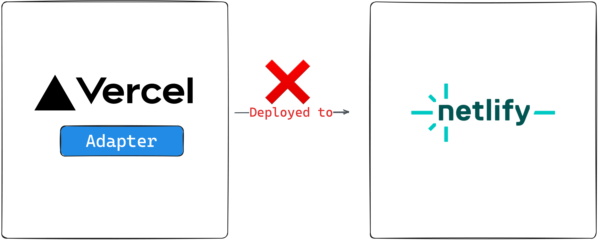
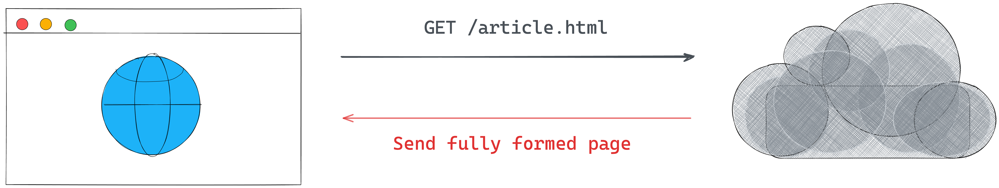
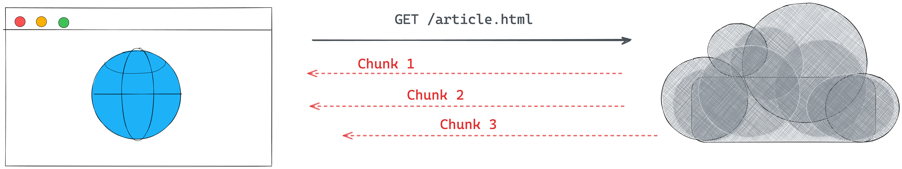

## Chapter 6: Server-side Rendering (SSR) in Astro

This chapter will guide you on enabling SSR in an Astro project, and we will also discuss a detailed overview of the extensive features a server-side rendered Astro project offers.

---- 

## What you’ll learn 
- Understand how to enable SSR in an Astro project.
- Leverage environment variables to store secrets. 
- Provide flexible server routing via dynamic routes.
- Understand the request-response cycle and its relevant properties.
- Take advantage of Astro API routes to power robust applications. 
---- 

## When do you need SSR?
In an earlier chapter, we discussed several rendering techniques for a frontend application. The reason was so we could make effective decisions for when to choose one rendering technique over the other.

III briefly summarise why we may need SR in an Astro project. Remember that your mileage may differ - so always refer to the basics discussed in Chapter 3: Build Your Own Component Island.

Now, the following are pointers to when we may need to enable SSR in an Astro project:

- **Content that is subject to frequent changes.**: We may need SSR if a page’s content frequently changes, rather than using a statically built page which would require a rebuild for every new change.
- **Thee need for API endpoints**: SSR allows us to create API endpoints while keeping sensitive data hidden from clients. We’ll see how to do this later in the chapter.
- **Creating pages with restricted access**: To restrict access to a page, enable server rendering for server-side handling of user privileges.


## How to Enable SSR 
Okay, here’s how it all begins. To enable SSR in an Astro project, set the `output` configuration option to `server` in the `astro.config.mjs` file. 

```ts
// 📂 astro.config.mjs 

import { defineConfig } from 'astro/config'


export default defineConfig({
  //This will enable SSR
  output: 'server'
})
```

And that’s it! 

Let’s see this in action by starting a new project with the following command: 

```ts
npm create astro@latest --  --template=minimal --yes --skip-houston ssr
```

This will use the `minimal` template, `--skip-houston` will skip the Houston animation, and the `--yes` option will skip all prompts and accept the defaults.

Now, change directories into `ssr` and start the project: 

```bash
cd ssr && npm start
```

The app should run on a local server with a single `index.astro` page. 

If we build the application for production via `npm build`, we should have the single `index.astro` page pre-rendered, i.e., statically built.


To re-iterate, a pre-rendered application is essentially a static site, i.e., not server-side rendered. 

To initiate server-side rendering, let’s change the configuration to include the `output` property as shown below: 

```js
// 📂 src/astro.config.mjs
import { defineConfig } from 'astro/config';

// https://astro.build/config
export default defineConfig({
  output: 'server'
});

```

If we rerun the production build, we will have an error in the console. 

```She
[error] Cannot use `output: 'server'` without an adapter. Please install and configure the appropriate server adapter for your final deployment.
```


## Deploying an SSR project 
The root cause of the error above is that to build your application for server-side rendering; the Astro build command must know what server you’ll eventually be deploying to. 

SSR requires a server runtime, i.e., the code running within the server that renders our Astro pages. To achieve this, Astro provides adapters that match our deployment runtime.

An adapter allows Astro to do two things. First, determine the server runtime environment. Second, output a script that runs the SSR code on the specified runtime.


At the time of writing, the available Astro adapters are Cloudfare, Deno, Netlify, NodeJS and Vercel. 

We may deploy our  SSR project to any of these runtimes with natively supported adapters. 

To install any of these adapters, use the command: 

```bash
npx astro add [name-of-adapter]
```

`[name-of-adapter]` could be `cloudfare`, `deno`, `netlify`, `node` or `vercel`. 

I recommend looking at the [official reference](https://docs.astro.build/en/guides/deploy/) for any adapters you need in your project, as it would be unreasonable to cover all of these in the book. However, we will stick to `netlify` moving on. 

To add the `netlify` adapter, go ahead and enter the following command in the terminal: 

```bash
npx astro add netlify
```

This will go ahead and install the adapter and update our configuration file to the following: 

```js
import { defineConfig } from "astro/config";
// 👀 look here
import netlify from "@astrojs/netlify/functions";

// https://astro.build/config
export default defineConfig({
  output: "server",
  // 👀 look here
  adapter: netlify()
});
```

Essentially, the adapter is imported in the second line of the config and added to the `adapter` property. 

Now re-run the build command: 

```js
npm run build 
```

This will successfully build our SSR project for production by outputting `netlify` specific code snippets in the `dist` and `.netlify` directory.

Now, we’re in business 🚀


## Use the correct adapter
It goes without saying that after adding an adapter, the project should be deployed to the specified adapter, `netlify`,  and not some other provider, e.g., `vercel`.

Use the correct adapter for your deployment runtime. 



Our actual deployment steps will vary depending on the server runtime being deployed. For example, for Netlify, we may follow the steps described in the deploy a static site in Chapter 1. These steps will be identical for similar runtimes like Vercel.

For other runtimes, the official Astro [deployment guides](https://docs.astro.build/en/guides/deploy/) do an excellent job of explaining the deployment steps required. 

## SSR with static pages 
With the `output` configuration property set to `server`, every page in our Astro project will be server-side rendered. However, there’s a great chance we may want one or more pages to be statically generated at build time, i.e., some pages server-side rendered and others pre-rendered.


In such cases, we can opt-in to pre-rendering by adding `export const prerender = true` to any page that supports exporting variables, e.g., `.astro`, `.mdx` `, .ts` and `.js`. 

Let’s try this out by creating a new `about.astro` page with the following content:

```js
// 📂 src/pages/about.astro 

---
// 👀 note the prerender export
export const prerender = true;
---

<html lang="en">
  <head>
    <meta charset="utf-8" />
    <link rel="icon" type="image/svg+xml" href="/favicon.svg" />
    <meta name="viewport" content="width=device-width" />
    <meta name="generator" content={Astro.generator} />
    <title>Astro</title>
  </head>
  <body>
    <h1>About us</h1>
  </body>
</html>

```

With the `prerender` export, the `about` page will be statically rendered at build time, while the `index` page remains server-side rendered. 

Run `npm run build` to see this in action. 


---- 
## From Request to Response 
The interaction between a client and server may be simplified in two steps: 

- the client makes a **request**.
- the server sends a **response**.

The two main entities in this simplified interaction are the client request and the server response. Luckily, with server-side rendering, we may access details of the request and response object.

### The Request object 
The `request` object may be accessed on the `Astro` global as shown below: 

```js
---
 const request = Astro.request
--- 
```

The object holds Information about the current request and is represented by the standard [Request](https://developer.mozilla.org/en-US/docs/Web/API/Request) interface of the fetch API. 

```js
interface Request extends Body {
    readonly cache: RequestCache
    readonly credentials: RequestCredentials;
    readonly destination: RequestDestination;
    readonly headers: Headers;
    readonly integrity: string;
    readonly keepalive: boolean;
    readonly method: string;
    readonly mode: RequestMode;
    readonly redirect: RequestRedirect;
    readonly referrer: string;
    readonly referrerPolicy: ReferrerPolicy;
    readonly signal: AbortSignal;
    readonly url: string;
    clone(): Request;
}
```

For example, we may access the request headers via `Astro.request.headers` and the current request URL as a string via `Astro.request.url`.

### The Response object 
The `Response` object is the corresponding interface representing the response to a request. This is also represented by the standard [Response](https://developer.mozilla.org/en-US/docs/Web/API/Response) interface of the Fetch API. 

As opposed to accessing the object on the `Astro` object, the `Response` object is created using the `Response()` constructor. 

The `Response()` constructor has the following signature: 

```js
new Response(body, options)
```

Where `body` defines the body for the response and `options` is an object containing custom settings to apply to the response, i.e., `status`, `statusText` and `headers`.

For example, we could update our `index` page to return a new response if we were presumably in beta - represented by a simple variable. 

```js
---
const isBeta = true;

if (isBeta) {
  return new Response("app not available - check back", {
    status: 200,
    statusText: "OK!",
  });
} 
---

<html lang="en">
  <head>
    <meta charset="utf-8" />
    <link rel="icon" type="image/svg+xml" href="/favicon.svg" />
    <meta name="viewport" content="width=device-width" />
    <meta name="generator" content={Astro.generator} />
    <title>Astro</title>
  </head>
  <body>
    <h1>We're live!</h1>
  </body>
</html>
```

Instead of returning the `HTML` page, we should now have a simple text response sent to the client. 

 

There’s also a `response` object on the `Astro` global. Blimey! 
However, It’s important to note that this is not the same as the `Response`  object constructor. So, rewriting our example to use `Astro.response`  will fail.

```js
---
const isBeta = true;

if (isBeta) {
  // ❌ This is wrong and will fail
  return new Astro.response("app not available - check back", {
    status: 200,
    statusText: "Excellent!",
  });
}
---
```


This is because `Astro.response` represents the response object initialiser. It’s used to set the `options` on the server response, i.e., `status`, `statusText` and `headers`.

For example, to set a custom header on the server response, we could do the following: 

```js
// 📂 src/pages/index.astro 
---
Astro.response.headers.set("beta_id", "some_header_value");
---

<html lang="en">
  <head>
    <meta charset="utf-8" />
    <link rel="icon" type="image/svg+xml" href="/favicon.svg" />
    <meta name="viewport" content="width=device-width" />
    <meta name="generator" content={Astro.generator} />
    <title>Astro</title>
  </head>
  <body>
    <h1>We're live!</h1>
  </body>
</html>

```

The server will return the `HTML` page and our custom `beta_id` header. 


### Redirect response 
It is pretty common to receive a client request and perform a redirect on the server. 

There are two ways to achieve this in Astro. 

The first is to leverage the standard `Response` object via `Response.redirect`. 

Consider a case where we want to redirect a user to another page if they are not logged in, as shown below: 

```js
{/** 📂 src/index.astro **/}
---
const getIsLoggedOut = () => true;
const isLoggedOut = getIsLoggedOut();

if (isLoggedOut) {
  return Response.redirect(`${Astro.request.url}about`, 307);
}
---
```

In this example, we call `Response.redirect` while passing it a redirect URL and a status code, i.e.:  

```js
Response.redirect(URL, status) 
```

It’s important to note that the `URL` in this case is an absolute path. Hence constructing from `Astro.request.url` that points to the absolute base path, e.g., `http://localhost:3001/`.

When logged out, the user will be redirected to the `about` page and the optional status code `307` indicates a temporary redirect. 

As we’ve seen above, constructing the absolute URL could get unnecessarily complex. Luckily, there’s an alternative way to perform a redirect. 

We may also leverage the `Astro.redirect` method to redirect to another page. For example, we could rewrite our solution to use `Astro.redirect` as shown below: 


```js
---
const getIsLoggedOut = () => true;
const isLoggedOut = getIsLoggedOut();

if (isLoggedOut) {
  return Astro.redirect("/about", 307);
}
---
```

We have a much simpler API here. We can redirect by just passing the relative path to redirect to. The status code is also optional here. 

> It’s important to note that redirects should be done in page components, I.e., not inside other components, e.g., layouts or base components. 


### Utilities for manipulating cookies 
In SSR mode, we may need to read or manipulate cookies. Well, Astro’s got us covered with `Astro.cookies`. This contains utilities for reading and using cookies in SSR mode. 

Consider the examples of retrieving a cookie: 

```js
//Get an AstroCookie object 
const cookieObject = Astro.cookies.get("coooookiee")

// Get the string value of the cookie 
const cookieValue = cookieObject.value 

// Parse the cookie value via JSON.parse. Returns an object if the cookie is a valid JSON. It throws an error otherwise. 

const cookieJSON = cookieObject.json()

// Parse the cookie value as a Number 
const cookieNumber = cookieObject.number() 

// Parse the cookie as a boolean 
const cookieBoolean = cookieObject.boolean() 
```

That’s a lot of flexibility!! 

We may also check if a cookie exists with the `has` method, as shown below: 

```js
// check if the "cooooookies" cookie exists. returns a boolean
const hasCookie = Astro.cookies.has('cooooookies')
```

It is also possible to set a cookie as shown below: 

```js
// Set a cookie 
Astro.cookies.set("cooookiees", "the-cookie-value")
```

The signature for `Astro.cookies.set` is shown below: 

```js
// Astro.set(key, value, options)
key: string, 
value: string | number | boolean | object,
options?: CookieOptions) => void
```

Note how different cookie value types may be set and additional cookie [options](https://www.npmjs.com/package/cookie#options-1) passed if needed, e.g., `domain`, `encode`, `expires`,    `maxAge` or `httpOnly`. 


### The request IP address 
Understanding [IP addresses](https://en.wikipedia.org/wiki/IP_address) is beyond the scope of this book. However, we may gain access to the request’s IP address on the server via the `Astro.clientAddress` property. 

Below’s a simple example: 

```js
---
const ip = Astro.clientAddress;
---

<div>Your IP address is: {ip}</div>
```

---- 
## Environment variables 
If you’re completely new to environment variables, you might the thinking, *"Oi, what are Environment variables, and why should I care?"* 

Generally speaking, environment variables help us store important information like API keys or sensitive data without ever having to reveal them to clients accessing your application. 

Like any secret, Environment variables can be arguably slightly tricky to handle. You need to know exactly where to find them, how to use them, and most importantly, how to keep them safe from prying eyes.

### Retrieving environment variables 
In Astro, environment variables are accessed on the `import.meta.env` object. 

So, for example, if we had a `CAT_API_TOKEN` value, we would access it as follows: 

```js
---
import.meta.env.CAT_API_TOKEN
---
```

If you’re conversant with environment variables in node environments, you’ll notice that this differs from the classic `process.env` object. Astro leverages Vite, which uses the [import.meta](https://developer.mozilla.org/en-US/docs/Web/JavaScript/Reference/Operators/import.meta) Javascript feature. 


### Default environment variables 
We all have secrets. 

I’m not quite sure of that. Let me rephrase: most people have secrets. 

Similarly, every Astro project has some default secrets, aka environment variables, out of the box. Consider the defaults below: 

```js
// Get the mode the Astro site is running in: "development" | "production" 
import.meta.env.MODE 

// Is the site running in production? returns true or false 
import.meta.env.PROD 

// Is the site running in development? returns true or false 
import.meta.env.DEV 

// The base URL of the Astro site 
import.meta.env.BASE_URL

// Get the final deployed URL of the Astro site
import.meta.env.SITE

// Get prefix for Astro-generated asset links 
import.meta.env.ASSETS_PREFIX
```


For `import.meta.env.BASE_URL`, it’s important to note that this will default to `/` except explicitly stated in the project configuration. e.g.: 

```js
import { defineConfig } from 'astro/config'

export default defineConfig({
   base: '/docs'
})
```

Astro will now use `/docs` as the root for our pages and assets in the development and production build.

Similarly, `import.meta.env.SITE` relies on the `site` property set in the astro config, e.g.: 

```js
import { defineConfig } from 'astro/config'

export default defineConfig({
   site: 'https://www.ohansemmanuel.com'
})
```

Astro will use this full URL to generate the site’s sitemap and canonical URLs where relevant. 

`import.meta.env.ASSETS_PREFIX`  also relies on the `build.assetsPrefix` option set in the project’s config, e.g.: 


```js
import  defineConfig  from 'astro/config'

export default defineConfig({
  build: {
    assetsPrefix: 'https://cdn.example.com'
  }
})
```

This can be used if assets are served from a different domain than the current site, e.g., with the `https://cdn.example.com` prefix, assets will be fetched from `https://cdn.example.com/_astro/...`. This implies the files in the default astro build directory `./dist/astro` must be uploaded to the CDN directory to serve the assets. 

Phew! Out with the secrets! 

### Creating environment variables 
It doesn’t do a lot of good if we can’t create our own secrets. Heck, it helps with the mystic. 

The most common way to create environment variables is to use `.env` files. 

For example, let’s go ahead and create a `.env` file in the root directory of our project directory with the following content: 

```js
// 📂 src/.env 
CAT_API_TOKEN="this-is-the-cat-production-token"
```

We may then access the secret server-side via `import.meta.env.CAT_API_TOKEN`. 

I must mention that exposing certain environment variables to the client (browser) is possible. To do this, prefix the environment variable with a `PUBLIC_`, e.g.: 

```js
PUBLIC_INSENSITIVE_TOKEN="this-is-public"
```

`PUBLIC_INSENSITIVE_TOKEN` will now be accessible both on the server and client. That’s an open secret. Anyone, and I mean anyone, can see your dirty laundry here. Only use this for insensitive environment variables. 

Remember that environment variables are only available in server-side code by default. Prefix environment variables with `PUBLIC_` to expose them to the client. 

It is also possible to run your project and provide environment variables from the CLI, as shown below: 

```bash
CAT_API_TOKEN="this-is-the-cat-production-token npm run dev"
```

In this case, `CAT_API_TOKEN` will be available both server-side and client-side. Use with caution. We only tell people we trust secrets and never blindly trust a client, e.g., a user browser.

### Typescript IntelliSense 
We don't get Typescript IntelliSense support if we attempt to access `CAT_API_TOKEN`  in `pages/index.astro` after creating the `.env` file. 


We’re pro developers; come on. Let’s fix this. 

We’ll find a `src/env.d.ts` file with projects started with an Astro template. Otherwise, go ahead and create one. 

Here’s the initial content of the file if it already exists: 

```ts
/// <reference types="astro/client" />
```

Let’s extend the default `ImportMeta` interface that provides type definitions for `import.meta.env` by adding the following: 

```ts
interface ImportMetaEnv {
  readonly CAT_API_TOKEN: string;
  // add other custom env variables...
}
```

And voila! Typescript knows our secrets - for the better. 


---- 
## Dynamic routes 
Static routes are arguably easy to reason about. For example, `.astro`, `.md` and `.mdx` files in `src/pages` will automatically become pages on our website. 

However, sometimes we require dynamic routes to prevent repetition. This typically happens when we have different routes with minimal UI changes between them. 

For example, if we were selling products on our website, we would have a different route for each product. 

```ts
// example routes for different products 
www.example.com/product/understanding-astro
www.example.com/product/astro-a-to-z
www.example.com/product/astro-for-beginners
www.example.com/product/fullstack-astro
```

```ts
// ❌ Providing multiple pages for each product
/pages/understanding-astro.astro
/pages/astro-a-to-z
/pages/astro-for-beginners
/pages/fullstack-astro
```

The URL structure of the product pages could be represented by `www.example.com/product/${name}` where `name` means the product’s name. 

Instead of creating different pages to represent each product, we may dynamically handle the product routing in one of two ways. 


### 1. Named parameters 
We could represent the variables in the route path with a named parameter surrounded by square brackets. For example, creating a file in the `pages` directory as follows: 

```js
/pages/products/[product].astro
```

We may then grab the `product` path value on the page as follows: 

```js
{/** 📂 src/pages/[product].astro **/}
<h1>{Astro.params.product}</h1>
```

Alternatively: 

```js
---
 const {product} = Astro.params 
---

<h1>{product}</h1>
```

Now if we visit the `/products/understanding-astro` page, we should have the title of the product displayed. 


In most cases, our variable path parameter will include a unique identifier, e.g., `/pages/products/[id].astro`. 

The same routing works.

It is also possible to leverage multiple named parameters in the route path, as shown below: 

```js
{/** /products/[product]_[id].astro **/}
<h1>Product name: {Astro.params.product}</h1>
<h1>Product id: {Astro.params.id}</h1>
```

This will be matched with a URL similar to `/products/understanding-astro_09u34359534530903453450` 


### 2. Rest parameters 
Rest parameters provide ultimate flexibility in our URL routing. For example, we may use `[...path]` to match file paths of any depth. Where `path` could be represented by any string, e.g., `[...file]` or `[...somestring]`. 

Consider the following product pages: 

```js
/products/product-id
/products/category/product-id/
/products/types/category/product-id
```

The routes above will all be matched by the page `pages/product/[...path].astro`, and we can access the full dynamic string path within our code.

For example, create a file in `/pages/product/[...path].astro` with the following content: 

```js
---
const { path } = Astro.params;
console.log({ path });
---

<h1>Hello there</h1>
```

For the paths above, the `path` variable corresponds to `product-id`, `category/product-id` and `types/category/product-id`. 

With much power comes much responsibility. 

With the increased flexibility rest path parameters provide comes the responsibility of handling the paths in our code. For example, consider how we may handle the multiple product paths below: 

```js
---
// Get the dynamic route path 
const { path } = Astro.params;

// Hold a list of all expected paths and corresponding data, e.g., title.
const page = [
  {
    path: undefined,
    title: "View all products"
  },
  {
    path: "product-id",
    title: "Some Product",
  },
  {
    path: "category/product-id",
    title: "Some Product Category Item",
  },
  {
    path: "types/category/product-id",
    title: "Some Product Type Category Item",
  },
];

//Is this a valid path? i.e., exists in our list? 
const relevantPageDetails = page.find((v) => v.path === path);

if (!relevantPageDetails) {
  // redirect if the dynamic page isn't valid.
  return Astro.redirect("/404");
}
---

// render the title of the page 
<h1>{relevantPageDetails.title}</h1>
```


It’s important to note that if the `path` is undefined, the root path will be matched, i.e., corresponds to `pages/product`.

While this demonstrates using rest paths in server-side rendered pages, it is a contrived example where we’ve assumed the literal string “product-id”.

In the real world, the literal string will be represented by different product id strings rather `product-id`; and we might not know what these are ahead of time! 

As we’ve done in the previous solution, keeping a massive list of all product IDs in our application becomes unmaintainable. 

For this use case, one way to achieve this would be to update our solution to have sufficiently complex matching logic, e.g., via regular expressions, because we don’t know the product IDs beforehand. 
 
```js
---
const { path = "index" } = Astro.params;

const page = [
  {
    match: /some-regex/,
    title: "View all products",
  },
  {
    match: /some-regex/,
    title: "Some Product",
  },
  {
    match: /some-regex/,
    title: "Some Product Category Item",
  },
  {
    match: /some-regex/,
    title: "Some Product Type Category Item",
  },
];

const relevantPageDetails = page.find((v) => path.match(v.match));

if (!relevantPageDetails) {
  return Astro.redirect("/404");
}
---

<h1>{relevantPageDetails.title}</h1>
```


As a matter of personal preference, I’ve sworn a blood oath to avoid path rest parameters for multiple SSR page paths when I can’t deterministically determine the path variables beforehand. 

Simple is sometimes better. 

In this case, I suggest separating the pages, i.e., creating multiple directories and letting the default Astro automatic routing kick in. 

For example, match the path `category/product-id`  by creating a page in `category/[id]` and `types/category/[id]` to match the route `types/category/product-id`. 

They can also be composed with a common layout or shared components if they have identical user interfaces. 

### Priority order
As we’ve discussed, URL paths can be matched in different ways, which begs the question, what happens when different file paths match the same URL path in our project? 

Well, Astro needs to make a decision, and that’s following the priority list below: 

1. Static routes, i.e., without path parameters, have the highest priority, e.g., `/pages/products/this-is-a-product`.
2. Dynamic routes with named parameters have the next priority, e.g., `/pages/products/[id]`.
3. Dynamic routes with rest parameters have the lowest priority, e.g., `/pages/products/[...path]`.
4. Following the above, any ties will be resolved alphabetically. 


---- 
## Server endpoints 
Server endpoints are like the secret weapons in our arsenal when running server-side functions. 

They can be used as REST API endpoints to run functions such as database access, authentications, and verifications without exposing sensitive data to the client, i.e., we can securely execute code on the server at runtime in these functions. 

Consider the current state of our project with a `page/products` directory. What if we wanted to create an API route to handle some client requests? How would we do this? 

### Creating server endpoints 
To create an API route in the `server` output mode, create a `.ts` or `.js` file within the `pages` directory. Optionally, you may see endpoints created with the type of data the endpoint returns in the file name, e.g., `.json.ts`

I prefer to keep server endpoints simple and omit additional file names. Let’s go ahead and create an `api.ts` file and handle incoming `GET` requests as shown below: 

```js
// 📂 pages/products/api
import type { APIRoute } from "astro";

export const get: APIRoute = (ctx) => {
  return {
    body: JSON.stringify({
      message: "Hello world",
    }),
  };
};
```

- Note the `APIRoute` type used on the `get` function. This represents the API route function type definition.
- Every API route function receives a context object, e.g., represented by `ctx`. The [context object](https://docs.astro.build/en/reference/api-reference/#endpoint-context) contains relevant properties we’ll take a look at shortly. 
- As shown above, an API route function can return a response with a `body`. The complete response form is shown below:  

	```js
	{
	   body: string
	   encoding?: 'ascii' | 'utf8' | 'utf-8' | 'utf16le' |
			 'ucs2' | 'ucs-2' | 'base64' | 'base64url' |
			  'latin1' | 'binary' | 'hex'
	}
	```

	We may also return a standard response via the Response object as shown below: 

	```js
	import type { APIRoute } from "astro";

	export const get: APIRoute = (ctx) => {
	  return new Response(JSON.stringify({ 
		message: "Hello world" 
		}), {
		 status: 200,
	  });
	};
	```

### Request details 
Accessing details of the request object is a breeze with API routes. For example, we may access the request object on the context object to check its headers, as shown below: 

```js
import type { APIRoute } from "astro";

export const get: APIRoute = (ctx) => {
  // check for an Authorization header on the request
  const auth = ctx.request.headers.get("Authorization");

  // The user is unauthorised to get this resource
  if (!auth) {
    return new Response(JSON.stringify({ message: "Unauthorized" }), {
      status: 401,
    });
  }

  return new Response(JSON.stringify({ message: "Hello world" }), {
    status: 200,
  });
};
```

We could also destructure properties of the context object, e.g., the request object, as shown below: 

```js
export const get: APIRoute = ({ request }) => {
  // ...
}
```

While getting the `request` object is great, consider the complete list of properties available on the endpoint context object: 

```js
export const get: APIRoute = ({
  url,
  site,
  params,
  request,
  cookies,
  generator,
  redirect,
  clientAddress,
}) => {
  return new Response(JSON.stringify({ message: "Hello world" }), {
    status: 200,
  });
}; 
```

Some of these should be familiar from discussing the request and response objects on the `Astro` global; however, here’s a quick breakdown: 


The alien properties here are `generator`, `url` and `params`. 

`generator` is easy to reason about, while `url` represents a [URL](https://developer.mozilla.org/en-US/docs/Web/API/URL) object constructed from `request.url`  i.e., identical to `new URL(request.url)`. It’s worth mentioning that a similar object may be accessed on the `Astro` global via `Astro.url`. This could come in handy in static pages. 

What about `params`? Well, that requires a separate section when we discuss dynamic routes. 

### Dynamic routes 
The dynamic route fabric on pages works the same magic on API endpoints. 

For example, our API endpoint is in the `pages/products/api` file. What if we wanted client requests to be made in the format: `GET /api/products/${id}`? 

Did you notice the variable `id`?

In this case, we may leverage dynamic routes as shown below: 

```js
// 📂 pages/api/products/[id]

import type { APIRoute } from "astro";

export const get: APIRoute = async (ctx) => {
  // Get the product ID 
  const productId = ctx.params.id;

  try {
    const response = await fetch("https://fakestoreapi.com/products/1");
    const data = await response.json();

    return new Response(JSON.stringify({ 
     ...data, 
     // Add the ID in the response body
     id: productId 
    }), {
      status: 200,
    });
  } catch (error) {
    return new Response(JSON.stringify({ 
        message: "An error occurred." 
      }), {
      status: 500,
    });
  }
};
```

I might have sprung a surprise on you in the code block above! However, the main difference here is we’re reaching out to some external API (think fetching data from a database) and sending the response back to the client. 

Another critical point is to notice how the specific id is retrieved from `ctx.params.id`, where `ctx` represents the context object. 

If we make a GET request to `api/products/astro-book-001`, we should have some data returned to the client.


Note how whatever “id” is passed in the request path is rightly retrieved, e.g., `astro-book-001`. 


To re-iterate, we can get the path segments in the dynamic route pattern via `context.params` and voila! We have our use case resolved. 

Passing query parameters to `GET` requests is not unheard of in the real world. Heck, it’s quite an everyday use case! 

Assuming the following client request `GET api/products/astro-book-001?version=2&publishedDate=2023-06-12`, how would we handle this? 

It’s important to note that `version` and `publishedDate` will not be present in `context.params`. However, we can grab these from the `URL` object as shown below: 

```js
// 📂 pages/api/products/[id]
export const get: APIRoute = async (ctx) => {
  const productId = ctx.params.id;

  // retrieve relevant search parameters, aka URL query parameters
  const searchParams = ctx.url.searchParams;
  const version = searchParams.get("version");
  const publishedDate = searchParams.get("publishedDate");

  try {
    const response = await fetch("https://fakestoreapi.com/products/1");
    const data = await response.json();

    // Return a new response with the retrieved 
    // "version" and "publishedDate"
    return new Response(
      JSON.stringify({ 
        ...data, 
        version, 
        publishedDate, 
        id: productId 
       }),
      {
        status: 200,
      }
    );
  } catch (error) {
    return new Response(JSON.stringify({ 
	  message: "An error occurred" }), {
      status: 500,
    });
  }
};
```

The crux of the solution is the following: 

```js
 // retrieve relevant search parameters, aka URL query parameters
  const searchParams = ctx.url.searchParams;
  const version = searchParams.get("version");
  const publishedDate = searchParams.get("publishedDate");
```


### Dedicated api directory
At the time of writing, API routes must live in the `pages` directory with appropriate file endings, e.g., `.ts` or `.js`. 

For example, you can have `pages/anyFileName.js` act as a server endpoint.

However, I find it easier (and better) to have my server API routes in a dedicated `pages/api` directory instead of mixing these in other page routes. 

One advantage to this is potentially making it easier to redirect a subdomain to a single path for all API routes, e.g., redirect `api.my-website.com/...` to `my-website.com/api/...`. 

On the flip side, an arguable downside is we break the collocation of other routes, e.g., standard pages such as `pages/products/...` will have their associated API route in `api/products/...`. This is a downside and a trade-off I happily make in production applications.


### Supporting other HTTP methods 
All our examples so far have used the `get` method within our API routes. However, Astro does support all the other HTTP methods, such as `post` or `delete`. 

Consider the following example that extends our `api/products/${id}` endpoint to include more methods: 

```js
import type { APIRoute } from "astro";

// Handle client GET requests 
export const get: APIRoute = async (ctx) => {
  const productId = ctx.params.id;
  try {
    // fetch remote resource 
    const response = await fetch("https://fakestoreapi.com/products/1");
    const data = await response.json();
	
    // return data, and the id param
    return new Response(JSON.stringify({ 
	  ...data, 
	  id: productId 
    }), {
      status: 200,
    });
  } catch (error) {
    return new Response(JSON.stringify({ 
	  message: "An error occurred" }), {
      status: 500,
    });
  }
};

/**
 * Handle "DELETE" requests
 * "delete" is a reserved word in Javascript. Hence, the function name "del"
 */
export const del: APIRoute = async (ctx) => {
  const productId = ctx.params.id;
  try {
    const response = await fetch("https://fakestoreapi.com/products/1", {
      method: "DELETE",
    });
    const data = await response.json();

    return new Response(
      JSON.stringify({ 
		id: productId, 
		message: "deleted", 
        title: data.title }),
      {
        status: 202,
      }
    );
  } catch (error) {
    return new Response(JSON.stringify({ 
	  message: "An error occurred" }), {
      status: 500,
    });
  }
};

/**
 * Handle "POST" requests
 */
export const post: APIRoute = async (ctx) => {
  // Get the POST body data
  const data = await ctx.request.json();

  return new Response(JSON.stringify({ 
	message: "Created", data 
  }));
};
```

Go ahead and give these a try!


As a fallback to handle other HTTP methods, we can provide an `all` function to match methods that don’t have a corresponding exported function. Consider the example below: 

```js
... 
export const all: APIRoute = async (ctx) => {
  // Get the request method
  const method = ctx.request.method;

  // Return a response
  return new Response(
    JSON.stringify({
      method,
      message: "Unsupported HTTP method",
    }),
    {
      status: 501, // unsupported
    }
  );
};
```

This will match unhandled methods in our implementation, such as `PATCH` requests. 


---- 
## Streams, oh streams
I’ve chosen a playful title for this section as it involves a relatively lesser-known feature of Astro: server streaming.

### What is server streaming? 
Generally speaking, SSR refers to generating HTML on the server and sending that to a browser in response to a request. 

In theory, we may break this off into distinct steps: 

- Browser requests a page
- The server renders the page (and every associated data) 
- The server returns the **fully formed page** to the browser 
- The browser renders the page 



What’s important here is to note that the server generates the page’s full HTML, and only then does it send the HTML to the browser. 

Now, consider a different approach. 

In most cases, certain parts of the HTML page are static and could be sent from the server immediately, i.e., without relying on fetching all the relevant data. 

What if the server could transmit the `HTML` to the browser as it creates the page server side? 



This is the crux of streaming: stream HTML to a browser as the server generates the HTML.

### Why should we bother? 
In theory, browsers can render partial HTML[^1] and support receiving and rendering HTML data in chunks. Users can view and interact with a page as it streams rather than waiting for the full page to be sent as one big chunk.

Different applications will need various workarounds. However, streaming improves server overhead. The server doesn’t need as much memory to buffer entire pages. It’ll incrementally send page data to the browser releasing memory to handle more requests and consequently save overhead costs. This is a great argument to convince your boss that streaming is good for the company’s wallets (except your company plays the silly game of *burning as much cash as possible*). 


### Streaming is easy yet difficult 
I’ve sung praises of streaming. It is conceptually easy to reason about. However, in practice is not unlikely to experience some difficult use cases. 

A great example is considering the `<title>` of a page that goes in our HTML’s `<head>`. Typically, the `<head>` is one of the first elements we stream to the browser. However, some elements within the `<head>` could very well be dynamic, e.g., we may have a `<title>` in the form `<title>{product name} fetched from the server<title>`. 

What’s likely to happen is we stream a stale `<title>` before we eventually get the product name from the database (assuming the database is the external source of data here). 

This out-of-order streaming represents some of the most common issues we may face in practice. In this example, we may provide a generic `<title>` placeholder and continue streaming. 

Once the data becomes available server-side, we may stream a tiny `<script>` that updates the page title to the desired value.

Okay, that’s enough backstory! Next, let’s dig into streaming in Astro! 


### Server streaming in Astro
Now that you’re convinced (not confused) about the importance of server streaming let’s explore how streaming in Astro works. 

Perhaps the most important thing to know is that Astro supports streaming by default. Yes, you heard that right. Browsers also natively support HTML streaming.

Essentially, within the Astro template, Astro will stream out HTML that occurs before hitting an async boundary. 

For example, consider the basic page with a `<LoadPets/>` component responsible for fetching and rendering some pet data from a database.

```js
---
import LoadPets from '../components/LoadPets.astro'
---

<html>
 <head> 
   <title> Petsssss! </title>
 </head> 
 <body>
   <h1>This is a pet site</h1>
   <p> Consider how pets are awesome ... </p>
   <LoadPets />
 </body>
</html>
```

In this contrived example, Astro will steam out the `<head>`, `<h1>` and `<p>` sections to the browser before stopping to fetch the data in  `<LoadPets />` and then stream its result to the browser when ready. 

Let’s explore a visual example. 

Update the `ssr` project to have a new `streaming.astro` page with the following content: 

```js
---
import Block from "../components/Block.astro";
---

<html>
  <head>
    <title>Streaming</title>
  </head>
  <body>
    <Block text="Block #1" delay={1000} />
    <Block text="Block #2" delay={2000} />
    <Block text="Block #3" delay={3000} />
    <Block text="Block #4" delay={4000} />
    <Block text="Block #5" delay={5000} />
  </body>
</html>

```

The `<Block/>` component receives a `text` and a `delay` prop. `delay` represents how long to wait before rendering its template, i.e., simulating some network request call. 

Here’s the `<Block/>` component: 

```js
{/** 📂 src/components/Block.astro **/}
---
import { sleep } from "../sleep";

interface Props {
  text: string;
  delay: number;
}

const { text, delay } = Astro.props;

await sleep(delay);
---

<div>
  {text}
</div>

<style>
  div {
    margin: 1rem 0;
    padding: 2rem 6rem;
    border-radius: 10px;
    background-color: blanchedalmond;
  }
</style>
```

Where `sleep` is a utility as follows: 

```js
// 📂 src/sleep.ts 
export const sleep = (delay: number) =>
  new Promise((r) => setTimeout(r, delay));
```

Now, go to the Chrome browser and visit the `/streaming` route to view the wonders of streaming. 


Each block of content comes in one at a time! 

It’s important to note that we don’t have to abstract the async bits into components. Streaming equally works with standard promises within the Astro template: 

```js
---
import Block from "../components/Block.astro";
import { sleep } from "../sleep";

const block5Promise = async () => {
  await sleep(1000);
  return "Block #5";
};
---

<html>
  <head>
    <title>Streaming</title>
  </head>
  <body>
    <Block text="Block #1" delay={1000} />
    <Block text="Block #2" delay={1000} />
    <Block text="Block #3" delay={1000} />
    <Block text="Block #4" delay={1000} />
    <p>{block5Promise}</p>
  </body>
</html>
```

### Taking advantage of streaming 
Since Astro supports streaming by default, understanding and applying it is the first step to taking advantage of streaming. 

Consider the following example: 

```js
---
import { sleep } from "../sleep";

const getSomeData = async () => {
  await sleep(1000);
  return "some data ";
};

const getSomeOtherData = async () => {
  await sleep(200);
  return "another data";
};

const data = await getSomeData();
const otherData = await getSomeOtherData();
---

<html>
  <head>
    <title>Product</title>
  </head>
  <body>
    <h2>A name</h2>
    <p>{data}</p>
    <h2>A fact</h2>
    <p>{otherData}</p>
  </body>
</html>
```

In the example above, we presumably need to fetch two resources, `data` and `otherData`. However, our solution blocks streaming. We wait for   `await getSomeData()` and `await getSomeOtherData()` before sending the full page to the browser. 

If we wanted to take advantage of server streaming, we could either render the promises directly within the markup: 

```js
---
import { sleep } from "../sleep";

const getSomeData = async () => {
  await sleep(1000);
  return "some data ";
};

const getSomeOtherData = async () => {
  await sleep(200);
  return "another data";
};
---

<html>
  <head>
    <title>Product</title>
  </head>
  <body>
    <h2>A name</h2>
    <p>{getSomeData}</p>
    <h2>A fact</h2>
    <p>{getSomeOtherData}</p>
  </body>
</html>
```

Or extract the data fetching to child components: 

```js
---
import Data from '../components/Data.astro'
import OtherData from '../components/OtherData.astro'
---

<html>
  <head>
    <title>Product</title>
  </head>
  <body>
    <h2>A name</h2>
    <!-- Handle fetch of data in <Data /> -->
    <Data />
    <h2>A fact</h2>
    <!-- Handle other data fetch in <OtherData /> -->
    <OtherData />
  </body>
</html>
```


Excellent! 

 
## Conclusion 
Server-side rendering is powerful and opens up many opportunities in our application. However, with much power comes responsibility. So, before considering making every page in your application server-rendered, consider the PROs and CONs (e.g., as discussed in Chapter 3). Then, make the right decision for your application — that’s where true responsibility lies. And do not forget to leverage hybrid rendering where possible. 


[^1]:	[https://en.wikipedia.org/wiki/Incremental\_rendering](https://en.wikipedia.org/wiki/Incremental_rendering)